# Machine Learning Course Summary - Decision Trees and Random Forests

## Table of Contents

1. [Decision Trees](#decision-trees)
2. [Random Forests](#random-forests)
3. [Key Components](#key-components)
4. [Algorithm Pipeline](#algorithm-pipeline)
5. [Parameters and Tuning](#parameters-and-tuning)
6. [Applications and Benefits](#applications-and-benefits)
7. [Key Takeaways](#key-takeaways)

---

## Decision Trees

### What are Decision Trees?

Decision Trees are supervised learning models that represent decisions and their possible consequences as a tree-like structure. They are used for both classification (predicting categories) and regression (predicting continuous values) tasks.

- **Tree structure**: Root node (full dataset) branches into decision nodes based on features, leading to leaf nodes (predictions)
- **Non-parametric**: No assumptions about data distribution
- **Interpretable**: Easy to visualize and understand decision paths

### How Decision Trees Work

Decision Trees build by recursively splitting the dataset:

1. **Root Selection** 🌳: Choose the best feature to split the data at the root
2. **Splitting Criteria** 📊: For classification, use Gini impurity or entropy; for regression, mean squared error (MSE)
3. **Recursion** 🔄: Repeat splitting on subsets until stopping criteria (e.g., max depth)
4. **Prediction** 🎯: For classification, majority class in leaf; for regression, mean value in leaf
5. **Pruning** ✂️: Post-build trimming to reduce overfitting by removing unnecessary branches

#### Example (Classification)

For iris dataset classifying flower species:

- Root split: Petal length > 2.5 cm?
  - Yes → Split on petal width → Leaf: Versicolor
  - No → Leaf: Setosa

For regression (house prices):

- Root split: Size > 1000 sq ft?
  - Yes → Mean price: $300k
  - No → Mean price: $150k

#### Decision Tree Structure Graph (Iris Classification)

This graph illustrates a simplified decision tree for the Iris dataset, showing how samples are partitioned based on feature thresholds to reach class predictions at the leaves, with approximate purity levels at leaves.

#### Regression Decision Tree Example Graph (House Prices)

This graph shows a simple regression tree for house price prediction, where leaves contain mean target values for the subset, demonstrating how continuous predictions are made.

#### Decision Tree Prediction Flow

## Key Components

### 1. Splitting Criteria

Splitting criteria determine the best way to divide the dataset at each node to maximize purity or minimize error.

| Criterion | Task Type | Formula/Description | Goal |
|-----------|-----------|---------------------|------|
| **Gini Impurity** | Classification | $Gini = 1 - \sum (p_i)^2$ where $p_i$ is class probability | Minimize misclassification probability (0 = pure) |
| **Entropy/Information Gain** | Classification | $Entropy = - \sum p_i \log_2(p_i)$  Gain = Parent Entropy - Weighted Child Entropy | Maximize uncertainty reduction |
| **Mean Squared Error (MSE)** | Regression | $MSE = \frac{1}{n} \sum (y_i - \bar{y})^2$ | Minimize variance in target values |
| **Mean Absolute Error (MAE)** | Regression | $MAE = \frac{1}{n} \sum \|y_i - \bar{y}\|$ | Minimize absolute deviations (less sensitive to outliers) |

- Gini is computationally efficient; Entropy provides similar results but is more expensive.
- For regression, MSE is default in many libraries like scikit-learn.

### 2. Tree Structure

Decision Trees consist of hierarchical nodes that progressively refine the dataset:

- **Root Node** 🌳: The top node containing the entire training dataset; first split is chosen here.
- **Internal Nodes** 🔀: Non-leaf nodes representing decisions based on a feature threshold (e.g., "Age > 30?"). Each leads to two child nodes.
- **Leaf Nodes** 🍃: Terminal nodes where splitting stops; store the prediction (majority class for classification, mean/median for regression).

The tree's depth and branching reflect the complexity of decision boundaries.

#### Components Visualization

```mermaid
graph LR
    ROOT["Root Node 🌳<br/>Full Dataset<br/>Best Split: Feature X > Threshold"] -->|"Yes"| INTERNAL1["Internal Node 🔀<br/>Subset Data<br/>Next Split: Feature Y <= Value"]
    ROOT -->|"No"| INTERNAL1
    INTERNAL1 -->|"Yes"| LEAF1["Leaf Node 🍃<br/>Class A (Majority Vote)<br/>or Mean Value"]
    INTERNAL1 -->|"No"| LEAF2["Leaf Node 🍃<br/>Class B"]
    
    style ROOT fill:#2563eb40,stroke:#2563eb,stroke-width:3px
    style INTERNAL1 fill:#7c3aed20,stroke:#7c3aed
    style LEAF1 fill:#16a34a20,stroke:#16a34a
    style LEAF2 fill:#16a34a20,stroke:#16a34a
```

### 3. Decision Tree Specific Components

- **Impurity Reduction**: At each split, select the feature/threshold that most reduces impurity (e.g., highest information gain).
- **Handling Categorical Features**: Binary splits for binary features; multi-way splits possible but less common.
- **Missing Values**: Impute or route to most probable child based on majority.

### 4. Ensemble Mechanisms (Random Forests Only)

These build on decision trees to create robust ensembles:

- **Bootstrap Aggregating (Bagging)** 🎲: Train each tree on a random bootstrap sample (~63% unique data) to reduce variance.
- **Random Feature Selection** 🔀: At splits, sample a subset of features (e.g., √n for classification) to decorrelate trees.
- **Voting/Averaging** 🗳️: Final prediction via majority vote (classification) or mean (regression) across all trees.

### 5. Pruning and Regularization

Pruning prevents overfitting by simplifying the tree:

- **Pre-pruning** (Early Stopping): Halt growth if:
  - Max depth reached.
  - Minimum samples per split/leaf not met.
  - No significant impurity reduction (e.g., gain < threshold).
- **Post-pruning** (Cost-Complexity Pruning): Grow full tree, then remove subtrees that increase validation error minimally. Uses a complexity parameter α to balance fit and simplicity.

#### Pruning Example

| Pruning Type | Pros | Cons |
|--------------|------|------|
| **Pre-pruning** | Faster training; avoids deep trees | May underfit if stopped too early |
| **Post-pruning** | Better accuracy; explores full structure | More computationally intensive |

Regularization parameters like min_samples_leaf (default 1) smooth leaves and reduce overfitting.

---

## Algorithm Pipeline

### Flow of Operations (Decision Tree)

### Flow of Operations (Random Forest)

### Key Process Steps

| Step | Description | Purpose |
|------|-------------|---------|
| **Initialization** | Load data and select root split | Start tree construction |
| **Splitting** | Choose optimal feature/threshold | Partition data for purity |
| **Recursion** | Build subtrees | Create full hierarchy |
| **Prediction** | Traverse tree to leaf | Generate output |
| **Aggregation (RF)** | Combine multiple trees | Improve robustness |

### Stopping Criteria

- **Max Depth**: Limit tree height to prevent overfitting
- **Min Samples Split**: Require minimum data per split
- **Min Samples Leaf**: Minimum data per leaf node
- **Max Features**: Limit features considered per split (esp. in RF)

---

## Parameters and Tuning

### Decision Tree Parameters

| Parameter | Description | Impact |
|-----------|-------------|--------|
| **Max Depth** 🌳 | Maximum tree levels | Deeper trees fit more but overfit |
| **Min Samples Split** 📊 | Min data for internal node | Higher values prevent overfitting |
| **Min Samples Leaf** 🍃 | Min data for leaf | Smooths predictions, reduces overfitting |

### Random Forest Parameters

| Parameter | Description | Impact |
|-----------|-------------|--------|
| **N Estimators** 🌲 | Number of trees | More trees improve stability but increase time |
| **Max Features** 🔀 | Features per split | 'sqrt' for classification, 'n_features/3' for regression |
| **Max Depth** 🌳 | Depth per tree | Controls individual tree complexity |
| **Bootstrap** 🎲 | Use sampling with replacement | True for bagging benefits |

### Tuning Strategies

1. **Grid Search**: Test combinations of depth, samples, features
2. **N Estimators**: Start with 100, increase until OOB error stabilizes
3. **Max Features**: Tune based on problem dimensionality
4. **Cross-Validation**: Evaluate on holdout sets to avoid overfitting

---

## Applications and Benefits

### Effectiveness

| Application Domain | Benefit | Key Advantage |
|--------------------|---------|---------------|
| **Classification** 🎯 | High accuracy on categorical targets | Handles non-linear relationships |
| **Regression** 📈 | Predicts continuous values | Robust to outliers via splitting |
| **Feature Importance** 🔍 | Ranks feature relevance | Interpretable insights |
| **Mixed Data** 🔄 | Works with numerical/categorical features | No need for scaling |

### Advantages

- **Interpretable**: Visualize decision paths (trees); feature importances (forests)
- **Non-linear**: Captures complex interactions without assumptions
- **Robust (RF)**: Reduces variance/overfitting via ensemble
- **Handles Missing Data**: Can impute or ignore during splits
- **Parallelizable**: Trees built independently in RF

#### Ensemble Visualization

### Disadvantages

- **Overfitting (Trees)**: Deep trees memorize training data
- **Instability (Trees)**: Small data changes alter structure
- **Bias (Trees)**: Toward features with more levels
- **Computation (RF)**: Many trees increase training time
- **Black-box (RF)**: Less interpretable than single trees

### Real-World Applications

| Application | Use Case | Problem Type |
|-------------|----------|--------------|
| **Medical Diagnosis** | Disease classification from symptoms | Classification |
| **Credit Scoring** | Risk assessment | Classification/Regression |
| **Customer Segmentation** | Grouping behaviors | Classification |
| **Stock Prediction** | Price forecasting | Regression |
| **Fraud Detection** | Anomaly identification | Classification |

---

## Key Takeaways 🎯

### 1. Core Principles 🧠

| Principle | Description |
|-----------|-------------|
| **Recursive Partitioning** | Split data hierarchically for pure subsets |
| **Impurity Measures** | Guide splits to maximize information gain |
| **Ensemble Averaging** | RF reduces variance by combining trees |
| **Interpretability** | Trees show decisions; RF shows importances |

### 2. Algorithm Parameters ⚙️

| Parameter | Tuning Guideline |
|-----------|------------------|
| **Max Depth** | Limit to 5-20; use CV to find optimal |
| **N Estimators (RF)** | 100-500; more for better stability |
| **Min Samples Leaf** | 1-10 to control overfitting |
| **Max Features** | sqrt(total) for classification |

### 3. Best Practices ✅

- 🔍 **Preprocess Data**: Handle categoricals, scale if needed (though not required)
- 📊 **Cross-Validate**: Tune hyperparameters with k-fold CV
- 🌳 **Prune Trees**: Use cost-complexity pruning for generalization
- 🔄 **Feature Engineering**: Select relevant features to improve splits
- 🎯 **Evaluate RF**: Use OOB score for quick validation

### 4. When to Use 🎯

- **Interpretable Models**: Single trees for explainability
- **High-Dimensional Data**: RF handles many features well
- **Non-linear Problems**: Both excel where linear models fail
- **Imbalanced Classes**: RF with class weights for classification
- **Quick Prototyping**: Easy to implement and visualize

### 5. Performance Considerations ⚖️

- **Training Time**: Trees fast; RF scales with n_estimators
- **Prediction Speed**: Trees O(depth); RF O(n_trees * depth)
- **Memory**: RF stores multiple trees
- **Scalability**: Parallelize tree building in RF

### 6. Advanced Techniques 🚀

- **Gradient Boosting**: Sequential trees (e.g., XGBoost) for better accuracy
- **Extra Trees**: Faster RF variant with random splits
- **Feature Selection**: Use tree importances to reduce dimensions
- **Hybrid Models**: Combine with neural nets for complex tasks

Decision Trees and Random Forests offer powerful, interpretable tools for classification and regression, balancing simplicity with strong performance in real-world machine learning applications. 🌳

## Additional Resources

### Videos

- [Decision Tree Classification Clearly Explained!](https://www.youtube.com/watch?v=ZVR2Way4nwQ)
- [Random Forest Algorithm Clearly Explained!](https://www.youtube.com/watch?v=v6VJ2RO66Ag)
