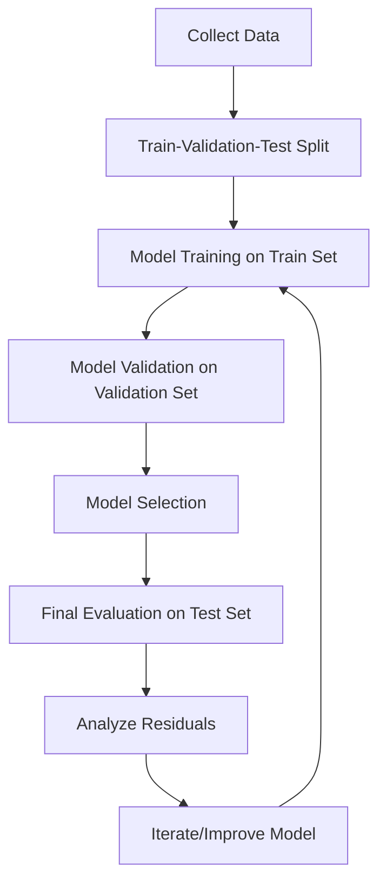
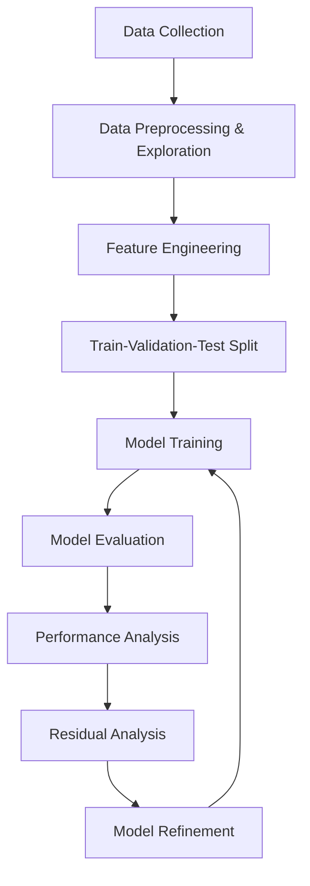

# Machine Learning Course Summary

## Table of Contents
1. [Introduction to Machine Learning](#introduction-to-machine-learning)
2. [Mathematical Foundations](#mathematical-foundations)
3. [Model Evaluation](#model-evaluation)
4. [Laboratory Projects](#laboratory-projects)
5. [Key Takeaways](#key-takeaways)

---

## Introduction to Machine Learning

### What is Machine Learning?

Machine Learning is a field of study that gives computers the ability to learn without being explicitly programmed (A. Samuel). At its core:

- **Learning** means getting better at some given task
- **Machine learning** is about writing computer programs that get better at given tasks by using data

### Applications of ML
ML is everywhere in modern applications:
- Self-driving cars
- LLMs (Large Language Models)
- Intrusion detection
- Stock market prediction

### A Brief History of ML

#### Mathematical Pre-history
- 1763: Bayes theorem (T. Bayes)
- 1805: Least squares fitting (A. M. Legendre, G. F. Gauss)

#### Early Days
- 1943: Mathematical model of artificial neuron (Pitts and Mc Culloch)
- 1951: First implementation of a neural network (M. Minsky)
- 1952: First "intelligent" program (A. Samuel)
- 1957: The Perceptron (F. Rosenblatt)
- 1974-1980: First AI winter

#### The AI Spring
- 1982-1985: Backpropagation algorithm (S. Linnainmaa, P. Werbos, D. Rumelhart, G. Hinton, R. Williams)
- 1989: Start of modern RL (C. Watkins)
- 1995: Random Forest (T. K. Ho)
- 1997: Deep Blue (IBM)

#### Modern Boom
- 2011-2012: AlexNet (A. Krizhevsky, I. Sutskever, G. Hinton), ML becomes good at vision
- 2016: AlphaGo (DeepMind), ML beats humans at complex games
- 2017: Transformer Architecture
- 2018: AlphaFold, ML performs a breakthrough in natural science
- 2022: ChatGPT, ML becomes good at natural language

### The ML Lifecycle

1. **Collect some data**
2. **Write a program that "learns" from it (training)**
3. **Use the program to "predict" what happens for new, unseen data**

### Types of Machine Learning

- **Supervised Learning**: Learning from labeled data
- **Unsupervised Learning**: Learning from unlabeled data
- **Reinforcement Learning**: Learning from interaction with an environment

### Supervised Learning

In supervised learning, we have labeled data consisting of training examples:
$$ \mathcal{D} = \{ (\mathbf{x}^{(i)}, y^{(i)}) | i = 1, \ldots, n \} $$

Our goal is to find a "model" $f$ that is able to predict $y$ for unseen values of $\mathbf{x}$.

**Notation:**
- Boldface is used to denote vectors
- $\mathbf{x}$ denotes a single training example, the associated response being denoted by $y$
- Individual components $\mathbf{x}_j$ denote single features of a given example
- Superscript denote different training examples: $\mathbf{x}^{(1)}, \mathbf{x}^{(2)}, \ldots$

### First Supervised Learning Algorithm: Linear Regression

A linear model is a model which, given some data point $x$ predicts the response $y$ using a linear function:
$$ \hat{y} = f(x) = a \cdot x + b $$

---

## Mathematical Foundations

### The Core Components of ML

**ML = Model space + Loss function (+ regularization) + optimization**

### Supervised Learning Setup

We have a (labeled) dataset of input-output examples:
$$ \mathcal{D} = \{(\mathbf{x}^{(i)}, y^{(i)}) | i = 1, \ldots, n\} $$

And we want to find a model $f$ that, given an unseen data pair $(x, y)$, performs well at predicting $y$:
$$ f(x) \approx y $$

### Model Space and Parameters

To solve the problem of finding the best model and make the model search tractable, we restrict our search to a given model space $\mathcal{M}$. The learning task is then to find the best $f$ in $\mathcal{M}$.

In most cases, our models are parametrized by a finite set of parameters:
$$ \boldsymbol{\theta} = (\theta_1, \ldots, \theta_p) \in \Theta $$
that belong to a parameter space $\Theta$.

### Examples of Model Spaces

#### Linear Regression Models
- **1D Linear regression model**: $\mathcal{M} = \{f(x) = a \cdot x + b | a, b \in \mathbb{R}\}$
- **Parameters**: $(a, b) =: \boldsymbol{\theta} \in \Theta := \mathbb{R}^2$
- **For a given parameter $\boldsymbol{\theta} = (a, b)$**: $f_{\boldsymbol{\theta}}(x) = a \cdot x + b$

#### Polynomial Regression Models
- **1D Polynomial Regression Model**: Model space is the set of all polynomial functions of $x$, up to degree $d$:
  $$ \mathcal{M} = \{f(x) = a_1 \cdot x + a_2 \cdot x^2 + \ldots + a_d \cdot x^d + b | a_1, \ldots, a_d, b \in \mathbb{R}\}$
- **Parameters**: $(b, a_1, \ldots, a_d) =: \boldsymbol{\theta} \in \Theta := \mathbb{R}^{d+1}$

### The Bias-Variance Trade-off

- **Simple models** (small $\mathcal{M}$): High bias (has difficulty fitting the data), low variance (low sensitivity to noise)
- **Complex models** (large $\mathcal{M}$): Low bias (can fit any data), high variance (too sensitive to data noise)

### Loss Functions

The idea is to quantify how "wrong" our predictions are. For each example $(\mathbf{x}, y)$ in the training dataset, we want to know how good our prediction $\hat{y} = f(x)$ is.

#### L2 Loss (Mean Squared Error)
$$ L(y, \hat{y}) = (y - \hat{y})^2 $$
- Penalizes large errors more than small ones
- Influenced by outliers
- Most common loss function for regression

#### L1 Loss (Mean Absolute Error)
$$ L(y, \hat{y}) = |y - \hat{y}| $$
- More robust to outliers
- Less statistically well-behaved

### Empirical Risk Minimization

The central idea is to sum all losses $L(y^{(i)}, \hat{y}^{(i)})$ over the training dataset for each possible value of the parameter $\boldsymbol{\theta}$:

$$ J(\boldsymbol{\theta}) = \sum_{i=1}^{n} L(y^{(i)}, f_{\boldsymbol{\theta}}(\mathbf{x}^{(i)})) $$

This tells us how well the model $f_{\boldsymbol{\theta}}$ fits the data for a given $\boldsymbol{\theta}$.

The best model is the one with the smallest loss (smallest risk):
$$ \boldsymbol{\theta}^* = \arg\min_{\boldsymbol{\theta} \in \Theta} J(\boldsymbol{\theta}) $$

### Optimization Methods

- Some models have analytical solutions (e.g., linear regression)
- In general, perform iterative minimization using methods like gradient descent
- Scipy provides optimization routines for general cases

---

## Model Evaluation

### Train-Validation-Test Split

The best practice in ML is to split the data into:
- **Training data** (60%): Used for model training
- **Validation data** (20%): Used for model selection
- **Test data** (20%): Used for final, honest performance evaluation

**Key principle**: Test data is never touched during model training and selection!

### Overfitting and Underfitting

#### Overfitting
- Model too complex
- Low training error
- High validation error
- Solution: Regularization, more data, simpler model

#### Underfitting
- Model too simple
- High training error
- High test error
- Solution: More complex model, more features

### Model Selection Process
1. Design different models
2. Train all models on the train set
3. Select best model by comparing performances on validation set

### Bias-Variance Tradeoff

- **Bias**: Error from wrong assumptions (underfitting)
- **Variance**: Error from sensitivity to training data (overfitting)
- **Sweet spot**: Minimize total error

### The No Free Lunch Theorem

"There is no such thing as a free lunch." (D. Wolpert and W. MacReady)

All models are wrong but some are useful. (G. Box)

### Regularization

Regularization adds a penalty term to the loss function to constrain model complexity:

$$ J_{\text{regularized}}(\boldsymbol{\theta}) = J_{\text{original}}(\boldsymbol{\theta}) + \lambda \cdot R(\boldsymbol{\theta}) $$

Where:
- $J_{\text{original}}(\boldsymbol{\theta})$: Original loss (e.g., MSE)
- $\lambda$: Regularization strength (hyperparameter)
- $R(\boldsymbol{\theta})$: Penalty term on parameters

#### L2 Regularization (Ridge Regression) and L1 Regularization (Lasso)

**L2 Regularization (Ridge Regression):**
$$ J_{\text{Ridge}}(\boldsymbol{\theta}) = \frac{1}{n} \sum_{i=1}^{n} (y_i - \hat{y}_i)^2 + \lambda \sum_{j=1}^{p} \theta_j^2 $$
- Penalizes squared magnitude of coefficients
- Shrinks coefficients toward zero (but not exactly zero)

**L1 Regularization (Lasso):**
$$ J_{\text{Lasso}}(\boldsymbol{\theta}) = \frac{1}{n} \sum_{i=1}^{n} (y_i - \hat{y}_i)^2 + \lambda \sum_{j=1}^{p} |\theta_j| $$
- Penalizes absolute magnitude of coefficients
- Can shrink coefficients to exactly zero
- Performs a kind of automatic feature selection

### Residuals Analysis

Residuals are the part of the data that is not captured by the model:
$$ r_i := y_i - \hat{y}_i $$

In an ideal world, residuals should be i.i.d. Gaussian distributed.

**What to check in residuals:**
- Plot residuals vs target variable - is there structure?
- Is the variance of the residuals constant (homoscedasticity)?
- Are the residuals normally distributed (qq-plot)?

---

## Laboratory Projects

### Mini Lab 1: Fuel Consumption Analysis

This project implemented key ML procedures for building a predictive model.

#### Data Exploration and Preprocessing
- **Dataset**: 17,766 samples with multiple features related to vehicle characteristics
- **Data inspection**: Used pandas for data loading, exploration of data types, missing values, and feature distributions
- **Correlation analysis**: Computed correlation matrix to identify relationships between features
- **Visualization**: Created heatmaps and scatter plots for feature analysis

#### ML Model Development Process
- **Simple linear model**: Implemented $y = a \cdot x$ where $x$ is fuel consumption
- **Parameter optimization**: Used manual parameter sweeps ($a = 10, 20, 30$) to find optimal coefficient
- **Performance evaluation**: Used R² (coefficient of determination) to quantify model performance
- **Advanced model**: Extended to multi-parameter model incorporating categorical variables (fuel type)
- **Model representation**: 
  $$ \text{CO2 emissions} = a \cdot \text{Combined (L/100 km)} + b \cdot \text{is_diesel} + c \cdot \text{is_essence} $$

#### Key ML Takeaways from this Lab
- **Feature selection**: Correlation analysis helps identify the most predictive features
- **Model complexity**: Adding relevant features (fuel type) improved model performance (R² from 0.637 to 0.837)
- **Parameter optimization**: Systematic parameter searches enable model improvement
- **Linear regression**: Serves as an effective baseline model with interpretable coefficients
- **Performance metrics**: R² provides a standardized way to evaluate regression models
- **Categorical encoding**: Binary indicators effectively incorporate categorical variables into linear models

### Project 1: House Price Analysis

This project demonstrated comprehensive ML pipeline implementation with multiple ML procedures.

#### Data Preprocessing and Feature Engineering
- **Dataset**: 1,364 samples with mixed data types (numerical and categorical)
- **Categorical encoding**: Converted categorical variables to numerical using mapping:
  - Kitchen quality: {mediocre: 0, moyenne: 1, bonne: 2, excellente: 3}
  - Building type: {individuelle: 0, individuelle reconvertie: 1, duplex: 2, bout de rangée: 3, milieu de rangée: 4}
- **Feature engineering**: Created composite features like `surface_by_room = surf_hab / n_pieces`
- **Exploratory analysis**: Used seaborn for correlation analysis and scatter plots

#### ML Pipeline Implementation
- **Train-validation-test split**: 60%-20%-20% distribution for proper model evaluation
- **Outlier handling**: Removed extreme values from training and validation sets
- **Model selection**: Used Linear Regression with selected features
- **Performance evaluation**: Calculated multiple metrics (MSE, RMSE, MAE, R²) on different datasets

#### Model Selection and Evaluation Process
- **Feature selection**: Identified most predictive features through correlation and domain knowledge
- **Model training**: Applied Linear Regression with selected features:
  - Surface per room (surface_by_room)
  - Building material quality (qualite_materiau) 
  - Living area (surf_hab)
- **Performance metrics calculation**: 
  - Training set: R² = 0.7255
  - Validation set: R² = 0.6710
  - Test set: R² = 0.7944
- **Residual analysis**: Examined prediction errors to understand model limitations

#### Key ML Takeaways from this Project
- **Data preprocessing**: Proper encoding of categorical variables is crucial for ML models
- **Feature engineering**: Creating meaningful derived features can improve model performance
- **Train-validation-test splits**: Essential for unbiased model evaluation
- **Cross-validation insight**: Performance differences between train/val/test indicate model generalization
- **Linear regression interpretation**: Coefficients provide insights into feature importance:
  - qualite_materiau had high impact (32,665.9383)
  - surf_hab and surface_by_room also contributed significantly
- **Model evaluation**: Multiple metrics provide comprehensive performance assessment
- **Residual analysis**: Critical for understanding model behavior and areas for improvement
- **Overfitting detection**: Gap between training and validation performance indicates overfitting risk

---

## Key Takeaways

### 1. ML Workflow
1. **Data Collection**: Gather relevant and representative data
2. **Data Preprocessing**: Clean, encode, and explore data
3. **Feature Engineering**: Create meaningful features from raw data
4. **Model Selection**: Choose appropriate model family
5. **Training**: Fit the model to training data
6. **Validation**: Select best model using validation data
7. **Testing**: Evaluate final performance on test data
8. **Analysis**: Interpret results and diagnose model behavior

### 2. Critical Concepts
- **Supervised Learning**: Learning from labeled examples
- **Overfitting**: When model learns training data too well, including noise
- **Underfitting**: When model is too simple to capture underlying patterns
- **Bias-Variance Tradeoff**: Balance between model simplicity and complexity
- **Cross-validation**: Robust method for model evaluation

### 3. Evaluation Metrics
- **R² (Coefficient of Determination)**: Proportion of variance explained
- **RMSE (Root Mean Squared Error)**: Average prediction error in target units
- **MAE (Mean Absolute Error)**: Average absolute prediction error
- **Residual Analysis**: Essential for understanding model performance

### 4. Best Practices
- Always split data before any preprocessing to avoid leakage
- Use separate train/validation/test splits for different purposes
- Consider feature engineering to create more meaningful inputs
- Regularize models to prevent overfitting
- Analyze residuals to understand model limitations
- Iterate based on empirical results

### 5. Linear Regression Insights
- Simple but powerful baseline for regression problems
- Sensitive to outliers (consider robust alternatives like L1 loss)
- Coefficients provide interpretable relationships between features and target
- Works best when relationships are approximately linear

### 6. Feature Importance
- Domain knowledge can guide feature selection
- Correlation analysis helps identify important variables
- Feature engineering can create more predictive inputs
- Regularization can perform automatic feature selection

### 7. Model Complexity
- Start with simple models as baselines
- Increase complexity only if justified by performance improvement
- Balance model interpretability with performance
- Be aware of the curse of dimensionality

This comprehensive approach to machine learning ensures systematic model development with proper evaluation and validation, leading to more reliable and generalizable results.

