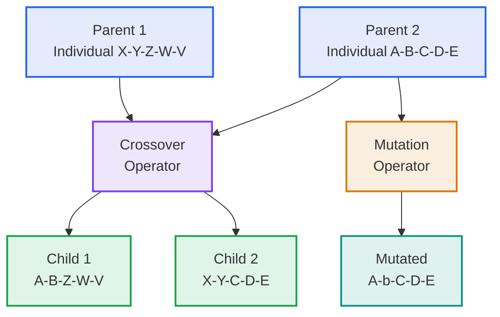
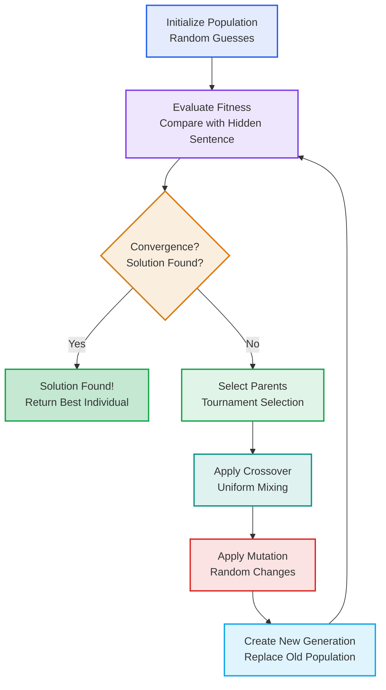
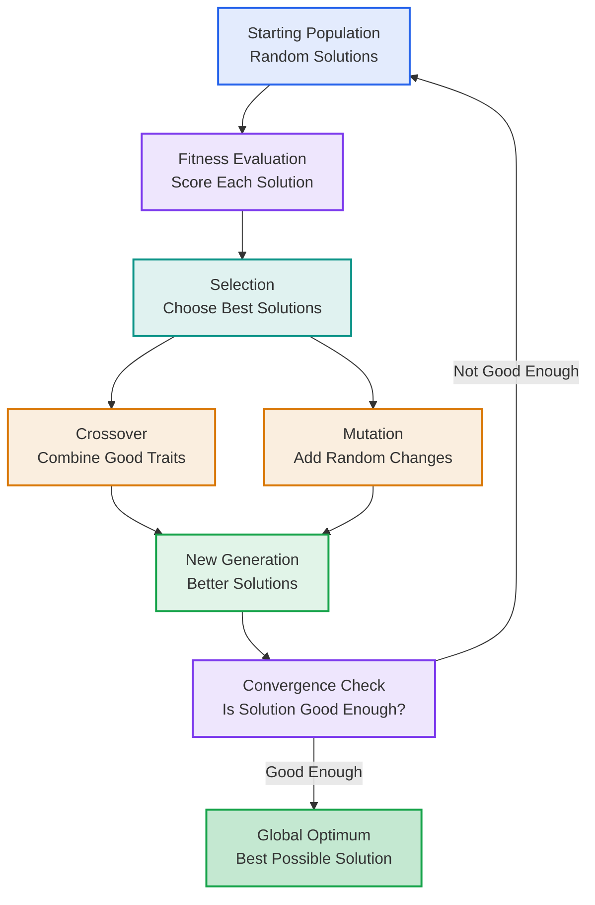

# Machine Learning Course Summary - Week 2

## Table of Contents

1. [Genetic Algorithms](#genetic-algorithms)
2. [Key Components](#key-components)
3. [Algorithm Pipeline](#algorithm-pipeline)
4. [Parameters and Tuning](#parameters-and-tuning)
5. [Applications and Benefits](#applications-and-benefits)
6. [Key Takeaways](#key-takeaways)

---

## Genetic Algorithms

### What are Genetic Algorithms?

Genetic Algorithms (GAs) are a class of evolutionary algorithms inspired by the process of natural selection. They are used to find approximate solutions to optimization and search problems by mimicking the process of evolution.

- **Nature-inspired computing**: Solutions evolve over generations through selection, crossover, and mutation
- **Population-based**: Work with a set of potential solutions rather than a single solution
- **Probabilistic**: Use stochastic processes to guide search rather than deterministic rules

### How Genetic Algorithms Work

Genetic algorithms follow a systematic approach to problem-solving:

1. **Initialization** 🧬: Creating a population of random "guesses" (candidate solutions)
2. **Evaluation** 📊: Evaluating each guess against the hidden sentence using fitness functions
3. **Selection** 🏆: Selecting the best performers to "breed" based on their fitness
4. **Crossover** 🔀: Creating new guesses by combining parts of two parent solutions
5. **Mutation** 🧬: Introducing random changes to maintain diversity
6. **Replacement** 🔁: Forming a new generation and repeating the process

### Genetic Algorithms in Mastermind Problem

In the Mastermind puzzle:

- **Correct Position** 🟢: A character that matches both the value and position in the hidden sentence
- **Correct Character** 🟡: A character that exists in the hidden sentence but is in the wrong position
- **Fitness Calculation** 📈: Optimizing for both metrics, with higher weight on correct positions

#### Example

If the hidden sentence is "**hello**" and we guess "**world**":

- Position 4: 'l' matches both value and position → **1 correct position**
- 'o' exists in the hidden sentence but at position 5, not 5 → **1 correct character**

---

## Key Components of Genetic Algorithms

### 1. Representation

- **Individuals**: Solutions encoded as "chromosomes" (e.g., character strings, binary vectors)
- **Genes**: The components that make up an individual solution
- **Alleles**: Possible values for each gene

### 2. Fitness Function

- **Purpose**: Measures how "good" a solution is
- **Optimization**: The function that the algorithm tries to maximize or minimize
- **Multi-objective**: Can evaluate multiple criteria simultaneously

### 3. Selection Mechanism

- **Tournament Selection** 🏟️: Competing individuals in small groups to select parents
- **Roulette Wheel**: Probability-proportional selection based on fitness
- **Rank-based**: Selection based on relative ranking rather than absolute fitness

### 4. Genetic Operators

- **Crossover (Recombination)** 🔀: Combining traits from two parent solutions
- **Mutation** 🧬: Randomly altering genes to maintain diversity in the population

#### Genetic Operators Visualization

### 5. Population Management

- **Population Size** 👥: Number of individuals maintained in each generation
- **Diversity Monitoring** 🌈: Tracking how varied the population remains
- **Elitism** 👑: Preserving best solutions across generations

---

## Genetic Algorithm Pipeline

### Flow of Operations

### Key Process Steps

| Step | Description | Purpose |
|------|-------------|---------|
| **Initialization** | Randomly generate a population of candidate solutions | Establish starting point for search |
| **Evaluation** | Calculate fitness values for each individual | Determine solution quality |
| **Selection** | Choose parents for reproduction | Focus on better solutions |
| **Crossover** | Combine selected parents to create offspring | Explore new solution combinations |
| **Mutation** | Randomly alter genes to maintain diversity | Maintain genetic diversity |
| **Replacement** | Form the next generation | Continue the evolutionary process |

### Stopping Criteria

- **Target Fitness Reached**: Solution meets or exceeds required fitness threshold
- **Maximum Generations**: Algorithm has run for specified number of iterations
- **Convergence**: Population has converged on a solution or plateaued

---

## Parameters and Tuning

### Population Parameters

| Parameter | Description | Impact |
|-----------|-------------|--------|
| **Population Size** 👥 | Number of individuals in each generation | Larger populations increase diversity but require more computational resources |
| **Generations** 🔄 | Maximum number of generations to run | Algorithm may converge before reaching this limit |

### Genetic Operators

| Parameter | Description | Impact |
|-----------|-------------|--------|
| **Crossover Probability** 🔀 | Chance that two parent solutions will combine | Higher values increase exploration |
| **Mutation Probability** 🧬 | Chance that a gene will be randomly changed | Higher values increase diversity |
| **Tournament Size** 🏟️ | Number of individuals competing in each selection tournament | Larger tournaments favor stronger individuals |

### Parameter Tuning Strategies

1. **Population Size**: Start with 50-200, increase if search space is large
2. **Crossover Rate**: Usually between 0.6-0.9, higher for more exploration
3. **Mutation Rate**: Usually between 0.01-0.1, lower to preserve good solutions
4. **Generations**: Set high enough to allow convergence, but not wastefully excessive

---

## Applications and Benefits

### Effectiveness

| Application Domain | Benefit | Key Advantage |
|--------------------|---------|---------------|
| **Large Search Spaces** ⚡ | Effective for spaces where brute force is infeasible | Avoids exponential complexity |
| **Multi-objective Optimization** 📊 | Can optimize multiple criteria simultaneously | Handles complex trade-offs |
| **Non-linear Problems** 📈 | Work well when the solution landscape is non-linear | No gradient required |

### Advantages

- **Robust**: Work well even when the fitness landscape is noisy, discontinuous, or multimodal
- **Global Search**: Less likely to get trapped in local optima compared to gradient-based methods
- **Parallel**: Explore multiple regions of the search space simultaneously
- **Flexible**: Adaptable to many different problem types with minimal modification

#### Fitness Landscape Visualization

### Disadvantages

- **Computationally Expensive**: May require many function evaluations
- **No Guarantee**: No guarantee of finding the global optimum
- **Parameter Sensitive**: Performance depends on appropriate parameter settings
- **No Derivatives**: Cannot leverage gradient information even when available

### Real-World Applications

| Application | Use Case | Problem Type |
|-------------|----------|--------------|
| **Engineering Design** | Optimizing structural components | Continuous optimization |
| **Scheduling** | Job-shop scheduling, timetabling | Combinatorial optimization |
| **Machine Learning** | Feature selection, hyperparameter tuning | Discrete optimization |
| **Game Playing** | Strategy optimization | Combinatorial optimization |

---

## Key Takeaways 🎯

### 1. Core Principles 🧠

| Principle | Description |
|-----------|-------------|
| **Population-based search** | Work with multiple solutions simultaneously |
| **Selection pressure** | Better solutions are more likely to reproduce |
| **Genetic variation** | Crossover and mutation maintain diversity |
| **Fitness-driven evolution** | Solutions improve over time based on performance |

### 2. Algorithm Parameters ⚙️

| Parameter | Tuning Guideline |
|-----------|------------------|
| **Population Size** | Larger for complex problems, smaller for simpler ones |
| **Mutation Rate** | Low (0.01-0.1) to maintain good solutions, high enough to escape local optima |
| **Crossover Rate** | High (0.6-0.9) to promote exploration |
| **Selection Pressure** | Moderate to balance exploration and exploitation |

### 3. Best Practices ✅

- 🔍 **Problem-specific encoding**: Design representations that work well with genetic operators
- 📊 **Effective fitness functions**: Design functions that guide evolution toward good solutions
- 🌈 **Maintain diversity**: Monitor and preserve genetic diversity to avoid premature convergence
- 🔄 **Elitism**: Preserve the best solutions across generations to ensure quality
- 📈 **Parameter adaptation**: Consider adjusting parameters dynamically during evolution

### 4. When to Use GAs 🎯

- **Complex optimization problems** where classical methods struggle
- **Problems with multiple objectives** that need trade-offs
- **Non-differentiable or discontinuous fitness landscapes**
- **Combinatorial problems** such as scheduling or routing
- **When you need a "good enough" solution quickly** rather than the absolute best

### 5. Performance Considerations ⚖️

- **Execution time**: GAs can be computationally intensive but often find good solutions relatively quickly
- **Solution quality**: Trade-off between run time and solution quality
- **Convergence monitoring**: Track diversity and fitness improvement to detect convergence
- **Scalability**: Performance typically scales with population size and complexity of fitness function

### 6. Advanced Techniques 🚀

- **Multi-objective GAs**: Methods like NSGA-II for problems with multiple competing objectives
- **Interactive GAs**: Human-in-the-loop evolution for problems involving subjective evaluation
- **Parallel GAs**: Distribute evolution across multiple processors or computers
- **Hybrid approaches**: Combine GAs with local search methods for improved performance

Genetic Algorithms provide a powerful and flexible approach to optimization problems, inspired by natural evolution principles. They excel in complex search spaces where traditional methods may struggle, making them valuable tools in the machine learning and optimization toolkit. 🧬
