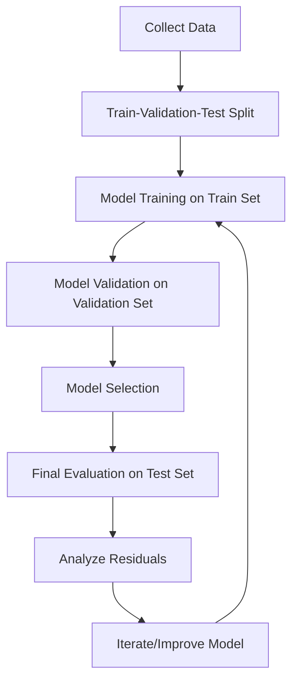
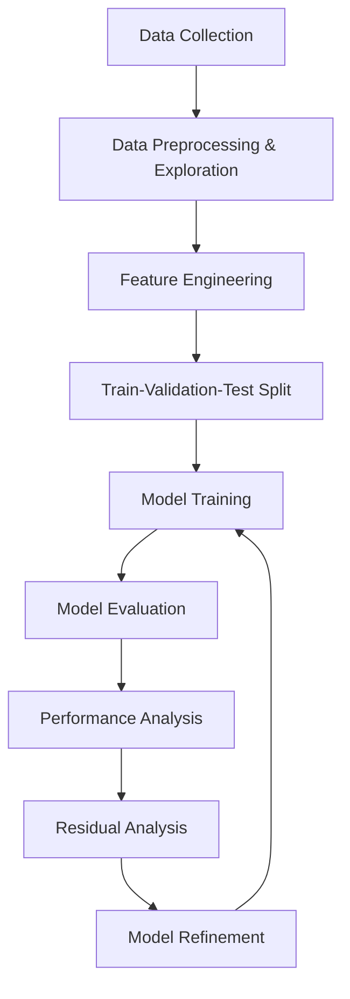

# Machine Learning Course Summary

### **ML = Model space + Loss function (+ regularization) + optimization**

At its core, ML can be mathematically represented as:
$\text{ML} = \mathcal{M} + L + R + \text{Opt}$

Where:

- $\mathcal{M}$ is the model space
- $L$ is the loss function
- $R$ is the regularization term
- $\text{Opt}$ represents the optimization algorithm

This comprehensive summary covers the fundamental concepts and practical applications of machine learning as taught in the course.

## Table of Contents

1. [Introduction to Machine Learning](#introduction-to-machine-learning)
2. [Model Evaluation](#model-evaluation)
4. [Laboratory Projects](#laboratory-projects)
5. [Key Takeaways](#key-takeaways)

---

## Introduction to Machine Learning

### What is Machine Learning?

---
Machine Learning is a field of study that gives computers the ability to learn without being explicitly programmed (A. Samuel). At its core:

- **Learning** means getting better at some given task
- **Machine learning** is about writing computer programs that get better at given tasks by using data

### Applications of ML

Machine learning is pervasive in modern applications:

- 🚗 **Self-driving cars** - Navigation and obstacle detection
- 🧠 **Large Language Models** - Natural language understanding and generation
- 🛡️ **Intrusion detection** - Cybersecurity threat identification
- 📈 **Stock market prediction** - Financial market analysis

### The ML Lifecycle

The machine learning process follows a systematic approach:

1. **Collect some data** - Gather relevant and representative examples
2. **Write a program that "learns" from it (training)** - Build a model from examples
3. **Use the program to "predict" what happens for new, unseen data** - Apply the model to new instances

### Types of Machine Learning

Machine learning is categorized into three main types:

| Type | Description | Use Case |
|------|-------------|----------|
| **Supervised Learning** | Learning from labeled examples | Predicting house prices |
| **Unsupervised Learning** | Learning from unlabeled examples | Customer segmentation |
| **Reinforcement Learning** | Learning from interaction with environment | Game playing, robotics |

### Supervised Learning

We have a (labeled) dataset of input-output examples:
$\mathcal{D} = \{(\mathbf{x}^{(i)}, y^{(i)}) | i = 1, \ldots, n\}$

And we want to find a model $f$ that, given an unseen data pair $(x, y)$, performs well at predicting $y$:
$f(x) \approx y$

---

### Model Space and Parameters

To solve the problem of finding the best model and make the model search tractable, we restrict our search to a given model space $\mathcal{M}$. The learning task is then to find the best $f$ in $\mathcal{M}$.

In most cases, our models are parametrized by a finite set of parameters:
$\boldsymbol{\theta} = (\theta_1, \ldots, \theta_p) \in \Theta$
that belong to a parameter space $\Theta$.

### Examples of Model Spaces

| Model Type | Mathematical Form | Parameters | Model space | Parameter space |
|------------|-------------------|------------|-------------|-----------------|
| **Linear Regression** | $f(x) = a \cdot x + b$ | $(a, b) \in \mathbb{R}^2$ | $\mathcal{M}= \{ f( x ) = a \cdot x + b \mid a, b \in \mathbb{R} \}$ | $(a, b)=: \theta \in \Theta := \mathbb{R}^2$ |
| **Polynomial Regression (degree $d$)** | $f(x) = a_1 \cdot x + a_2 \cdot x^2 + \ldots + a_d \cdot x^d + b$ | $(b, a_1, \ldots, a_d) \in \mathbb{R}^{d+1}$ | $\mathcal{M} = \{ f(x) = a_1 \cdot x + a_2 \cdot x^2 + \ldots + a_d \cdot x^d + b \vert a_1, a_2, \ldots, a_d, b \in \mathbb{R} \}$ | $(b, a_1, \ldots, a_d)=: \theta \in \Theta := \mathbb{R}^{d+1}$ |

### The Bias-Variance Trade-off

Understanding the trade-off between model simplicity and complexity is crucial:

| Type | Characteristic | Impact |
|------|----------------|---------|
| **Simple models** | High bias, low variance | Difficulty fitting the data, low sensitivity to noise |
| **Complex models** | Low bias, high variance | Can fit any data, too sensitive to noise |

### Loss Functions

Loss functions quantify how "wrong" our predictions are. For each example $(\mathbf{x}, y)$ in the training dataset, we want to know how good our prediction $\hat{y} = f(x)$ is.

| Loss Function | Formula | Properties |
|---------------|---------|------------|
| **L2 Loss (Mean Squared Error)** | $L(y, \hat{y}) = (y - \hat{y})^2$ | Penalizes large errors more than small ones, influenced by outliers |
| **L1 Loss (Mean Absolute Error)** | $L(y, \hat{y}) = \lvert y - \hat{y} \rvert$ | More robust to outliers, less statistically well-behaved |

### Empirical Risk Minimization

The central idea is to sum all losses $L(y^{(i)}, \hat{y}^{(i)})$ over the training dataset for each possible value of the parameter $\boldsymbol{\theta}$:

$J(\boldsymbol{\theta}) = \sum_{i=1}^{n} L(y^{(i)}, f_{\boldsymbol{\theta}}(\mathbf{x}^{(i)}))$

This tells us how well the model $f_{\boldsymbol{\theta}}$ fits the data for a given $\boldsymbol{\theta}$.

The best model is the one with the smallest loss (smallest risk):
$\boldsymbol{\theta}^* = \arg\min_{\boldsymbol{\theta} \in \Theta} J(\boldsymbol{\theta})$

### Optimization Methods

- **Analytical solutions**: Some models have closed-form solutions (e.g., linear regression with MSE)
- **Iterative methods**: For complex models, use gradient descent and similar algorithms
- **Optimization libraries**: Tools like Scipy provide general-purpose optimization routines

---

## Model Evaluation

### Train-Validation-Test Split 📊

The best practice in ML is to split the data into:

| Dataset | Purpose | Percentage | Key Rule |
|---------|---------|------------|----------|
| **Training data** | Model training | 60% | Used for learning patterns |
| **Validation data** | Model selection | 20% | Used for hyperparameter tuning |
| **Test data** | Final evaluation | 20% | Never touched during model development |

**Key principle**: Test data is sacred - it's never touched during model training and selection!

### Overfitting vs. Underfitting 🎯

#### Overfitting - The Complex Model Trap

- **Symptoms**: Low training error, High validation/test error
- **Cause**: Model is too complex relative to available data
- **Solutions**: Regularization, more data, simpler model

#### Underfitting - The Simple Model Trap

- **Symptoms**: High training error, High validation/test error
- **Cause**: Model is too simple for the task
- **Solutions**: More complex model, more features, less regularization

| Type | Training Error | Validation Error | Solution |
|------|----------------|------------------|----------|
| **Overfitting** | Low | High | Regularization, more data |
| **Underfitting** | High | High | Complex model, more features |

### Model Selection Process

The systematic approach to finding the best model:

1. **Design multiple models** - Create variations with different complexities
2. **Train all models** - Fit each model to the training set
3. **Compare performance** - Evaluate on validation set
4. **Select best model** - Choose based on validation performance

### Bias-Variance Tradeoff 📈

The fundamental trade-off in ML model design:

- **Bias**: Error from wrong assumptions (underfitting)
- **Variance**: Error from sensitivity to training data (overfitting)
- **Sweet spot**: Minimize total error by balancing both

### The No Free Lunch Theorem

> "There is no such thing as a free lunch." (D. Wolpert and W. MacReady)

> All models are wrong but some are useful. (G. Box)

No single model works best for all problems - context matters!

### Regularization 🛡️

Regularization adds a penalty term to the loss function to constrain model complexity:

$J_{\text{regularized}}(\boldsymbol{\theta}) = J_{\text{original}}(\boldsymbol{\theta}) + \lambda \cdot R(\boldsymbol{\theta})$

Where:

- $J_{\text{original}}(\boldsymbol{\theta})$: Original loss (e.g., MSE)
- $\lambda$: Regularization strength (hyperparameter)
- $R(\boldsymbol{\theta})$: Penalty term on parameters

#### Regularization Comparison

| Technique | Formula | Effect |
|-----------|---------|---------|
| **L2 (Ridge)** | $J_{\text{Ridge}} = \frac{1}{n} \sum (y_i - \hat{y}_i)^2 + \lambda \sum \theta_j^2$ | Shrinks coefficients toward zero |
| **L1 (Lasso)** | $J_{\text{Lasso}} = \frac{1}{n} \sum (y_i - \hat{y}_i)^2 + \lambda \sum \lvert \theta_j \rvert$ | Can zero out coefficients (feature selection) |
| **Elastic Net** | $J_{Ellastic\_net} = \sum_{i=1}^{n} \left(y_i - \hat{y_i}\right)^2 + \lambda_1 \sum_{j=1}^{p} \|\beta_j\| + \lambda_2 \sum_{j=1}^{p} \beta_j^2$ | Combines the benefits of L1 and L2; it both shrinks coefficients (like Ridge) and can set some to exactly zero (like Lasso) |

### Residuals Analysis 🔍

Residuals are the part of the data that is not captured by the model:
$r_i := y_i - \hat{y}_i$

In an ideal world, residuals should be i.i.d. Gaussian distributed.

**Key residual checks:**

- Plot residuals vs. predicted values - look for patterns
- Check for constant variance (homoscedasticity)
- Verify normal distribution (qq-plot)
- Look for systematic bias

---

## Laboratory Projects

### Mini Lab 1: Fuel Consumption Analysis

This project implemented key ML procedures for building a predictive model.

#### ML Pipeline Steps Implemented

| Step | Technique | Purpose |
|------|-----------|---------|
| **Data Exploration** | Correlation matrix, heatmaps, scatter plots | Identify feature relationships |
| **Model Development** | Simple linear regression: $y = a \cdot x$ | Baseline model creation |
| **Parameter Optimization** | Manual parameter sweeps ($a = 10, 20, 30$) | Find optimal coefficients |
| **Performance Evaluation** | R² (coefficient of determination) | Quantify model performance |
| **Model Extension** | Multi-parameter model with categorical encoding | Improved prediction accuracy |

$\text{CO2 emissions} = a \cdot \text{Combined (L/100 km)} + b \cdot \text{is diesel} + c \cdot \text{is essence}$

#### Key ML Takeaways from this Lab

- **Feature selection**: Correlation analysis helps identify the most predictive features
- **Model complexity**: Adding relevant features improved performance (R² from 0.637 to 0.837)
- **Parameter optimization**: Systematic parameter searches enable model improvement
- **Linear regression**: Serves as an effective baseline model with interpretable coefficients
- **Performance metrics**: R² provides a standardized way to evaluate regression models
- **Categorical encoding**: Binary indicators effectively incorporate categorical variables into linear models

### Project 1: House Price Analysis

This project demonstrated comprehensive ML pipeline implementation with multiple procedures.

#### ML Pipeline Implementation

| Phase | Technique | Purpose |
|-------|-----------|---------|
| **Data Preprocessing** | Categorical encoding (mapping values) | Convert non-numeric features |
| **Feature Engineering** | Composite features (`surface_by_room`) | Create meaningful derived features |
| **Data Splitting** | 60%-20%-20% train-val-test split | Proper model evaluation |
| **Outlier Handling** | Remove extreme values | Improve model robustness |
| **Model Selection** | Linear Regression with feature selection | Choose appropriate algorithm |
| **Performance Evaluation** | Multiple metrics (MSE, RMSE, MAE, R²) | Comprehensive assessment |

#### ML Key Procedures Demonstrated

- **Categorical Encoding**: Kitchen quality {mediocre: 0, moyenne: 1, bonne: 2, excellente: 3}
- **Feature Engineering**: `surface_by_room = surf_hab / n_pieces`
- **Model Training**: Linear Regression with selected features
- **Performance Tracking**: Training R² = 0.7255, Validation R² = 0.6710, Test R² = 0.7944

#### Key ML Takeaways from this Project

- **Data preprocessing**: Proper encoding of categorical variables is crucial for ML models
- **Feature engineering**: Creating meaningful derived features can improve model performance
- **Train-validation-test splits**: Essential for unbiased model evaluation
- **Linear regression interpretation**: Coefficients provide insights into feature importance
- **Model evaluation**: Multiple metrics provide comprehensive performance assessment
- **Residual analysis**: Critical for understanding model behavior and areas for improvement
- **Overfitting detection**: Gap between training and validation performance indicates overfitting risk

---

## Key Takeaways 🎯

### 1. ML Workflow 🔄

| Step | Purpose |
|------|---------|
| **Data Collection** | Gather relevant and representative data |
| **Data Preprocessing** | Clean, encode, and explore data |
| **Feature Engineering** | Create meaningful features from raw data |
| **Model Selection** | Choose appropriate model family |
| **Training** | Fit the model to training data |
| **Validation** | Select best model using validation data |
| **Testing** | Evaluate final performance on test data |
| **Analysis** | Interpret results and diagnose model behavior |

### 2. Critical Concepts 🧠

| Concept | Description |
|---------|-------------|
| **Supervised Learning** | Learning from labeled examples |
| **Overfitting** | When model learns training data too well, including noise |
| **Underfitting** | When model is too simple to capture underlying patterns |
| **Bias-Variance Tradeoff** | Balance between model simplicity and complexity |
| **Cross-validation** | Robust method for model evaluation |

### 3. Evaluation Metrics 📊

| Metric | Purpose |
|--------|---------|
| **R² (Coefficient of Determination)** | Proportion of variance explained |
| **RMSE (Root Mean Squared Error)** | Average prediction error in target units |
| **MAE (Mean Absolute Error)** | Average absolute prediction error |
| **Residual Analysis** | Essential for understanding model performance |

### 4. Best Practices ✅

- 🔒 **Always split data** before preprocessing to avoid leakage
- 📐 **Use separate splits** for training, validation and testing
- ⚡ **Feature engineering** creates more meaningful inputs
- 🛡️ **Regularize models** to prevent overfitting
- 🔍 **Analyze residuals** to understand model limitations
- 🔄 **Iterate** based on empirical results

### 5. Linear Regression Insights 📈

- **Simple but powerful**: Excellent baseline for regression problems
- **Sensitive to outliers**: Consider robust alternatives like L1 loss
- **Interpretable**: Coefficients show feature-target relationships
- **Best when linear**: Works optimally when relationships are approximately linear

### 6. Feature Importance 🎯

- **Domain knowledge**: Guides effective feature selection
- **Correlation analysis**: Identifies important variables
- **Feature engineering**: Creates more predictive inputs
- **Regularization**: Performs automatic feature selection

### 7. Model Complexity ⚖️

- **Start simple**: Use basic models as baselines
- **Increase carefully**: Only if justified by performance improvement
- **Balance interpretability**: With predictive performance
- **Beware of curse**: High-dimensional spaces create challenges

This comprehensive approach to machine learning ensures systematic model development with proper evaluation and validation, leading to more reliable and generalizable results. 🚀
