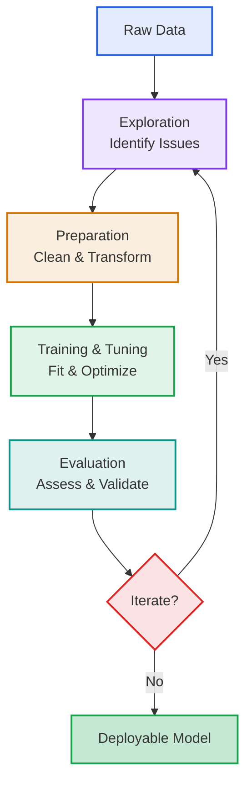
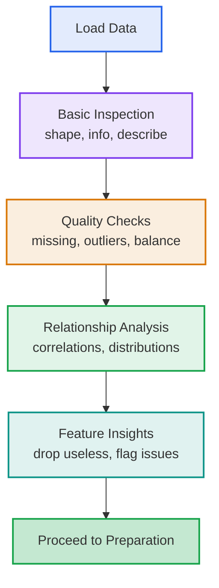
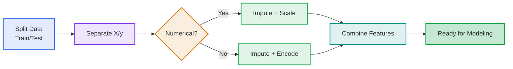
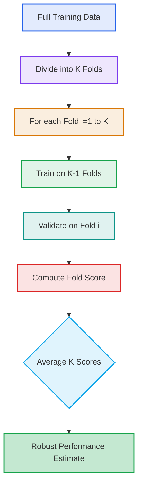
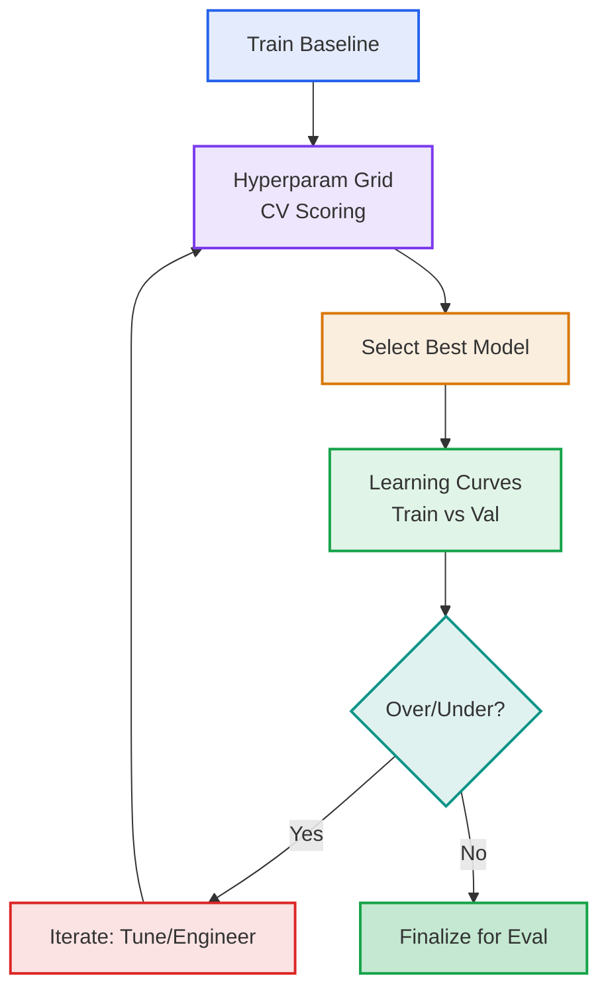
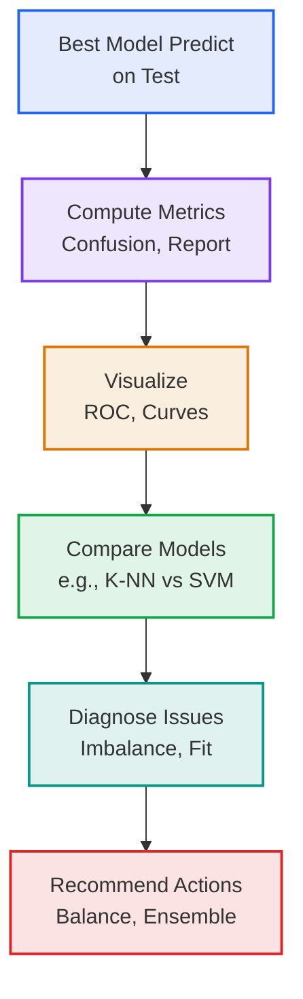

# ML Pipeline Summary: Supervised Classification Workflow

### **ML Pipeline = Exploration + Preparation + Modeling + Evaluation + Iteration**

At its core, an ML pipeline systematically transforms raw data into predictive models through a structured, iterative process:
$\text{Pipeline} = \mathcal{E} + \mathcal{P} + \mathcal{M} + \mathcal{V} + \mathcal{I}$

Where:
- $\mathcal{E}$: Data exploration (understand structure and issues)
- $\mathcal{P}$: Data preparation (clean and transform)
- $\mathcal{M}$: Model training and tuning (fit and optimize)
- $\mathcal{V}$: Evaluation (assess performance)
- $\mathcal{I}$: Iteration (refine based on insights)

This summary provides a conceptual overview of a supervised classification workflow, highlighting key principles for developing robust, generalizable models. It progresses logically from data understanding to deployment-ready insights.

## Table of Contents

1. [High-Level Pipeline Overview](#high-level-pipeline-overview)
2. [Data Exploration](#data-exploration)
3. [Data Preparation](#data-preparation)
4. [Model Training and Tuning](#model-training-and-tuning)
5. [Model Evaluation](#model-evaluation)
6. [Key Takeaways](#key-takeaways)

---

## High-Level Pipeline Overview

Before diving into details, consider the end-to-end flow: Start with raw data, explore to identify challenges, prepare to make it model-ready, train and tune for optimal performance, evaluate for reliability, and iterate for improvement.

This cyclical structure ensures continuous refinement, preventing issues like data leakage or overfitting.

---

## Data Exploration

Exploration is the foundation: It uncovers data properties to guide all subsequent steps. Without it, preparation and modeling risk being misguided.

### Core Principles
- **Inspection**: Examine structure, types, and summaries to grasp the dataset's scale and composition.
- **Quality Checks**: Detect missing values, class imbalances, and outliers that could bias models.
- **Relationships**: Investigate correlations and distributions to identify predictive signals or redundancies.

### Essential Operations
Leverage libraries like Pandas for efficient analysis:

| Operation | Purpose | Conceptual Benefit |
|-----------|---------|--------------------|
| **Selection/Indexing** | Extract subsets (e.g., loc/iloc) | Focus on relevant features |
| **Filtering** | Boolean conditions | Isolate patterns (e.g., by class) |
| **Aggregation** | Summaries (e.g., value_counts, corr) | Detect imbalances and dependencies |

**Transition**: Insights from exploration directly inform preparation strategies, ensuring targeted handling of issues like missing data or scaling needs.

**Principle**: Treat exploration as diagnostic – it's not one-and-done but revisited iteratively.

---

## Data Preparation

Building on exploration insights, preparation cleans and structures data for modeling. This step is critical to prevent biases and enable algorithmic compatibility.

### Fundamental Steps
- **Splitting**: Partition into train/validation/test sets (e.g., 70/15/15), using stratification to preserve class distributions.
- **Separation**: Distinguish features (X) from target (y); eliminate non-informative elements early.

### Handling Common Issues
Tailor techniques to data types for effective transformation:

| Issue | Technique | Rationale |
|-------|-----------|-----------|
| **Missing Values** | Imputation (mean/median for numerical; mode for categorical) | Preserve samples; advanced (KNN) leverages correlations |
| **Scaling** | Standardization (z-score) or normalization | Equalizes ranges for distance-sensitive algorithms |
| **Categorical Encoding** | One-hot (nominal) or ordinal (ordered) | Numerically represents categories without false ordering |

### Assembly
Integrate processed components into cohesive feature matrices, validating shapes and types.

**Transition**: Prepared data now feeds into training, where models learn patterns without distortion from raw imperfections.

**Best Practice**: Fit preprocessors solely on training data to mimic real-world unseen data application.

---

## Model Training and Tuning

With clean data in hand, focus shifts to building and refining models. Start simple, then optimize to balance bias and variance.

### Baseline Fitting
Establish a performance baseline using straightforward algorithms.

- **Exemplar: K-NN**: Non-parametric classifier relying on nearest neighbors; initial k (e.g., 5) for basic predictions.
- **Process**: Train (`fit(X_tr, y_tr)`) and predict (`predict(X_te)`) to gauge initial viability.

### K-Fold Cross-Validation
To reliably estimate performance and tune hyperparameters, employ K-fold Cross-Validation (CV). This method partitions the training data into K folds, iteratively training on K-1 and validating on the remaining fold, averaging results for stability.

#### Key Concepts
- **Folds (K)**: Typically 5-10; balances computation and variance reduction.
- **Stratified Variant**: Maintains class proportions per fold, vital for imbalanced datasets.
- **Integration**: Pairs with search methods (e.g., GridSearchCV) for hyperparameter selection.

| Aspect | Description | Benefit |
|--------|-------------|---------|
| **Robustness** | Averages over multiple splits | Minimizes random split variance |
| **Efficiency** | Full data utilization | Ideal for smaller datasets |
| **Tuning** | Scores guide best params | Prevents overfitting in selection |
| **Diagnosis** | Fold variances highlight instability | Informs further refinements |

#### Variants and Flow
- **Repeated K-Fold**: Multiple runs for extra stability.
- **Nested CV**: Outer loop for final eval, inner for tuning.

### Optimization Techniques
- **Search Methods**: Exhaustive (GridSearch) or sampled (RandomSearch); CV-scored for accuracy/F1.
- **Exemplar: SVM**: Optimizes margins; tunes C and kernel parameters via CV.

### Diagnostics
Use learning curves to visualize train/validation performance trends.

| Fit Type | Train Perf | Val Perf | Action |
|----------|------------|----------|--------|
| **Overfitting** | High | Low | Regularize, simplify |
| **Underfitting** | Low | Low | Enhance capacity/features |
| **Good Fit** | High | High | Advance to evaluation |

**Transition**: Tuned models now undergo rigorous evaluation on held-out data to confirm real-world viability.

**Insight**: CV bridges training and evaluation, ensuring selections are data-efficient and unbiased.

---

## Model Evaluation

The culmination: Test the tuned model on unseen data to quantify generalization. This step validates the pipeline's effectiveness.

### Comprehensive Assessment
- **Predictions**: Output class labels or probabilities; benchmark against ground truth.
- **Metrics**: Select based on problem needs, emphasizing imbalance handling.

| Metric | Focus | When Preferred |
|--------|-------|----------------|
| **Accuracy** | Overall correctness | Balanced datasets |
| **Precision/Recall** | Error types (FP/FN) | Cost-sensitive scenarios |
| **F1-Score** | P/R harmony | Imbalanced classes |
| **ROC-AUC** | Threshold-independent | Probabilistic models |

### Visualizations
- **Confusion Matrix**: Cross-tab of predictions vs. actuals; normalization aids interpretation.
- **ROC Curve**: Plots true/false positive rates; AUC measures overall discrimination.

### Model Comparison
Contrast algorithms to select the best fit:

| Model | Strengths | Weaknesses |
|-------|-----------|------------|
| **K-NN** | Intuitive, local adaptation | Scalability issues, noise vulnerability |
| **SVM** | Global margins, high-dimensional prowess | Tuning complexity, interpretability challenges |

**Transition**: Evaluation outcomes feed back into iteration, closing the loop for pipeline refinement.

**Principle**: Reserve the test set as "gold standard" – its metrics define success.

---

## Key Takeaways 🎯

### 1. Pipeline Principles 🔄
- **Logical Progression**: Each stage builds on the previous, with iteration for refinement.
- **Leakage Prevention**: Strict train/test isolation; CV for internal validation.
- **Type-Aware Handling**: Distinct strategies for numerical vs. categorical data.

### 2. Core Concepts 🧠
| Concept | Essence |
|---------|---------|
| **Exploration** | Diagnostic foundation to flag issues early |
| **Preparation** | Bias-free transformation for algorithmic readiness |
| **K-Fold CV** | Reliable resampling for tuning and estimation |
| **Evaluation** | Unbiased metrics and visuals for generalization check |
| **Bias-Variance** | Diagnostic curves guide optimal complexity |

### 3. Best Practices ✅
- 🔍 **Iterate Proactively**: Re-explore after major changes.
- 🛡️ **Stratify Always**: Preserve distributions in splits/CV.
- ⚡ **CV Integration**: Essential for small data; nested for thorough tuning.
- 📊 **Multi-Faceted Eval**: Combine metrics/visuals for complete picture.
- 🔄 **Benchmark Models**: Compare (e.g., K-NN/SVM) to validate choices.
- 🚀 **Scale Concepts**: Adapt to regression by metric swaps (e.g., MSE).

### 4. Model Philosophy 📈
- **Baselines First**: Simple models (K-NN) test assumptions before complexity.
- **Robust Selection**: SVM's structure aids noisy/high-dim data.
- **No Universal Best**: Problem-specific tuning via CV yields tailored solutions.

This streamlined workflow promotes efficient, reproducible ML development. From exploration's insights to evaluation's validation, it equips practitioners for scalable classification tasks – extensible to regression or beyond. 🚀

