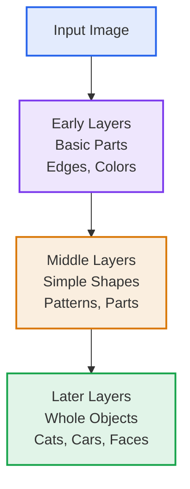
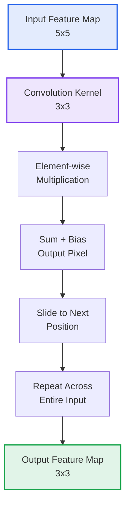
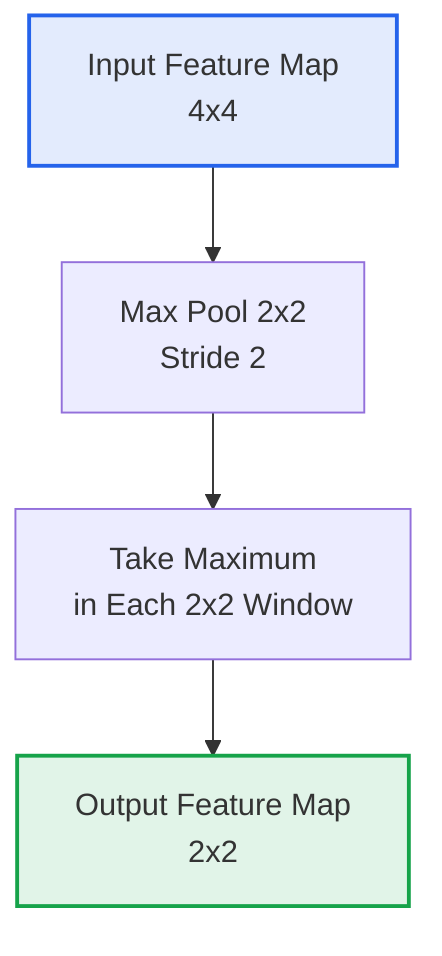
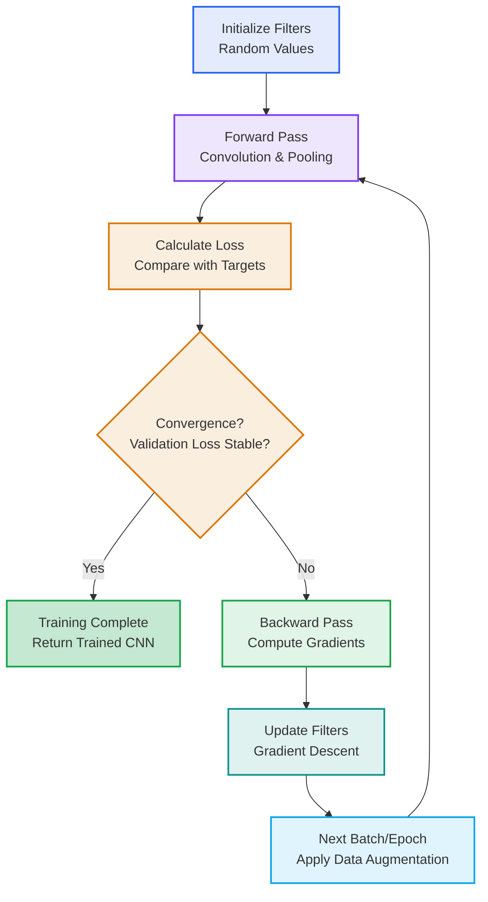

# Machine Learning Course Summary - Convolutional Neural Networks

## Introduction

This summary provides a comprehensive overview of convolutional neural networks (CNNs), focusing on their specialized architecture for processing grid-structured data like images. Building upon the foundations of neural networks, CNNs excel at capturing spatial hierarchies and local patterns, making them indispensable for computer vision tasks. This guide will explore their unique components, operational mechanisms, and practical applications.

## Table of Contents

1. [Introduction](#introduction)
2. [Convolutional Neural Networks](#convolutional-neural-networks)
3. [Key Components](#key-components)
4. [Feature Learning Hierarchy](#feature-learning-hierarchy)
5. [How Convolutional Neural Networks Work](#how-convolutional-neural-networks-work)
6. [Training Process](#training-process)
7. [Parameters and Tuning](#parameters-and-tuning)
8. [Applications and Benefits](#applications-and-benefits)
9. [Key Takeaways](#key-takeaways)

---

## <a name="convolutional-neural-networks"></a>Convolutional Neural Networks

### What are Convolutional Neural Networks?

Convolutional Neural Networks (CNNs) are a specialized class of neural networks designed to process data with grid-like topology, particularly excelling at image recognition and computer vision tasks. They automatically learn hierarchical feature representations by applying convolutional operations that preserve spatial relationships.

- **Spatial Hierarchy Learning**: Learn features from local to global patterns
- **Parameter Sharing**: Reuse learned filters across the input space
- **Translation Invariance**: Detect features regardless of position in the image

### How CNNs Differ from Regular Neural Networks

While standard neural networks treat inputs as flat vectors, CNNs maintain spatial structure:

- **Local Connectivity**: Neurons connect to local regions rather than entire input
- **Weight Sharing**: Same weights applied across different spatial locations
- **Hierarchical Features**: Build complex features from simple ones layer by layer

#### Example Application

For image classification (e.g., CIFAR-10):

- Input: 32x32x3 RGB image
- Convolutional layers: Extract edges, textures, shapes
- Pooling layers: Reduce spatial dimensions while preserving features
- Fully connected layers: Classify into 10 categories

---

## <a name="key-components"></a>Key Components of Convolutional Neural Networks

### 1. Convolutional Layers

- **Convolution Operation**: Apply learnable filters (kernels) to input feature maps
- **Feature Maps**: Output of convolution operations capturing different aspects
- **Stride and Padding**: Control output size and boundary handling

### 2. Activation Functions

- **ReLU**: Rectified Linear Unit, sets negative values to zero
- **Leaky ReLU**: Allows small negative values to prevent dead neurons
- **ELU**: Exponential Linear Unit for smoother gradients
- **Purpose**: Introduce non-linearity to enable learning of complex patterns

### 3. Pooling Layers

- **Max Pooling**: Select maximum value in each pooling window
- **Average Pooling**: Compute average value in each pooling window
- **Purpose**: Reduce spatial dimensions and provide translation invariance

### 4. Fully Connected Layers

- **Dense Connections**: Traditional neural network layers at the end
- **Classification Head**: Produce final predictions from learned features

### CNN Architecture Visualization

```mermaid
graph LR
    I[Input Image<br/>32x32x3] --> C1[Conv Layer 1<br/>28x28x32]
    C1 --> A1[ReLU<br/>Activation]
    A1 --> P1[Max Pool<br/>14x14x32]
    P1 --> C2[Conv Layer 2<br/>10x10x64]
    C2 --> A2[ReLU<br/>Activation]
    A2 --> P2[Max Pool<br/>5x5x64]
    P2 --> F1[Fully Connected<br/>512 neurons]
    F1 --> A3[ReLU<br/>Activation]
    A3 --> F2[Fully Connected<br/>10 neurons]
    F2 --> A4[Softmax<br/>Activation]
    A4 --> O[Output<br/>Class Probabilities]

    style I fill:#2563eb20,stroke:#2563eb,stroke-width:2px
    style C1 fill:#7c3aed20,stroke:#7c3aed,stroke-width:2px
    style A1 fill:#f59e0b20,stroke:#f59e0b,stroke-width:2px
    style A3 fill:#f59e0b20,stroke:#f59e0b,stroke-width:2px
    style A4 fill:#f59e0b20,stroke:#f59e0b,stroke-width:2px
    style P1 fill:#d9770620,stroke:#d97706,stroke-width:2px
    style O fill:#16a34a20,stroke:#16a34a,stroke-width:2px
```



---

## <a name="feature-learning-hierarchy"></a>Feature Learning Hierarchy

CNNs learn like humans: starting with basic details and building up to complex understanding. Think of it like learning to recognize a cat - you first notice whiskers and fur, then see the cat's face, and finally recognize the whole animal.



- **Early Layers (Low-level)**: Spot basic patterns like lines, edges, and colors
- **Middle Layers (Mid-level)**: Combine patterns into shapes, textures, and simple object parts
- **Later Layers (High-level)**: Recognize complete objects and complex scenes

This hierarchy makes CNNs great at recognizing objects no matter where they appear in an image.

---

## <a name="how-convolutional-neural-networks-work"></a>How Convolutional Neural Networks Work

### The Convolution Operation

The core operation in CNNs involves sliding a learnable filter (kernel) over the input feature map to extract local patterns:

1. **Filter Application**: Multiply filter weights with corresponding input values
2. **Summation**: Sum the products to get output pixel
3. **Sliding Window**: Move filter across entire input with defined stride

#### Convolution Operation Visualization



#### Convolution Example

Consider a 4x4 input with a 2x2 kernel (stride=1, no padding, bias=0):

```
Input:     Kernel:    Output:
1 2 3 0    1 0        2  4  6
0 1 2 3    0 1        0  2  4
3 0 1 2               3  1  3
2 3 0 1               2  3  1
```

Calculations (element-wise multiplication + sum):

- Top-left: (1×1 + 2×0 + 0×0 + 1×1) = 1 + 0 + 0 + 1 = 2
- Top-middle: (2×1 + 3×0 + 1×0 + 2×1) = 2 + 0 + 0 + 2 = 4
- Top-right: (3×1 + 0×0 + 2×0 + 3×1) = 3 + 0 + 0 + 3 = 6
- Middle-left: (0×1 + 1×0 + 3×0 + 0×1) = 0 + 0 + 0 + 0 = 0
- Middle-middle: (1×1 + 2×0 + 0×0 + 1×1) = 1 + 0 + 0 + 1 = 2
- And so on...

Each output value = sum of element-wise products + bias

### Mathematical Representation

For a 2D convolution:
$(O)_{i,j} = \sum_m \sum_n (I)_{i+m,j+n} \cdot (K)_{m,n} + b$

Where:

- $I$: Input feature map
- $K$: Convolution kernel (filter)
- $O$: Output feature map
- $b$: Bias term

### Output Dimensions and Padding

#### Padding Types

- **Valid Padding** (no padding): Output size shrinks
- **Same Padding**: Adds padding to maintain input size
- **Custom Padding**: Specified number of pixels added to borders

#### Convolution Output Dimensions

For 2D convolution:
$\text{Output size} = \left\lfloor \frac{\text{Input size} - \text{Kernel size} + 2 \times \text{Padding}}{\text{Stride}} \right\rfloor + 1$

Examples:

- 32x32 input, 3x3 kernel, stride=1, padding=1 → 32x32 output (same)
- 28x28 input, 3x3 kernel, stride=1, padding=0 → 26x26 output (valid)

### Activation Functions in Convolutional Layers

After the convolution operation, an activation function is applied element-wise to introduce non-linearity:

| Function | Formula | Use Case | Advantages | Disadvantages |
|----------|---------|----------|------------|---------------|
| **ReLU** | $\max(0,x)$ | Most common, avoids vanishing gradient | Simple, computationally efficient, helps with vanishing gradients | Can cause "dying ReLU" where neurons become inactive |
| **Leaky ReLU** | $\max(0.01x,x)$ | Addresses dying ReLU problem | Allows small negative values, prevents dead neurons | Slightly more computation |
| **ELU** | $x$ if $x > 0$ else $\alpha(e^x - 1)$ | Smooth activation, faster convergence | Smooth gradients, can improve learning | More computationally expensive |
| **Swish** | $x \cdot \sigma(x)$ | Modern alternative to ReLU | Self-gated, often outperforms ReLU | More complex computation |
| **Sigmoid** | $\frac{1}{1 + e^{-x}}$ | Binary classification outputs | Bounded output [0,1] | Vanishing gradients, not zero-centered |
| **Tanh** | $\frac{e^x - e^{-x}}{e^x + e^{-x}}$ | Hidden layers in shallow nets | Zero-centered, bounded [-1,1] | Still susceptible to vanishing gradients |

**Key Considerations:**

- ReLU and its variants are preferred in hidden layers of deep CNNs
- Sigmoid and Softmax are typically reserved for output layers in classification tasks
- The choice of activation can significantly impact training stability and convergence speed

### Pooling Operations

Pooling layers reduce spatial dimensions while preserving important features, providing translation invariance:

- **Spatial Reduction**: Decrease feature map size (typically 2x downsampling)
- **Translation Invariance**: Make feature detection position-independent
- **Computational Efficiency**: Reduce parameters and prevent overfitting

#### Max Pooling Visualization



#### Pooling Example

Max pooling on a 4x4 feature map with 2x2 windows (stride=2):

```
Input:        Max Pool Output:
1  3  2  4    5  6
5  2  6  1    7  9
0  7  1  8
3  4  9  2
```

Windows:

- Top-left 2x2: max(1,3,5,2) = 5
- Top-right 2x2: max(2,4,6,1) = 6
- Bottom-left 2x2: max(0,7,3,4) = 7
- Bottom-right 2x2: max(1,8,9,2) = 9

Each 2x2 window → single maximum value

#### Pooling Output Dimensions

For max/average pooling:
$\text{Output size} = \left\lfloor \frac{\text{Input size} - \text{Pool size}}{\text{Stride}} \right\rfloor + 1$

Examples:

- 4x4 input, 2x2 pool, stride=2 → 2x2 output
- 6x6 input, 3x3 pool, stride=2 → 2x2 output

## <a name="parameters-and-tuning"></a>Parameters and Tuning

### Network Architecture Parameters

| Parameter | Description | CNN-Specific Guidelines |
|-----------|-------------|-------------------------|
| **Filter Size** | Size of convolutional kernels (e.g., 3x3, 5x5) | 3x3 most common; smaller filters for efficiency |
| **Number of Filters** | Depth of feature maps per layer | Increase progressively (32→64→128→256) |
| **Stride** | Step size for filter sliding | Stride 1 for feature preservation, 2 for downsampling |
| **Padding** | Border addition to maintain spatial dimensions | 'Same' padding preserves input size |

### Training Parameters

| Parameter | Description | CNN Tuning Guidelines |
|-----------|-------------|----------------------|
| **Learning Rate** | Step size for parameter updates | 0.001-0.01 initial; use decay schedules |
| **Batch Size** | Images processed per gradient update | 16-64 common; balance memory and stability |
| **Epochs** | Complete passes through training data | 50-200 typical; use early stopping |
| **Optimizer** | Algorithm for gradient descent | Adam default; SGD with momentum for generalization |

### Regularization Techniques for CNNs

- **Dropout**: Applied after fully connected layers (0.5 rate) or convolutional layers (0.2-0.3 rate)
- **Batch Normalization**: Essential between conv layers for training stability
- **Data Augmentation**: Image transformations critical for robust feature learning
- **Weight Decay**: L2 regularization on filters to prevent overfitting

### Hyperparameter Tuning Strategies

1. **Architecture Search**: Experiment with filter counts, kernel sizes, and network depth
2. **Learning Rate Scheduling**: Cosine annealing or step decay for optimal convergence
3. **Progressive Training**: Start with smaller images, gradually increase resolution
4. **Cross-Validation**: Use k-fold CV on validation set for robust evaluation

---

## <a name="training-process"></a>Training Process

### Gradient Descent Optimization for CNNs



### Key Training Concepts for CNNs

| Concept | Description | CNN-Specific Considerations |
|---------|-------------|-----------------------------|
| **Epoch** | One complete pass through the training images | Multiple epochs needed for convergence; monitor for overfitting |
| **Batch** | Subset of training images processed together | Smaller batches (16-64) common due to memory constraints |
| **Learning Rate** | Step size for filter updates | Start lower (0.001-0.01); use schedules for stability |
| **Data Augmentation** | Artificial dataset expansion through transformations | Critical for CNNs: rotation, flip, crop, color jitter |

### CNN-Specific Training Considerations

- **Data Augmentation**: Essential for preventing overfitting - rotate, flip, scale, crop images to create diverse training samples
- **Batch Normalization**: Normalizes activations between convolutional layers, stabilizes training and acts as regularization
- **Transfer Learning**: Leverage pre-trained models (e.g., ImageNet) and fine-tune for specific vision tasks
- **GPU Acceleration**: Convolutional operations are highly parallelizable, making GPUs essential for efficient training

### Training Challenges in CNNs

- **Vanishing/Exploding Gradients**: Deep architectures can suffer from gradient issues; mitigated by careful initialization and normalization
- **Overfitting on Limited Data**: High parameter count requires large datasets; data augmentation and regularization are crucial
- **Memory Constraints**: Large feature maps and deep networks require significant GPU memory
- **Computational Intensity** 💻: Convolution operations are expensive; efficient implementations needed for real-time training

---

## <a name="applications-and-benefits"></a>Applications and Benefits

### Core Applications

| Domain | Task | Example |
|--------|------|---------|
| **Computer Vision** | Image Classification | ImageNet classification |
| **Object Detection** | Bounding Box Prediction | YOLO, Faster R-CNN |
| **Semantic Segmentation** | Pixel-wise Classification | Medical imaging, autonomous driving |
| **Image Generation** | GAN-based Synthesis | Style transfer, super-resolution |

### Advantages

- **Spatial Feature Learning**: Automatically learn spatial hierarchies
- **Parameter Efficiency**: Fewer parameters than fully connected networks
- **Translation Invariance**: Robust to object position changes
- **Scalability**: Handle high-resolution images effectively

### Performance Metrics

- **Accuracy**: Classification performance on test sets
- **mAP**: Mean Average Precision for detection tasks
- **IoU**: Intersection over Union for segmentation
- **Inference Speed**: Real-time performance requirements

### Real-World Impact

CNNs power applications from:

- **Medical Diagnosis**: X-ray analysis, tumor detection
- **Autonomous Vehicles**: Pedestrian detection, lane recognition
- **Quality Control**: Defect detection in manufacturing
- **Content Moderation**: Image and video analysis

---

## <a name="key-takeaways"></a>Key Takeaways

### 1. Core Principles

| Principle | Description |
|-----------|-------------|
| **Local Receptive Fields** | Each neuron sees only a small region of input |
| **Weight Sharing** | Same filters applied across entire input |
| **Spatial Hierarchy** | Features progress from edges to complex objects |

### 2. Architecture Design

| Consideration | Guideline |
|----------------|-----------|
| **Filter Size** | 3x3 filters most common for modern CNNs |
| **Depth Progression** | Gradually increase filter count (32→64→128→...) |
| **Pooling Strategy** | Max pooling for downsampling, preserve important features |
| **Skip Connections** | Use residual blocks for deep networks |

### 3. Best Practices

- **Data Augmentation**: Essential - flip, rotate, crop, color jitter
- **Pre-trained Models**: Fine-tune ImageNet models for new tasks
- **Batch Normalization**: Apply after conv layers for stability
- **Progressive Resizing**: Train on small images first, then larger
- **Learning Rate Scheduling**: Cosine annealing or step decay

### 4. When to Use CNNs

- **Image Data**: Natural images, medical scans, satellite imagery
- **Spatial Patterns**: When relative positions matter
- **Large-Scale Vision Tasks**: Classification, detection, segmentation
- **GPU Access**: For efficient convolution computations

### 5. Performance Considerations

- **Parameter Efficiency**: Fewer parameters than fully connected networks
- **Computational Intensity**: High FLOPs for large inputs
- **Memory Bottleneck**: Feature maps consume significant GPU memory
- **Inference Speed**: Real-time requirements for applications

### 6. Advanced CNN Techniques

- **Attention Modules**: Squeeze-and-excitation, self-attention
- **Multi-scale Features**: Feature pyramids for object detection
- **Generative CNNs**: Style transfer, super-resolution
- **Efficient Architectures**: MobileNet, ShuffleNet for edge devices

Convolutional Neural Networks have revolutionized computer vision by enabling automatic learning of spatial features from images. Their ability to capture hierarchical patterns while maintaining computational efficiency makes them the foundation of modern visual AI systems.
