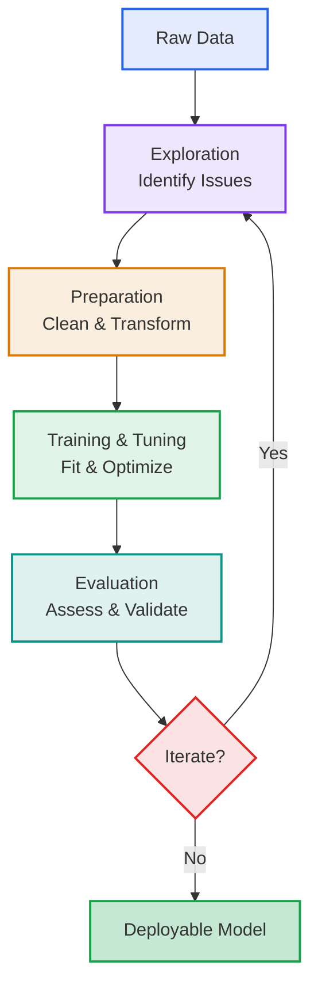
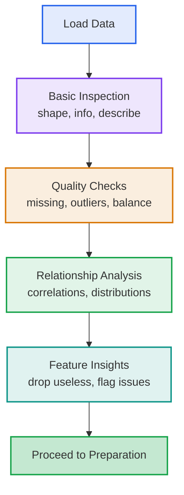
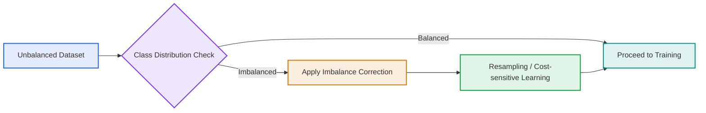
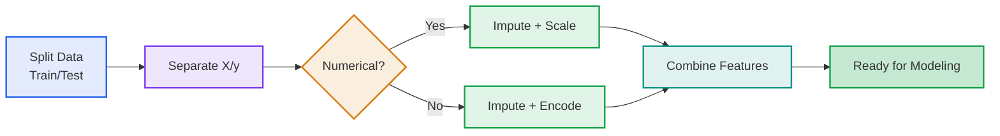
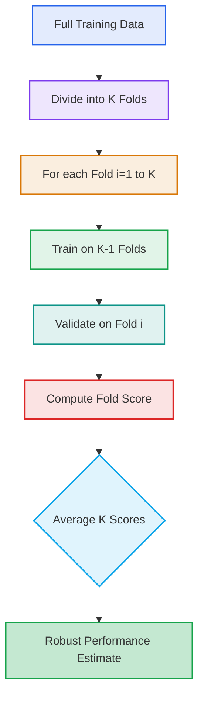
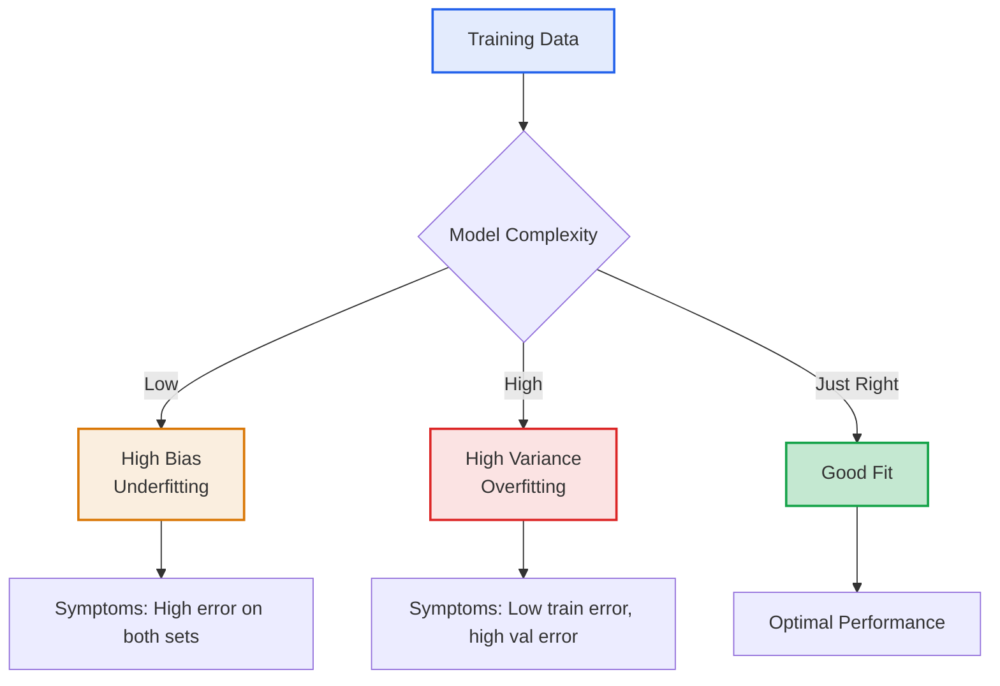
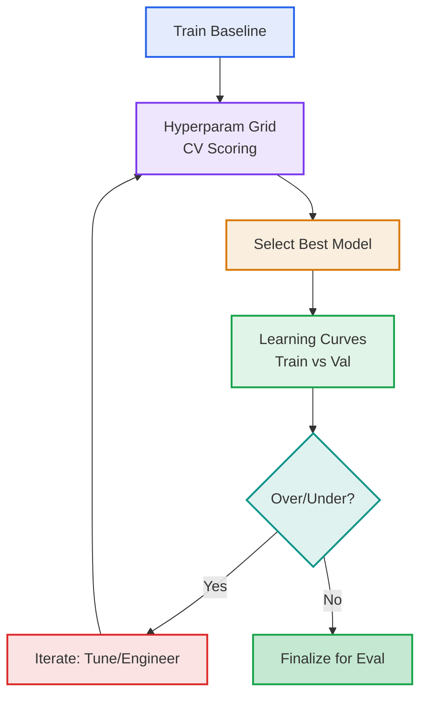
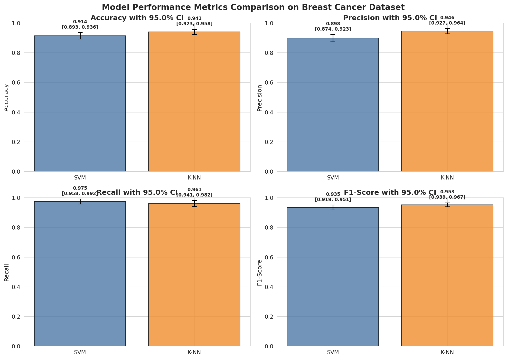
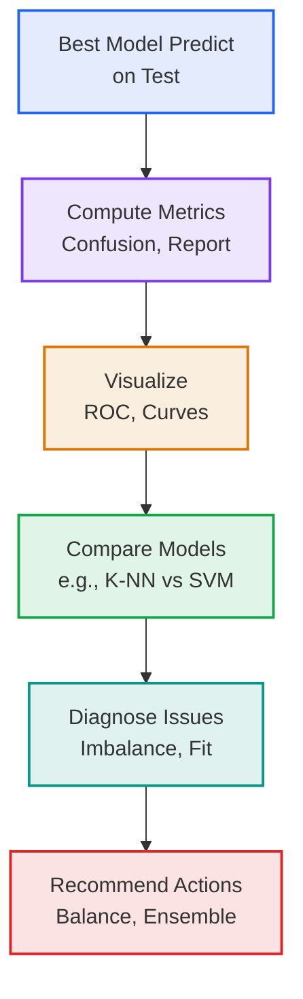

# ML Pipeline Summary: Supervised Classification Workflow

### **ML Pipeline = Exploration + Preparation + Modeling + Evaluation + Iteration**

This summary provides a conceptual overview of a supervised classification workflow, highlighting key principles for developing robust, generalizable models. It progresses logically from data understanding to deployment-ready insights.

## Table of Contents

1. [High-Level Pipeline Overview](#high-level-pipeline-overview)
2. [Data Exploration](#data-exploration)
3. [Data Preparation](#data-preparation)
4. [Model Training and Tuning](#model-training-and-tuning)
5. [Model Evaluation](#model-evaluation)
6. [Key Takeaways](#key-takeaways)

---

## <a name="high-level-pipeline-overview"></a>High-Level Pipeline Overview

Before diving into details, consider the end-to-end flow: Start with raw data, explore to identify challenges, prepare to make it model-ready, train and tune for optimal performance, evaluate for reliability, and iterate for improvement.



This cyclical structure ensures continuous refinement, preventing issues like data leakage or overfitting.

---

## <a name="data-exploration"></a>Data Exploration

Exploration is the foundation: It uncovers data properties to guide all subsequent steps. Without it, preparation and modeling risk being misguided.

### Core Principles

- **Inspection**: Examine structure, types, and summaries to grasp the dataset's scale and composition.
- **Quality Checks**: Detect missing values, class imbalances, and outliers that could bias models.
- **Relationships**: Investigate correlations and distributions to identify predictive signals or redundancies.

### Essential Operations

Leverage libraries like Pandas for efficient analysis:

| Operation | Purpose | Conceptual Benefit |
|-----------|---------|--------------------|
| **Selection/Indexing** | Extract subsets (e.g., loc/iloc) | Focus on relevant features |
| **Filtering** | Boolean conditions | Isolate patterns (e.g., by class) |
| **Aggregation** | Summaries (e.g., value_counts, corr) | Detect imbalances and dependencies |



**Transition**: Insights from exploration directly inform preparation strategies, ensuring targeted handling of issues like missing data or scaling needs.

**Principle**: Treat exploration as diagnostic – it's not one-and-done but revisited iteratively.

---

## <a name="data-preparation"></a>Data Preparation

Building on exploration insights, preparation cleans and structures data for modeling. This step is critical to prevent biases and enable algorithmic compatibility.

### Fundamental Steps

- **Splitting**: Partition into train/validation/test sets (e.g., 70/15/15), using stratification to preserve class distributions.
- **Separation**: Distinguish features (X) from target (y); eliminate non-informative elements early.

### Handling Common Issues

Tailor techniques to data types for effective transformation:

| Issue | Technique | Rationale |
|-------|-----------|-----------|
| **Missing Values** | Imputation (mean/median for numerical; mode for categorical) | Preserve samples; advanced (KNN) leverages correlations |
| **Scaling** | Standardization (z-score) or normalization | Equalizes ranges for distance-sensitive algorithms |
| **Categorical Encoding** | One-hot (nominal) or ordinal (ordered) | Numerically represents categories without false ordering |
| **Class Imbalance** | Resampling, cost-sensitive learning, ensemble methods | Address bias toward majority class |

### Class Imbalance

An unbalanced training set can significantly impact the performance of some classifiers, especially algorithms like K-NN. When classes are unbalanced (skewed), the model may be biased toward the majority class, leading to poor performance on the minority class.

**Solutions for Class Imbalance:**

- Balance the training set by randomly repeating samples from the minority class
- Apply cost-sensitive learning by giving more importance to errors on the minority class
- Use ensemble methods designed to handle imbalanced data



### Feature Scaling and Normalization

Some machine learning algorithms (K-NN, SVM, neural networks, and others) ignore features with smaller scales. Proper feature scaling ensures that all features contribute fairly to the model.

**Example: Predicting flat energy label based on:**

- Feature 1: Number of rooms (ranging from 1 to 12)
- Feature 2: Price of the flat (ranging from 300,000 to 2,000,000)

Without normalization, the price feature would dominate the distance calculations in algorithms like K-NN.

**Common Scaling Techniques:**

1. **Min-Max Scaling (Rescaling)**: Features are rescaled to the range [0,1]
   $x_{scaled} = \frac{x - x_{min}}{x_{max} - x_{min}}$

2. **Standardization**: Features are transformed to have zero mean and unit variance
   $x_{standardized} = \frac{x - \mu}{\sigma}$

| Sample | # of rooms (orig) | Price (orig) | # of rooms (scaled) | Price (scaled) |
|--------|------------------|--------------|-------------------|----------------|
| 1      | 4                | 300,000      | 0                 | 0              |
| 2      | 12               | 2,000,000    | 1                 | 1              |
| 3      | 6                | 650,000      | 0.25              | 0.206          |

### Assembly

Integrate processed components into cohesive feature matrices, validating shapes and types.



**Transition**: Prepared data now feeds into training, where models learn patterns without distortion from raw imperfections.

**Best Practice**: Fit preprocessors solely on training data to mimic real-world unseen data application.

---

## <a name="model-training-and-tuning"></a>Model Training and Tuning

With clean data in hand, focus shifts to building and refining models. Start simple, then optimize to balance bias and variance.

### Baseline Fitting

Establish a performance baseline using straightforward algorithms.

- **Exemplar: K-NN**: Non-parametric classifier relying on nearest neighbors; initial k (e.g., 5) for basic predictions.
- **Process**: Train (`fit(X_tr, y_tr)`) and predict (`predict(X_te)`) to gauge initial viability.

### Cross-Validation

Cross-validation is a statistical method for evaluating and comparing learning algorithms by dividing data into two segments: one used to learn (or train) a model and the other used to validate the model. The goal of machine learning is to automatically extract relevant information from data and apply it to analyze new data (regression or classification). However, good prediction capability on the training data might fail to predict future unseen data, so we need a procedure for estimating the generalization performance.

#### Cross-Validation Approaches

1. **Resubstitution Validation**:
   - Learning from all the available data
   - Test on all the available data
   - Pros: Uses all available data
   - Cons: Suffers seriously from overfitting

2. **Hold-Out Validation**:
   - Learning from half of the available data (or 80-20 split)
   - Test on the other half of data (held out during training)
   - Pros: Avoids overlap between training and test data
   - Cons: Doesn't use all available data for training; results dependent on split choice

3. **K-Fold Cross-Validation**:
   - The data is partitioned into k equally sized segments (or folds)
   - K iterations of training and validation:
     - Learning on k-1 folds
     - Test on the held-out fold
   - Data are commonly stratified first to ensure each fold is a good representative of the whole

#### K-Fold Cross-Validation Process

To reliably estimate performance and tune hyperparameters, employ K-fold Cross-Validation (CV). This method partitions the training data into K folds, iteratively training on K-1 and validating on the remaining fold, averaging results for stability.

#### Key Concepts

- **Folds (K)**: Typically 5-10; balances computation and variance reduction.
- **Stratified Variant**: Maintains class proportions per fold, vital for imbalanced datasets.
- **Integration**: Pairs with search methods (e.g., GridSearchCV) for hyperparameter selection.

| Aspect | Description | Benefit |
|--------|-------------|---------|
| **Robustness** | Averages over multiple splits | Minimizes random split variance |
| **Efficiency** | Full data utilization | Ideal for smaller datasets |
| **Tuning** | Scores guide best params | Prevents overfitting in selection |
| **Diagnosis** | Fold variances highlight instability | Informs further refinements |

#### What is the right number of folds?

- **Larger k**:
  - More performance estimations
  - Training set size is closer to full data size (better generalization)
  - Overlap between training sets increases
  - Test set size is very reduced (less precise measurements)

- **In practice**:
  - Bigger k means longer computation time
  - K=10 is a good compromise

#### Model Selection with K-Fold Cross-Validation

1. Put aside the test set (remember to stratify the data first)
2. Use k-fold cross-validation to determine hyperparameters that optimize accuracy
3. Calculate the mean accuracy as a function of the hyperparameter
4. Train the algorithm using optimal hyperparameters on the whole dataset
5. Evaluate the algorithm on the test set



#### Variants and Flow

- **Repeated K-Fold**: Multiple runs for extra stability.
- **Nested CV**: Outer loop for final eval, inner for tuning.

### Optimization Techniques

- **Search Methods**: Exhaustive (GridSearch) or sampled (RandomSearch); CV-scored for accuracy/F1.
- **Exemplar: SVM**: Optimizes margins; tunes C and kernel parameters via CV.

### Diagnostics: Bias vs Variance (Underfitting vs Overfitting)

The trade-off between bias and variance is crucial in model selection:

1. **High Bias (Underfitting)**:
   - The model is too simple to capture the underlying pattern
   - Both training and validation errors are high
   - Symptoms: High error from the beginning; getting more training data will NOT help
   - Solution: Try getting additional features or using more complex models

2. **High Variance (Overfitting)**:
   - The model is too complex and captures noise instead of the underlying pattern
   - Training error is low but validation error is high
   - A large gap exists between training and validation errors
   - Symptoms: Larger gap between the two errors; getting more training data is likely to help
   - Solution: Regularization, simplification, or more training data



| Fit Type | Train Perf | Val Perf | Action |
|----------|------------|----------|--------|
| **Overfitting** | High | Low | Regularize, simplify |
| **Underfitting** | Low | Low | Enhance capacity/features |
| **Good Fit** | High | High | Advance to evaluation |



**Transition**: Tuned models now undergo rigorous evaluation on held-out data to confirm real-world viability.

**Insight**: CV bridges training and evaluation, ensuring selections are data-efficient and unbiased.

---

## <a name="model-evaluation"></a>Model Evaluation

The culmination: Test the tuned model on unseen data to quantify generalization. This step validates the pipeline's effectiveness.

### Visualizations

- **Confusion Matrix**: Cross-tab of predictions vs. actuals; normalization aids interpretation.
- **Confidence Intervals**: Indicate the reliability of an estimate (e.g., average accuracy, precision, etc.).
- **ROC Curve**: Plots true/false positive rates; AUC measures overall discrimination.

### Confusion Matrix

A confusion matrix is a specific table layout that allows visualization of the performance of an algorithm. It's particularly useful for understanding the types of errors the model makes.

|           | Actual Positive | Actual Negative |
|-----------|-----------------|-----------------|
| Predicted Positive | True Positive (TP) | False Positive (FP) |
| Predicted Negative | False Negative (FN) | True Negative (TN) |

**Components:**

- **True Positives (TP)**: Correctly predicted positive observations
- **True Negatives (TN)**: Correctly predicted negative observations
- **False Positives (FP)**: Incorrectly predicted as positive (Type I error)
- **False Negatives (FN)**: Incorrectly predicted as negative (Type II error)

### Confidence Intervals

Confidence intervals quantify the uncertainty in model performance metrics:

- A confidence interval describes the precision of the estimation of a parameter (e.g., mean accuracy)
- The confidence interval indicates the reliability of an estimate
- A large confidence interval is related to an uncertain estimate
- Increasing the number of observations (n) reduces the width of the confidence interval
- Result example: 90% ± 2% (i.e.: [88% - 92%])
- General formula: $CI = \bar{X} \pm Z \times \frac{\sigma}{\sqrt{n}}$ where:
  - $\bar{X}$ is the sample mean
  - $Z$ is the Z-score corresponding to the desired confidence level
  - $\sigma$ is the standard deviation
  - $n$ is the sample size



### ROC Curve

The Receiver Operating Characteristic (ROC) curve is a graphical representation of the diagnostic ability of a binary classifier system as its discrimination threshold is varied. It plots the True Positive Rate (TPR) against the False Positive Rate (FPR) at various threshold settings.

- **True Positive Rate (TPR)** = $\frac{TP}{TP + FN}$ (also known as Sensitivity or Recall)
- **False Positive Rate (FPR)** = $\frac{FP}{FP + TN}$ = $1 - \frac{TN}{TN + FP}$ = $1 - Specificity$

The Area Under the Curve (AUC) provides an aggregate measure of performance across all classification thresholds. An AUC of 1.0 represents a perfect classifier, while 0.5 represents a random classifier.


### Performance Indicators

#### Accuracy and Precision

- **Accuracy** = $\frac{TP + TN}{TP + TN + FP + FN}$ - The proportion of true results in the population
- **Precision** = $\frac{TP}{TP + FP}$ - The proportion of true positive results among what was predicted as positive

#### Sensitivity (Recall) and Specificity

- **Sensitivity (Recall)** = $\frac{TP}{TP + FN}$ - Probability that a positive test will be given if the patient is ill
- **Specificity** = $\frac{TN}{TN + FP}$ - Probability that a negative test will be given if the patient is well

#### F-Score (F1-Score)

- **F1-Score** = $F_1 = 2 \times \frac{Precision \times Recall}{Precision + Recall}$ - Combines precision and recall in one metric
- Most commonly used when β = 1

### Multi-Class Metrics Example

```
                    Actual Class
                 Tuna  Codfish  Salmon
Predicted  Tuna    15      4       7
  Class   Codfish   3     20       4
         Salmon     6      1      15
```

For multi-class classification, metrics like precision, recall, and F1-score are typically computed per class and then averaged (macro, micro, or weighted). Using the confusion matrix above:

- **Total samples**: 75
- **Overall Accuracy**: (15 + 20 + 15) / 75 ≈ 0.667

**Per-Class Metrics:**

For each class, we calculate TP, TN, FP, FN based on treating that class as positive and all others as negative.

- **Tuna (Class 0)**:
  - TP = 15, FP = 4 + 7 = 11, FN = 3 + 6 = 9, TN = 20 + 4 + 1 + 15 = 40
  - Precision = $\frac{TP}{TP + FP} = \frac{15}{15 + 11} = \frac{15}{26} \approx 0.577$
  - Recall = $\frac{TP}{TP + FN} = \frac{15}{15 + 9} = \frac{15}{24} = 0.625$
  - F1-Score = $2 \times \frac{Precision \times Recall}{Precision + Recall} = 2 \times \frac{0.577 \times 0.625}{0.577 + 0.625} \approx 0.600$

- **Codfish (Class 1)**:
  - TP = 20, FP = 3 + 4 = 7, FN = 4 + 1 = 5, TN = 15 + 7 + 6 + 15 = 43
  - Precision = $\frac{TP}{TP + FP} = \frac{20}{20 + 7} = \frac{20}{27} \approx 0.741$
  - Recall = $\frac{TP}{TP + FN} = \frac{20}{20 + 5} = \frac{20}{25} = 0.800$
  - F1-Score = $2 \times \frac{Precision \times Recall}{Precision + Recall} = 2 \times \frac{0.741 \times 0.800}{0.741 + 0.800} \approx 0.769$

- **Salmon (Class 2)**:
  - TP = 15, FP = 6 + 1 = 7, FN = 7 + 4 = 11, TN = 15 + 4 + 3 + 20 = 42
  - Precision = $\frac{TP}{TP + FP} = \frac{15}{15 + 7} = \frac{15}{22} \approx 0.682$
  - Recall = $\frac{TP}{TP + FN} = \frac{15}{15 + 11} = \frac{15}{26} \approx 0.577$
  - F1-Score = $2 \times \frac{Precision \times Recall}{Precision + Recall} = 2 \times \frac{0.682 \times 0.577}{0.682 + 0.577} \approx 0.624$

**Macro-Averaged F1-Score**: (0.600 + 0.769 + 0.624) / 3 ≈ 0.664

### Model Comparison

Contrast algorithms to select the best fit:

| Model | Strengths | Weaknesses |
|-------|-----------|------------|
| **K-NN** | Intuitive, local adaptation | Scalability issues, noise vulnerability |
| **SVM** | Global margins, high-dimensional prowess | Tuning complexity, interpretability challenges |



**Transition**: Evaluation outcomes feed back into iteration, closing the loop for pipeline refinement.

**Principle**: Reserve the test set as "gold standard" – its metrics define success.

---

## <a name="key-takeaways"></a>Key Takeaways

### 1. Pipeline Principles

- **Logical Progression**: Each stage builds on the previous, with iteration for refinement.
- **Leakage Prevention**: Strict train/test isolation; CV for internal validation.
- **Type-Aware Handling**: Distinct strategies for numerical vs. categorical data.

### 2. Core Concepts

| Concept | Essence |
|---------|---------|
| **Exploration** | Diagnostic foundation to flag issues early |
| **Preparation** | Bias-free transformation for algorithmic readiness |
| **K-Fold CV** | Reliable resampling for tuning and estimation |
| **Evaluation** | Unbiased metrics and visuals for generalization check |
| **Bias-Variance** | Diagnostic curves guide optimal complexity |
| **Class Imbalance** | Important to address skewed training sets that can bias models |
| **Feature Scaling** | Critical for distance-based algorithms to ensure all features contribute fairly |

### 3. Best Practices

- **Iterate Proactively**: Re-explore after major changes.
- **Stratify Always**: Preserve distributions in splits/CV.
- **CV Integration**: Essential for small data; nested for thorough tuning.
- **Multi-Faceted Eval**: Combine metrics/visuals for complete picture.
- **Benchmark Models**: Compare (e.g., K-NN/SVM) to validate choices.
- **Scale Concepts**: Adapt to regression by metric swaps (e.g., MSE).
- **Handle Imbalanced Data**: Apply resampling or cost-sensitive learning when classes are skewed.
- **Normalize Features**: Apply scaling techniques for distance-based algorithms to work properly.

### 4. Model Philosophy

- **Baselines First**: Simple models (K-NN) test assumptions before complexity.
- **Robust Selection**: SVM's structure aids noisy/high-dim data.
- **No Universal Best**: Problem-specific tuning via CV yields tailored solutions.
- **Cross-Validation**: Essential for model selection and hyperparameter tuning.
- **Diagnose Overfitting/Underfitting**: Use learning curves to identify high variance vs high bias.

### 5. Performance Assessment

- **Comprehensive Metrics**: Use accuracy, precision, recall, F1-score depending on the problem.
- **Confusion Matrix**: Essential for understanding model behavior across classes.
- **Confidence Intervals**: Quantify uncertainty in model performance estimates.

This streamlined workflow promotes efficient, reproducible ML development. From exploration's insights to evaluation's validation, it equips practitioners for scalable classification tasks – extensible to regression or beyond.

---

## Additional Notes: Validation Approaches

When building and evaluating machine learning models, several validation approaches can be used:

### Learning Process General Schema

The typical process follows these steps:

1. Training Set: Feature extraction and data modelization
2. Validation Set: Optimization of the model
3. Iterate steps 1 and 2
4. Test Set: Final assessment with no assumptions using these data

### Types of Validation Methods

- **Resubstitution Validation**: Train and test on all available data (prone to overfitting)
- **Hold-Out Validation**: Split data into training and test sets (e.g., 80-20 split)
- **K-Fold Cross-Validation**: Partition data into k segments, train on k-1 and test on 1, repeat k times

### Applications of Cross-Validation

- Obtain reliable performance estimation (accuracy, precision, recall, F-score)
- Algorithm tuning (feature selection, hyperparameter optimization)
- Finding parameters that optimize classifier performance (K for K-NN, number of trees for Random Forest)

## Complete ML Pipeline Summary

```mermaid
flowchart TD
    A[Raw Data] --> B[Data Exploration]
    B --> C[Data Preparation]
    C --> D[Feature Engineering]
    D --> E[Data Splitting]
    E --> F[Model Training]
    F --> G[Hyperparameter Tuning]
    G --> H[Model Evaluation]
    H --> I[Model Diagnostics]
    I --> J{Iterate?}
    J -->|Yes| B
    J -->|No| K[Deployed Model]
    L[New Data] --> K
    K --> M[Predictions]
    
    B --> B1[Inspect Structure]
    B1 --> B1a["shape, info(), describe()"]
    B --> B2["Check Missing Values"]
    B2 --> B2a["isnull().sum(), percentage"]
    B --> B3["Check Class Balance"]
    B3 --> B3a["value_counts(), ratios"]
    
    C --> C1["Handle Missing Values (Imputation)"]
    C1 --> C1a["Mean/Median for Numerical"]
    C1 --> C1b["Mode for Categorical"]
    C1 --> C1c["Advanced: KNN, IterativeImputer"]
    C --> C2["Feature Scaling/Normalization"]
    C2 --> C2a["Min-Max Scaling (0-1)"]
    C2 --> C2b["Standardization (Z-score)"]
    C --> C3["Handle Class Imbalance"]
    C3 --> C3a["Resampling: Over/Under Sampling"]
    C3 --> C3b["SMOTE (Synthetic Minority)"]
    C3 --> C3c["Cost-Sensitive Learning"]
    C --> C4["Encode Categorical Variables"]
    C4 --> C4a["One-Hot Encoding (Nominal)"]
    C4 --> C4b["Ordinal Encoding (Ordered)"]
    C4 --> C4c["Binary Encoding"]
    
    D --> D1["Feature Selection"]
    D1 --> D1a["Filter: Correlation, Chi-Sq"]
    D1 --> D1b["Wrapper: Recursive Feature Elimination"]
    D1 --> D1c["Embedded: Lasso, Tree Importance"]
    D --> D2["Feature Creation"]
    D2 --> D2a["Polynomial Features"]
    D2 --> D2b["Interaction Terms"]
    
    E --> E1["Train/Validation/Test Split (70/15/15, Stratified)"]
    
    F --> F1["Cross-Validation"]
    F1 --> F2["K-Fold CV (k=5-10, Stratified)"]
    F1 --> F3["Repeated K-Fold"]
    
    G --> G1["Grid Search (Exhaustive)"]
    G --> G2["Random Search (Sampled)"]
    G --> G3["Bayesian Optimization"]
    
    H --> H1["Performance Metrics"]
    H1 --> H1a["Accuracy, Precision, Recall, F1"]
    H1 --> H1b["AUC-ROC, Log Loss"]
    H --> H2["Confusion Matrix"]
    H2 --> H2a["TP, TN, FP, FN Visualization"]
    
    I --> I1["Bias-Variance Tradeoff"]
    I1 --> I1a["Learning Curves (Train vs Val Error)"]
    I --> I2["Overfitting/Underfitting Detection"]
    I2 --> I2a["High Variance: Low Train, High Val Error"]
    I2 --> I2b["High Bias: High Errors Both"]
    
    classDef rawData fill:#2563eb20,stroke:#2563eb,stroke-width:2px
    classDef exploration fill:#7c3aed20,stroke:#7c3aed,stroke-width:2px
    classDef prep fill:#d9770620,stroke:#d97706,stroke-width:2px
    classDef featureEng fill:#ca8a0420,stroke:#ca8a04,stroke-width:2px
    classDef dataSplit fill:#4f46e520,stroke:#4f46e5,stroke-width:2px
    classDef training fill:#16a34a20,stroke:#16a34a,stroke-width:2px
    classDef tuning fill:#0d948820,stroke:#0d9488,stroke-width:2px
    classDef evaluation fill:#a855f720,stroke:#a855f7,stroke-width:2px
    classDef diagnostics fill:#ec489920,stroke:#ec4899,stroke-width:2px
    classDef deploy fill:#16a34a40,stroke:#16a34a,stroke-width:2px
    classDef iterate fill:#dc262620,stroke:#dc2626,stroke-width:2px
    
    class A rawData
    class B,B1,B1a,B2,B2a,B3,B3a exploration
    class C,C1,C1a,C1b,C1c,C2,C2a,C2b,C3,C3a,C3b,C3c,C4,C4a,C4b,C4c prep
    class D,D1,D1a,D1b,D1c,D2,D2a,D2b featureEng
    class E,E1 dataSplit
    class F,F1,F2,F3 training
    class G,G1,G2,G3 tuning
    class H,H1,H1a,H1b,H2,H2a evaluation
    class I,I1,I1a,I2,I2a,I2b diagnostics
    class J iterate
    class K,M deploy
    class L deploy
```



This comprehensive diagram summarizes all the key stages and sub-operations in a typical machine learning pipeline, from raw data to deployment, incorporating the content covered in this document.
