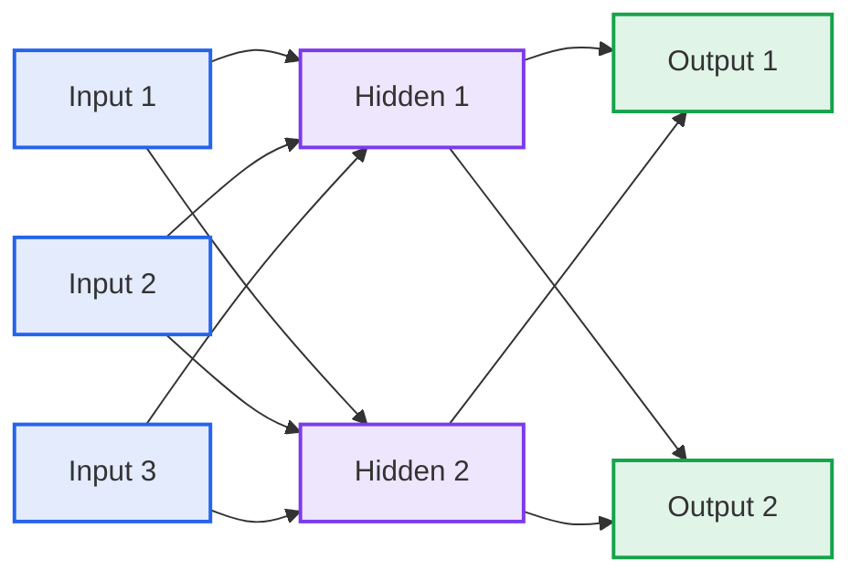
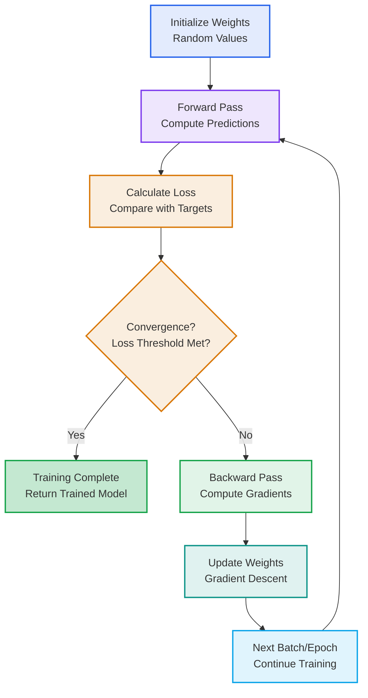
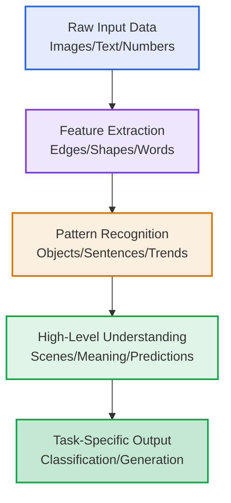

# Machine Learning Course Summary - Neural Networks

## Introduction

This summary provides a comprehensive overview of neural networks, covering their fundamental concepts, architectural components, learning mechanisms, training processes, and practical applications. Whether you're new to machine learning or looking to deepen your understanding, this guide will walk you through the key principles that make neural networks a powerful tool for modern AI.

## Table of Contents

1. [Introduction](#introduction)
2. [Neural Networks](#neural-networks)
3. [Key Components](#key-components)
4. [How Neural Networks Work](#how-neural-networks-work)
5. [Training Process](#training-process)
6. [Parameters and Tuning](#parameters-and-tuning)
7. [Applications and Benefits](#applications-and-benefits)
8. [Key Takeaways](#key-takeaways)

---

## Neural Networks

### What are Neural Networks?

Neural Networks (NNs) are computational models inspired by the structure and function of biological neural networks in the human brain. They are a cornerstone of deep learning and are used for a wide range of tasks including classification, regression, and pattern recognition.

- **Brain-inspired computing**: Mimic the interconnected neurons in biological brains
- **Layered architecture**: Organized in layers of interconnected nodes (neurons)
- **Learning through data**: Learn complex patterns and representations from data

### How Neural Networks Work

Neural networks process information through interconnected layers of neurons:

1. **Input Layer** 📥: Receives raw input data (features)
2. **Hidden Layers** 🧠: Process and transform the input through weighted connections
3. **Output Layer** 📤: Produces the final prediction or classification
4. **Forward Pass** ➡️: Data flows from input to output through the network
5. **Backpropagation** ⬅️: Error gradients flow backward to update weights
6. **Training** 🔄: Iterative process of forward pass and backpropagation

### Neural Networks in Classification Problems

In classification tasks:

- **Input Features** 📊: Raw data like pixel values, text embeddings, or numerical features
- **Hidden Representations** 🔍: Learned features that capture patterns in the data
- **Output Probabilities** 🎯: Probability distributions over classes for decision making

#### Example

For image classification (e.g., MNIST digits):

- Input: 28x28 pixel image flattened to 784 values
- Hidden layers: Learn edges, shapes, and patterns
- Output: 10 probabilities (one for each digit 0-9)

---

Now that we have a foundational understanding of what neural networks are and how they operate at a high level, let's explore the key building blocks that constitute these computational models.

## Key Components of Neural Networks

### 1. Neurons (Nodes)

- **Artificial Neuron** 🧠: Basic computational unit that receives inputs, applies weights, and produces output
- **Activation Function** ⚡: Non-linear transformation applied to the weighted sum
- **Bias Term** ➕: Additional parameter to shift the activation function

### 2. Layers

- **Input Layer** 📥: First layer that receives the raw input data
- **Hidden Layers** 🔍: Intermediate layers that learn representations
- **Output Layer** 📤: Final layer that produces predictions

### 3. Connections and Weights

- **Synapses** 🔗: Connections between neurons with associated weights
- **Weight Matrix** 📋: Collection of all weights between layers
- **Parameters** ⚙️: Weights and biases that are learned during training

### 4. Activation Functions

| Function | Formula | Use Case |
|----------|---------|----------|
| **Sigmoid** | $\sigma(x) = \frac{1}{1+e^{-x}}$ | Binary classification, outputs in (0,1) |
| **Tanh** | $\tanh(x) = \frac{e^x - e^{-x}}{e^x + e^{-x}}$ | Zero-centered outputs, (-1,1) |
| **ReLU** | $\max(0,x)$ | Most common, avoids vanishing gradient |
| **Softmax** | $\frac{\exp(x_i)}{\sum \exp(x_j)}$ | Multi-class classification |

Activation functions introduce non-linearity to each neuron's output, enabling the network to learn complex, non-linear patterns in data. Without them, the network would only perform linear transformations, severely limiting its representational power.

#### Neural Network Architecture Visualization

### 5. Loss Functions

- **Mean Squared Error (MSE)**: For regression tasks
- **Cross-Entropy Loss**: For classification tasks
- **Purpose**: Measures the difference between predicted and actual values

---

With a solid grasp of the fundamental components, we can now explore how neural networks process information and learn complex patterns from data.

## How Neural Networks Work

### Forward Propagation

Data flows from input to output through the network:

1. **Weighted Sum** ➕: Each neuron computes weighted sum of inputs plus bias
2. **Activation** ⚡: Apply activation function to the weighted sum
3. **Layer-by-Layer** 📈: Process continues through each layer until output

### Mathematical Representation

For a single neuron:
$z = \sum (w_i \cdot x_i) + b$
$a = \text{activation}(z)$

Where:

- `w_i`: weights
- `x_i`: inputs
- `b`: bias
- `z`: weighted sum
- `a`: activation output

### Backpropagation

Error gradients flow backward to update weights:

1. **Compute Loss** 📊: Calculate loss between prediction and target
2. **Gradient Calculation** 📉: Compute partial derivatives of loss w.r.t. parameters
3. **Weight Update** 🔄: Update weights using gradient descent
4. **Chain Rule** ⛓️: Propagate gradients backward through the network

---

Understanding the forward and backward passes naturally leads us to the training process, where neural networks iteratively optimize their parameters to minimize prediction errors.

## Training Process

### Gradient Descent Optimization

### Key Training Concepts

| Concept | Description | Purpose |
|---------|-------------|---------|
| **Epoch** | One complete pass through the training data | Ensure all data is used for learning |
| **Batch** | Subset of training data processed together | Balance computational efficiency and gradient accuracy |
| **Learning Rate** | Step size for weight updates | Control how quickly the model learns |
| **Overfitting** | Model performs well on training but poorly on new data | Need regularization techniques |

### Training Challenges

- **Vanishing Gradients** 📉: Gradients become very small, slowing learning
- **Exploding Gradients** 📈: Gradients become very large, causing instability
- **Local Minima** 🕳️: Optimization gets stuck in suboptimal solutions

---

Once we understand the training mechanics, the next step is mastering the configuration and tuning of neural network parameters to achieve optimal performance.

## Parameters and Tuning

### Network Architecture Parameters

| Parameter | Description | Impact |
|-----------|-------------|--------|
| **Number of Layers** 📚 | Depth of the network | Deeper networks can learn more complex patterns |
| **Neurons per Layer** 🧠 | Width of each layer | More neurons increase capacity but risk overfitting |
| **Activation Functions** ⚡ | Non-linearity applied at each neuron | Affects gradient flow and expressiveness |

### Training Parameters

| Parameter | Description | Tuning Guidelines |
|-----------|-------------|-------------------|
| **Learning Rate** 📏 | Step size for gradient descent | Start with 0.001-0.01, use learning rate schedules |
| **Batch Size** 📦 | Number of samples per gradient update | 32-256 common, larger for stability |
| **Epochs** 🔄 | Number of training iterations | Monitor validation loss, use early stopping |
| **Optimizer** 🎯 | Algorithm for gradient descent | Adam, SGD, RMSprop - Adam often best default |

### Regularization Techniques

- **Dropout** 🎲: Randomly drop neurons during training to prevent overfitting
- **L2 Regularization** 📏: Add penalty term to loss for large weights
- **Batch Normalization** 📊: Normalize layer inputs to stabilize training

### Hyperparameter Tuning Strategies

1. **Grid Search**: Exhaustive search over parameter combinations
2. **Random Search**: Random sampling from parameter distributions
3. **Bayesian Optimization**: Use probabilistic models to guide search
4. **Cross-Validation**: Evaluate performance on validation sets

---

With knowledge of how to build and train neural networks, let's explore their real-world applications and the advantages they offer over traditional machine learning approaches.

## Applications and Benefits

### Effectiveness

| Application Domain | Benefit | Key Advantage |
|--------------------|---------|---------------|
| **Computer Vision** 👁️ | Image classification, object detection | Learn hierarchical features automatically |
| **Natural Language Processing** 💬 | Text classification, translation | Capture semantic and syntactic patterns |
| **Time Series** 📈 | Forecasting, anomaly detection | Model temporal dependencies |
| **Reinforcement Learning** 🎮 | Game playing, robotics | Learn optimal policies |

### Advantages

- **Feature Learning** 🔍: Automatically learn relevant features from raw data
- **Scalability** 📊: Handle large datasets with appropriate hardware
- **Flexibility** 🔧: Adaptable to various problem types with architecture changes
- **Non-linearity** 📈: Model complex, non-linear relationships

#### Learning Process Visualization

### Disadvantages

- **Computational Cost** 💻: Require significant computational resources
- **Data Hungry** 📊: Need large amounts of labeled data for training
- **Black Box Nature** ❓: Difficult to interpret internal decision-making
- **Hyperparameter Sensitivity** ⚙️: Performance depends on careful parameter tuning

### Real-World Applications

| Application | Use Case | Problem Type |
|-------------|----------|--------------|
| **Image Recognition** | Facial recognition, medical imaging | Computer vision |
| **Language Models** | Chatbots, translation services | NLP |
| **Recommendation Systems** | Netflix suggestions, e-commerce | Collaborative filtering |
| **Autonomous Vehicles** | Self-driving cars, obstacle detection | Computer vision + control |

---

To wrap up our comprehensive exploration of neural networks, here are the key takeaways and best practices to guide your implementation and deepen your understanding.

## Key Takeaways 🎯

### 1. Core Principles 🧠

| Principle | Description |
|-----------|-------------|
| **Universal Approximation** | NNs can approximate any continuous function |
| **Gradient-based Learning** | Learn through backpropagation and gradient descent |
| **Hierarchical Learning** | Learn simple to complex features layer by layer |
| **Distributed Representation** | Knowledge distributed across network parameters |

### 2. Architecture Design ⚙️

| Consideration | Guideline |
|----------------|-----------|
| **Network Depth** | Start shallow, add layers if needed |
| **Layer Width** | Balance capacity with overfitting risk |
| **Activation Choice** | ReLU for hidden layers, softmax for classification |
| **Regularization** | Use dropout and batch norm for robustness |

### 3. Best Practices ✅

- 📊 **Data Preprocessing**: Normalize inputs, handle missing values
- 🔍 **Monitor Training**: Track loss curves, validation performance
- 🛑 **Early Stopping**: Stop when validation loss stops improving
- 📈 **Learning Rate Scheduling**: Decrease learning rate over time
- 🌐 **Transfer Learning**: Use pre-trained models when possible

### 4. When to Use Neural Networks 🎯

- **Complex Patterns** in high-dimensional data
- **Large Datasets** where traditional methods struggle
- **End-to-End Learning** from raw inputs to outputs
- **When Feature Engineering** is difficult or impossible
- **Scalable Problems** with available computational resources

### 5. Performance Considerations ⚖️

- **Training Time**: Can take hours to days depending on network size
- **Memory Usage**: Large networks require significant GPU memory
- **Inference Speed**: Trade-off between accuracy and computational cost
- **Scalability**: Performance improves with more data and parameters

### 6. Advanced Techniques 🚀

- **Convolutional NNs**: Specialized for image data with spatial hierarchies
- **Recurrent NNs**: Handle sequential data with memory of previous inputs
- **Transformer Architecture**: Attention-based models for sequence tasks
- **Generative Adversarial Networks**: Generate new data samples

Neural Networks represent a powerful paradigm in machine learning, capable of learning complex patterns from data through layered computational graphs. They form the foundation of modern deep learning and continue to drive advances in artificial intelligence across numerous domains. 🧠
