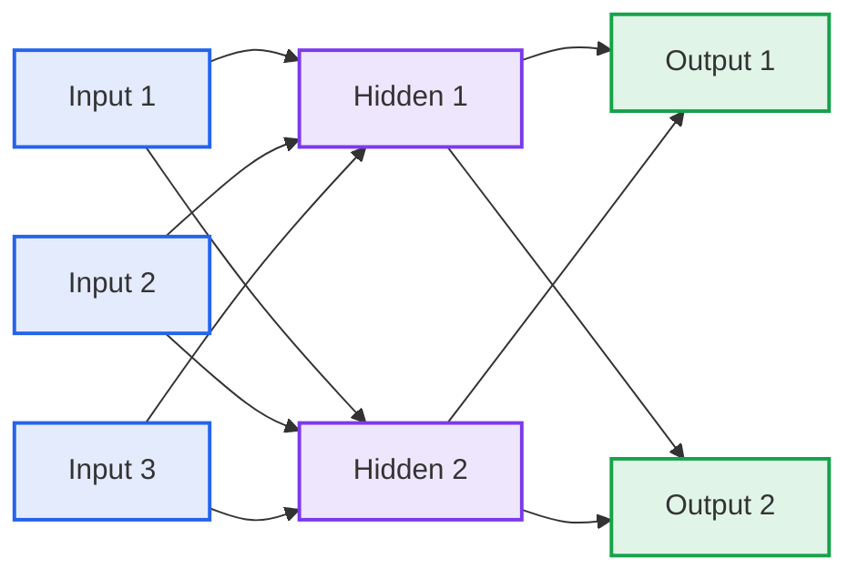
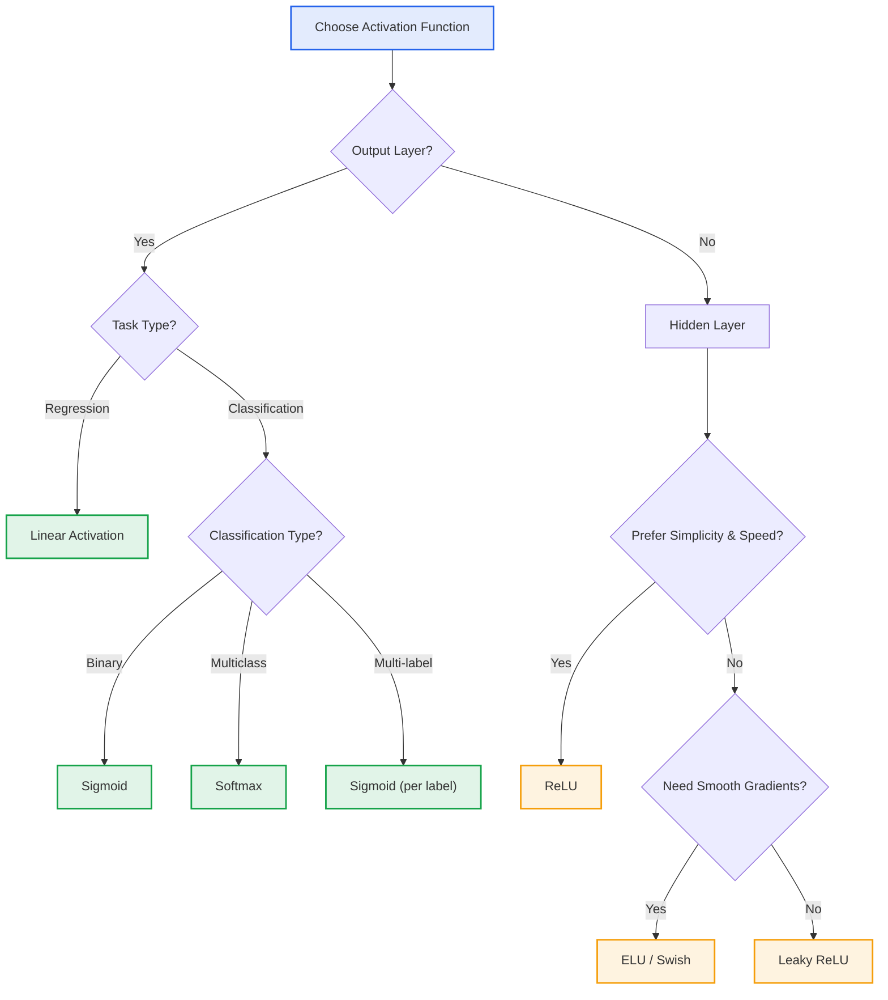
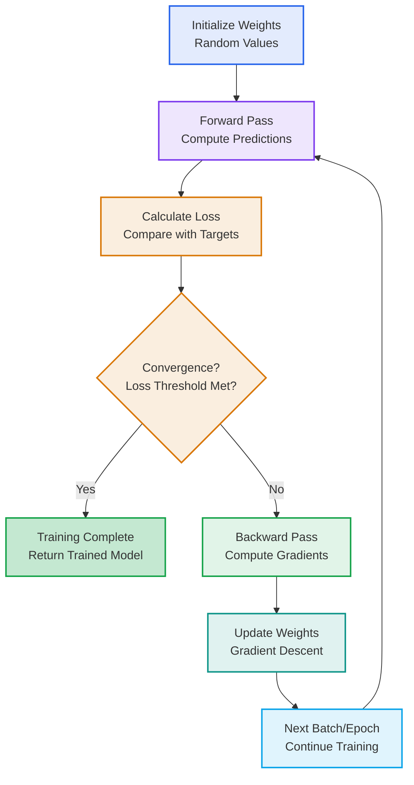
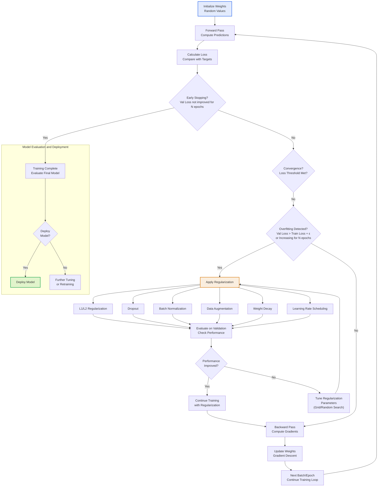
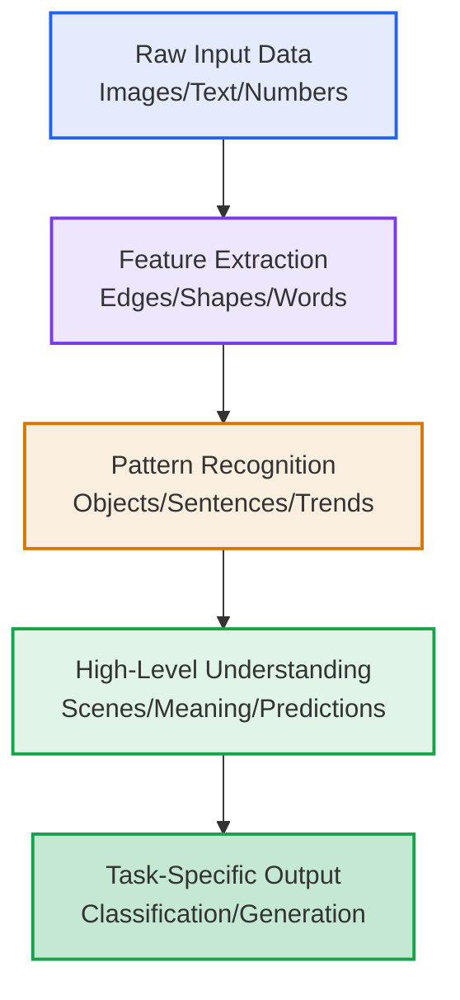

# Machine Learning Course Summary - Neural Networks

## Introduction

This summary provides a comprehensive overview of neural networks, covering their fundamental concepts, architectural components, learning mechanisms, training processes, and practical applications. Whether you're new to machine learning or looking to deepen your understanding, this guide will walk you through the key principles that make neural networks a powerful tool for modern AI.

## Table of Contents

1. [Introduction](#introduction)
2. [Neural Networks](#neural-networks)
3. [Key Components](#key-components)
4. [How Neural Networks Work](#how-neural-networks-work)
5. [Training Process](#training-process)
6. [Optimization Algorithms](#optimization-algorithms)
7. [Regularization Techniques](#regularization-techniques)
8. [Evaluation Metrics](#evaluation-metrics)
9. [Parameters and Tuning](#parameters-and-tuning)
10. [Applications and Benefits](#applications-and-benefits)
11. [Key Takeaways](#key-takeaways)

---

## Neural Networks

### What are Neural Networks?

Neural Networks (NNs) are computational models inspired by the structure and function of biological neural networks in the human brain. They are a cornerstone of deep learning and are used for a wide range of tasks including classification, regression, and pattern recognition.

- **Brain-inspired computing**: Mimic the interconnected neurons in biological brains
- **Layered architecture**: Organized in layers of interconnected nodes (neurons)
- **Learning through data**: Learn complex patterns and representations from data

### How Neural Networks Work

Neural networks process information through interconnected layers of neurons:

1. **Input Layer**: Receives raw input data (features)
2. **Hidden Layers**: Process and transform the input through weighted connections
3. **Output Layer**: Produces the final prediction or classification
4. **Forward Pass**: Data flows from input to output through the network
5. **Backpropagation**: Error gradients flow backward to update weights
6. **Training**: Iterative process of forward pass and backpropagation

### Neural Networks in Classification Problems

In classification tasks:

- **Input Features**: Raw data like pixel values, text embeddings, or numerical features
- **Hidden Representations**: Learned features that capture patterns in the data
- **Output Probabilities**: Probability distributions over classes for decision making

#### Example

For tabular data classification (e.g., Iris dataset):

- Input: 4 features (sepal length, sepal width, petal length, petal width)
- Hidden layers: Learn combinations of input features
- Output: 3 probabilities (one for each species)

---

Now that we have a foundational understanding of what neural networks are and how they operate at a high level, let's explore the key building blocks that constitute these computational models.

## Key Components of Neural Networks

### 1. Neurons (Nodes)

- **Artificial Neuron**: Basic computational unit that receives inputs, applies weights, and produces output
- **Activation Function**: Non-linear transformation applied to the weighted sum
- **Bias Term**: Additional parameter to shift the activation function

### 2. Layers

- **Input Layer**: First layer that receives the raw input data
- **Hidden Layers**: Intermediate layers that learn representations
- **Output Layer**: Final layer that produces predictions

#### Neural Network Architecture Visualization

### 3. Connections and Weights

- **Synapses**: Connections between neurons with associated weights
- **Weight Matrix**: Collection of all weights between layers
- **Parameters**: Weights and biases that are learned during training

### 4. Activation Functions

#### Hidden Layer Activation Functions

| Function | Formula | Use Case |
|----------|---------|----------|
| **Sigmoid** | $\sigma(x) = \frac{1}{1+e^{-x}}$ | Introduces non-linearity, outputs in (0,1) |
| **Tanh** | $\tanh(x) = \frac{e^x - e^{-x}}{e^x + e^{-x}}$ | Zero-centered outputs, (-1,1), avoids vanishing gradient better than sigmoid |
| **ReLU** | $\max(0,x)$ | Most common, avoids vanishing gradient, computationally efficient |
| **Leaky ReLU** | $\max(\alpha x, x)$ where $\alpha$ is small positive constant | Addresses dying ReLU problem, allows small gradients for negative inputs |
| **ELU** | $x$ if $x > 0$ else $\alpha(e^x - 1)$ | Smooth version of ReLU, handles negative values, reduces vanishing gradient |
| **Swish** | $x \cdot \sigma(x)$ | Self-gated activation, often outperforms ReLU, smooth and non-monotonic |

#### Output Layer Activation Functions

| Function | Formula | Use Case |
|----------|---------|----------|
| **Linear** | $f(x) = x$ | Regression tasks, unbounded outputs |
| **Sigmoid** | $\sigma(x) = \frac{1}{1+e^{-x}}$ | Binary/multi-label classification, outputs probability in (0,1) |
| **Softmax** | $\frac{\exp(x_i)}{\sum \exp(x_j)}$ | Multi-class classification, outputs probability distribution |

Activation functions introduce non-linearity to each neuron's output, enabling the network to learn complex, non-linear patterns in data. Without them, the network would only perform linear transformations, severely limiting its representational power.

To help choose the appropriate activation function for different layers and tasks, consider this decision tree:

### 5. Loss Functions

Loss functions measure the difference between predicted and actual values, guiding the optimization process during training. They quantify how well the model performs and are minimized through gradient descent.

| Loss Function | Formula | Use Case |
|---------------|---------|----------|
| **Mean Squared Error (MSE)** | $\frac{1}{n} \sum (y_i - \hat{y}_i)^2$ | Regression tasks |
| **Mean Absolute Error (MAE)** | $\frac{1}{n} \sum \|y_i - \hat{y}_i\|$ | Regression tasks (less sensitive to outliers) |
| **Binary Cross Entropy (BCE)** | $-\frac{1}{n} \sum [y_i \log(\hat{y}_i) + (1-y_i) \log(1-\hat{y}_i)]$ | Binary classification |
| **Binary Cross Entropy with Logits** | BCE + Sigmoid in one function | Binary/multi-label classification (numerically stable) |
| **Categorical Cross Entropy** | $-\frac{1}{n} \sum y_i \log(\hat{y}_i)$ | Multi-class classification |

---

With a solid grasp of the fundamental components, we can now explore how neural networks process information and learn complex patterns from data.

## How Neural Networks Work

### Forward Propagation

Data flows from input to output through the network:

1. **Weighted Sum**: Each neuron computes weighted sum of inputs plus bias
2. **Activation**: Apply activation function to the weighted sum
3. **Layer-by-Layer**: Process continues through each layer until output

### Mathematical Representation

For a single neuron:

$z = \sum (w_i \cdot x_i) + b$

$a = \text{activation}(z)$

Where:

- `w_i`: weights
- `x_i`: inputs
- `b`: bias
- `z`: weighted sum
- `a`: activation output

### Backpropagation

Error gradients flow backward to update weights:

1. **Compute Loss**: Calculate loss between prediction and target
2. **Gradient Calculation**: Compute partial derivatives of loss w.r.t. parameters
3. **Weight Update**: Update weights using gradient descent
4. **Chain Rule**: Propagate gradients backward through the network

---

Understanding the forward and backward passes naturally leads us to the training process, where neural networks iteratively optimize their parameters to minimize prediction errors.

## Training Process

### Gradient Descent Optimization

---

Now that we have explored the basic training process, let's delve into the optimization algorithms that efficiently train neural networks.

## Optimization Algorithms

### Stochastic Gradient Descent (SGD)

Stochastic Gradient Descent is the foundational optimization algorithm for training neural networks, using random subsets of data to compute gradients and update parameters iteratively.

#### How SGD Works

SGD approximates the true gradient using a small random sample (mini-batch) instead of the entire dataset, enabling efficient training on large-scale problems:

1. **Mini-batch Selection**: Randomly sample m examples from the training set
2. **Gradient Computation**: Calculate average gradient over the mini-batch
3. **Parameter Update**: Update parameters using the computed gradient
4. **Iteration**: Repeat with new mini-batches until convergence

#### Mathematical Formulation

For a mini-batch $B$ of size $m$:

$\theta_{t+1} = \theta_t - \eta \cdot \frac{1}{m} \sum_{i \in B} \nabla_\theta L(f(x^{(i)}; \theta), y^{(i)})$

Where:

- $\theta_t$: Parameters at step t
- $\eta$: Learning rate (step size)
- $\nabla_\theta L$: Gradient of loss with respect to parameters
- $f(x; \theta)$: Network prediction function

#### Advantages

- **Scalability**: Handles massive datasets efficiently
- **Memory Efficiency**: Processes data in chunks, reducing memory requirements
- **Generalization**: Stochastic noise acts as implicit regularization
- **Parallelization**: Independent mini-batch processing enables GPU acceleration

#### Disadvantages

- **Noisy Updates**: High variance can cause unstable convergence
- **Learning Rate Sensitivity**: Requires careful tuning; too high causes divergence, too low slows training
- **Plateau Trapping**: May get stuck in sharp local minima or saddle points
- **Oscillations**: Can oscillate around optima without momentum

#### Variants and Extensions

| Variant | Key Feature | Advantages | Use Case |
|---------|-------------|------------|----------|
| **SGD with Momentum** | Accumulates past gradients with momentum term | Faster convergence, reduces oscillations | General neural network training |
| **Nesterov Momentum** | Looks ahead before updating | Better convergence properties | When momentum is needed |
| **RMSprop** | Adaptive learning rates using gradient RMS | Handles varying gradient scales | Recurrent networks, non-stationary objectives |
| **Adagrad** | Accumulates squared gradients | Adapts to parameter frequencies | Sparse features, NLP tasks |

#### When to Use SGD

- **Large Datasets**: When full-batch gradient descent is computationally infeasible
- **Online Learning**: For streaming data or continuous learning scenarios
- **Simple Problems**: When computational resources are limited
- **Baseline Comparison**: As a reference for evaluating advanced optimizers

### Adam Optimizer

Adam (Adaptive Moment Estimation) is an adaptive optimization algorithm that combines momentum and RMSprop, automatically adjusting learning rates for each parameter based on estimates of first and second moments of gradients.

#### How Adam Works

Adam computes individual adaptive learning rates by maintaining running averages of both the gradients (first moment) and the squared gradients (second moment):

1. **Moment Calculation**: Update biased first and second moment estimates
2. **Bias Correction**: Correct initial bias in moment estimates
3. **Adaptive Update**: Scale learning rate by square root of second moment
4. **Parameter Update**: Apply momentum-enhanced gradient step

#### Mathematical Formulation

The algorithm updates parameters using:

$m_t = \beta_1 m_{t-1} + (1 - \beta_1) g_t$

$v_t = \beta_2 v_{t-1} + (1 - \beta_2) g_t^2$

$\hat{m}_t = \frac{m_t}{1 - \beta_1^t}$

$\hat{v}_t = \frac{v_t}{1 - \beta_2^t}$

$\theta_{t+1} = \theta_t - \frac{\eta}{\sqrt{\hat{v}_t} + \epsilon} \hat{m}_t$

Where:

- $m_t, v_t$: Biased first and second moment estimates
- $\hat{m}_t, \hat{v}_t$: Bias-corrected moment estimates
- $\beta_1 = 0.9, \beta_2 = 0.999$: Exponential decay rates
- $\epsilon = 10^{-8}$: Numerical stability constant

#### Advantages

- **Adaptive Learning Rates**: Automatically adjusts step sizes per parameter
- **Momentum Integration**: Combines benefits of momentum for faster convergence
- **Hyperparameter Robustness**: Works well with default settings (η=0.001, β₁=0.9, β₂=0.999)
- **Memory Efficient**: Requires storage for only two moments per parameter
- **Sparse Gradient Handling**: Effective for sparse data and embeddings

#### Disadvantages

- **Potential Overfitting**: May generalize worse than SGD on some tasks due to adaptive rates
- **Memory Usage**: Higher memory footprint than basic SGD
- **Convergence Issues**: Can converge to suboptimal solutions in some cases
- **Less Interpretability**: Complex adaptive behavior harder to understand

#### When to Use Adam

- **Default Optimizer**: Excellent first choice for most deep learning tasks
- **Sparse Data**: Particularly effective for NLP and recommendation systems
- **Large-Scale Training**: Scales well to big datasets and complex models
- **Transfer Learning**: Good for fine-tuning pre-trained models
- **Rapid Prototyping**: When you want robust performance without extensive tuning

#### SGD vs Adam Comparison

| Aspect | SGD | Adam |
|--------|-----|------|
| **Convergence Speed** | Slower, may oscillate | Faster, smoother convergence |
| **Hyperparameter Sensitivity** | High (learning rate critical) | Low (robust defaults) |
| **Memory Usage** | Low | Moderate (stores moments) |
| **Generalization** | Often better on test data | May overfit more easily |
| **Computational Cost** | Lower per iteration | Higher per iteration |
| **Sparse Gradients** | Good with momentum variants | Excellent |
| **Large Datasets** | Excellent scalability | Good scalability |
| **Default Choice** | No | Yes for most tasks |
| **Tuning Required** | High | Low |
| **Best For** | Simple models, large data, generalization | Complex models, sparse data, quick results |

---

### Key Training Concepts

| Concept | Description | Purpose |
|---------|-------------|---------|
| **Epoch** | One complete pass through the training data | Ensure all data is used for learning |
| **Batch** | Subset of training data processed together | Balance computational efficiency and gradient accuracy |
| **Learning Rate** | Step size for weight updates | Control how quickly the model learns |
| **Overfitting** | Model performs well on training but poorly on new data | Need regularization techniques |

### Training Challenges

- **Vanishing Gradients**: Gradients become very small, slowing learning
- **Exploding Gradients**: Gradients become very large, causing instability
- **Local Minima**: Optimization gets stuck in suboptimal solutions

---

With optimization algorithms covered, let's explore regularization techniques that prevent overfitting and improve generalization.

## Regularization Techniques

Regularization prevents overfitting by adding constraints to the learning process, ensuring the model generalizes well to unseen data.

#### L1 and L2 Regularization

- **L1 Regularization (Lasso)**: Adds penalty $\lambda \sum |w_i|$ to loss function
  - Encourages sparsity (many weights become zero)
  - Useful for feature selection
- **L2 Regularization (Ridge)**: Adds penalty $\lambda \sum w_i^2$ to loss function
  - Prevents large weights, smooths the model
  - Most commonly used regularization

#### Dropout

- **Mechanism**: Randomly "drops out" neurons during training with probability $p$
- **Effect**: Forces network to learn redundant representations
- **Implementation**: Applied after activation functions in hidden layers
- **Typical Values**: Dropout rate 0.2-0.5 for hidden layers, 0.0 for input/output

#### Other Regularization Methods

| Technique | Description | When to Use |
|-----------|-------------|-------------|
| **Early Stopping** | Stop training when validation loss increases | Prevents overfitting without modifying loss |
| **Batch Normalization** | Normalizes layer inputs during training | Stabilizes training, acts as implicit regularization |
| **Data Augmentation** | Artificially increases dataset through transformations | Particularly effective for image data |
| **Weight Decay** | Adds a penalty to the loss function proportional to the sum of squared weights | Prevents overfitting by discouraging large weights |
| **Learning Rate Schedule** | Adjusts the learning rate during training, often decreasing it over time | Improves convergence and training stability |

#### Regularization in Practice

### Balancing Bias and Variance

Regularization helps achieve the optimal balance between bias and variance:

- **High Bias (Underfitting)**: Model too simple, poor training performance
- **High Variance (Overfitting)**: Model too complex, poor generalization
- **Regularization**: Reduces variance while maintaining low bias

---

## Evaluation Metrics

Evaluation metrics assess model performance on validation/test data, providing insights beyond training loss. They help determine how well the model generalizes to unseen data.

### Regression Metrics

| Metric | Formula | Description |
|--------|---------|-------------|
| **Mean Absolute Error (MAE)** | $\frac{1}{n} \sum \|y_i - \hat{y}_i\|$ | Average absolute prediction error |
| **Mean Squared Error (MSE)** | $\frac{1}{n} \sum (y_i - \hat{y}_i)^2$ | Average squared prediction error (penalizes large errors) |
| **Root Mean Squared Error (RMSE)** | $\sqrt{\frac{1}{n} \sum (y_i - \hat{y}_i)^2}$ | Square root of MSE (same units as target) |
| **R² Score** | $1 - \frac{\sum (y_i - \hat{y}_i)^2}{\sum (y_i - \bar{y})^2}$ | Proportion of variance explained (0-1, higher is better) |

### Classification Metrics

| Metric | Formula | Description |
|--------|---------|-------------|
| **Accuracy** | $\frac{TP + TN}{TP + TN + FP + FN}$ | Proportion of correct predictions |
| **Precision** | $\frac{TP}{TP + FP}$ | True positives over predicted positives |
| **Recall (Sensitivity)** | $\frac{TP}{TP + FN}$ | True positives over actual positives |
| **F1-Score** | $2 \cdot \frac{Precision \cdot Recall}{Precision + Recall}$ | Harmonic mean of precision and recall |
| **AUC-ROC** | Area under ROC curve | Measures discrimination ability (0.5-1.0) |

### Multi-label Classification Metrics

| Metric | Description |
|--------|-------------|
| **Hamming Loss** | Fraction of labels incorrectly predicted |
| **Subset Accuracy** | Exact match of all labels |
| **Macro/Micro F1** | F1 averaged across labels (macro) or globally (micro) |

---

With a solid understanding of optimization algorithms and regularization techniques, we can now explore the various parameters and tuning strategies that optimize neural network performance.

## Parameters and Tuning

### Network Architecture Parameters

| Parameter | Description | Impact |
|-----------|-------------|--------|
| **Number of Layers** | Depth of the network | Deeper networks can learn more complex patterns |
| **Neurons per Layer** | Width of each layer | More neurons increase capacity but risk overfitting |
| **Activation Functions** | Non-linearity applied at each neuron | Affects gradient flow and expressiveness |

### Training Parameters

| Parameter | Description | Tuning Guidelines |
|-----------|-------------|-------------------|
| **Learning Rate** | Step size for gradient descent | Start with 0.001-0.01, use learning rate schedules |
| **Batch Size** | Number of samples per gradient update | 32-256 common, larger for stability |
| **Epochs** | Number of training iterations | Monitor validation loss, use early stopping |
| **Optimizer** | Algorithm for gradient descent | Adam, SGD, RMSprop - Adam often best default |

### Regularization Techniques

- **Dropout**: Randomly drop neurons during training to prevent overfitting
- **L2 Regularization**: Add penalty term to loss for large weights
- **Batch Normalization**: Normalize layer inputs to stabilize training

### Hyperparameter Tuning Strategies

1. **Grid Search**: Exhaustive search over parameter combinations
2. **Random Search**: Random sampling from parameter distributions
3. **Bayesian Optimization**: Use probabilistic models to guide search
4. **Cross-Validation**: Evaluate performance on validation sets

---

With knowledge of how to build and train neural networks, let's explore their real-world applications and the advantages they offer over traditional machine learning approaches.

## Applications and Benefits of Neural Networks

### Effectiveness

| Application Domain | Benefit | Key Advantage |
|--------------------|---------|---------------|
| **Computer Vision** | Image classification, object detection | Learn hierarchical features automatically |
| **Natural Language Processing** | Text classification, translation | Capture semantic and syntactic patterns |
| **Time Series** | Forecasting, anomaly detection | Model temporal dependencies |
| **Reinforcement Learning** | Game playing, robotics | Learn optimal policies |

### Advantages

- **Feature Learning**: Automatically learn relevant features from raw data
- **Scalability**: Handle large datasets with appropriate hardware
- **Flexibility**: Adaptable to various problem types with architecture changes
- **Non-linearity**: Model complex, non-linear relationships

#### Learning Process Visualization

### Disadvantages

- **Computational Cost**: Require significant computational resources
- **Data Hungry**: Need large amounts of labeled data for training
- **Black Box Nature**: Difficult to interpret internal decision-making
- **Hyperparameter Sensitivity**: Performance depends on careful parameter tuning

### Real-World Applications

| Application | Use Case | Problem Type |
|-------------|----------|--------------|
| **Image Recognition** | Facial recognition, medical imaging | Computer vision |
| **Language Models** | Chatbots, translation services | NLP |
| **Recommendation Systems** | Netflix suggestions, e-commerce | Collaborative filtering |
| **Autonomous Vehicles** | Self-driving cars, obstacle detection | Computer vision + control |

---

To wrap up our comprehensive exploration of neural networks, here are the key takeaways and best practices to guide your implementation and deepen your understanding.

## Key Takeaways

### 1. Core Principles

| Principle | Description |
|-----------|-------------|
| **Universal Approximation** | NNs can approximate any continuous function |
| **Gradient-based Learning** | Learn through backpropagation and gradient descent |
| **Hierarchical Learning** | Learn simple to complex features layer by layer |
| **Distributed Representation** | Knowledge distributed across network parameters |

### 2. Architecture Design

| Consideration | Guideline |
|----------------|-----------|
| **Network Depth** | Start shallow, add layers if needed |
| **Layer Width** | Balance capacity with overfitting risk |
| **Activation Choice** | ReLU for hidden layers, softmax for classification |
| **Regularization** | Use dropout and batch norm for robustness |

### 3. Best Practices

- **Data Preprocessing**: Normalize inputs, handle missing values
- **Monitor Training**: Track loss curves, validation performance
- **Early Stopping**: Stop when validation loss stops improving
- **Learning Rate Scheduling**: Decrease learning rate over time
- **Transfer Learning**: Use pre-trained models when possible

### 4. When to Use Neural Networks

- **Complex Patterns** in high-dimensional data
- **Large Datasets** where traditional methods struggle
- **End-to-End Learning** from raw inputs to outputs
- **When Feature Engineering** is difficult or impossible
- **Scalable Problems** with available computational resources

### 5. Performance Considerations

- **Training Time**: Can take hours to days depending on network size
- **Memory Usage**: Large networks require significant GPU memory
- **Inference Speed**: Trade-off between accuracy and computational cost
- **Scalability**: Performance improves with more data and parameters

### 6. Advanced Techniques

- **Convolutional NNs**: Specialized for image data with spatial hierarchies
- **Recurrent NNs**: Handle sequential data with memory of previous inputs
- **Transformer Architecture**: Attention-based models for sequence tasks
- **Generative Adversarial Networks**: Generate new data samples

Neural Networks represent a powerful paradigm in machine learning, capable of learning complex patterns from data through layered computational graphs. They form the foundation of modern deep learning and continue to drive advances in artificial intelligence across numerous domains.
