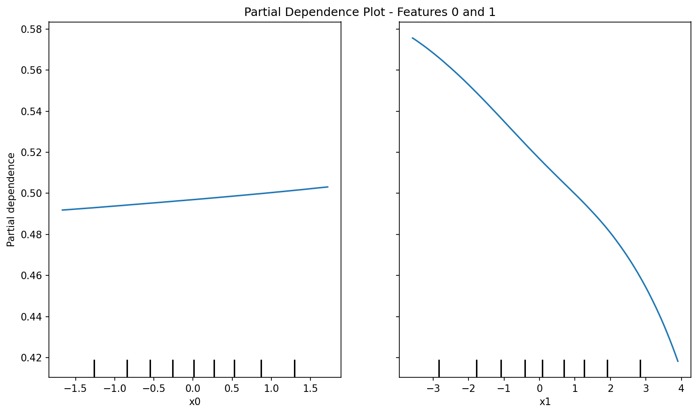
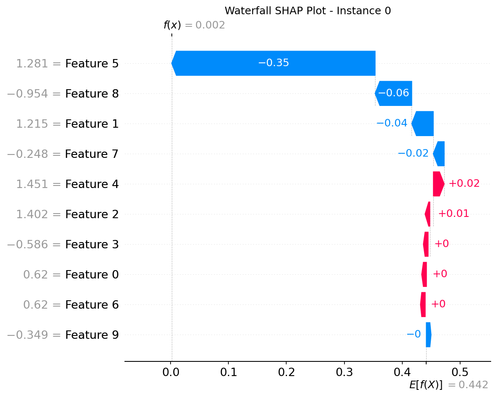
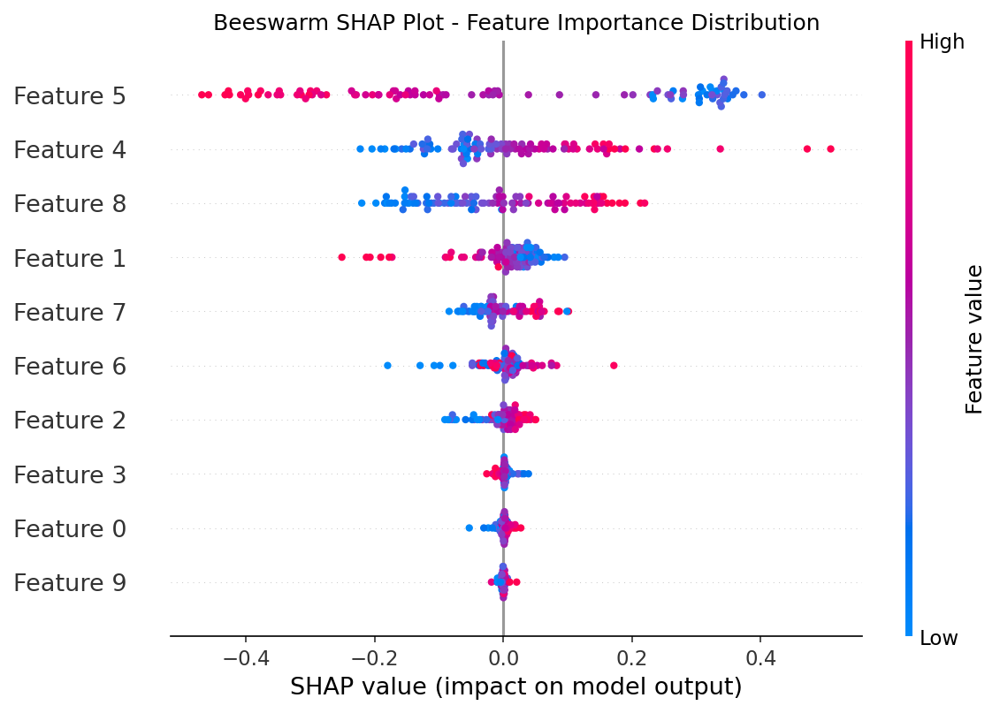

# Machine Learning Course Summary - Model Explainability with SHAP

## Table of Contents

1. [Introduction to SHAP](#introduction-to-shap)
2. [Partial Dependence Plots](#partial-dependence-plots)
3. [Waterfall SHAP Plots](#waterfall-shap-plots)
4. [Beeswarm SHAP Plots](#beeswarm-shap-plots)
5. [Applications and Benefits](#applications-and-benefits)
6. [Key Takeaways](#key-takeaways)

---

## Introduction to SHAP

### What is SHAP?

SHAP (SHapley Additive exPlanations) is a unified framework for interpreting machine learning model predictions. Based on game theory's Shapley values, SHAP assigns each feature an importance value for a particular prediction, providing consistent and locally accurate explanations.

- **Shapley values**: Fairly distribute the prediction among features
- **Additive explanations**: Feature contributions sum to the difference between actual and expected predictions
- **Model-agnostic**: Works with any machine learning model
- **Consistent**: If a model changes so that a feature contributes more to the prediction, the SHAP value increases

### Why Explainable AI Matters

Machine learning models are increasingly used in high-stakes decisions. Understanding how models make predictions is crucial for:

- **Trust and transparency**: Building confidence in model decisions
- **Bias detection**: Identifying discriminatory patterns
- **Model debugging**: Finding and fixing model errors
- **Regulatory compliance**: Meeting requirements for explainable AI

### SHAP Value Interpretation

For a prediction $f(x)$, the SHAP explanation is:

$f(x) = \phi_0 + \sum_{j=1}^{M} \phi_j$

Where:

- $\phi_0$ is the base value (expected prediction)
- $\phi_j$ is the SHAP value for feature j
- M is the number of features

---

## Partial Dependence Plots

### What are Partial Dependence Plots?

Partial Dependence Plots (PDPs) show the marginal effect of one or two features on the predicted outcome of a machine learning model. They illustrate how the model's predictions change as the values of the features vary.

### How PDPs Work

1. **Select features**: Choose one or two features of interest
2. **Marginalize**: Average predictions over all other features
3. **Plot relationship**: Visualize how predictions change with feature values

### Mathematical Foundation

For a single feature $x_S$, the partial dependence function is:

$PD_{x_S}(x_S) = E_{x_C}[f(x_S, x_C)]$

Where $x_C$ are the other features.

### PDP Visualization

The following plot shows a partial dependence plot for a single feature:

### How to Read Partial Dependence Plots

**Reading a Single Feature PDP:**

1. **X-axis**: Feature values (the feature you're analyzing)
2. **Y-axis**: Predicted outcome (marginal effect on prediction)
3. **Line**: Shows how predictions change as the feature varies
4. **Confidence band**: Uncertainty around the estimate (if shown)

**Key Patterns to Look For:**

- **Increasing line**: Higher feature values increase the prediction
- **Decreasing line**: Higher feature values decrease the prediction
- **Flat line**: Feature has no effect on predictions
- **Non-linear curves**: Complex relationships (e.g., U-shaped, S-shaped)
- **Plateaus**: Regions where feature changes don't affect predictions

**Example Interpretation:**

- If a PDP for "age" shows an upward slope, older individuals get higher predictions
- If it shows a U-shape, both very young and very old get extreme predictions

**Reading Two-Feature PDPs:**

- **Contour plot**: Shows interaction effects between two features
- **Color scale**: Prediction values (darker = higher predictions)
- **Lines**: Iso-prediction curves (same prediction value)

### Advantages and Limitations

**Advantages:**

- Easy to interpret
- Shows feature importance trends
- Works with any model

**Limitations:**

- Assumes feature independence
- Can be misleading with correlated features
- Computationally expensive for many features

---

## Waterfall SHAP Plots

### What are Waterfall SHAP Plots?

Waterfall plots (also called force plots) provide a detailed explanation of individual predictions. They show how each feature pushes the prediction away from the base value, creating a waterfall effect that leads to the final prediction.

### How Waterfall Plots Work

1. **Base value**: Start with the expected prediction
2. **Feature contributions**: Add SHAP values sequentially
3. **Final prediction**: End with the actual prediction

### Waterfall Plot Components

- **Base value**: Average model prediction (horizontal line)
- **Arrows/Bars**: Each feature's contribution (positive = red, negative = blue)
- **Final prediction**: Sum of base value and all SHAP values

### Waterfall Visualization

The following plot shows a waterfall SHAP explanation for a single prediction:

### How to Read Waterfall SHAP Plots

**Step-by-Step Reading:**

1. **Start at Base Value**: The horizontal line at the bottom represents the expected prediction across all data (average model output)

2. **Read Left to Right**: Each bar shows how one feature pushes the prediction away from the current value

3. **Bar Direction and Color**:
   - **Red bars pointing right**: Positive SHAP values - feature increases prediction
   - **Blue bars pointing left**: Negative SHAP values - feature decreases prediction
   - **Bar length**: Magnitude of the feature's contribution

4. **Feature Labels**: Usually sorted by importance (largest absolute SHAP values first)

5. **Final Prediction**: The end of the last bar shows the actual prediction for this instance

**Mathematical Reading:**

The plot visually shows: `Prediction = Base Value + Σ(SHAP values)`

**Example Interpretation:**

For a loan approval model predicting probability of default:

- Base value: 0.15 (15% average default rate)
- Feature "Credit Score = 650": Blue bar left by -0.08 (reduces risk by 8%)
- Feature "Debt-to-Income = 0.45": Red bar right by +0.12 (increases risk by 12%)
- Final prediction: 0.19 (19% predicted default probability)

**Key Insights:**

- **Dominant features**: Longest bars have the most influence
- **Feature interactions**: SHAP accounts for all interactions automatically
- **Prediction drivers**: See exactly why this instance got this prediction
- **Compared to average**: Distance from base value shows how unusual this case is

---

## Beeswarm SHAP Plots

### What are Beeswarm SHAP Plots?

Beeswarm plots (also called SHAP summary plots) display the distribution of SHAP values for each feature across all instances in the dataset. They combine feature importance with feature effects, showing both what features matter and how they impact predictions.

### How Beeswarm Plots Work

1. **Calculate SHAP values**: For all instances and features
2. **Sort features**: By mean absolute SHAP value (importance)
3. **Plot distributions**: SHAP values as dots, colored by feature values

### Beeswarm Plot Components

- **Y-axis**: Features sorted by importance
- **X-axis**: SHAP values (impact on prediction)
- **Dots**: Individual SHAP values for each instance
- **Color**: Feature values (high = red, low = blue)

### Beeswarm Visualization

The following plot shows a beeswarm SHAP summary plot:

### How to Read Beeswarm SHAP Plots

**Overall Structure:**

- **Y-axis**: Features ranked by importance (most important at top)
- **X-axis**: SHAP values (impact on model output)
- **Dots**: Individual predictions (one dot per instance)
- **Color**: Feature values (red = high values, blue = low values)

**Reading Feature Importance:**

1. **Top features**: Most influential across the dataset
2. **Bottom features**: Less important (smaller average impact)
3. **Ranking**: Based on mean absolute SHAP values

**Reading Feature Effects:**

- **Dots right of center (positive SHAP)**: Feature increases prediction when present
- **Dots left of center (negative SHAP)**: Feature decreases prediction when present
- **Vertical spread**: How much impact varies across instances

**Reading Feature-Value Relationships:**

- **Red dots on right**: High feature values tend to increase predictions
- **Blue dots on right**: Low feature values tend to increase predictions
- **Red dots on left**: High feature values tend to decrease predictions
- **Blue dots on left**: Low feature values tend to decrease predictions

**Identifying Patterns:**

- **Symmetric distribution**: Feature has balanced positive/negative effects
- **One-sided distribution**: Feature consistently pushes in one direction
- **Wide spread**: Feature impact varies greatly across instances
- **Tight cluster**: Feature has consistent effect across instances

**Example Interpretation:**

For a house price prediction model:

- **Top feature: "Square Footage"** - Red dots mostly right, blue dots left → Larger houses cost more
- **Feature: "Distance to City"** - Red dots left, blue dots right → Closer to city increases price
- **Feature: "Age of House"** - Mixed distribution → Complex relationship with price

**Advanced Insights:**

- **Interaction effects**: When features cluster together in their effects
- **Outliers**: Extreme SHAP values indicate unusual cases
- **Non-linear effects**: Color gradients show complex relationships
- **Feature redundancy**: Similar patterns across correlated features

### Comparing the Three Plot Types

| Aspect | Partial Dependence | Waterfall | Beeswarm |
|--------|-------------------|-----------|----------|
| **Scope** | Global (dataset-wide) | Local (single prediction) | Global (all predictions) |
| **Features** | 1-2 features | All features | All features |
| **Shows** | Average relationships | Individual contributions | Distribution of effects |
| **Best for** | Understanding feature relationships | Explaining specific decisions | Feature importance ranking |
| **Interactions** | Limited (assumes independence) | Fully captured | Partially visible |
| **Computation** | Moderate | High per instance | High for full dataset |

**When to Use Each Plot:**

- **Partial Dependence**: When you want to understand how a feature generally affects predictions
- **Waterfall**: When you need to explain why a specific prediction was made
- **Beeswarm**: When you want to see which features matter most and how they vary

---

## Applications and Benefits

### Real-World Applications

| Application Domain | Use Case | Benefit |
|-------------------|----------|---------|
| **Healthcare** 🏥 | Medical diagnosis explanations | Understand why a patient received a certain risk score |
| **Finance** 💰 | Credit scoring decisions | Explain loan approval/rejection reasons |
| **Autonomous Vehicles** 🚗 | Decision-making transparency | Understand why a vehicle took a specific action |
| **Hiring** 👥 | Resume screening | Identify biases in automated hiring systems |
| **Insurance** 🛡️ | Risk assessment | Explain premium calculations |

### Benefits of SHAP

- **Local explanations**: Understand individual predictions
- **Global insights**: Identify important features across dataset
- **Fairness analysis**: Detect discriminatory patterns
- **Model validation**: Compare expected vs. actual behavior
- **Stakeholder communication**: Explain complex models to non-technical audiences

### Comparison with Other Methods

| Method | Pros | Cons |
|--------|------|------|
| **SHAP** | Consistent, accurate, flexible | Computationally intensive |
| **LIME** | Fast, local explanations | Inconsistent, less accurate |
| **Permutation Importance** | Fast, global insights | No local explanations |
| **Partial Dependence** | Intuitive, shows relationships | Assumes independence |

---

## Key Takeaways 🎯

### 1. SHAP Fundamentals 🧠

| Concept | Description |
|---------|-------------|
| **Shapley values** | Fair allocation of prediction contributions to features |
| **Additivity** | SHAP values sum to prediction difference from base |
| **Consistency** | If feature contributes more, SHAP value increases |
| **Local accuracy** | Explanations are faithful to the model |

### 2. Plot Types 📊

| Plot Type | Purpose | Best For |
|-----------|---------|----------|
| **Partial Dependence** | Feature effect on predictions | Understanding marginal relationships |
| **Waterfall** | Individual prediction explanation | Debugging specific decisions |
| **Beeswarm** | Feature importance distribution | Global model understanding |

### 3. Best Practices ✅

- **Use appropriate plots**: Choose based on analysis goals
- **Consider correlations**: SHAP handles dependencies better than PDPs
- **Validate explanations**: Check if explanations make domain sense
- **Balance local/global**: Use waterfall for individuals, beeswarm for patterns
- **Communicate clearly**: Explain SHAP concepts to stakeholders

### 4. Implementation Considerations ⚙️

- **Computational cost**: SHAP can be expensive for large datasets
- **Model compatibility**: Works with tree-based models most efficiently
- **Sampling**: Use background dataset sampling for approximations
- **Visualization**: Choose appropriate plot types for different audiences

### 5. Ethical Considerations 🤝

- **Bias detection**: Use SHAP to identify unfair feature impacts
- **Transparency**: Provide explanations for automated decisions
- **Accountability**: Ensure models can be audited and understood
- **User trust**: Build confidence through explainable predictions

SHAP provides powerful tools for understanding machine learning models, bridging the gap between complex algorithms and human interpretability. By using partial dependence plots, waterfall plots, and beeswarm plots, practitioners can gain both local and global insights into model behavior, leading to more trustworthy and accountable AI systems. 🧠
