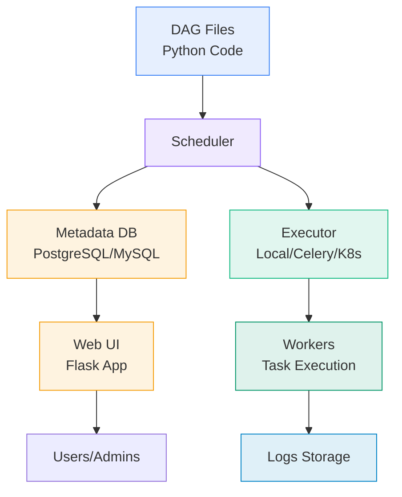
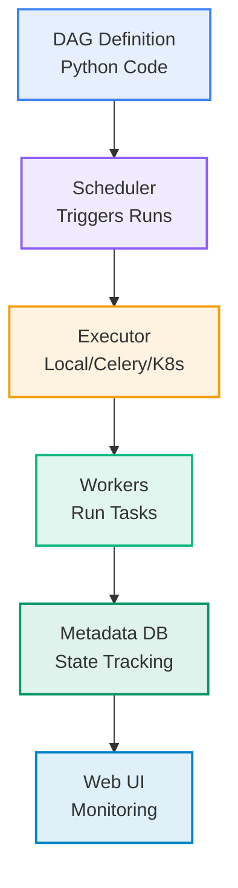
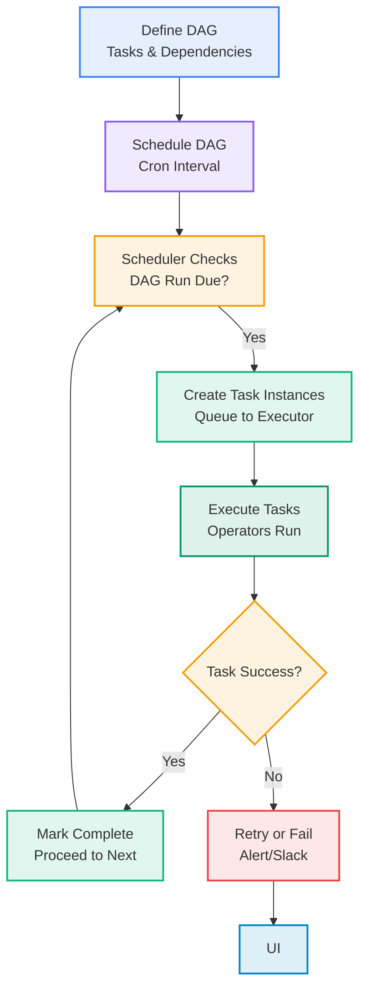
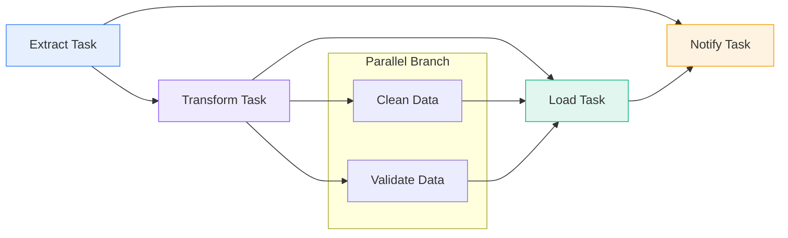
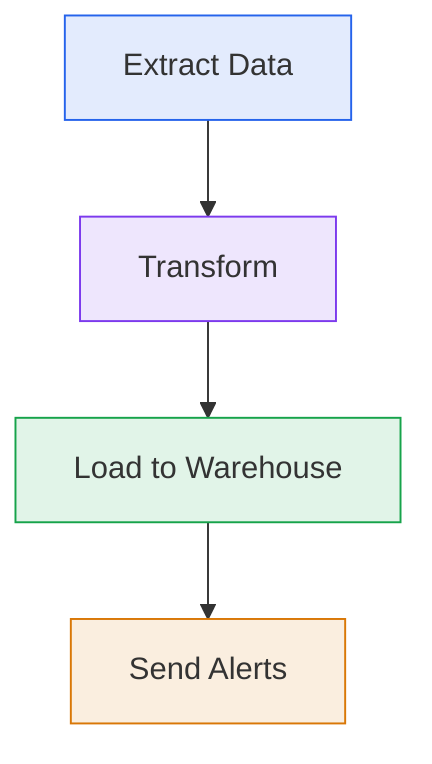

# Data Computation Course Summary - Apache Airflow

## Table of Contents

1. [Introduction to Airflow](#introduction-to-airflow)
   - [What is Apache Airflow?](#what-is-apache-airflow)
   - [Core Concepts and Architecture](#core-concepts-and-architecture)
   - [Airflow in Data Computation](#airflow-in-data-computation)
2. [Key Components of Airflow](#key-components-of-airflow)
   - [DAGs](#dags)
   - [Scheduler](#scheduler)
   - [Executor](#executor)
   - [Metadata Database](#metadata-database)
   - [Operators and Sensors](#operators-and-sensors)
3. [DAG Workflow](#dag-workflow)
   - [Defining and Executing DAGs](#defining-and-executing-dags)
   - [Common Patterns](#common-patterns)
   - [Error Handling](#error-handling)
4. [Operators and Hooks](#operators-and-hooks)
   - [Built-in Operators](#built-in-operators)
   - [Hooks and Connections](#hooks-and-connections)
5. [DAG Examples](#dag-examples)
   - [Basic ETL DAG](#basic-etl-dag)
   - [Advanced DAG with Branching](#advanced-dag-with-branching)
   - [Integration with Spark](#integration-with-spark)
6. [Common Commands](#common-commands)
   - [Airflow CLI](#airflow-cli)
   - [Docker Setup for Airflow](#docker-setup-for-airflow)
7. [Parameters, Configuration, and Best Practices](#parameters-configuration-and-best-practices)
   - [Configuration Files](#configuration-files)
   - [DAG Parameters](#dag-parameters)
   - [Best Practices](#best-practices)
8. [Applications and Benefits](#applications-and-benefits)
   - [Real-World Use Cases](#real-world-use-cases)
   - [Advantages and Limitations](#advantages-and-limitations)
9. [Key Takeaways](#key-takeaways)
   - [Core Principles](#core-principles)
   - [Practical Advice](#practical-advice)
   - [Advanced Topics](#advanced-topics)

---

## <a name="introduction-to-airflow"></a>Introduction to Airflow

### <a name="what-is-apache-airflow"></a>What is Apache Airflow?

Apache Airflow is an open-source workflow management platform designed to programmatically author, schedule, and monitor complex data pipelines. Created by Airbnb, it treats workflows as code, allowing data engineers to define tasks as Python scripts in Directed Acyclic Graphs (DAGs). Airflow's flexibility makes it a go-to tool for orchestrating ETL processes, ML workflows, and more in data-intensive environments.

Unlike cron jobs or simple schedulers, Airflow provides a rich UI for monitoring, retry logic, and extensibility through plugins, making it scalable for enterprise use.

### <a name="core-concepts-and-architecture"></a>Core Concepts and Architecture

At its heart, Airflow revolves around DAGs—graphs where tasks (nodes) have dependencies (edges). The architecture includes:
- **Scheduler**: Triggers DAG runs.
- **Executor**: Runs tasks (e.g., locally or distributed).
- **Webserver**: Provides a UI for oversight.
- **Metadata DB**: Stores state and configurations.

This modular design allows Airflow to handle everything from simple scripts to distributed systems.

### <a name="airflow-in-data-computation"></a>Airflow in Data Computation

In data computation, Airflow excels at coordinating tasks like data ingestion from S3, transformation with Spark, and loading into warehouses. It ensures dependencies (e.g., wait for upstream data) and handles failures gracefully, which is vital for reliable pipelines in big data scenarios.

#### Airflow Architecture Schema



#### Basic Example

A simple DAG for daily data sync:

```python
from airflow import DAG
from airflow.operators.bash import BashOperator
from datetime import datetime

dag = DAG('daily_sync', start_date=datetime(2023, 1, 1), schedule_interval='@daily')

sync_task = BashOperator(task_id='sync_data', bash_command='rsync -av /source /target', dag=dag)
```

---

## <a name="key-components-of-airflow"></a>Key Components of Airflow

Airflow's power lies in its interconnected components, each handling a specific aspect of workflow management.

### <a name="dags"></a>DAGs

DAGs define the workflow structure. They are Python files in a designated folder, parsed periodically by the scheduler. DAGs support dynamic generation for flexible pipelines.

### <a name="scheduler"></a>Scheduler

The scheduler is the brain, monitoring DAGs for execution triggers and queuing tasks based on dependencies and intervals.

### <a name="executor"></a>Executor

Executors determine how tasks run:
- **Local**: Simple, single-machine execution.
- **Celery**: Distributed with message queuing.
- **Kubernetes**: Pod-per-task for cloud-native setups.

### <a name="metadata-database"></a>Metadata Database

A relational DB (e.g., PostgreSQL) persists DAG states, run history, and variables, enabling auditing and retries.

### <a name="operators-and-sensors"></a>Operators and Sensors

Operators execute actions (e.g., run a script), while sensors wait for conditions (e.g., file arrival).

#### Components Visualization



---

## <a name="dag-workflow"></a>DAG Workflow

DAGs bring workflows to life through a structured execution process, ensuring tasks run in the correct order with proper error handling.

### <a name="defining-and-executing-dags"></a>Defining and Executing DAGs

1. **Define**: Write Python code specifying tasks and `>>` for dependencies.
2. **Schedule**: Set intervals like `@hourly` or cron expressions.
3. **Execute**: Scheduler creates runs; executor dispatches tasks.
4. **Monitor**: UI shows progress, logs, and graphs.

### <a name="common-patterns"></a>Common Patterns

- **Linear**: Sequential tasks (extract >> transform >> load).
- **Parallel**: Independent branches for scalability.
- **Fan-in/Fan-out**: Split and merge for batch processing.

### <a name="error-handling"></a>Error Handling

Airflow supports retries, email alerts, and SLAs. Use `default_args` for global settings like `retries=3`.

#### Workflow Flowchart



#### Dependency Schema



---

## <a name="operators-and-hooks"></a>Operators and Hooks

Operators are the executable units in DAGs, while hooks provide connectivity to external systems.

### <a name="built-in-operators"></a>Built-in Operators

| Operator | Description | Data Use Case |
|----------|-------------|---------------|
| `PythonOperator` | Executes Python functions | Custom transformations |
| `BashOperator` | Runs shell commands | System-level tasks like backups |
| `SparkSubmitOperator` | Submits Spark jobs | Distributed processing |
| `PostgresOperator` | Executes SQL | Database queries |

### <a name="hooks-and-connections"></a>Hooks and Connections

Hooks abstract interactions (e.g., `PostgresHook` for queries). Connections store credentials securely in the UI or env vars.

---

## <a name="dag-examples"></a>DAG Examples

Examples illustrate practical DAG implementation, from basic to integrated setups.

### <a name="basic-etl-dag"></a>Basic ETL DAG

```python
from airflow import DAG
from airflow.operators.python import PythonOperator
from datetime import datetime, timedelta

default_args = {
    'owner': 'data-team',
    'retries': 1,
    'retry_delay': timedelta(minutes=5),
}

def extract():
    # Fetch data from API
    pass

def transform():
    # Process data
    pass

def load():
    # Save to DB
    pass

dag = DAG('basic_etl', default_args=default_args, schedule_interval='@daily', start_date=datetime(2023,1,1))

extract_task = PythonOperator(task_id='extract', python_callable=extract, dag=dag)
transform_task = PythonOperator(task_id='transform', python_callable=transform, dag=dag)
load_task = PythonOperator(task_id='load', python_callable=load, dag=dag)

extract_task >> transform_task >> load_task
```

### <a name="advanced-dag-with-branching"></a>Advanced DAG with Branching

```python
from airflow.operators.python import BranchPythonOperator

def branch_func(**context):
    if some_condition:
        return 'transform_path'
    return 'failure_path'

branch_task = BranchPythonOperator(task_id='branch', python_callable=branch_func, dag=dag)
# ... define paths
```

### <a name="integration-with-spark"></a>Integration with Spark

```python
from airflow.providers.apache.spark.operators.spark_submit import SparkSubmitOperator

spark_task = SparkSubmitOperator(
    task_id='spark_process',
    application='hdfs://path/to/job.py',
    total_executor_cores=4,
    executor_cores=2,
    executor_memory='2g',
    num_executors=2,
    dag=dag
)
```

---

## <a name="common-commands"></a>Common Commands

CLI commands are key for setup, testing, and management.

### <a name="airflow-cli"></a>Airflow CLI

| Command | Description | Example |
|---------|-------------|---------|
| `airflow db init` | Setup DB | `airflow db init` |
| `airflow dags list` | List DAGs | `airflow dags list` |
| `airflow dags test` | Test run | `airflow dags test dag_id 2023-01-01` |
| `airflow users create` | Add user | `airflow users create --username admin ...` |
| `airflow variables set` | Set var | `airflow variables set key value` |

### <a name="docker-setup-for-airflow"></a>Docker Setup for Airflow

Use official images for quick starts:

```yaml
version: '3.8'
x-airflow-common:
  &airflow-common
  image: apache/airflow:2.7.0
  environment: &airflow-common-env
    AIRFLOW__CORE__EXECUTOR: LocalExecutor
  volumes:
    - ./dags:/opt/airflow/dags

services:
  postgres: ...
  airflow-webserver:
    <<: *airflow-common
    ports: ["8080:8080"]
  airflow-scheduler:
    <<: *airflow-common
    command: scheduler
```

---

## <a name="parameters-configuration-and-best-practices"></a>Parameters, Configuration, and Best Practices

### <a name="configuration-files"></a>Configuration Files

`airflow.cfg` holds global settings like executor type and parallelism.

### <a name="dag-parameters"></a>DAG Parameters

| Parameter | Description | Example |
|-----------|-------------|---------|
| `schedule_interval` | Execution frequency | `'0 2 * * *'` (daily at 2 AM) |
| `max_active_runs` | Concurrent runs | `1` (no overlap) |
| `default_args` | Task defaults | `{'retries': 3}` |

### <a name="best-practices"></a>Best Practices

1. **Modularity**: Keep DAGs focused; use TaskGroups for organization.
2. **Testing**: Use `airflow tasks test` before production.
3. **Security**: Encrypt connections; use RBAC.
4. **Monitoring**: Integrate with Prometheus for metrics.
5. **Version Control**: Store DAGs in Git.

---

## <a name="applications-and-benefits"></a>Applications and Benefits

### <a name="real-world-use-cases"></a>Real-World Use Cases

- **ETL Orchestration**: Coordinate Spark jobs with notifications.
- **ML Ops**: Schedule model training and validation.
- **Data Quality**: Run checks before loading.

### <a name="advantages-and-limitations"></a>Advantages and Limitations

**Advantages**:
- Code-as-workflow for versioned pipelines.
- Rich UI and alerting.

**Limitations**:
- Overhead for simple tasks.
- DB dependency can bottleneck large setups.

#### Workflow Visualization



---

## <a name="key-takeaways"></a>Key Takeaways

### <a name="core-principles"></a>Core Principles

| Principle | Description |
|-----------|-------------|
| **DAGs as Code** | Define workflows programmatically. |
| **Dependency Management** | Ensure ordered execution. |
| **Extensibility** | Plugins for custom needs. |

### <a name="practical-advice"></a>Practical Advice

- Begin with LocalExecutor for learning.
- Use providers for integrations (e.g., AWS).
- Monitor DAG parsing time.

### <a name="advanced-topics"></a>Advanced Topics

- Dynamic task mapping (Airflow 2.3+).
- Celery with Redis for scaling.
- Managed services like Astronomer.

Airflow empowers data teams to build robust, observable pipelines. 🌊