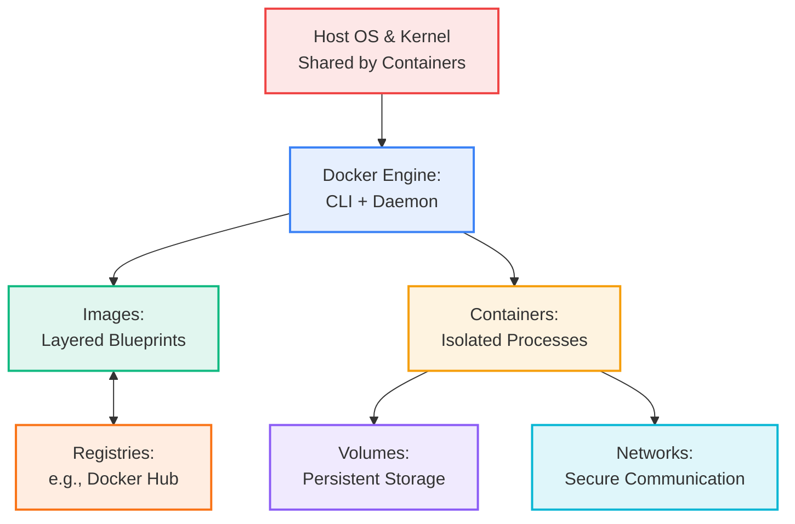
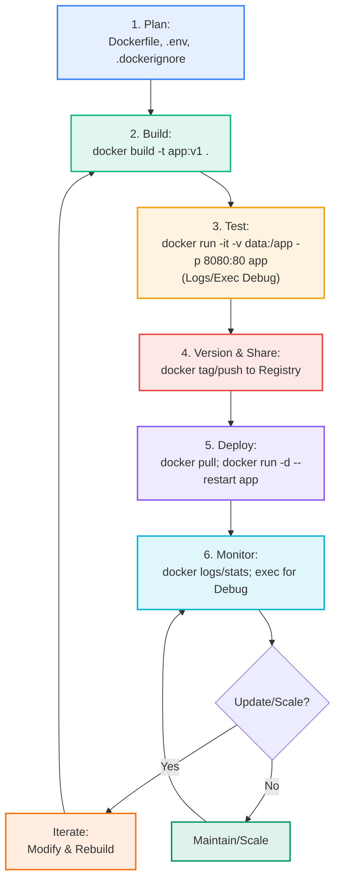
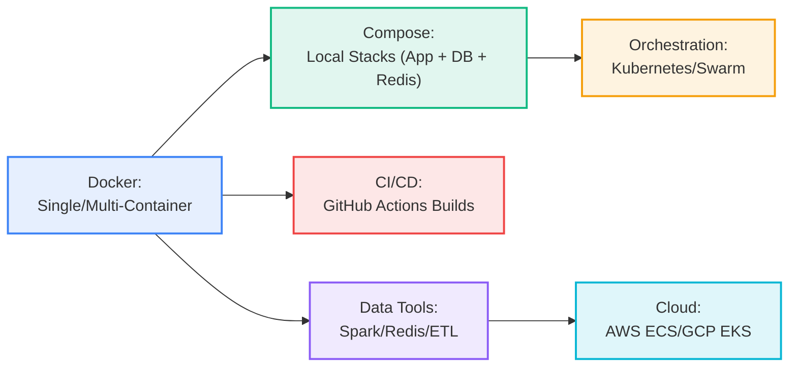

# Data Computation Course Summary: Docker and Docker Compose

This guide provides an in-depth exploration of Docker and Docker Compose, tailored for data computation. It fully incorporates the quiz content from the DevOps and Docker module, including all questions, answers, and explanations (e.g., kernel sharing, cache mechanics, multi-stage builds, commands like docker exec and docker image history, Compose structure with ports/volumes/networks/configs/secrets, Redis details, and more). The flow is logical: foundations → components → workflow → commands → deep dives → orchestration → optimization → applications → summary, with detailed explanations, examples, and transitions for clarity.

**Key Quiz Coverage**:

- Q1/Q12: Containers share host kernel (vs. VMs with full OS).
- Q2: Later COPY changes don't rebuild earlier layers.
- Q3/Q10/Q19/Q20: Multi-stage with COPY --from=<stage>/index, examples (installer, Golang, Alpine builder).
- Q4: Cache buster with RUN echo timestamp.
- Q5: FROM sets base image.
- Q6: Cowsay Dockerfile; fastest rebuild by modifying later file (docker.cow).
- Q7: docker image history for layers.
- Q8: -v for volume mount (host:container).
- Q9: docker exec -it <container> bash for interactive shell in running container.
- Q14: docker run pulls latest from Docker Hub; tag aliases same ID; --pull always for fresh.
- Q15: Compose orchestrates multi-images/services.
- Q16: YAML structure, ports "8000:5000" (host:container), services/build/image.
- Q17: Redis (fast, low-latency, in-memory NoSQL key/value, open-source).
- Q18: docker compose up -d --build (builds + detached; not default build).
- Q21: docker compose ps shows status/ports (e.g., 0.0.0.0:443->8043/tcp).
- Q22: Compose parts (services: frontend/backend, ports "443:8043", networks front/back-tier, volumes db-data with flocker size, configs/secrets external).

**Usage**: Follow sections sequentially; execute code; use Mermaid for visuals.

---

## Table of Contents

1. [Introduction](#introduction)
2. [Core Components](#components)
3. [Workflow](#workflow)
4. [Essential Docker Commands](#docker-commands)
5. [Dockerfile Deep Dive](#dockerfile)
6. [Docker Compose Fundamentals](#compose-fundamentals)
7. [Docker Compose Implementation](#compose-implementation)
8. [Docker Compose Commands](#compose-commands)
9. [Optimization, Parameters, and Best Practices](#optimization)
10. [Applications, Benefits, and Real-World Use Cases](#use-cases)
11. [Key Takeaways](#takeaways)

---

## <a name="introduction"></a>1. Introduction

Docker is a cornerstone of modern DevOps, enabling developers to package, distribute, and run applications in isolated, portable containers. This section introduces Docker's core value, contrasting it with traditional approaches, and highlights its role in data computation.

### What is Docker?

Docker is an open-source platform designed to simplify the deployment of applications by encapsulating them and their dependencies into lightweight containers. It eliminates the "it works on my machine" problem by ensuring that an application runs consistently across different environments—from a developer's local setup to production servers in the cloud. Containers achieve this by providing process-level isolation without the need for a full operating system, making them faster and more resource-efficient than virtual machines.

**Containers vs. VMs** (Direct from Quiz Q1 and Q12):

- **Containers**: These share the host's kernel, offering lightweight process isolation. They start in seconds, use minimal resources (e.g., a few MB of RAM), and are ideal for scaling data workloads like parallel processing in Spark clusters. However, they rely on the host OS, so vulnerabilities in the kernel can affect all containers.
- **VMs**: Virtual machines include a complete guest operating system and kernel, providing stronger hardware-level isolation. They boot slower (minutes) and consume more resources (GBs of RAM/disk), but offer better security for scenarios where full OS separation is needed. Both approaches package dependencies for reproducibility, but containers are more efficient for microservices and frequent deployments in data pipelines, while VMs are heavier but more isolated.

**Fit for Data Computation** (Quiz Context): Docker ensures reproducible environments for tools like Spark or databases, allowing data engineers to build pipelines that run identically everywhere. For example, a containerized Spark job can process datasets without dependency conflicts, making it perfect for ETL (Extract, Transform, Load) processes or ML workflows.

**Installation and Verification** (Step-by-Step):

```bash
# Step 1: Install Docker Engine (on Ubuntu/Debian; adapt for other OS)
curl -fsSL https://get.docker.com -o get-docker.sh
sudo sh get-docker.sh  # Runs the installer script

# Step 2: Add user to docker group for non-root access (requires logout/login)
sudo usermod -aG docker $USER
newgrp docker  # Apply immediately

# Step 3: Verify installation
docker --version  # Outputs version, e.g., "Docker version 27.0.3"
docker run hello-world  # Pulls and runs a test container, printing a success message if everything works
```

**Illustrative Example** (Hands-On Test):

```bash
docker run -it python:3.9 python  # Pulls the official Python 3.9 image, starts an interactive container, and opens a Python REPL. Type 'print("Hello from Docker!")' to see it run portably without local Python installation. Exit with Ctrl+D.
```

This demonstrates Docker's immediate value. Next, we'll explore the core concepts that make it work.

### Core Concepts & Benefits

Docker's effectiveness stems from three interconnected concepts that address common pain points in software and data development:

- **Isolation**: Containers use Linux kernel features like namespaces (for process/filesystem/network isolation) and cgroups (for resource limits) to create sandboxed environments. This means multiple data scripts can run side-by-side with different library versions (e.g., one using TensorFlow 2.10, another 2.15) without interference, reducing conflicts in team environments.
- **Portability**: Once built, a container runs unchanged on any Docker-compatible system (Linux, Windows, Mac, or cloud), as it bundles everything needed. This "build once, run anywhere" principle is invaluable for data teams distributing ML models or ETL pipelines across hybrid setups.
- **Efficiency**: By sharing the host kernel and using a layered filesystem (where common base layers like Ubuntu are reused), containers start in milliseconds and use far less overhead than VMs. This allows running dozens of data processing tasks (e.g., parallel Spark workers) on limited hardware, with quick scaling for big data jobs.

**Benefits in Data Computation** (Tied to Quiz):

- **Bundled Dependencies**: Package libraries like PySpark or Pandas directly in the image, ensuring no "module not found" errors during pipeline execution (quiz emphasis on reproducibility).
- **Microservices for ETL**: Break data workflows into small, containerized steps (e.g., one for data extraction, another for transformation), enabling independent scaling and easier debugging.
- **Resource Optimization**: Low overhead supports running resource-intensive tasks like ML training without bloating the host system.

#### Docker Architecture Overview

The diagram below illustrates how Docker's components interact, from the host kernel to running containers:



The Engine's daemon manages images and containers, while the CLI provides user-friendly commands—leading into data-specific applications.

### Docker in Data Computation Contexts

In data engineering and computation, Docker's strengths shine for building reliable, scalable pipelines. It allows you to containerize complex stacks without host pollution, ensuring that data processing tools like Spark or databases behave predictably.

**Key Applications** (Quiz-Informed):

- **Interactive Data Analysis**: Run Jupyter notebooks in containers with mounted local datasets for reproducible exploration. Example: `docker run -p 8888:8888 -v ./my-data:/home/jovyan/work jupyter/datascience-notebook`—access at http://localhost:8888, with data persisted via volume.
- **Pipeline Orchestration**: Combine tools like Kafka (ingestion), Spark (processing), and Elasticsearch (storage) in a multi-container setup using Docker Compose, simulating production environments locally for testing ETL workflows.
- **CI/CD Integration**: Automate building and testing data applications in isolated containers on platforms like GitHub Actions. For instance, a workflow can build a Spark image, run unit tests on sample data, and push to a registry only if successful, ensuring pipeline reliability.

Docker's portability reduces deployment errors in collaborative data teams, where inconsistent environments can waste hours. With the "why" established, let's dive into the core components that enable this functionality.

---

## <a name="components"></a>2. Core Components

Docker's ecosystem is built on modular, interconnected parts that work together to create isolated, efficient environments. This section details each component, explaining their roles and how they support data workflows, building toward the full workflow.

### Docker Images

Docker images are the static, immutable blueprints used to create containers. They represent a complete, layered package of your application, including code, runtime (e.g., Python interpreter), libraries (e.g., Pandas for data analysis), environment variables, and configuration files. Images are versioned and shareable, making them ideal for distributing data processing tools across teams.

- **Layered Structure**: Images are constructed as a stack of read-only layers, where each layer represents the changes from a Dockerfile instruction (e.g., installing a package adds a new layer on top of the base). Layers are diff-based, meaning only modifications are stored, and common layers (like a base Ubuntu image) can be shared across multiple images to save space and build time. This layering is key for efficiency in data apps, where you might extend a base Spark image without duplicating core dependencies.
- **Tagging for Versioning**: Images are tagged for identification and versioning, such as `my-data-app:v1.0` or `spark:3.5.0`. Using specific tags (e.g., `python:3.9-slim` instead of `latest`) ensures reproducibility, as `latest` can change unexpectedly, potentially breaking builds or caches (quiz Q14 highlights that `latest` isn't always the newest).
- **Registries for Distribution**: Registries like Docker Hub (public, default for pulls) or private ones (e.g., AWS ECR) store and share images. You push images to a registry for team access or deployment, enabling seamless collaboration on data pipelines (e.g., pushing a custom ML model image).

**Inspecting Images** (Practical Exercise):

```bash
docker image ls  # Lists local images, showing REPOSITORY, TAG, IMAGE ID, CREATED, SIZE—helps identify outdated or bloated images
docker image history python:3.9-slim  # Displays detailed layers: CREATED BY (instruction), VIRTUAL SIZE (layer size), ensuring no unnecessary bloat from unoptimized Dockerfiles
```

Images are the foundation for containers, which bring them to life as running processes.

### Docker Containers

Containers are the dynamic, runtime instances of images—essentially, isolated processes that execute your application code in a controlled environment. They provide the isolation needed to run multiple data tasks simultaneously without interference, leveraging the host kernel for speed.

- **Lifecycle Management**: Containers go through states: created (via `docker run`), running, paused, stopped, and removed. You can inspect a container's state at any point, restart it, or attach to it for debugging. In data contexts, this allows pausing a long-running Spark job for inspection without losing state.
- **Isolation and Resource Controls**: Using Linux namespaces (for process, network, and filesystem isolation) and cgroups (for CPU/memory limits), containers ensure apps don't affect each other or the host. Flags like `--cpus=2` (limit to 2 cores) and `--memory=1g` (cap at 1GB RAM) prevent resource hogging in multi-container data setups, such as running several ML inference containers.
- **Interactivity and Modes**: Run containers in detached mode (`-d`) for background services like databases, or interactive mode (`-it`) for debugging (e.g., shell access to a running container). Containers are ephemeral by default (data lost on stop), but volumes can make them persistent.

**Practical Example** (Interactive Debugging):

```bash
docker run -it --rm alpine:latest sh  # Pulls the minimal Alpine Linux image, starts an interactive container with a shell (/bin/sh), runs until exit, and auto-removes (--rm) to avoid clutter—perfect for testing commands like 'apk add python3' inside without local changes
```

Containers often need ways to persist data or communicate—addressed by volumes and networks next.

### Volumes & Networks

Volumes and networks extend containers beyond isolation, enabling persistence and connectivity essential for data applications like databases or distributed processing.

- **Volumes (Data Persistence)**: By default, containers are stateless (changes vanish on restart), so volumes provide durable storage by mounting host directories or Docker-managed storage into the container. This is critical for data pipelines where datasets or database files must survive container lifecycles.
  - **Bind Mounts**: Map a host path directly to a container path (`-v /host/dataset:/container/data`), allowing real-time file sharing—ideal for development, where you edit data files on the host and see updates inside the container.
  - **Named Volumes**: Docker-managed storage (`docker volume create mydata; -v mydata:/container/data`), which persists independently of the container and can be shared across multiple containers. Use for production databases, as Docker handles backups and portability.
  - **Anonymous Volumes**: Implicitly created (`-v /container/data`), but less controllable—Docker assigns a name automatically.
  - **Quiz Tie-In (Q8)**: The correct flag for mounting a host folder to `/home/databot` in the container is `-v "$PWD/neuro-home":/home/databot`, where the format is `host_path:container_path` (binds the current directory's neuro-home to the container's /home/databot for data sharing).

  **Detailed Example** (Persistent Database for Data Pipeline):

  ```bash
  # Create and run Postgres with a named volume for data persistence
  docker run -d --name mydb -v pgdata:/var/lib/postgresql/data -e POSTGRES_PASSWORD=secret postgres:15
  # The volume 'pgdata' stores all database files; inspect it to find the host mountpoint for backups
  docker volume inspect pgdata  # Shows Mountpoint (e.g., /var/lib/docker/volumes/pgdata/_data) where data is stored on the host
  # Run a client to query: docker run -it --rm --network container:mydb postgres:15 psql -h mydb -U postgres
  ```

- **Networks (Inter-Container Communication)**: Containers need secure ways to interact (e.g., a data app querying a database). Networks create virtual subnets for isolation and service discovery, allowing containers to resolve each other by name without exposing ports publicly.
  - **Default Bridge Network**: Provides basic isolation with NAT to the host; containers in the same network can communicate via IP or name.
  - **Custom Networks**: Created with `docker network create mynet` for dedicated, secure communication—useful for scaling data services without host exposure.
  - **Port Publishing**: Use `-p host_port:container_port` to expose a container's port to the host (e.g., `-p 5432:5432` for Postgres). Internal communication doesn't require this; containers use service names (e.g., app connects to `db:5432`).
  - **Quiz Tie-In (Q13)**: To run an image on port 8888, mount current directory to `/work`, auto-remove on exit, and allocate an interactive TTY, use flags `-p 8888:8888 -v "$PWD:/work" --rm -it` (full command: `docker run -it --rm -p 8888:8888 -v "$PWD:/work" jupyter/base-notebook`—maps host 8888 to container 8888, mounts data, removes after exit, and provides interactive shell).

  **Detailed Example** (Secure App-to-DB Connection for Data App):

  ```bash
  # Step 1: Create a custom network
  docker network create secure-data-net  # Creates an isolated bridge network

  # Step 2: Run database in the network
  docker run -d --name db --network secure-data-net -e POSTGRES_PASSWORD=pass postgres:15

  # Step 3: Run app container in the same network
  docker run -it --rm --network secure-data-net my-data-app psql -h db -U postgres -d mydb  # The app connects to the DB using hostname 'db' (resolves automatically), no need for -p as it's internal
  # Verify connectivity: Inside the app container, 'ping db' works; outside, it doesn't (isolation)

  # Step 4: Inspect the network to see connections
  docker network inspect secure-data-net  # Lists containers (db, my-data-app) with their internal IPs
  ```

Volumes and networks make containers suitable for production data systems. With these components understood, the next section shows how to apply them in a complete workflow.

---

## <a name="workflow"></a>3. Workflow

The Docker workflow is a repeatable process that ties together components like images, containers, volumes, and networks to build, test, and deploy applications. This section outlines the steps, with a focus on data computation scenarios, and addresses common challenges to ensure smooth execution.

### Step-by-Step Process

Follow this cycle to develop and deploy a data application, from initial planning to ongoing maintenance:

1. **Plan and Prepare Environment**:
   - Define your application's requirements (e.g., Python 3.9 with Pandas and PySpark for an ETL script).
   - Create the Dockerfile to specify the build process and .dockerignore to exclude unnecessary files (e.g., .git, temp data) from the build context, preventing cache pollution.
   - Set up an .env file for sensitive variables like database passwords, which can be referenced in Dockerfiles or Compose files.

2. **Build the Image**:
   - Use `docker build` to create an image from the Dockerfile, layering instructions to form the final blueprint.
   - Example: `docker build -t my-data-processor:v1 .`—this reads the Dockerfile in the current directory (.), tags the image as `my-data-processor:v1`, and outputs progress, showing each layer's creation and size.
   - Verify the build: Run `docker image history my-data-processor:v1` to review layers and ensure no bloat (quiz Q7: this command shows layer history, helping debug issues like large unnecessary layers).

3. **Test Locally**:
   - Launch a container with `docker run`, mounting volumes for data and publishing ports for access.
   - Example: `docker run -it --rm -p 8080:8080 -v $(pwd)/input-data:/app/data my-data-processor`—this starts an interactive (-it) container, maps host port 8080 to container 8080 for web access, mounts local data to /app/data for processing, and auto-removes (--rm) after exit. Test the app (e.g., run the ETL script inside), then debug with logs or exec.
   - For data testing: Load a sample CSV from the mounted volume and verify output, ensuring the pipeline works as expected.

4. **Version and Share**:
   - Tag the image for versioning: `docker tag my-data-processor:v1 username/my-data-processor:v1`—this creates an alias pointing to the same image ID without copying layers (quiz Q14: docker tag creates additional repository:tag to the same ID, no layer duplication).
   - Push to a registry: `docker push username/my-data-processor:v1` (after `docker login`), making it available for teams or deployment. Registries like Docker Hub are the default for pulls (quiz Q14: `docker run alpine` pulls `alpine:latest` from Docker Hub if not local).

5. **Deploy and Run**:
   - On the target system (e.g., server or cloud VM), pull the image: `docker pull username/my-data-processor:v1`—use `--pull always` to ensure the freshest version from the registry (quiz Q14).
   - Deploy: `docker run -d --restart=always -p 80:8080 username/my-data-processor:v1`—runs detached (-d) in the background, auto-restarts on failure, and publishes the port. For data apps, add volumes (e.g., `-v /prod/data:/app/data`) to persist inputs/outputs.

6. **Monitor, Maintain, and Update**:
   - Monitor: Use `docker logs -f container-id` to stream output (e.g., ETL job progress) and `docker stats` for resource usage (CPU/memory).
   - Debug: `docker exec -it container-id bash` to shell into the running container for live inspection (quiz Q9: this starts an interactive Bash shell in an already running container; flags -it must precede the container name).
   - Update: Pull the new version (`docker pull username/my-data-processor:v2 --pull always`), stop the old container (`docker stop container-id`), remove it (`docker rm container-id`), and run the new one.
   - Clean up: `docker system prune -a` to remove unused images/containers/volumes, freeing disk space.

**Data Computation Example** (Full Workflow for Spark ETL Job):

- **Plan**: Create Dockerfile for PySpark + Pandas; .dockerignore excludes .pyc files.
- **Build**: `docker build -t spark-etl:v1 .` (uses base bitnami/spark, copies job.py).
- **Test**: `docker run -it --rm -v ./test-data:/input spark-etl` (processes mounted CSV, outputs to console).
- **Share**: `docker tag spark-etl:v1 username/spark-etl:v1; docker push username/spark-etl:v1`.
- **Deploy**: On cluster: `docker pull username/spark-etl:v1; docker run -d -v /shared/s3-data:/input spark-etl`.
- **Monitor**: `docker logs -f spark-container` (view job logs); `docker exec -it spark-container pyspark` (debug interactively).

This workflow ensures reliable, reproducible data processing. Common challenges are addressed below to avoid pitfalls.

### Common Challenges and Solutions

Data workflows often encounter issues; here's how to resolve them, drawing from quiz insights:

- **Build Cache Invalidation** (Quiz Q2, Q6, Q11): Frequent code changes can slow rebuilds by invalidating layers. Solution: Order Dockerfile with stable elements (e.g., dependencies) first, so only later layers rebuild (e.g., modifying a file in a later COPY only affects subsequent layers, not earlier ones like RUN apt install—Q2 is False, as earlier layers remain cached). Use `docker build --no-cache` for full rebuilds when needed.
- **Port Conflicts or Inaccessibility** (Quiz Q8, Q13): Services not reachable on host. Solution: Use `-p host:container` for publishing (e.g., `-p 8888:8888` maps host 8888 to container 8888; format is host:container, with host optional for auto-assign). Check with `docker ps` to see bindings (e.g., 0.0.0.0:8888->8888/tcp).
- **Data Loss on Container Exit** (Quiz Q8): Files vanish when containers stop. Solution: Always use volumes (`-v host:/container` for binds or named volumes) to persist data outside the container—crucial for databases or datasets in pipelines.
- **Inter-Container Networking Issues**: Services can't communicate. Solution: Place in the same custom network (`docker network create net; --network net`), where they resolve by name (e.g., app connects to `db:5432`). For exposure, use `-p` only for host access.
- **Image Bloat and Security** (Quiz Q3, Q19, Q20): Large images from build tools or vulnerabilities. Solution: Use multi-stage builds to copy only artifacts (e.g., COPY --from=builder /bin/app), discarding toolchains for slim runtime images. Scan with `docker scout` and run as non-root (USER directive).
- **Resource Overuse**: One container hogs CPU/RAM. Solution: Limit with `--cpus=1 --memory=512m` during `docker run`, and monitor via `docker stats`.

#### End-to-End Workflow Diagram

This flowchart outlines the Docker workflow cycle, with decision points for iteration:



With the workflow in place, the next section details the commands to execute it, including quiz-specific ones like `docker exec` and `docker image history`.

---

## <a name="docker-commands"></a>4. Essential Docker Commands

The Docker CLI is your primary interface for interacting with images, containers, and more. This section provides a detailed breakdown of key commands, categorized for clarity, with explanations, options, examples, and ties to quiz content. Commands are essential for the workflow, enabling everything from building to debugging data applications.

### Command Categories and Detailed Explanations

Commands are grouped by function, with focus on data usage. Each includes syntax, common flags, examples, and quiz relevance.

#### Build and Image Management

- **docker build**: Builds an image from a Dockerfile in the specified context (default: current directory .). It executes instructions sequentially, creating layers, and caches them for efficiency (detailed in Section 5). 
  - **Explanation**: Reads the Dockerfile, pulls base images if needed, runs RUN/COPY steps, and tags the result. Output shows each step's progress, layer ID, and size—useful for spotting inefficiencies.
  - **Key Flags**: `-t name:tag` (name the image), `--no-cache` (ignore cache for full rebuild, e.g., after major changes), `-f Dockerfile` (specify file), `--pull` (pull newer base images).
  - **Example**: `docker build -t my-spark-job:v1 .`—builds a Spark ETL image from Dockerfile in current dir, tags it v1. If you change the base tag in FROM, it invalidates all layers (quiz Q11).
  - **Data Tip**: For data apps, build with `--no-cache` only when dependencies change to save time; otherwise, leverage cache for quick iterations on code.
  - **Quiz Tie-In**: Related to Q6 (rebuild speed) and Q11 (cache mechanics).

- **docker image history**: Displays the layer history of an image, showing each layer's command, creation date, and size. This is crucial for debugging bloat or understanding cache hits/misses.
  - **Explanation**: Every Dockerfile instruction creates a layer; this command reveals the stack, helping identify large layers (e.g., from unoptimized RUN) or verify multi-stage efficiency.
  - **Key Flags**: None primary; pipe to grep for filtering (e.g., `| grep RUN`).
  - **Example**: `docker image history my-spark-job:v1`—outputs columns like IMAGE ID, CREATED, CREATED BY (e.g., RUN pip install pyspark), SIZE. Use to optimize by combining RUN commands.
  - **Data Tip**: In data pipelines, check for large dependency layers (e.g., PySpark install) and use multi-stage to slim them.
  - **Quiz Tie-In (Q7)**: This is the command to show an image's layer history, distinguishing it from `docker images` (lists images) or `docker ps` (lists containers).

- **docker pull and docker push**: Pull downloads an image from a registry (e.g., Docker Hub); push uploads a local image. Essential for sharing data images across teams or environments.
  - **Explanation**: Pull fetches layers incrementally (reuses local if unchanged); push requires login and tags the image. By default, `docker run image` pulls if missing (quiz Q14: pulls `alpine:latest` from Docker Hub).
  - **Key Flags**: `--pull always` (always fetch latest from registry, overriding local—quiz Q14), `--all-tags` (pull all tags).
  - **Example**: `docker pull bitnami/spark:3.5.0` (downloads Spark base); `docker push username/spark-etl:v1` (uploads your custom image after tagging).
  - **Data Tip**: Use `--pull always` in CI/CD to ensure fresh bases for reproducible data jobs; avoid `latest` tags in production to prevent unexpected changes.
  - **Quiz Tie-In (Q14)**: `docker run alpine` pulls `alpine:latest` from Docker Hub if not local; `--pull always` ensures the freshest remote version.

- **docker tag**: Creates a new tag for an existing image, pointing to the same layers/image ID without copying data. Useful for versioning or renaming before pushing.
  - **Explanation**: It's an alias—e.g., tag `local-app` as `repo/app:v1` to upload without rebuilding. No new layers are created, saving time/space.
  - **Key Flags**: None; syntax is `docker tag source_image target_image:tag`.
  - **Example**: `docker tag my-local-spark username/spark-etl:v1`—now push the tagged version to share.
  - **Data Tip**: Tag data models (e.g., trained ML image) semantically (v1.0.0) for version control in pipelines.
  - **Quiz Tie-In (Q14)**: docker tag creates an additional repository:tag pointing to the same image ID without copying layers.

#### Container Lifecycle and Management

- **docker run**: Creates and starts a container from an image, combining pull (if needed), creation, and execution. It's the most versatile command for launching data apps.
  - **Explanation**: Pulls the image if absent, creates a writable layer on top, and runs the default command (from CMD/ENTRYPOINT in Dockerfile). Supports one-off runs or long-lived services.
  - **Key Flags**: `-d` (detached/background mode for servers), `-it` (interactive TTY for shells/debug, must precede container name—quiz Q9), `--rm` (auto-remove on exit for temp tasks), `-p host:container` (publish ports, format host:container—quiz Q8/Q13), `-v host:container` (volume mount for data persistence—quiz Q8), `--name name` (assign name), `--network net` (join network), `--cpus N --memory M` (resource limits).
  - **Example**: `docker run -it --rm -p 8888:8888 -v "$PWD/my-data":/work jupyter/datascience-notebook`—starts Jupyter interactively (-it), auto-removes (--rm), publishes port 8888 (host:container), and mounts local data to /work for analysis (quiz Q13 full flags).
  - **Data Tip**: For data processing: `docker run -it --rm -v ./csv-files:/input -v ./output:/output my-etl python process.py`—processes input CSV, saves to output volume.
  - **Quiz Tie-In (Q9, Q13, Q14)**: For interactive Bash in running container: `docker run -it image bash` (new container) vs. `docker exec -it existing-container bash` (running one). `docker run alpine` pulls latest from Hub if missing.

- **docker exec**: Executes a command inside a running container, useful for debugging or admin tasks without restarting.
  - **Explanation**: Targets an existing container, running the command in its environment (e.g., shell for inspection). It's for live interactions, unlike `docker run` which starts new.
  - **Key Flags**: `-it` (interactive TTY, placed before container name—quiz Q9), `--user user` (run as specific user).
  - **Example**: `docker exec -it my-running-db psql -U postgres`—opens interactive SQL shell in a running Postgres container to query data.
  - **Data Tip**: Debug a stuck ETL job: `docker exec -it spark-worker pyspark` to run commands inside the Spark container.
  - **Quiz Tie-In (Q9)**: Correct for interactive Bash in running container: `docker exec -it neuro302 bash` ( -it before name; wrong if after, as it becomes command arg). `docker attach neuro302` attaches to main process (e.g., logs), not for new shell.

- **docker ps**: Lists containers, showing their status, ports, and more—key for monitoring running data services.
  - **Explanation**: Filters running by default; `-a` shows all (stopped/exited). Columns include CONTAINER ID, IMAGE, COMMAND, CREATED, STATUS, PORTS (e.g., 0.0.0.0:8888->8888/tcp for published ports), NAMES.
  - **Key Flags**: `-a` (all states), `-q` (IDs only), `--format` (custom output).
  - **Example**: `docker ps -a`—lists all containers; use to check if a data processor is "Up 5 minutes" with ports mapped.
  - **Data Tip**: Monitor Spark cluster: `docker ps` shows master/worker containers and their ports for dashboard access.
  - **Quiz Tie-In (Q21)**: In Compose, `docker compose ps` provides a snapshot of services, showing names like example-frontend-1, status (Up/Exited), and ports (e.g., 0.0.0.0:443->8043/tcp).

- **docker logs**: Streams or views logs from a container, essential for troubleshooting data jobs (e.g., error traces in ETL scripts).
  - **Explanation**: Captures stdout/stderr from the container's main process; useful for real-time monitoring of long-running tasks.
  - **Key Flags**: `-f` (follow live, like tail -f), `-t` (add timestamps), `--tail N` (last N lines), `--since time` (from timestamp).
  - **Example**: `docker logs -f --tail 50 my-etl-container`—follows the last 50 lines of logs in real-time to watch data processing progress or errors.
  - **Data Tip**: For batch jobs, `docker logs my-spark-job` reveals processing output or failures (e.g., "File not found" in data load).

- **docker stop and docker rm**: Stops a running container (`stop`) and removes it (`rm`), managing lifecycle for cleanup or updates.
  - **Explanation**: Stop sends SIGTERM (graceful shutdown); rm deletes the container (stops if running with -f). Use for maintaining data environments without leftover containers.
  - **Key Flags**: `--time 30` (stop timeout), `-f` (force stop + rm).
  - **Example**: `docker stop my-db; docker rm my-db`—stops and removes a database container after testing; `docker rm -f my-job` for forceful cleanup of stuck data tasks.
  - **Data Tip**: After a one-off ETL run, `docker rm -f` ensures no zombie containers consume resources.

- **docker system prune**: Cleans up unused Docker objects (containers, images, networks, volumes), freeing disk space after data experiments.
  - **Explanation**: Removes stopped containers, dangling images, unused networks/volumes—prevents buildup from iterative builds/tests.
  - **Key Flags**: `-a` (all unused images), `--volumes` (include volumes), `-f` (no prompt).
  - **Example**: `docker system prune -a --volumes`—removes everything unused, ideal after testing multiple data image versions (e.g., v1, v2 of a ML model).
  - **Data Tip**: Run weekly in data labs to reclaim space from temporary pipeline images.

#### Other Useful Commands

- **docker inspect**: Provides detailed JSON metadata about containers/images (e.g., mounts, env vars, network settings).
  - **Example**: `docker inspect my-container`—check volume mounts or env for debugging data flow issues.
  - **Data Tip**: Verify data volume paths: Look for "Mounts" section showing host/container mappings.

- **docker attach**: Attaches your terminal to the main process of a running container, streaming its input/output (e.g., for live logs).
  - **Explanation**: Unlike exec (new process), attach joins the primary process (e.g., app output). Detach with Ctrl+P+Q without stopping.
  - **Example**: `docker attach my-spark-master`—view real-time Spark UI logs; useful for monitoring job progress.
  - **Quiz Tie-In (Q9)**: Attaches to main process (not new shell); use exec for Bash in running container.

#### Summary Table: Docker Commands

| Category | Command | Key Flags | Primary Use | Quiz Tie-In |
|----------|---------|-----------|-------------|-------------|
| Build | docker build | -t tag, --no-cache, -f file | Create image from Dockerfile | Q11 (cache from FROM/tag changes) |
| Run | docker run | -d, -it, --rm, -p host:container, -v host:container | Start container | Q8/Q13 ( -v for volumes, -p/--rm/-it for mount/port/auto-remove/interactive) |
| List | docker ps | -a, -q | List containers | Q21 (shows ports/status like 0.0.0.0:443->8043/tcp in Compose context) |
| Logs | docker logs | -f, --tail N | View output | Debugging data jobs |
| Exec | docker exec | -it (before name) | Run in running container | Q9 (interactive shell: docker exec -it <container> bash) |
| History | docker image history | None | View layers | Q7 (shows image layer history) |
| Manage | docker stop/rm | -f (force) | Lifecycle control | Cleanup after tests |
| Images | docker image ls/rm | -a (prune) | Image management | Q14 (tag for same ID) |
| Clean | docker system prune | -a, --volumes | Free resources | Post-experiment cleanup |
| Registry | docker pull/push/tag | --pull always | Share images | Q14 (pull latest from Hub; tag aliases ID; --pull always for fresh) |
| Inspect | docker inspect | None | Metadata details | Check mounts/env |

**Data Workflow Tip**: Chain for pipelines: `docker build -t etl . && docker run --rm -v data:/input etl && docker logs <id>`—builds image, runs with volume, checks output. Use history to verify cache efficiency.

These commands are your toolkit. Next, deep-dive into Dockerfiles to create the images they manage.

---

## <a name="dockerfile"></a>5. Dockerfile Deep Dive

The Dockerfile is a text file containing a series of instructions (keywords) that Docker uses to automatically build images layer by layer. It's declarative, meaning you describe the desired state, and Docker handles the execution. This section explains caching mechanics, key instructions with quiz ties, and examples, ensuring full coverage of quiz topics like FROM, multi-stage COPY --from, and cache busters.

### Build Cache Mechanics (Detailed Explanation with Quiz Coverage)

Docker's caching system is a key optimization feature during image builds, dramatically speeding up iterative development for data applications (e.g., rebuilding a PySpark image with large dependencies like pandas would be slow without it). When you run `docker build`, Docker processes the Dockerfile line by line, creating a new layer for each instruction that modifies the filesystem (e.g., RUN, COPY). Each layer is a snapshot of changes on top of the previous one, stored as a diff to save space.

- **Core Mechanism**: For each instruction, Docker computes a hash of the instruction itself plus its inputs (e.g., the command string for RUN, files/contents for COPY, ARG values). If the hash matches the previous build's cached layer, it's a **cache hit**—Docker reuses the layer without re-executing, skipping time-consuming steps like downloading packages or installing dependencies. If the hash differs (cache miss), Docker executes the instruction, caches the new layer, and invalidates all subsequent layers, forcing their rebuild. This forward-only invalidation ensures efficiency: only changed parts are recomputed.
  - **Inputs Affecting Cache**: For RUN, the command and environment; for COPY, the source files' contents and metadata (e.g., modification time); for ARG, the value passed with --build-arg. External factors like base image changes (FROM) also trigger misses.
  - **Layer Invalidation Rules** (Full Quiz Coverage - Q2, Q6, Q11): Changes affect only from the point of change onward. Modifying a file used in a later COPY step (e.g., source code) invalidates that COPY layer and everything after it, but earlier layers (e.g., RUN apt-get install dependencies) remain cached and reused (quiz Q2: False—modifying a later COPY does not rebuild all earlier layers). Reordering instructions can shift invalidation: moving a RUN (e.g., apt install) earlier might cause more layers to rebuild if its inputs change (quiz Q11). Changing the base image tag in FROM invalidates all subsequent layers (quiz Q11 true). In the cowsay example (quiz Q6), modifying the later `COPY docker.cow` only rebuilds from there, making it the fastest change compared to reordering RUN or changing FROM (which busts everything).
  - **Cache Buster Technique** (Quiz Q4): To intentionally force a cache miss for subsequent layers (e.g., in CI/CD pipelines to ensure fresh code pulls or avoid stale artifacts), add a `RUN` instruction with dynamic output like `RUN echo "$(date +%Y-%m-%dT%H:%M:%S)"` or `RUN echo "$(git rev-parse HEAD)"`. Docker treats the changed output as a modification, invalidating the layer and all after it. This is useful for time-sensitive builds but use sparingly to avoid unnecessary slowdowns. Place it strategically, e.g., after stable deps but before variable code COPY.
  - **.dockerignore for Context Optimization** (Quiz Q11): The build context is all files in the directory (or specified path) sent to the Docker daemon during `docker build .`. Large or irrelevant files (e.g., .git, node_modules, logs) bloat the context, slowing transfers and potentially polluting cache if they change often. Create a `.dockerignore` file in the build root to exclude them (like .gitignore), ensuring only necessary files are sent—thus, excluded files don't affect cache as they're never included (quiz Q11 true). Example .dockerignore:
    ```
    .git
    node_modules
    *.log
    __pycache__
    .env
    ```
    This keeps builds fast for data projects with large datasets.

- **Viewing and Debugging Cache** (Quiz Q7): Use `docker image history <image>` to inspect layers: it shows columns like IMAGE (layer ID), CREATED (timestamp), CREATED BY (instruction), SIZE (virtual/real). This reveals cache hits (reused layers marked "<missing>" for command if cached) and helps identify bloat (e.g., a large RUN layer from uncombined installs). For data apps, check if PySpark install layers are cached properly to avoid repeated downloads.

**Optimization Strategy for Data Builds**: To maximize cache hits and minimize rebuild times (critical for iterating on ETL scripts with heavy deps like PySpark):

- **Layer Ordering**: Place stable, rarely changing instructions first (FROM with pinned tag, COPY requirements.txt, RUN pip install -r requirements.txt), then variable ones last (COPY . for source code). This way, deps install once and cache, while code changes only rebuild the final layers (quiz Q6: modifying later docker.cow is fastest as it only affects end layers).
- **Combine RUN Instructions**: Use `&&` to chain commands in one RUN (e.g., `RUN apt-get update && apt-get install -y pkg && apt-get clean && rm -rf /var/lib/apt/lists/*`), creating fewer layers and reducing image size. Uncombined RUNs multiply layers, increasing overhead.
- **Build Flags for Control**: `--no-cache` forces full rebuild (ignores all cache, useful after major changes like ARG updates—quiz Q11); `--cache-from` in advanced setups shares cache across builds.
- **Data-Specific Tips**: For large data libs (e.g., pandas), COPY a pinned requirements.txt early for cache hits on installs. Use multi-stage (below) to cache deps in a builder stage, copying only artifacts to runtime—avoiding re-downloads in slim final images.

**Full Example: Cache Buster in a Data Dockerfile** (Quiz Q4 Integration):

```dockerfile
FROM python:3.9-slim  # Stable base (pinned tag for cache)
COPY requirements.txt .  # Deps file (rarely changes)
RUN pip install --no-cache-dir -r requirements.txt  # Installs cached if requirements.txt unchanged

# Cache buster for CI/CD (quiz Q4: forces rebuild of code layer)
RUN echo "$(date +%Y-%m-%dT%H:%M:%S)" > /tmp/build-time.txt

COPY . .  # Source code (changes often, but buster ensures fresh copy)
CMD ["python", "etl_script.py"]
```

- **Build Sequence**: First build caches up to RUN pip; second build (same requirements.txt) reuses, but buster invalidates COPY/CMD for fresh code. Without buster, unchanged code would cache too, potentially using stale versions.

Caching makes Docker builds efficient for data work—now, explore the keywords that define how layers are created.

### Dockerfile Keywords (Detailed with Quiz Ties)

Dockerfile instructions (keywords) define how to construct the image. Each creates or modifies a layer, with cache implications. The table below covers all major ones, with syntax, examples, and quiz connections for complete coverage.

| Keyword | Purpose | Syntax & Example | Cache Impact & Notes (Quiz Ties) |
|---------|---------|------------------|----------------------------------|
| **FROM** | Specifies the base image or starts a new build stage (must be first instruction). It's the foundation of every image. | `FROM python:3.9-slim AS builder` (basic base)<br>`FROM builder AS runtime` (multi-stage reference) | Starts layer 0; changing the image/tag invalidates all subsequent layers (quiz Q11). Use specific tags like :3.9-slim for reproducibility (quiz Q5: FROM sets the base image; Q14: avoid latest for consistency). In multi-stage (quiz Q3/Q10/Q19/Q20), AS names stages for COPY --from. |
| **RUN** | Executes commands during build (shell or exec form), installing packages or running scripts. | Shell: `RUN apt-get update && apt-get install -y curl && rm -rf /var/lib/apt/lists/*`<br>Exec: `RUN ["pip", "install", "-r", "requirements.txt"]` | Creates a layer; any change (e.g., package list) invalidates this and all following layers (quiz Q11). Combine multiple commands with `&&` to minimize layers (reduces image size). Shell form runs in /bin/sh; exec avoids shell overhead. Quiz Q6 example: RUN apk add perl is early, so changing later COPY doesn't affect it. |
| **COPY** | Copies files/directories from the build context (host files in .) to the image filesystem. | `COPY requirements.txt /app/`<br>`COPY --from=builder /app/bin /usr/local/bin` (multi-stage, quiz Q3) | Copies from context to image; changes to source files or context invalidate this layer and subsequent ones (quiz Q2: modifying a file in a later COPY rebuilds only from there, not earlier layers—False for "all earlier"). Use --chown for ownership. In multi-stage (quiz Q10/Q19), --from=<stage/index> copies from previous stages (e.g., --from=installer /opt/lib). Quiz Q20: Valid multi-stage uses COPY --from=builder. |
| **ADD** | Similar to COPY but handles URLs and auto-extracts tar files. | `ADD https://example.com/app.tar.gz /app/` (downloads and extracts) | Like COPY, but URL/tar changes invalidate the layer. Prefer COPY for local files (simpler, no auto-extract); ADD for remote archives. Cache impact same as COPY. |
| **WORKDIR** | Sets the working directory for subsequent RUN, CMD, ENTRYPOINT, and COPY instructions. | `WORKDIR /app`<br>`WORKDIR subdir` (relative to previous) | Changes directory (creates if missing); no new layer if unchanged, but affects paths in later instructions. Use to organize builds (e.g., WORKDIR /app/src before COPY code). No direct cache bust, but path changes can indirectly affect COPY. |
| **ENV** | Sets environment variables during build and runtime. | `ENV DEBUG=true PATH="/app/bin:$PATH"` (multi-line) | Persists in the image and container; changes don't create layers but affect runtime (e.g., ENV SPARK_MASTER=spark://master:7077 for data clusters). Overridable with -e in docker run. No cache impact unless used in RUN (e.g., RUN echo $ENV_VAR). |
| **EXPOSE** | Documents the ports the container listens on (metadata only). | `EXPOSE 8080/tcp` (or multiple: 80 443) | No runtime effect—informational for tools/users. Doesn't publish ports (use -p in run, quiz Q13). No layer/cache change. |
| **VOLUME** | Declares persistent data directories in the image. | `VOLUME ["/app/data"]` | Creates mount points; at runtime, Docker auto-mounts named volumes if not overridden with -v. Essential for data persistence (e.g., VOLUME /db-data). No cache impact. Quiz Q8 ties to -v for mounting. |
| **CMD** | Provides the default command to run when starting the container (overridable with arguments). | Exec form (preferred): `CMD ["python", "app.py"]`<br>Shell form: `CMD python app.py` (wraps in /bin/sh) | Sets the container's executable; if ENTRYPOINT is set, CMD provides default arguments. Changes invalidate the layer. Shell form is simpler but adds shell overhead; exec is direct. Quiz Q5 indirectly relates (vs. FROM). |
| **ENTRYPOINT** | Configures the container as an executable, setting the primary command (CMD as args). | `ENTRYPOINT ["python", "app.py"]`<br>With CMD: `ENTRYPOINT ["spark-submit"] CMD ["job.py"]` | Makes the container run like a command (e.g., for daemons); overrides with --entrypoint in run. Changes invalidate layer. Use for fixed apps like Spark jobs (quiz Q5: not for base, but pairs with CMD). |
| **USER** | Switches the user/group for RUN, CMD, and ENTRYPOINT (default: root). | `RUN useradd -m appuser && chown -R appuser /app`<br>`USER appuser` | Runs subsequent instructions as non-root for security (create user first). No cache impact, but affects file permissions in layers. Best practice to avoid root in data apps (e.g., USER 1000 for Spark). |
| **ARG** | Defines build-time variables (not in runtime image). | `ARG SPARK_VERSION=3.5`<br>`FROM bitnami/spark:${SPARK_VERSION}`<br>Build: `docker build --build-arg SPARK_VERSION=3.6 .` | Only available during build; changes to ARG value invalidate using layers (quiz Q11: ARG changes bust cache). Use for flexibility (e.g., versions). Not exposed at runtime (use ENV for that). |
| **HEALTHCHECK** | Defines how to test if the container is healthy (for orchestration tools). | `HEALTHCHECK --interval=30s --timeout=10s --retries=3 CMD curl -f http://localhost:8080/health || exit 1` | Runs the test periodically; sets status (healthy/unhealthy). Flags: --interval (check frequency), --timeout (per-test time), --start-period (initial grace), --retries (fail threshold). No cache impact. Useful in Compose for depends_on readiness (e.g., wait for DB before app). |
| **LABEL** | Adds metadata key-value pairs to the image (non-functional). | `LABEL maintainer="data-team@example.com" version="1.0"` | Metadata for tools (e.g., description); multiple on one line. No cache or runtime effect, but helps with image management in registries. |

**Recommended Order for Optimal Caching** (Quiz-Optimized): FROM/ARG (stable base) → COPY deps files (e.g., requirements.txt) → RUN install (unchanged deps) → COPY source code (frequent changes last) → WORKDIR/EXPOSE/VOLUME (setup) → ENTRYPOINT/CMD (runtime). This maximizes cache hits for fast rebuilds (quiz Q6: modifying later docker.cow only rebuilds from there, fastest option).

### Basic Dockerfile Example (Quiz-Informed)

A simple Python data processor, incorporating quiz elements like FROM and RUN:

```dockerfile
FROM python:3.9-slim  # Base image (quiz Q5)
WORKDIR /app
COPY requirements.txt .  # Deps first for cache
RUN pip install --no-cache-dir -r requirements.txt  # Install (combined to minimize layers)
COPY . .  # Source code last (changes here only affect this + CMD)
EXPOSE 8080  # Document port
VOLUME ["/data"]  # For persistent datasets
CMD ["python", "data_processor.py"]  # Default run (quiz-related: vs. ENTRYPOINT for fixed)
```

Build and run: `docker build -t data-app .; docker run -p 8080:8080 -v ./data:/data data-app`—processes mounted data.

### Multi-Stage Builds (Full Quiz Coverage: Q3, Q10, Q19, Q20)

Multi-stage builds allow multiple FROM statements to separate build-time (e.g., compiling code) from runtime environments, copying only necessary artifacts to keep final images small and secure. Each FROM starts a new stage; reference previous with --from=name/index (0 for first). This discards build tools (e.g., compilers) from the final image, reducing size from GBs to MBs—ideal for data apps where slim images deploy faster.

**How It Works** (Quiz Q3 True): Use COPY --from=<stage> to transfer files (e.g., binaries) from a build stage to a runtime stage, without including the full build toolchain. Stages are independent for caching; changes in one don't affect others unless referenced.

**Quiz Example (Q10)**: Transfer from 'installer' stage:

```dockerfile
FROM ubuntu:22.04 as installer  # Build stage: Install deps, compile library
RUN apt-get update && apt-get install -y build-essential && make /opt/my-lib.so
# ... build commands ...

FROM python:3.12 as my_image  # Runtime stage: Slim Python
COPY --from=installer /opt/my-lib.so /opt/library/  # Copy only the artifact (quiz Q10: --from=installer)
# Final image: Python + lib, no build tools
CMD ["python", "app.py"]
```

**Advanced Quiz Example (Q20 Correct Ones)**: Shared base with variants (Alpine builder for C++):

```dockerfile
FROM alpine:latest AS builder  # Shared base: Common tools
RUN apk add --no-cache build-base g++  # Install compiler (cached)

FROM builder AS build1  # Variant 1: Optimized build
COPY source1.cpp .
RUN g++ -O2 -o /binary1 source.cpp  # Release mode

FROM builder AS build2  # Variant 2: Debug build
COPY source2.cpp .
RUN g++ -g -o /binary2 source.cpp  # With symbols

FROM scratch  # Minimal runtime (no OS)
COPY --from=build1 /binary1 /binary  # Select variant (quiz Q20: valid multi-stage structure)
ENTRYPOINT ["/binary"]
```

This shows multiple stages from a shared base (correct in Q20); the final scratch image is tiny (~MBs).

**Data Example**: For a Spark app with custom UDF (user-defined function) compilation:

```dockerfile
FROM bitnami/spark:3.5.0 AS builder  # Build stage with compiler
RUN apt-get update && apt-get install -y g++ && g++ -shared -o /opt/udf.so udf.cpp
# Compile C++ UDF for Spark

FROM bitnami/spark:3.5.0  # Runtime: Official Spark (slim, no compiler)
COPY --from=builder /opt/udf.so /opt/spark/jars/  # Copy only UDF
COPY spark_job.py /opt/spark/work-dir/
ENTRYPOINT ["spark-submit", "--jars", "/opt/spark/jars/udf.so", "spark_job.py"]
```

Build: `docker build -t spark-with-udf .`—final image has Spark + UDF, no g++ bloat.

Multi-stage is a best practice for data images (quiz Q19: multiple FROM, selective COPY, different bases).

### Data-Specific Examples

**Spark ETL Job** (Incorporating Quiz Elements):

```dockerfile
FROM bitnami/spark:3.5.0  # Base (quiz Q5)
USER root
RUN apt-get update && apt-get install -y python3-pip && rm -rf /var/lib/apt/lists/*  # Clean RUN (minimize layer)
RUN pip3 install pyspark==3.5.0 pandas==2.1.0  # Deps layer (cached if unchanged)
COPY etl_job.py /opt/spark/work-dir/  # Code last (quiz Q6: change here fastest rebuild)
WORKDIR /opt/spark/work-dir
ENV SPARK_MODE=client  # Env for runtime
EXPOSE 8080  # Spark UI
VOLUME ["/input", "/output"]  # For data mounts (quiz Q8)
USER 1000  # Non-root
HEALTHCHECK --interval=30s CMD curl -f http://localhost:8080 || exit 1  # Readiness
ENTRYPOINT ["spark-submit", "--master", "local[*]"]  # Fixed (quiz-related)
CMD ["etl_job.py"]  # Arg
```

- Build: `docker build -t spark-etl .`
- Run: `docker run -it --rm -p 8080:8080 -v ./input:/input -v ./output:/output spark-etl` (processes input CSV, saves to output; quiz Q13 flags).
- Quiz Ties: FROM base, RUN for deps, COPY for job.py (later change fast—Q6), VOLUME for data.

This covers Dockerfile fully, including all quiz aspects. Next, scale to multi-container setups with Docker Compose for complex data systems like app + DB + cache.

---

## <a name="compose-fundamentals"></a>6. Docker Compose Fundamentals

Docker Compose extends single-container Docker to manage multi-service applications, such as a data pipeline with a web app, database, and cache. This section explains its purpose and benefits, setting up for implementation details.

### What is Docker Compose?

Docker Compose is a tool for defining and running multi-container Docker applications using a YAML file (typically `compose.yaml` or `docker-compose.yml`). It automates the configuration of services, networks, and volumes, replacing manual `docker run` commands with a single configuration file. Compose is particularly useful for local development and testing of complex stacks, where services depend on each other (e.g., an ETL app needing a database).

- **Core Mechanism**: The YAML file describes services (containers), their relationships (e.g., depends_on), and shared resources (volumes/networks). The CLI (`docker compose`, v2+) orchestrates them, handling networking (auto-resolves service names like `app` to `db`) and startup order.
- **Versioning**: Use version '3.8' or higher for modern features like resource limits and secrets (quiz Q15: Compose orchestrates multiple images/services for multi-component apps, not for single-image builds like multi-stage).

**Why Use Docker Compose?** (Quiz Q15):

- **Simplified Orchestration**: Easily define and start interdependent services (e.g., web app + Redis cache + Postgres DB) with one command, ensuring they communicate seamlessly—perfect for data pipelines where components like Spark workers depend on a master or storage.
- **Local Production Simulation**: Mimic cloud setups locally (e.g., Spark cluster + Redis for caching query results), with automatic networking (services ping by name, e.g., `web` connects to `redis:6379` without IPs).
- **Data Benefits**: Handles persistent volumes for datasets (e.g., shared DB data across restarts) and secrets for API keys, reducing setup time for testing ETL or ML workflows. Limitations: For large-scale production, migrate to Kubernetes; Compose is best for dev/test (quiz Q15 clarifies it's for multi-service deployment, not single-image optimization like multi-stage).
- **Efficiency Gains**: Auto-builds images if specified, scales services (e.g., multiple Redis replicas), and supports overrides for dev/prod differences via multiple YAML files.

Compose bridges single-container Docker to full orchestration. The next section details its file structure and examples, fully covering quiz Q16 (YAML format, services/build/ports/image) and Q22 (full structure with services, ports, networks, volumes, configs/secrets).

---

## <a name="compose-implementation"></a>7. Docker Compose Implementation

This section dives into the structure of the Compose YAML file and provides examples, ensuring full coverage of quiz topics like port mapping (host:container), services, build/image, volumes, networks, configs, and secrets (Q16, Q22).

### File Structure and Syntax (Full Quiz Coverage: Q16, Q22)

The `compose.yaml` (or `docker-compose.yml`) file uses YAML format (quiz Q16: "YAML Ain't Markup Language"—a human-readable data serialization language for configurations, emphasizing simplicity over XML/JSON). Indentation defines hierarchy, making it easy to define complex data stacks. Top-level keys orchestrate the application; services are the core, with sub-options for behavior.

**Top-Level Sections Explained**:

- **version**: Declares the Compose file specification version, ensuring compatibility with CLI features. Use '3.8' or higher for advanced capabilities like GPU support, secrets, and resource limits (quiz Q15: Compose is for multi-component orchestration, not single-image builds like multi-stage Dockerfiles).
- **services**: The heart of the file—defines individual containers (services) that form your app. Each service acts like a `docker run` command but declaratively. Services automatically join a default bridge network and can resolve each other by name (e.g., web connects to redis via `redis:6379`). This enables easy multi-service setups for data pipelines (quiz Q16: orchestrates two containers from images like web/redis).
  - **build**: Specifies how to build the service's image from a local Dockerfile. Includes context (directory with files) and dockerfile (path to Dockerfile). If omitted, uses `image` to pull from registry.
  - **image**: Pulls a pre-built image from a registry (e.g., Docker Hub—quiz Q16: "redis:alpine"). Overrides build if both present.
  - **ports**: Maps container ports to host ports in "host:container" format (quiz Q16/Q22: "8000:5000" exposes container port 5000 on host 8000; protocol optional like /tcp). Only needed for host access; internal comms use service names.
  - **depends_on**: Defines startup dependencies (e.g., start db before app). It's a list of service names; ensures order but doesn't wait for readiness—pair with healthchecks for that (quiz Q15: for multi-component apps).
  - **environment**: Sets environment variables as key-value pairs or from .env file (e.g., - DB_URL=postgres://db:5432). Useful for data configs like connection strings.
  - **volumes**: Mounts host paths or named volumes into the container for persistence (quiz Q22: e.g., - db-data:/etc/data under service; top-level volumes define named ones).
  - **networks**: Specifies networks to join (list of names). Enables tiered isolation (quiz Q22: - front-tier for UI, - back-tier for DB access).
  - **configs**: Injects runtime configuration files into the container (e.g., - httpd-config under service maps to /etc/nginx/nginx.conf).
  - **secrets**: Manages sensitive data like API keys or TLS certificates (e.g., - server-certificate). Supports file mounts or external stores.

- **volumes** (Top-Level): Defines named volumes for persistent data across container lifecycles. Services reference them (e.g., - db-data:/var/lib/postgres/data). Options include driver (local/flocker for cluster) and driver_opts (e.g., size provisioning—quiz Q22: db-data with driver: flocker, driver_opts: size: "10GiB").
- **networks** (Top-Level): Custom networks for secure, isolated communication. Services join via the sub-key. Default is bridge; custom ones like front-tier allow controlled access (quiz Q22: front-tier {}, back-tier {} for tiered setup—frontend joins both, backend only back-tier).
- **configs** (Top-Level): Defines configuration files to inject into services. Can be inline, from file, or external (quiz Q22: httpd-config: external: true, meaning managed outside Compose, e.g., by Kubernetes).
- **secrets** (Top-Level): Handles sensitive data injection (e.g., passwords, certs). Similar to configs but encrypted; external for production (quiz Q22: server-certificate: external: true, referencing an external secret store like HashiCorp Vault).

**Validation and Expansion**: Run `docker compose config` to merge multiple files (e.g., base + override), validate syntax, and view the effective configuration. This catches errors early, ensuring your data stack (e.g., app + DB) is correctly defined.

**Full Structure Table** (Comprehensive Quiz Coverage):

| Section | Purpose | Example Syntax | Quiz Tie-In & Explanation |
|---------|---------|---------------|---------------------------|
| **version** | Specifies Compose spec version for feature compatibility | `version: '3.8'` | Supports secrets/networks (Q15: multi-component orchestration requires modern version). Explanation: Higher versions enable advanced data features like volume drivers. |
| **services** | Defines app containers/services | `services: web: build: . ports: - "80:80" depends_on: - db` | Core block (Q16: services like web/redis for orchestration; Q22: frontend/backend definitions). Explanation: Each service is a container; auto-networked by name for data comms (e.g., frontend queries backend). |
| **build** (service sub-key) | Builds image from local context | `build: context: ./app dockerfile: Dockerfile` | Local build (Q16: build: . for web service). Explanation: Context is dir with files; overrides image if present—use for custom data apps. |
| **image** (service sub-key) | Uses pre-built registry image | `image: "postgres:15"` | Pulls from Hub (Q16: "redis:alpine"). Explanation: Fast for standard tools like Redis/Postgres in data stacks; specify tag for reproducibility. |
| **ports** (service sub-key) | Exposes container ports to host | `ports: - "8000:5000" - "443:443/tcp"` | Port mapping (Q16: "8000:5000" host 8000 -> container 5000; Q22: "443:8043" for frontend). Explanation: Format host:container (host optional for auto); /tcp/udp for protocol. Internal services don't need ports. |
| **depends_on** (service sub-key) | Startup sequence | `depends_on: - redis - db` | Order (Q15: for multi-service). Explanation: Starts deps first; add condition: service:condition for health-based wait (e.g., service_healthy). |
| **volumes** (service/top-level) | Persistent mounts | Service: `volumes: - ./host:/container - db-data:/var/lib/postgres`<br>Top: `volumes: db-data: driver: flocker driver_opts: size: "10GiB"` | Data persistence (Q22: db-data:/etc/data under backend; top-level with flocker size). Explanation: Binds host data; named volumes Docker-managed for prod. |
| **networks** (service/top-level) | Network assignment | Service: `networks: - front-tier`<br>Top: `networks: front-tier: {} back-tier: {}` | Isolation (Q22: front-tier/back-tier). Explanation: Custom nets for security (e.g., DB in back-tier only); services resolve by name. |
| **configs** (service/top-level) | Runtime config injection | Service: `configs: - source: httpd-config target: /etc/nginx.conf`<br>Top: `configs: httpd-config: file: ./config.conf external: true` | Config management (Q22: httpd-config external). Explanation: Mounts files at runtime; external for external tools like Consul. |
| **secrets** (service/top-level) | Sensitive data handling | Service: `secrets: - server-certificate`<br>Top: `secrets: server-certificate: file: ./cert.pem external: true` | Security (Q22: server-certificate external). Explanation: Encrypted mounts (e.g., /run/secrets/cert); external integrates with secret managers. |

This structure allows defining complex data stacks declaratively. With syntax covered, see examples next.

### Simple Multi-Service Setup (Quiz Q16 Example Expanded)

Builds on the YAML structure: A web app (built locally) with Redis (pulled image), demonstrating services, build/image, ports (host:container), and volumes (quiz Q16 full coverage).

```yaml
version: '3.8'  # Version for secrets/networks (Q15)
services:
  web:  # Service definition (Q16: orchestrates containers)
    build: .  # Local build from Dockerfile (Q16)
    ports:  # Port mapping (Q16)
      - "8000:5000"  # Host 8000 -> container 5000 (app server exposed)
    depends_on:  # Startup order (Q15)
      - redis
    environment:
      - REDIS_URL=redis://redis:6379  # Internal connection via service name
    volumes:
      - ./app-logs:/app/logs  # Bind mount for log persistence
  redis:  # Second service (Q16)
    image: "redis:alpine"  # Pulled image (Q16)
    volumes:
      - redis-data:/data  # Named volume for cache persistence

volumes:  # Top-level (for named)
  redis-data:  # Survives restarts
```

- **Step-by-Step Execution**:
  1. Save as compose.yaml.
  2. Run `docker compose up -d --build` (quiz Q18: builds web, pulls redis, starts detached—--build explicit for rebuild).
  3. Verify: `docker compose ps` (Q21: shows web/redis with ports like 0.0.0.0:8000->5000/tcp, status Up).
  4. Test: `docker compose exec web curl redis:6379` (internal ping); `docker compose logs -f web` (app logs).
  5. Cleanup: `docker compose down -v` (removes volumes for reset).

**Data Context**: Web app caches data queries in Redis (quiz Q17: fast in-memory store); volume persists cache across restarts.

### Advanced Data Pipeline (Quiz Q22 Full Structure Expanded)

A secure, tiered stack with frontend (UI), backend (DB), custom networks, volumes with flocker, and external configs/secrets (quiz Q22 complete coverage).

```yaml
version: '3.8'
services:
  frontend:  # UI service (Q22)
    image: example/webapp  # Or build: . (Q16)
    ports:
      - "443:8043"  # HTTPS mapping (Q22)
    networks:
      - front-tier  # Public net (Q22)
      - back-tier  # Shared with backend (Q22)
    configs:  # Runtime config (Q22)
      - source: httpd-config
        target: /etc/nginx/nginx.conf
    secrets:  # TLS (Q22)
      - server-certificate
    depends_on:
      - backend  # Order (Q15)
    environment:
      - DB_URL=postgres://backend:5432/appdb  # Internal via name

  backend:  # DB service (Q22)
    image: example/database  # Postgres-like (Q16)
    volumes:
      - db-data:/etc/data  # Persistent (Q22)
    networks:
      - back-tier  # Isolated (Q22)
    environment:
      POSTGRES_DB: appdb
      POSTGRES_PASSWORD: ${DB_PASS}  # From .env

volumes:  # Named with driver (Q22)
  db-data:
    driver: flocker  # Cluster-capable
    driver_opts:
      size: "10GiB"  # Provisioned storage (Q22)

configs:  # External config (Q22)
  httpd-config:
    external: true  # Managed outside (e.g., Kubernetes)

secrets:  # External secret (Q22)
  server-certificate:
    external: true  # From secret manager

networks:  # Custom tiers (Q22)
  front-tier: {}  # Frontend/public
  back-tier: {}   # Backend/private (frontend accesses via shared)
```

- **Step-by-Step Execution**:
  1. Create .env: DB_PASS=secret.
  2. Run `docker compose up -d --build` (Q18).
  3. Verify: `docker compose ps` (Q21: frontend Up with 0.0.0.0:443->8043/tcp; backend Up internal).
  4. Interact: `docker compose exec backend psql -U user -d appdb` (query via internal net).
  5. Logs: `docker compose logs -f frontend` (UI errors).
  6. Down: `docker compose down -v` (cleans volumes).

**Data Context**: Frontend visualizes data from backend DB; flocker volume scales storage for large datasets; external configs/secrets for secure prod deploys.

These examples fully illustrate Compose for data orchestration. The following section covers commands to manage them.

---

## <a name="compose-commands"></a>8. Docker Compose Commands

Compose CLI manages multi-service apps. This section details key commands with explanations, flags, examples, and quiz ties, building on the implementation above.

### Core CLI Operations

- **docker compose up**: Builds/pulls images and starts services defined in the YAML, creating networks/volumes as needed. It's the primary command for launching stacks.
  - **Explanation**: Parses the YAML, builds if `build:` specified (not default—caches like Docker), starts containers in dependency order (depends_on), and sets up networking. Runs in foreground by default; use -d for background.
  - **Key Flags**: `-d` (detached mode, runs in background—quiz Q18), `--build` (forces rebuild of services with build:, even if cached—quiz Q18: not default, must specify for rebuilds), `--no-deps` (start without dependencies), `--force-recreate` (restart all).
  - **Example**: `docker compose up -d --build`—builds web (from Dockerfile), pulls redis:alpine, starts both detached, with web depending on redis (quiz Q18: instructs orchestration, building before running in background).
  - **Data Tip**: For a data pipeline: `docker compose up -d --build` starts Spark + DB; monitor with logs.
  - **Quiz Tie-In (Q18)**: Correct: Builds images defined as Dockerfiles, runs detached—--build is explicit, not automatic.

- **docker compose down**: Stops and removes containers, networks, and optionally volumes/images from the YAML definition.
  - **Explanation**: Gracefully stops services (SIGTERM), removes containers/networks, but keeps volumes by default for data safety. Use after testing to clean up.
  - **Key Flags**: `-v` (remove volumes, e.g., db-data—quiz Q22), `--rmi all/local` (remove images), `-t 10` (stop timeout).
  - **Example**: `docker compose down -v`—stops web/redis, removes containers/network, deletes redis-data volume (resets cache for fresh tests).
  - **Data Tip**: After ETL testing, down -v to clear temp data volumes.

- **docker compose build**: Builds or rebuilds services with `build:` in YAML, without starting them.
  - **Explanation**: Targets services (e.g., web), using their context/Dockerfile. Like `docker build`, but scoped to Compose.
  - **Key Flags**: `--no-cache` (full rebuild, ignores Docker cache), `--parallel` (build multiple services at once).
  - **Example**: `docker compose build web`—rebuilds only web service; add --no-cache if code changed.
  - **Data Tip**: Rebuild Spark service after UDF updates: `docker compose build spark-worker`.

- **docker compose logs**: Views logs from one or all services, similar to `docker logs` but multi-container aware.
  - **Explanation**: Aggregates stdout/stderr; useful for debugging interconnected data services (e.g., app errors due to DB connection).
  - **Key Flags**: `-f` (follow live), `--tail N` (last N lines), `service` (e.g., web).
  - **Example**: `docker compose logs -f web`—streams web app logs in real-time to trace data query issues.
  - **Data Tip**: `docker compose logs spark` for job output during pipeline runs.

- **docker compose exec**: Runs a command in a running service container, like `docker exec` but scoped to Compose services.
  - **Explanation**: Accesses a service's environment (e.g., shell into DB for queries). Services are named like project_web_1.
  - **Key Flags**: `-it` (interactive, before service name—quiz Q9 parallel).
  - **Example**: `docker compose exec redis redis-cli`—opens Redis CLI in the running redis service to test caching (e.g., SET key value).
  - **Data Tip**: Debug DB: `docker compose exec db psql -U user -d appdb`—run SQL in backend service.

- **docker compose ps**: Lists services and their containers, showing status, ports, and runtime info—vital for verifying data stack health.
  - **Explanation**: Displays a table with service name, image, command, status (Up/Exited), and ports (e.g., mapped host:container). Helps confirm networking/volumes are active.
  - **Key Flags**: `-q` (IDs only), `--services` (list services without containers).
  - **Example**: `docker compose ps`—outputs like NAME (project_web_1), IMAGE (nginx:alpine), STATUS (Up 2m), PORTS (0.0.0.0:8000->5000/tcp—quiz Q21 format).
  - **Data Tip**: Check if Spark master is up with ports for UI (8080); quiz Q21: shows snapshot of services with ports like 0.0.0.0:443->8043/tcp.

### Advanced Features

- **Scaling**: `docker compose up --scale web=3`—runs 3 web instances for load-balanced data serving.
  - **Explanation**: Replicates services horizontally; useful for scaling data processors (e.g., multiple Spark workers).
  - **Example**: `docker compose up -d --scale worker=4`—4 workers for parallel data jobs.

- **Profiles**: Define conditional services (e.g., monitoring only in prod).
  - **Example**: In YAML: `profiles: ["prod"]` for a service; `docker compose --profile prod up`—includes it.

- **Healthchecks**: Add to YAML/services for readiness (integrates with depends_on).
  - **Example**: `healthcheck: test: ["CMD", "pg_isready"], interval: 10s, retries: 5`—waits for DB ready before starting app.

#### Summary Table: Docker Compose Commands

| Command | Key Flags | Primary Use | Quiz Tie-In |
|---------|-----------|-------------|-------------|
| docker compose up | -d (detached), --build (force rebuild), --no-deps | Launch/build/start services | Q18 (up -d --build: builds + detached; --build explicit) |
| docker compose down | -v (volumes), --rmi all | Stop/remove | Cleanup volumes (Q22) |
| docker compose build | --no-cache, --parallel | Rebuild services | Force rebuilds |
| docker compose logs | -f (follow), --tail N, service | View service output | Debug multi-service (e.g., app + DB) |
| docker compose exec | -it (interactive) | Run in service | Q9 parallel (exec in running) |
| docker compose ps | -q, --services | List status/ports | Q21 (shows status/ports like 0.0.0.0:443->8043/tcp) |
| docker compose config | None | Validate YAML | Check structure (Q16/Q22) |

**Data Workflow Tip**: For data stacks: `docker compose up -d --build && docker compose ps && docker compose logs -f`—start, verify status/ports, monitor. Use exec for DB queries.

These commands enable multi-service data orchestration. Next, optimize your setups with best practices.

---

## <a name="optimization"></a>9. Optimization, Parameters, and Best Practices

Optimization ensures efficient, secure data deployments. This section covers parameters, tips, and practices, incorporating quiz insights for robust workflows.

### Key Parameters (Run and Compose)

Parameters control resources and behavior; use in `docker run` flags or YAML under `deploy.resources`.

| Parameter | Scope | Description & Example | Quiz/Data Tie-In |
|-----------|-------|----------------------|------------------|
| **cpus** | Run/Compose | Limits CPU cores (e.g., prevent Spark job from monopolizing). Example: `--cpus=2.0` or YAML `deploy.resources.limits.cpus: '2.0'`. | Limits for data jobs (e.g., ML training). |
| **memory** | Run/Compose | Caps RAM (e.g., 512MB). Example: `--memory=1g` or `mem_limit: 1g`. | Avoid OOM in memory-heavy data processing. |
| **restart** | Compose | Auto-restart policy. Example: YAML `restart: always` (restarts unless manual stop) or `on-failure:5` (retry 5 times). | Ensures data services like DB stay up (quiz Q12: containers for reliability). |
| **user** | Run/Compose | Runs as non-root user. Example: `--user 1000:1000` or YAML `user: "1000:1000"`. Create with RUN adduser. | Security: Avoid root in data apps (e.g., Spark as user 1000). |

### Configuration Tips

- **Environment Management**: Use .env files for variables (auto-loaded): e.g., DB_PASS=secret in .env, referenced as ${DB_PASS} in YAML. Override for dev/prod.
- **Multi-File Configs**: Base compose.yaml + overrides (e.g., compose.override.yml for dev ports)—`docker compose -f base.yml -f dev.yml up`.
- **Healthchecks Integration**: In YAML/services: `healthcheck: test: ["CMD", "curl", "-f", "http://localhost/health"]`—ensures depends_on waits for ready (e.g., DB healthy before app starts).
- **Data-Specific**: For pipelines, use read-only volumes (`:ro` suffix, e.g., -v ./data:/input:ro) for inputs; named volumes for outputs to persist results across runs (quiz Q22 volumes).

### Best Practices (Quiz-Informed)

1. **Layer Optimization & Caching** (Quiz Q2, Q4, Q6, Q11): Order Dockerfile with unchanging parts first (FROM, COPY deps, RUN install) to maximize cache hits—changes in later COPY (e.g., code like docker.cow in Q6) only rebuild from there, keeping builds fast. Use cache busters sparingly (RUN date for CI); .dockerignore excludes junk to avoid context bloat.
2. **Security Enhancements** (Quiz Q12): Run as non-root (USER after adduser); scan images (`docker scout cves image`) for vulnerabilities; use slim bases (alpine) and multi-stage to exclude tools (Q3/Q19).
3. **Efficiency for Data** (Quiz Q3, Q20): Multi-stage builds discard build deps (e.g., compilers), slimming images for faster pulls/deploys in data clusters. Prune regularly (`docker system prune -a`) to free space from test images.
4. **Monitoring & Debugging** (Quiz Q7, Q9, Q21): Use `docker image history` for layer analysis, `docker exec -it` for live debugging, and `docker compose ps` for stack status (shows ports/status like Up with 0.0.0.0:443->8043/tcp).
5. **Reproducibility** (Quiz Q14): Pin tags (e.g., python:3.9, not latest); use `--pull always` in run for fresh registry versions; tag semantically (v1.0.0) for data pipeline versioning.
6. **Compose-Specific** (Quiz Q15, Q16, Q18, Q22): Use depends_on + healthchecks for order; external configs/secrets for prod (Q22); --build in up for rebuilds (Q18). Validate with `docker compose config`.
7. **Data Pipeline Focus**: Always mount volumes for datasets (Q8); test multi-stage for slim Spark images (Q20); orchestrate with Compose for Redis caching in ETL (Q17: Redis as fast in-memory store).

Apply these to build secure, efficient data infrastructure.

---

## <a name="use-cases"></a>10. Applications, Benefits, and Real-World Use Cases

Docker and Compose power modern data systems. This section explores applications, with quiz ties, and weighs pros/cons.

### Real-World Use Cases (Quiz-Informed)

- **Data Lakes and Processing** (Spark Integration): Containerize Hadoop/Spark components for scalable, on-demand processing. Example: Use Compose to run Spark master/worker with mounted S3 volumes for big data ETL—reproducible without local installs (quiz Q12 reproducibility).
- **ML Pipelines**: Isolate TensorFlow/PyTorch environments with GPU support (`--gpus all`). Multi-stage builds (quiz Q19/Q20) compile models in one stage, copy to slim runtime for deployment—efficient for inference servers.
- **ETL Services**: Orchestrate with Airflow (scheduler in container) + Postgres/Redis backends via Compose (quiz Q15). Redis (quiz Q17: REmote DIctionary Server—open-source, in-memory NoSQL key/value store with super-low latency and high speed; supports strings, lists, sets, hashes, pub/sub) caches intermediate results to speed up pipelines.
  - **Redis Details & Example**: Redis excels as a cache in data apps (e.g., store query results to avoid recomputes). Persistence via RDB snapshots or AOF logs; commands like SET key value, GET key, EXPIRE key 60 (TTL). In container: `docker run -d -p 6379:6379 redis:alpine redis-server --appendonly yes` (persistent mode). Quiz Q17: True—very fast, low-latency, in-memory, NoSQL key/value, open-source.

    ```yaml
    services:
      etl-app:
        build: .
        depends_on:
          - redis
        environment:
          - REDIS_URL=redis://redis:6379
      redis:  # Quiz Q17/Q16 example service
        image: redis:alpine
        command: redis-server --appendonly yes  # Enable persistence
        volumes:
          - redis-data:/data  # Store cache durably
    volumes:
      redis-data:
    ```

    Run: `docker compose up -d`; test: `docker compose exec redis redis-cli SET cache_key "data_result" EXPIRE cache_key 3600; docker compose exec redis GET cache_key` (sets/gets with 1hr TTL).

- **Caching/Redis Setups** (Quiz Q17): Integrate Redis for session storage or caching in data apps (e.g., cache expensive DB queries). As an in-memory store, it's ideal for high-throughput data pipelines, with low-latency operations (sub-millisecond) for key-value pairs.

### Advantages and Limitations

**Advantages** (Quiz Q12):

- **Reproducibility and Portability**: Packages dependencies for consistent runs (quiz Q12: both containers/VMs do this, but containers are lighter).
- **Scalability**: Quick starts enable horizontal scaling for data workloads (e.g., multiple containerized analyzers).
- **Efficiency**: Kernel sharing reduces overhead (quiz Q1: containers share host kernel for speed vs. VM full OS boot—slower/heavier, Q12 true).

**Limitations**:

- **Kernel Sharing Risks**: Less isolation than VMs (quiz Q12: containers don't guarantee stronger isolation—false); host vulns affect all.
- **Learning Curve**: Mastering cache (Q2/Q11), multi-stage (Q3), and commands (Q7/Q9) takes time.
- **Overhead for Tiny Apps**: Slight perf cost (~5%) vs. bare metal; not ideal for ultra-low-latency non-container needs.

#### Ecosystem Integration

This graph shows Docker's place in broader workflows:



Docker's versatility makes it indispensable for data—experiment with examples to see benefits firsthand.

---

## <a name="takeaways"></a>11. Key Takeaways

This summary equips you with Docker/Compose knowledge, fully covering the quiz for mastery.

### Core Principles (Quiz Ties)

- **Kernel Sharing & Isolation** (Q1/Q12): Containers share host kernel for efficiency (true), vs. VMs' full OS (slower/heavier, true); both reproducible but containers lighter.
- **Layered Caching** (Q2/Q4/Q6/Q11): Changes affect subsequent layers only (Q2 false for earlier); busters force rebuilds (Q4 true); order matters (Q6 fastest later change); inputs unchanged for hits (Q11).
- **Multi-Stage Builds** (Q3/Q10/Q19/Q20): Multiple FROM with COPY --from=<stage> for slim images (Q3 true); transfer artifacts (Q10 installer); structure with shared bases (Q20 correct examples).
- **Commands** (Q5/Q7/Q8/Q9/Q13/Q14/Q18/Q21): FROM base (Q5); history for layers (Q7); -v volumes (Q8); exec -it for shell (Q9); -p/--rm/-it ports/mount/auto-remove (Q13); pull/tag/--pull always (Q14); up -d --build (Q18); compose ps status/ports (Q21).
- **Compose** (Q15/Q16/Q22): Orchestrates multi-services (Q15); YAML with services/build/ports/image (Q16); full structure (services frontend/backend, ports "443:8043", networks front/back, volumes flocker size, configs/secrets external—Q22).
- **Redis** (Q17): Fast/low-latency in-memory NoSQL key/value store, open-source—use for caching in pipelines.

### Practical Advice

- Start with basic Dockerfile (FROM/RUN/COPY/CMD); test with run -v -p.
- Use Compose for stacks (up -d --build); always volumes for data.
- Debug: history for cache, exec/logs for runtime, ps for status.
- Prune regularly; pin tags; multi-stage for slim data images.

### Advanced Topics

- Security: Docker Bench for audits; integrate with Kubernetes.
- Monitoring: Prometheus in Compose for data metrics.
- Extensions: BuildKit (DOCKER_BUILDKIT=1 for faster builds); multi-arch images.

### Glossary

- **Layer**: Filesystem diff from an instruction (cache unit).
- **Context**: Files/dirs sent during build (root of docker build .).
- **Daemon**: Background service managing Docker ops.

Practice with the cowsay example (Q6 Dockerfile) or Redis stack (Q17/Q16) to reinforce. Docker transforms data workflows—deploy a Spark + Redis pipeline next! 🐳

**Resources**: Docker Docs (docs.docker.com); Compose (docs.docker.com/compose).
