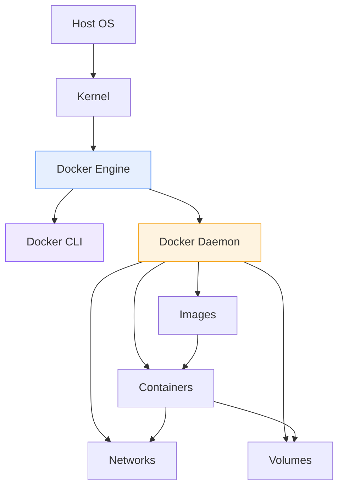
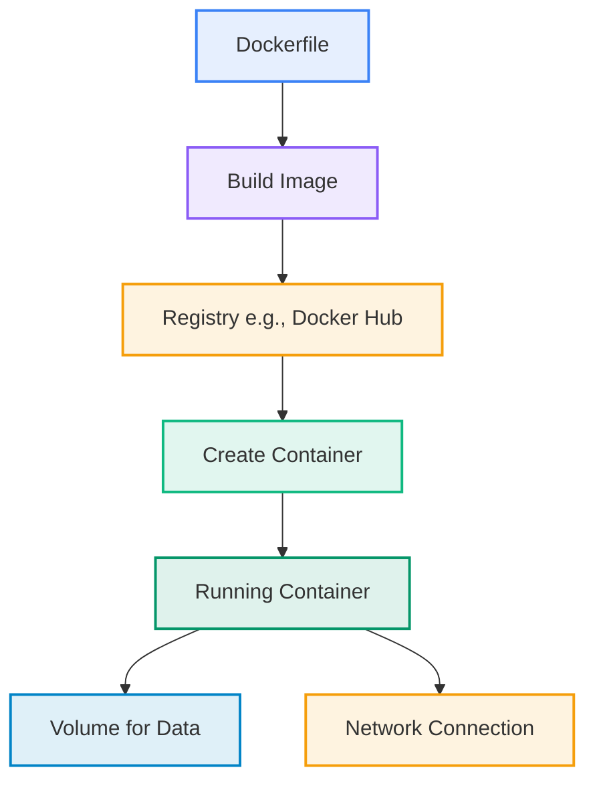
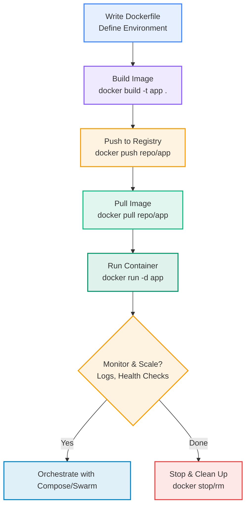
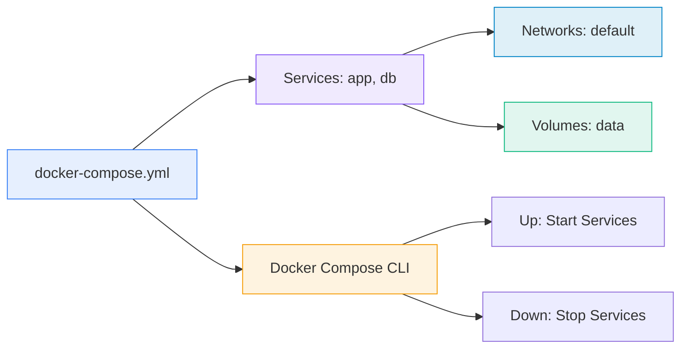
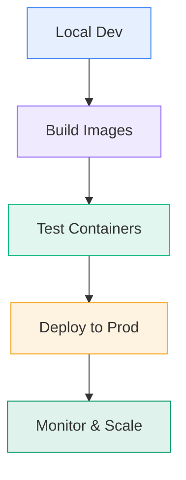

# Data Computation Course Summary - Docker and Docker Compose

## Table of Contents

1. [Introduction to Docker](#introduction-to-docker)
   - [What is Docker?](#what-is-docker)
   - [Core Concepts and Benefits](#core-concepts-and-benefits)
   - [Docker in Data Computation Contexts](#docker-in-data-computation-contexts)
2. [Key Components of Docker](#key-components-of-docker)
   - [Docker Images](#docker-images)
   - [Docker Containers](#docker-containers)
   - [Dockerfile](#dockerfile)
   - [Docker CLI](#docker-cli)
   - [Volumes and Networks](#volumes-and-networks)
3. [Docker Workflow](#docker-workflow)
   - [Step-by-Step Process](#step-by-step-process)
   - [Common Challenges and Solutions](#common-challenges-and-solutions)
4. [Dockerfile Examples](#dockerfile-examples)
   - [Basic Dockerfile](#basic-dockerfile)
   - [Multi-Stage Builds](#multi-stage-builds)
   - [Data-Specific Examples](#data-specific-examples)
5. [Introduction to Docker Compose](#introduction-to-docker-compose)
   - [What is Docker Compose?](#what-is-docker-compose)
   - [Why Use It?](#why-use-docker-compose)
6. [Docker Compose Examples](#docker-compose-examples)
   - [Simple Multi-Service Setup](#simple-multi-service-setup)
   - [Advanced Data Pipeline](#advanced-data-pipeline)
7. [Common Commands](#common-commands)
   - [Docker CLI Essentials](#docker-cli-essentials)
   - [Docker Compose CLI](#docker-compose-cli)
8. [Parameters, Configuration, and Best Practices](#parameters-configuration-and-best-practices)
   - [Key Parameters](#key-parameters)
   - [Configuration Tips](#configuration-tips)
   - [Best Practices](#best-practices)
9. [Applications and Benefits](#applications-and-benefits)
   - [Real-World Use Cases](#real-world-use-cases)
   - [Advantages and Limitations](#advantages-and-limitations)
10. [Key Takeaways](#key-takeaways)
    - [Core Principles](#core-principles)
    - [Practical Advice](#practical-advice)
    - [Advanced Topics](#advanced-topics)

---

## <a name="introduction-to-docker"></a>Introduction to Docker

### <a name="what-is-docker"></a>What is Docker?

Docker is a powerful open-source platform that enables developers to build, ship, and run applications in lightweight, portable containers. At its core, Docker solves the classic "it works on my machine" problem by encapsulating applications and their dependencies into isolated environments. This containerization approach ensures consistency across development, testing, and production stages.

Unlike traditional virtual machines, which include a full operating system, Docker containers share the host's kernel, making them more efficient in terms of resource usage and startup time. Docker has become a standard in modern software development, particularly in data computation where reproducible environments are crucial for pipelines involving tools like Spark or databases.

### <a name="core-concepts-and-benefits"></a>Core Concepts and Benefits

Key concepts include:

- **Containerization**: Each container runs in isolation, preventing conflicts between applications.
- **Portability**: Containers can run on any system with Docker installed, from laptops to cloud servers.
- **Efficiency**: Containers start in seconds and use fewer resources, ideal for scaling data workloads.

Benefits in data contexts:

- Ensures data processing scripts run identically regardless of the underlying infrastructure.
- Facilitates microservices architectures for distributed data systems.
- Simplifies dependency management for libraries like NumPy or Hadoop clients.

### <a name="docker-in-data-computation-contexts"></a>Docker in Data Computation Contexts

In data computation, Docker shines for orchestrating complex pipelines. For instance, you can containerize a Spark worker node to process large datasets without polluting the host environment. It also supports hybrid setups, like running Jupyter notebooks alongside databases for interactive analysis. By using Docker, data engineers can achieve reproducibility, a cornerstone of reliable ETL processes.

#### Docker Architecture Schema



#### Simple Example

Consider a Python script for data analysis:

```dockerfile
FROM python:3.9-slim
WORKDIR /app
COPY requirements.txt .
RUN pip install -r requirements.txt
COPY data_script.py .
CMD ["python", "data_script.py"]
```

Build with `docker build -t data-processor .` and run with `docker run data-processor`.

---

## <a name="key-components-of-docker"></a>Key Components of Docker

Understanding Docker's building blocks is essential before diving into workflows. These components work together to create a robust container ecosystem.

### <a name="docker-images"></a>Docker Images

Images are the blueprints for containers—immutable, layered filesystems that include your application code, runtime, libraries, and environment variables. Layers allow for efficient reuse; for example, a base Python image can be extended without duplicating common dependencies.

- **Registries**: Centralized repositories like Docker Hub store images for easy sharing.
- **Tagging**: Use tags like `myapp:v1.0` to version control images.

### <a name="docker-containers"></a>Docker Containers

Containers are runtime instances of images, providing isolated execution environments. They are ephemeral by default but can be made persistent with volumes.

- **Resource Management**: Limit CPU and memory to prevent resource hogging in multi-container data setups.
- **Lifecycle**: Containers can be paused, restarted, or inspected for debugging.

### <a name="dockerfile"></a>Dockerfile

The Dockerfile is a text file with instructions to automate image creation. It starts with a `FROM` base image and includes steps like `COPY`, `RUN`, and `CMD`.

### <a name="docker-cli"></a>Docker CLI

The command-line interface (CLI) is your primary tool for interacting with Docker. It handles building, running, and managing containers.

### <a name="volumes-and-networks"></a>Volumes and Networks

- **Volumes**: Enable data persistence beyond container lifecycles, crucial for databases in data pipelines.
- **Networks**: Allow secure communication between containers, such as linking a web app to a backend database.

#### Components Visualization



---

## <a name="docker-workflow"></a>Docker Workflow

With components in place, let's explore the end-to-end workflow for building and deploying Docker-based applications. This process ensures your data computation tasks are portable and scalable.

### <a name="step-by-step-process"></a>Step-by-Step Process

1. **Development**: Write code and Dockerfile locally.
2. **Build**: Use `docker build` to create an image.
3. **Test**: Run and debug containers interactively.
4. **Push**: Upload to a registry for distribution.
5. **Deploy**: Pull and run on target environments.
6. **Monitor**: Use logs and metrics for ongoing management.

This workflow minimizes environment discrepancies, especially in data teams collaborating on shared pipelines.

### <a name="common-challenges-and-solutions"></a>Common Challenges and Solutions

- **Challenge: Large Image Sizes** – Solution: Use multi-stage builds to discard build tools.
- **Challenge: Networking Issues** – Solution: Define custom networks in Compose.
- **Challenge: Data Persistence** – Solution: Mount volumes for stateful services.

#### Workflow Flowchart



---

## <a name="dockerfile-examples"></a>Dockerfile Examples

Dockerfiles are the heart of image creation. Below are progressively complex examples tailored for data computation.

### <a name="basic-dockerfile"></a>Basic Dockerfile

For a simple script:

```dockerfile
FROM python:3.9-slim
WORKDIR /app
COPY . .
RUN pip install pandas numpy
CMD ["python", "analyze.py"]
```

### <a name="multi-stage-builds"></a>Multi-Stage Builds

Optimize for production by separating build and runtime:

```dockerfile
# Build stage
FROM node:18-alpine AS builder
WORKDIR /app
COPY package*.json ./
RUN npm ci
COPY . .
RUN npm run build

# Runtime stage
FROM node:18-alpine
WORKDIR /app
COPY --from=builder /app/dist ./dist
EXPOSE 3000
CMD ["node", "dist/server.js"]
```

### <a name="data-specific-examples"></a>Data-Specific Examples

For a Spark-compatible Python app:

```dockerfile
FROM bitnami/spark:3.5.0
USER root
RUN apt-get update && apt-get install -y python3-pip
RUN pip3 install pyspark pandas
COPY data_job.py /opt/spark/work-dir/
WORKDIR /opt/spark/work-dir
CMD ["spark-submit", "data_job.py"]
```

These examples highlight how Dockerfiles adapt to data needs, ensuring all dependencies are bundled.

---

## <a name="introduction-to-docker-compose"></a>Introduction to Docker Compose

Building on single-container Docker, Compose extends functionality to multi-container applications, streamlining complex data stacks.

### <a name="what-is-docker-compose"></a>What is Docker Compose?

Docker Compose uses a YAML file (`docker-compose.yml`) to define services, networks, and volumes. It abstracts away manual `docker run` commands, making it easier to manage interdependent components like a database and processing service.

### <a name="why-use-docker-compose"></a>Why Use It?

Compose is ideal for development and testing multi-service data apps. It supports scaling, environment-specific overrides, and integration with tools like Airflow for orchestration. For production, it pairs well with Kubernetes.

---

## <a name="docker-compose-examples"></a>Docker Compose Examples

### <a name="simple-multi-service-setup"></a>Simple Multi-Service Setup

A web app with PostgreSQL:

```yaml
version: '3.8'
services:
  app:
    build: .
    ports:
      - "8000:8000"
    depends_on:
      - db
    environment:
      - DB_URL=postgresql://user:pass@db:5432/appdb
  db:
    image: postgres:15
    environment:
      POSTGRES_DB: appdb
      POSTGRES_USER: user
      POSTGRES_PASSWORD: pass
    volumes:
      - db_data:/var/lib/postgresql/data

volumes:
  db_data:
```

Run with `docker-compose up -d`.

### <a name="advanced-data-pipeline"></a>Advanced Data Pipeline

Integrating Spark and a database:

```yaml
version: '3.8'
services:
  spark-master:
    image: bitnami/spark:3.5.0
    ports:
      - "8081:8080"
    environment:
      - SPARK_MODE=master
  spark-worker:
    image: bitnami/spark:3.5.0
    depends_on:
      - spark-master
    environment:
      - SPARK_MODE=worker
      - SPARK_MASTER_URL=spark://spark-master:7077
  postgres:
    image: postgres:15
    ports:
      - "5432:5432"
    volumes:
      - pgdata:/var/lib/postgresql/data

volumes:
  pgdata:
```

#### Compose Schema



---

## <a name="common-commands"></a>Common Commands

Mastering CLI commands accelerates Docker usage in daily workflows.

### <a name="docker-cli-essentials"></a>Docker CLI Essentials

| Command | Description | Example |
|---------|-------------|---------|
| `docker build` | Build image | `docker build -t app:v1 .` |
| `docker run` | Run container | `docker run -d -p 80:80 app` |
| `docker ps` | List containers | `docker ps -a` |
| `docker logs` | View logs | `docker logs container_id` |
| `docker exec` | Execute in container | `docker exec -it id bash` |
| `docker prune` | Clean resources | `docker system prune -a` |

### <a name="docker-compose-cli"></a>Docker Compose CLI

| Command | Description | Example |
|---------|-------------|---------|
| `docker-compose up` | Start services | `docker-compose up -d` |
| `docker-compose down` | Stop services | `docker-compose down -v` |
| `docker-compose build` | Rebuild | `docker-compose build --no-cache` |
| `docker-compose logs` | Service logs | `docker-compose logs -f app` |
| `docker-compose exec` | Run in service | `docker-compose exec app bash` |

---

## <a name="parameters-configuration-and-best-practices"></a>Parameters, Configuration, and Best Practices

### <a name="key-parameters"></a>Key Parameters

Docker offers fine-grained control:

| Parameter | Description | Example |
|-----------|-------------|---------|
| `--cpus` | Limit CPU | `docker run --cpus=1.0 app` |
| `--memory` | Limit RAM | `docker run --memory=512m app` |
| `restart: always` | Auto-restart | In Compose YAML |

### <a name="configuration-tips"></a>Configuration Tips

- Use environment files (`.env`) for secrets.
- Override Compose files for dev/prod differences.
- Integrate with CI/CD for automated builds.

### <a name="best-practices"></a>Best Practices

1. **Layer Optimization**: Combine RUN commands to reduce layers.
2. **Security**: Scan images with `docker scout` and run as non-root.
3. **Efficiency**: Use `.dockerignore` to exclude temp files.
4. **Monitoring**: Implement healthchecks in Dockerfiles.
5. **Versioning**: Always tag images semantically.

---

## <a name="applications-and-benefits"></a>Applications and Benefits

### <a name="real-world-use-cases"></a>Real-World Use Cases

- **Data Lakes**: Containerize Hadoop components for on-demand scaling.
- **ML Pipelines**: Run TensorFlow in isolated environments.
- **ETL Services**: Combine with Airflow for orchestrated workflows.

### <a name="advantages-and-limitations"></a>Advantages and Limitations

**Advantages**:

- Portability reduces deployment errors.
- Scalability supports microservices in data architectures.

**Limitations**:

- Overhead for very small apps.
- Requires learning curve for advanced networking.

#### Benefits Visualization



---

## <a name="key-takeaways"></a>Key Takeaways

### <a name="core-principles"></a>Core Principles

| Principle | Description |
|-----------|-------------|
| **Isolation** | Containers prevent interference. |
| **Immutability** | Images as versioned artifacts. |
| **Orchestration** | Compose for multi-container harmony. |

### <a name="practical-advice"></a>Practical Advice

- Start with simple Dockerfiles for data scripts.
- Use Compose for local data stack simulations.
- Regularly prune to manage disk space.

### <a name="advanced-topics"></a>Advanced Topics

- Docker Swarm for clustering.
- Integration with Kubernetes.
- Security tools like Docker Bench.

Docker and Compose form the foundation for modern data infrastructure, enabling efficient, reproducible computation environments. 🐳

