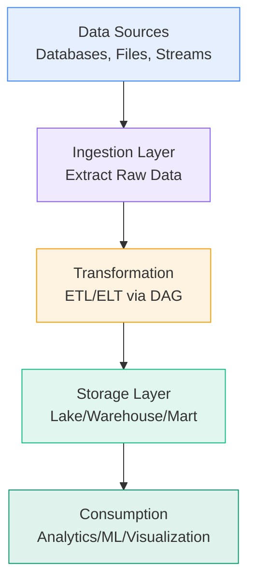
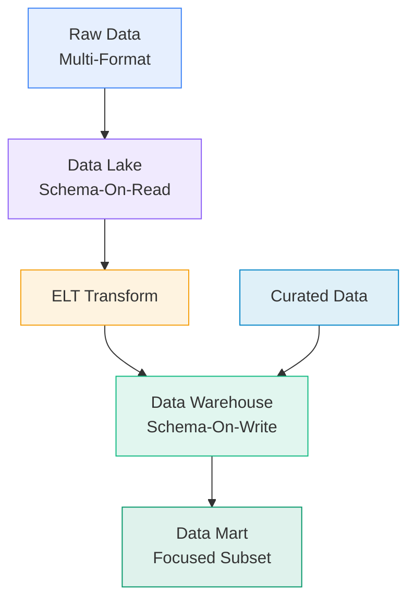
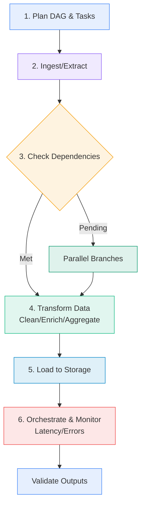
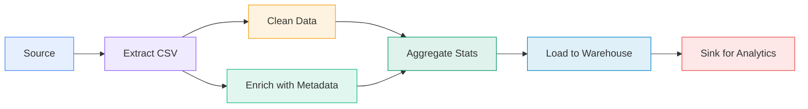
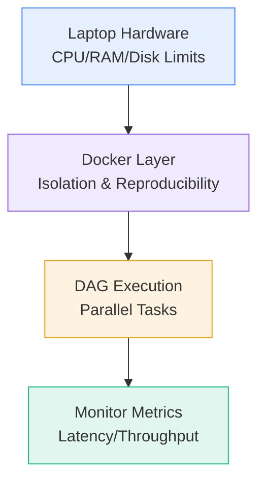
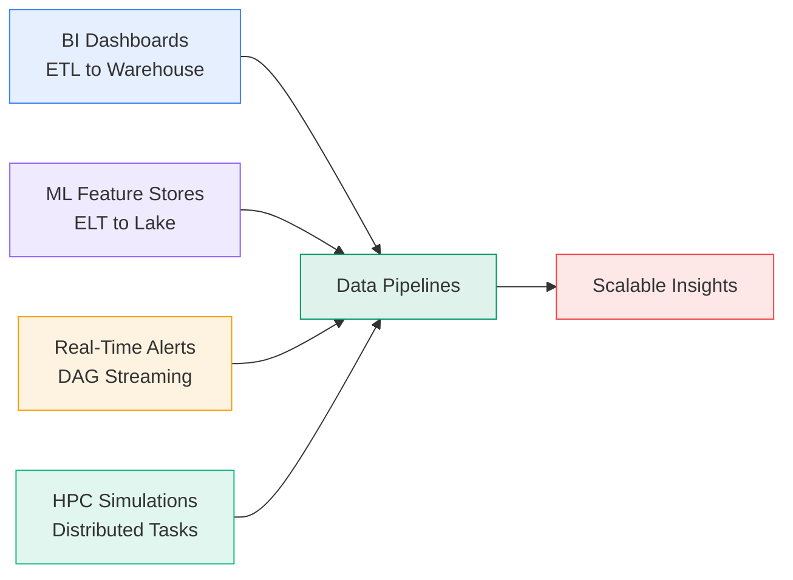

# Data Computation Course Summary - Introduction to Data Pipelines

## Table of Contents

1. [Introduction to Data Pipelines](#introduction)
   - [Overview and Importance](#overview)
   - [Historical Context and Evolution](#history)
2. [Fundamental Concepts](#fundamentals)
   - [What is a Data Pipeline?](#what-is-pipeline)
   - [Directed Acyclic Graphs (DAGs)](#dags)
   - [ETL vs. ELT Processes](#etl-vs-elt)
   - [Key Data Storage Paradigms](#storage-paradigms)
3. [Designing and Building Pipelines](#designing)
   - [Step-by-Step Workflow](#workflow)
   - [Latency, Parallelism, and Performance Metrics](#metrics)
   - [Handling Dependencies and Transformations](#dependencies)
4. [Practical Examples and Visualizations](#examples)
   - [Basic DAG Structures](#basic-dag)
   - [Valid and Invalid Pipeline Graphs](#valid-invalid)
   - [Advantages of DAG-Based Design](#dag-advantages)
5. [Resource Management and Tools](#resources-tools)
   - [Hardware Constraints on Laptops](#hardware-limits)
   - [Integrating Docker for Reproducibility](#docker-integration)
   - [Essential Docker Commands for Pipelines](#docker-commands)
6. [Best Practices and Configuration](#best-practices)
   - [Configuration Strategies](#config-strategies)
   - [Proven Best Practices](#practices)
   - [Common Pitfalls and Solutions](#pitfalls)
7. [Real-World Applications](#applications)
   - [Use Cases in Data Computation](#use-cases)
   - [Benefits and Limitations](#benefits-limitations)
8. [Key Takeaways and Next Steps](#takeaways)
   - [Core Principles Summary](#principles)
   - [Practical Recommendations](#recommendations)
   - [Advanced Topics and Resources](#advanced)

---

## <a name="introduction"></a>Introduction to Data Pipelines

### <a name="overview"></a>Overview and Importance

Data pipelines are the backbone of modern data computation, systematically ingesting, transforming, and delivering data to enable analysis, machine learning, and decision-making. In the context of this course (302.1 - Data Computation), pipelines bridge raw data sources to actionable insights, often involving distributed systems like Spark or containerized environments with Docker.

Unlike ad-hoc scripts, pipelines ensure **reproducibility**, **scalability**, and **reliability**. They handle everything from batch ETL jobs to real-time streaming, making them indispensable for big data workflows. This summary expands on the introductory quiz material, providing deeper explanations, examples, and practical guidance to solidify your understanding.

Key learning outcomes:

- Model pipelines using Directed Acyclic Graphs (DAGs).
- Differentiate ETL/ELT and storage types (lakes, warehouses).
- Optimize for performance with parallelism and tools like Docker.

### <a name="history"></a>Historical Context and Evolution

Data pipelines evolved from simple Unix pipes (1970s) to sophisticated orchestrators like Apache Airflow (2015+). Early challenges like "it works on my machine" led to containerization (Docker, 2013) and workflow engines. Today, they integrate with cloud services (e.g., AWS Glue, Google Dataflow) for handling petabyte-scale data in HPC environments.

In data computation, pipelines now support hybrid batch/streaming, emphasizing fault-tolerance and schema evolution for evolving datasets.

#### Introductory Pipeline Schema



This high-level view sets the stage for detailed components.

---

## <a name="fundamentals"></a>Fundamental Concepts

### <a name="what-is-pipeline"></a>What is a Data Pipeline?

A data pipeline is a directed sequence of data processing steps that ingests raw data, applies transformations, and outputs refined data for downstream use. It's a specialized workflow emphasizing **acyclicity** (no loops) and **dependency management** to ensure deterministic execution.

Pipelines differ from general workflows by focusing on data flow: inputs → processing → outputs. They support batch (e.g., daily reports) or streaming (e.g., real-time alerts) modes, often modeled as DAGs for visualization and orchestration.

Why it matters: In data computation, pipelines prevent data silos, automate ETL, and scale with tools like Spark, reducing manual errors.

### <a name="dags"></a>Directed Acyclic Graphs (DAGs)

DAGs are the mathematical foundation for pipelines, representing tasks as nodes and dependencies as directed edges without cycles.

- **Core Elements**:
  - **Nodes**: Atomic tasks (e.g., "clean data", "join tables").
  - **Edges**: Directed links showing precedence (e.g., "aggregate" after "extract").
  - **Acyclicity**: No loops; guarantees termination and topological sorting for execution order.

- **Execution**: Traverse in topological order—process sources first, then dependents. Parallelism emerges naturally for independent nodes.

Example pseudo-code for a simple DAG executor:

```python
def execute_dag(tasks, dependencies):
    topo_order = topological_sort(tasks, dependencies)  # e.g., using Kahn's algorithm
    for task in topo_order:
        if all(pred in completed for pred in dependencies[task]):
            result = run_task(task)
            completed.add(task)
    return results
```

DAGs enable tools like Airflow to schedule and monitor pipelines dynamically.

### <a name="etl-vs-elt"></a>ETL vs. ELT Processes

ETL and ELT are core patterns for data movement:

- **ETL (Extract, Transform, Load)**:
  - **Flow**: Extract from sources → Transform (clean, enrich, aggregate) → Load into target.
  - **Schema**: Enforced on write (reject malformed data early).
  - **Use Cases**: Structured data to warehouses; e.g., daily sales reports.
  - **Pros**: Clean data at destination; simpler queries.
  - **Cons**: Bottlenecks in transformation step for large volumes.

- **ELT (Extract, Load, Transform)**:
  - **Flow**: Extract → Load raw to target → Transform in-place.
  - **Schema**: On-read (flexible ingestion).
  - **Use Cases**: Big data lakes; e.g., ML feature stores.
  - **Pros**: Faster loading; leverages target compute (e.g., Spark SQL).
  - **Cons**: Requires powerful storage for transformations.

Transition tip: Use ETL for compliance-heavy apps; ELT for exploratory analytics.

### <a name="storage-paradigms"></a>Key Data Storage Paradigms

Choose based on data maturity and use:

- **Data Lake**: Vast repository for raw, semistructured data (e.g., JSON, logs). Schema-on-read allows diverse formats; no rejection of malformed records. Ideal for ingestion-first pipelines.
  - Example: S3 bucket with Parquet files for ML raw data.

- **Data Warehouse**: Centralized store for structured, curated data optimized for OLAP queries. Schema-on-write ensures integrity.
  - Example: Snowflake or BigQuery for BI dashboards.

- **Data Mart**: Specialized subset of a warehouse, tailored to a business unit (e.g., sales team). Focuses on dimensional modeling.
  - Example: Subset views in a warehouse for marketing analytics.

Integration: Pipelines often lake → warehouse (ELT) or source → mart (ETL).

#### Storage Paradigms Diagram



These fundamentals flow into practical design.

---

## <a name="designing"></a>Designing and Building Pipelines

### <a name="workflow"></a>Step-by-Step Workflow

1. **Planning**: Identify sources/sinks; define tasks and dependencies to form a DAG.
2. **Ingestion**: Extract data (e.g., via APIs, files); handle errors gracefully.
3. **Transformation**: Apply logic (e.g., SQL joins, Python scripts); use ETL/ELT based on scale.
4. **Loading**: Persist to storage; ensure idempotency for retries.
5. **Orchestration**: Execute via tools (e.g., Airflow schedules DAG runs).
6. **Monitoring/Validation**: Log metrics; validate outputs (e.g., schema checks).

This iterative process ensures pipelines are maintainable and fault-tolerant.

### <a name="metrics"></a>Latency, Parallelism, and Performance Metrics

- **Latency**: End-to-end time; critical for streaming (low) vs. batch (tolerable). Calculate as sum of sequential tasks or max of parallel paths.
  - Example: Sequential ETL: latency = extract (5s) + transform (10s) + load (3s) = 18s.
  - Parallel: If transform splits into two 7s tasks, latency = extract (5s) + max(7s,7s) + load (3s) = 15s.

- **Parallelism**: Exploit DAG branches; limited by resources (e.g., CPU cores).
  - Metric: Throughput (records/sec); aim for >1 via distribution.

- **Other Metrics**: Throughput, error rate, cost (cloud compute).

Tools like Prometheus monitor these in production.

### <a name="dependencies"></a>Handling Dependencies and Transformations

Dependencies enforce order: Use edges in DAGs to sequence tasks. Transformations include:

- **Cleaning**: Remove duplicates/nulls.
- **Enriching**: Join external data.
- **Aggregating**: Summarize (e.g., GROUP BY in SQL).

Ensure transformations are idempotent (rerunnable without side effects) for resilience.

#### Workflow Diagram



Examples now demonstrate these in action.

---

## <a name="examples"></a>Practical Examples and Visualizations

### <a name="basic-dag"></a>Basic DAG Structures

A simple ETL pipeline as DAG:

- Nodes: Extract (from CSV), Transform (filter/aggregate), Load (to DB).
- Edges: Extract → Transform → Load.

Pseudo-code:

```python
# Simple DAG in Python (using networkx for visualization)
import networkx as nx
G = nx.DiGraph()
G.add_edges_from([('Extract', 'Transform'), ('Transform', 'Load')])
nx.draw(G, with_labels=True)
```

### <a name="valid-invalid"></a>Valid and Invalid Pipeline Graphs

- **Valid Examples**:
  - Linear: Source → Extract → Transform → Load → Sink (batch ETL).
  - Branched: Extract → [Clean Parallel to Enrich] → Aggregate → Load (parallel cleaning/enrichment).

- **Invalid Examples**:
  - Cyclic: Load → Extract (loop; causes non-termination).
  - Undirected: Bidirectional edges (ambiguous order).

Validation: Use topological sort; if impossible, cycle detected.

### <a name="dag-advantages"></a>Advantages of DAG-Based Design

1. **Explicit Dependencies**: Prevents race conditions; e.g., ensures data is ready before processing.
2. **Task Ordering Clarity**: Topological sort defines execution sequence.
3. **Parallelism Revelation**: Independent nodes (no incoming edges from each other) run concurrently, optimizing for multi-core systems.
4. **Fault Isolation**: Failures in one branch don't halt the entire pipeline.
5. **Scalability**: Easily distribute across clusters (e.g., Spark jobs per node).

In practice, DAGs reduce debugging time by 50%+ in complex workflows.

#### Example DAG Visualization



This branched DAG shows parallelism between Clean and Enrich.

---

## <a name="resources-tools"></a>Resource Management and Tools

### <a name="hardware-limits"></a>Hardware Constraints on Laptops

Laptops impose limits critical for local pipeline testing:

- **CPU Cores**: Dictate parallelism (e.g., 4 cores → 4 concurrent tasks max).
- **RAM Capacity**: In-memory ops (e.g., Pandas DataFrames) fail if exceeded; aim for 16GB+ for datasets >1GB.
- **Disk Speed**: SSDs speed I/O; HDDs bottleneck large loads.

Mitigation: Downsample data for dev; use Docker to cap resources (e.g., `--cpus=2 --memory=4g`).

### <a name="docker-integration"></a>Integrating Docker for Reproducibility

Docker encapsulates pipelines, solving dependency hell. Containers share the host kernel for efficiency but isolate libraries (e.g., run Spark without global installs).

- **Why Docker?**: Ensures "once built, runs anywhere"; ideal for Jupyter + Spark stacks.
- **VM Comparison**: VMs virtualize hardware (heavy, slow boot); containers virtualize OS (light, seconds to start).

Example: Containerize a pipeline script:

```dockerfile
FROM python:3.9-slim
RUN pip install pandas pyspark
COPY pipeline.py .
CMD ["python", "pipeline.py"]
```

Build/run: `docker build -t my-pipeline . && docker run --rm my-pipeline`.

### <a name="docker-commands"></a>Essential Docker Commands for Pipelines

- `docker run --rm -it -p 8888:8888 myimage`: Starts interactive container, auto-cleans, exposes Jupyter port.
- `docker exec -it container_id bash`: Enters running container for debugging.
- `docker build -t image:tag .`: Builds from Dockerfile.
- `docker logs container_id`: Views output for monitoring.

For pipelines: Use volumes (`-v host_dir:/container_dir`) for data persistence.

#### Resource and Docker Flow



---

## <a name="best-practices"></a>Best Practices and Configuration

### <a name="config-strategies"></a>Configuration Strategies

- **DAG Configuration**: Use JSON/YAML for task defs; validate with libraries like networkx (Python).
- **ETL/ELT Setup**: Parameterize schemas; use config files for sources (e.g., env vars for DB creds).
- **Docker Optimization**: Multi-stage builds to slim images; healthchecks (`HEALTHCHECK CMD`) for reliability.
- **Storage Config**: Partition lakes by date; index warehouses for queries.

Example config (YAML for pipeline):

```yaml
pipeline:
  tasks:
    - name: extract
      depends: []
    - name: transform
      depends: [extract]
  storage: lake  # or warehouse
```

### <a name="practices"></a>Proven Best Practices

1. **Enforce Acyclicity**: Run cycle detection pre-execution; redesign loops as iterations.
2. **Maximize Parallelism**: Profile DAGs to identify bottlenecks; distribute with Spark.
3. **Containerize Everything**: Dockerize scripts/notebooks; use Compose for multi-service pipelines.
4. **Monitor Comprehensively**: Track latency per task; alert on >threshold (e.g., Prometheus + Grafana).
5. **Idempotency and Testing**: Make tasks rerunnable; unit-test transformations.
6. **Version Control**: Git for code; tag Docker images semantically (v1.0.0).

### <a name="pitfalls"></a>Common Pitfalls and Solutions

- **Pitfall: Resource Exhaustion** – Solution: Set Docker limits; monitor with `docker stats`.
- **Pitfall: Schema Drift** – Solution: Use schema registries (e.g., Avro) in ELT.
- **Pitfall: Silent Failures** – Solution: Implement retries and logging in DAG tasks.

These ensure pipelines are production-ready.

---

## <a name="applications"></a>Real-World Applications

### <a name="use-cases"></a>Use Cases in Data Computation

- **Business Intelligence**: ETL pipeline extracts sales data, transforms to KPIs, loads to warehouse for Tableau dashboards. DAG ensures daily freshness.
- **Machine Learning**: ELT loads raw logs to lake; DAG features engineering (e.g., Spark MLlib) feeds models. Docker isolates TensorFlow versions.
- **Real-Time Analytics**: Streaming DAG processes IoT data (Kafka → Spark Streaming → Elasticsearch); parallelism handles spikes.
- **HPC Integration**: Distributed pipelines on clusters (e.g., MPI/OpenMP via Docker) for simulations.

Case Study: Netflix uses DAGs (via Apache Airflow) for content recommendation pipelines, processing terabytes daily with <1s latency.

### <a name="benefits-limitations"></a>Benefits and Limitations

**Benefits**:

- **Efficiency**: Parallelism cuts processing time by 30-70% in branched DAGs.
- **Reliability**: Acyclicity + Docker = fewer deployment issues.
- **Scalability**: From laptop prototypes to cloud (e.g., Kubernetes-orchestrated DAGs).

**Limitations**:

- **Complexity**: Large DAGs hard to debug; solution: modular sub-DAGs.
- **Overhead**: Docker adds ~10% startup; negligible for long-running tasks.
- **Vendor Lock-in**: ELT to specific lakes (e.g., Delta Lake); mitigate with standards like Parquet.

#### Application Flow



---

## <a name="takeaways"></a>Key Takeaways and Next Steps

### <a name="principles"></a>Core Principles Summary

| Principle       | Key Insight                              |
|-----------------|------------------------------------------|
| **DAGs**       | Acyclic graphs for ordered, parallel execution. |
| **ETL/ELT**    | Choose based on data volume and schema needs. |
| **Latency**    | Optimize paths: sum sequential, max parallel. |
| **Storage**    | Lake (raw/flexible), Warehouse (structured/query-optimized). |
| **Docker**     | Lightweight isolation for reproducible pipelines. |

### <a name="recommendations"></a>Practical Recommendations

- **Start Small**: Prototype linear DAGs in Jupyter; Dockerize for sharing.
- **Test Thoroughly**: Simulate failures; measure latency on sample data.
- **Scale Gradually**: Add parallelism; migrate to Airflow for orchestration.
- **Document**: Annotate DAGs with purposes; version configs in Git.

### <a name="advanced"></a>Advanced Topics and Resources

- **Orchestration**: Apache Airflow or Prefect for DAG scheduling.
- **Distributed Computing**: Integrate Spark for large-scale parallelism.
- **Streaming**: Kafka + Flink for real-time pipelines.
- **Further Reading**:
  - "Designing Data-Intensive Applications" by Martin Kleppmann.
  - Docker docs: docs.docker.com.
  - Course follow-up: Explore Spark IO in later weeks.

With these foundations, you're equipped to tackle data computation challenges. Experiment with a simple ETL DAG in Docker to reinforce concepts! 🚀
