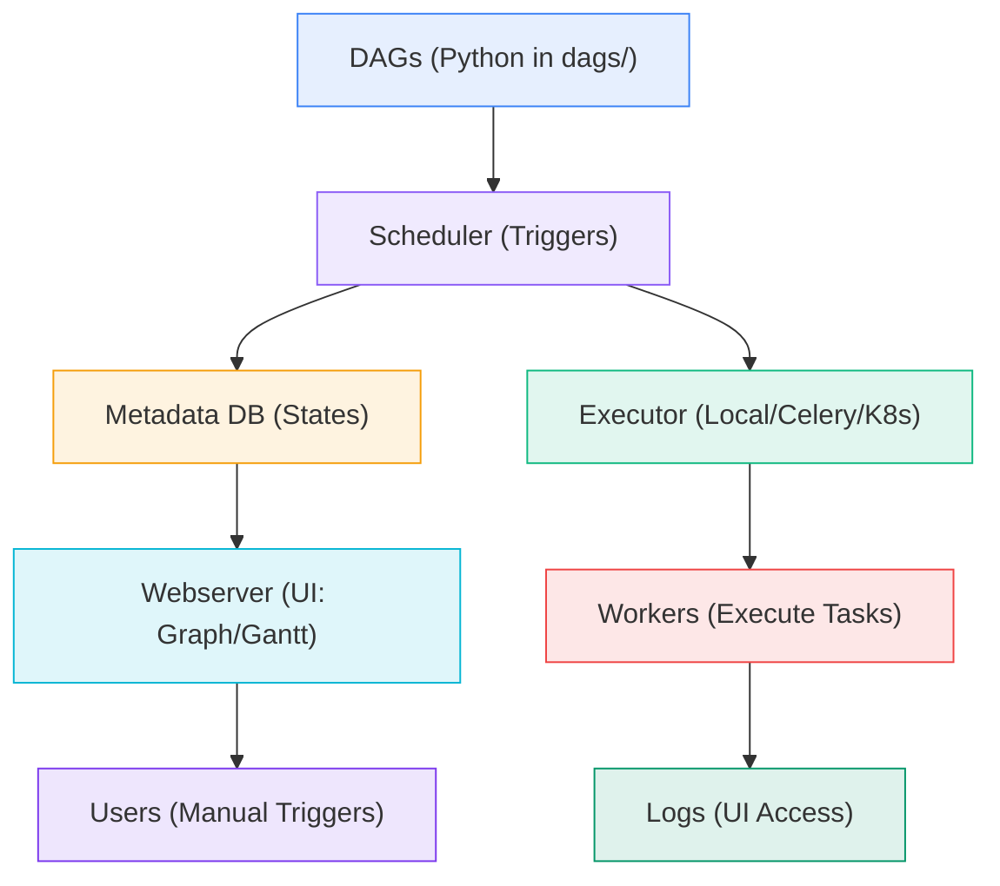
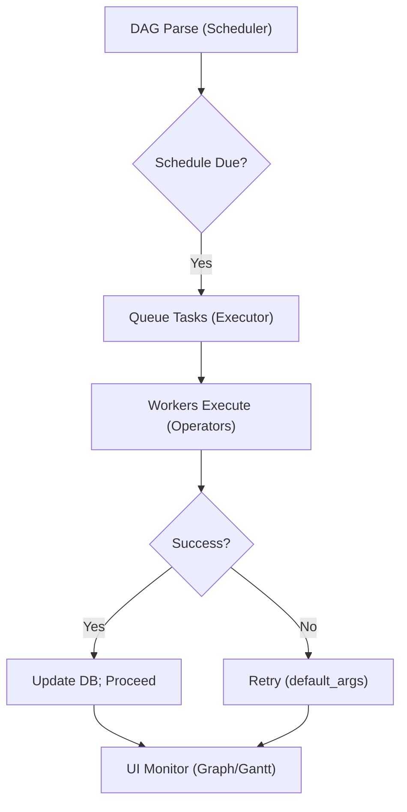
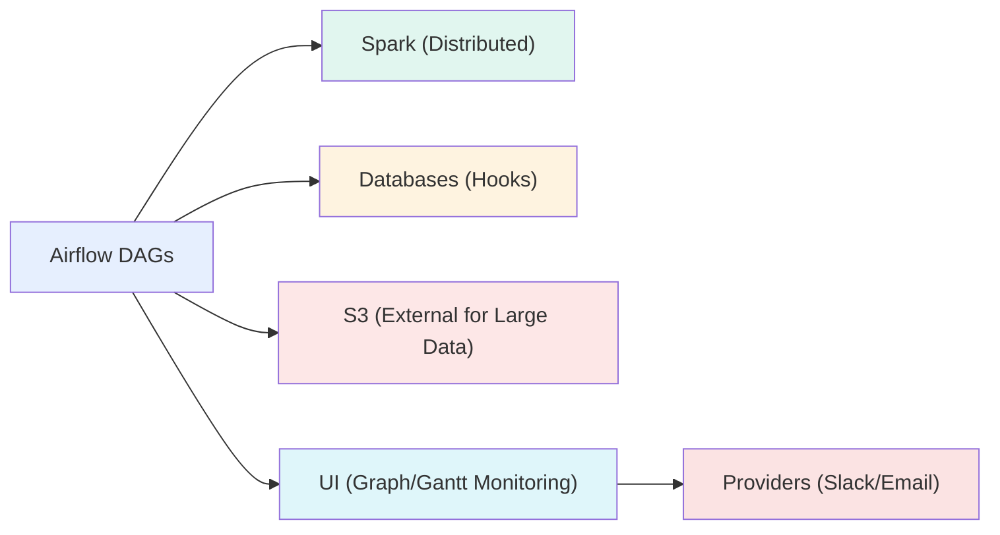

# Data Computation Course Summary: Apache Airflow

This guide explores Apache Airflow for orchestrating data pipelines, incorporating key concepts from the "Specifying pipelines & Apache Airflow" quiz (e.g., DAGs as pipelines, Scheduler/Executor roles, XComs for small data, `>>` dependencies, Graph/Gantt views, PythonOperator, providers for notifications, TaskGroups). The structure flows from foundations to advanced usage, with examples, diagrams, and data-focused tips for practical application.

**Key Quiz Coverage**:

- Q1: Operators describe how to do work; Tasks are instances in a DAG (True).
- Q2: Webserver does not decide what to run (False; Scheduler does).
- Q3: Executor submits tasks to workers (True).
- Q4: XComs enable task communication despite isolation (True).
- Q5: XComs are not for large data blobs (False; use external storage).
- Q6: schedule_interval=None means manual triggers only (True).
- Q7: a >> b means B depends on A (True).
- Q8: Web UI shows DAGs, execution, timings, logs (True).
- Q9: apache-airflow-providers-slack enables Slack notifications (True).
- Q10: DAG files in dags/ directory.
- Q11: Metadata DB stores DAGs, runs, task instances, state.
- Q12: Graph view shows task dependencies.
- Q13: Hypervisor is not an Airflow component.
- Q14: PythonOperator runs Python callables.
- Q15: a >> b means b waits for a.
- Q16: Good hygiene: log I/O/latency, explicit deps, small/idempotent tasks, ruff checks.
- Q17: Components: Scheduler, Executor, Worker, Metadata DB, Webserver.
- Q18: XComs best for small data/refs; use external for large; pull with ti.xcom_pull.
- Q19: Reasons: Gantt/Graph views, scheduling/retries/monitoring, multi-step orchestration.
- Q20: Pipeline is a DAG.
- Q21: Scheduler decides what/when to run.
- Q22: DAG files under dags/.
- Q23: >> declares B depends on A.
- Q24: Dependencies via lists [t2, t3], tuples (t2, t3), chain().
- Q25: chain_linear(t0, t1, [t2,t3,t4], [t5,t6,t7], t8) for parallel groups (True).
- Q26: TaskGroup for grouping tasks like t0 >> tg1 >> t3 (True).

**Usage**: Follow sections sequentially; execute code; use Mermaid for visuals.

---

## Table of Contents

1. [Introduction](#introduction)
2. [Core Components](#core-components)
3. [DAG Workflow](#dag-workflow)
4. [Operators, Hooks, and Examples](#operators-hooks-examples)
5. [Common Commands](#commands)
6. [Configuration and Best Practices](#configuration-best-practices)
7. [Applications and Benefits](#applications-benefits)
8. [Key Takeaways](#key-takeaways)

---

## 1. Introduction

Apache Airflow is an open-source platform for authoring, scheduling, and monitoring workflows as code (Q19). It models pipelines as Directed Acyclic Graphs (DAGs)—collections of tasks with dependencies (Q20)—ideal for data engineering tasks like ETL in distributed systems. Created by Airbnb and maintained by the Apache Foundation, Airflow supports scalability via executors (local to Kubernetes) and extensibility through providers (Q9).

### What is Apache Airflow?

A pipeline in Airflow is a **DAG**, emphasizing its acyclic, graph-based structure for reliable execution. DAGs are Python files in the `dags/` directory, parsed by the Scheduler to create task instances based on schedules (e.g., `@daily` or `None` for manual). Unlike cron, Airflow handles dependencies, retries, and monitoring via a web UI.

**Core Value in Data Computation**: Coordinates tools like Spark for processing, databases for loading, and notifications for alerts, ensuring fault-tolerant pipelines.

#### Installation and Quick Start

1. **Via pip** (Python 3.8+):

   ```bash
   pip install apache-airflow==2.7.0
   airflow db init  # Setup Metadata DB
   airflow users create --username admin --role Admin --email admin@example.com
   airflow webserver -p 8080 & airflow scheduler
   ```

   Access UI at `http://localhost:8080`.

2. **Docker Compose** (Full stack):

   ```yaml
   version: '3.8'
   services:
     postgres:
       image: postgres:13
       environment: {POSTGRES_USER: airflow, POSTGRES_PASSWORD: airflow, POSTGRES_DB: airflow}
       volumes: [postgres_db:/var/lib/postgresql/data]

     webserver:
       image: apache/airflow:2.7.0
       command: webserver
       ports: ["8080:8080"]
       volumes: ['./dags:/opt/airflow/dags']
       depends_on: [postgres]

     scheduler:
       image: apache/airflow:2.7.0
       command: scheduler
       volumes: ['./dags:/opt/airflow/dags']
       depends_on: [postgres]

   volumes: {postgres_db: {}}
   ```

   Run: `docker compose up -d`. UI at `localhost:8080`; place DAGs in `./dags`.

**Basic DAG Example** (Place in `dags/basic_etl.py`):

```python
from airflow import DAG
from airflow.operators.python import PythonOperator
from datetime import datetime

def extract(): print("Extracting data...")
def transform(**context): print(f"Transforming for {context['ds']}...")

dag = DAG('basic_etl', start_date=datetime(2023, 1, 1), schedule_interval='@daily')
extract_task = PythonOperator(task_id='extract', python_callable=extract, dag=dag)
transform_task = PythonOperator(task_id='transform', python_callable=transform, dag=dag)
extract_task >> transform_task  # Dependency: transform waits for extract
```

Trigger manually in UI; view Graph (dependencies) and Gantt (timings).

This setup introduces Airflow's power. Next, core components.

---

## 2. Core Components

Airflow's modular architecture separates concerns for scalable orchestration.

### Scheduler

Monitors `dags/` folder (Q10, Q22), parses files, and triggers runs based on `schedule_interval` (e.g., `None` for manual - Q6). Decides *what* and *when* to run (Q2, Q21), queuing tasks for the Executor.

- **Role**: Handles dependencies (`>>` ensures ordered execution) and retries.
- **Data Tip**: For daily ETL, set `@daily` to run post-midnight; use `None` for on-demand testing.

### Executor

Submits queued tasks to Workers (Q3). Types: Local (single-machine), Celery (distributed with Redis - Q17), Kubernetes (pods per task).

- **Role**: Enables scaling; e.g., Celery for parallel data transforms.
- **Data Tip**: Use CeleryExecutor for Spark jobs across multiple nodes.

### Metadata Database

Relational DB (e.g., PostgreSQL) stores DAGs, runs, task states, and variables (Q11). Essential for retries and UI queries (Q17).

- **Role**: Tracks failures for resumption; query for audits (e.g., failed tasks).
- **Data Tip**: Use for SLA monitoring: `SELECT * FROM task_instance WHERE state='failed';`.

### Webserver

Flask app serving the UI for monitoring (DAG list, Graph view for dependencies - Q12, Gantt for timings - Q8, logs - Q8).

- **Role**: No execution; visualizes workflows.
- **Data Tip**: Graph view shows `>>` edges; Gantt identifies slow tasks.

### Workers

Execute tasks (processes/pods - Q1). Managed by Executor (Q3); report states to DB (Q11).

- **Role**: Run Operator logic; scale via slots.
- **Data Tip**: Configure 16 slots for concurrent data validations.

#### Architecture Diagram



**Transition**: Components enable workflows; see how DAGs orchestrate them.

---

## 3. DAG Workflow

DAGs define pipelines as code: tasks (Operators) connected by dependencies (`>>`). Scheduler creates runs, Executor dispatches to Workers, DB tracks states, UI monitors.

### Defining DAGs

Python files in `dags/` (Q10, Q22) with `DAG` constructor and Operators (Q1). Use `>>` for deps (B waits for A - Q7, Q15, Q23).

**Example** (Sequential ETL):

```python
from airflow import DAG
from airflow.operators.python import PythonOperator
from datetime import datetime

def extract(): print("Extract...")
def transform(**context): print(f"Transform {context['ds']}...")

dag = DAG('etl', start_date=datetime(2023, 1, 1), schedule_interval='@daily')
extract_task = PythonOperator(task_id='extract', python_callable=extract, dag=dag)
transform_task = PythonOperator(task_id='transform', python_callable=transform, dag=dag)
extract_task >> transform_task  # transform waits for extract
```

### Execution Flow

1. Scheduler parses DAG, checks schedule (`None` for manual).
2. Creates run; queues tasks respecting `>>`.
3. Executor submits to Workers; states update in DB.
4. UI shows progress (Graph: deps; Gantt: timings).

**Patterns**:

- **Linear**: `task1 >> task2` (ETL sequence).
- **Parallel**: `task1 >> [task2, task3]` (fan-out for validations).
- **Branching**: BranchPythonOperator for conditions.
- **Grouping**: TaskGroup for sub-DAGs (nest tasks as one unit).

#### Workflow Diagram



**Data Tip**: Use `schedule_interval=None` for testing; trigger in UI. For data, add Sensors (wait for files) before extract.

---

## 4. Operators, Hooks, and Examples

Operators define task logic; Hooks connect externally. Providers extend both.

### Operators

Encapsulate "how" (e.g., PythonOperator runs callables - Q14).

- **PythonOperator**: Executes Python functions (ideal for data transforms).
- **BashOperator**: Shell commands (e.g., Spark submit).
- **Sensors**: Wait for conditions (e.g., FileSensor for data arrival).

**Hooks**: Abstract connections (e.g., PostgresHook for queries). Use Connections (UI-configured) for secrets.

**Providers**: Add specialized Operators/Hooks (e.g., `pip install apache-airflow-providers-slack` for Slack alerts).

#### Table: Key Operators and Hooks

| Type | Description | Data Use Case | Example |
|------|-------------|---------------|---------|
| PythonOperator | Runs Python callable | Data cleaning/aggregation | `PythonOperator(python_callable=transform_df)` |
| BashOperator | Executes shell | Spark jobs | `BashOperator(bash_command='spark-submit job.py')` |
| PostgresOperator | Runs SQL | Warehouse loads | `PostgresOperator(sql='INSERT INTO table...')` |
| SlackOperator (Provider) | Sends messages | Alerts on failure | `SlackOperator(message='ETL failed')` |
| PostgresHook | DB connections | Query data | `hook.run(sql)` |
| S3Hook | AWS S3 ops | Upload datasets | `hook.load_file('local.csv', 's3://bucket/')` |

**Example** (ETL with Hook and Provider):

```python
from airflow.providers.postgres.hooks.postgres import PostgresHook
from airflow.providers.slack.operators.slack import SlackOperator

def load_data(**context):
    pg_hook = PostgresHook(postgres_conn_id='postgres')  # UI-configured
    pg_hook.run("INSERT INTO sales VALUES (%s, %s)", params=(context['ds'], 1000))
    return "Loaded successfully"

load_task = PythonOperator(task_id='load', python_callable=load_data, dag=dag)

notify = SlackOperator(
    task_id='notify',
    slack_conn_id='slack',
    message='ETL complete: {{ ti.xcom_pull(task_ids="load") }}',  # XCom small data
    dag=dag,
)

transform_task >> load_task >> notify  # Deps + alert
```

**Data Tip**: Use Hooks for secure DB access; Providers for alerts. Limit XComs to small metadata (e.g., row counts); store large data externally.

**Advanced Example** (Parallel with TaskGroup):

```python
from airflow.utils.task_group import TaskGroup

with DAG('parallel_etl', start_date=datetime(2023, 1, 1), schedule_interval='@daily') as dag:
    with TaskGroup(group_id='processing') as group:  # Sub-DAG
        clean = PythonOperator(task_id='clean', python_callable=clean_data, dag=dag)
        validate = PythonOperator(task_id='validate', python_callable=validate_data, dag=dag)
        clean >> validate

    extract_task >> group >> load_task  # Group as single task
```

UI Graph shows group as collapsible node.

---

## 5. Common Commands

CLI for DAG management and testing.

#### Commands Table

| Command | Description | Example | Use Case |
|---------|-------------|---------|----------|
| `airflow db init` | Initializes Metadata DB | `airflow db init` | Setup states (core for retries/UI) |
| `airflow dags list` | Lists DAGs from `dags/` | `airflow dags list` | Verify files loaded |
| `airflow dags test <dag> <date>` | Tests full DAG run | `airflow dags test etl 2023-01-01` | Validate deps/schedule |
| `airflow tasks test <dag> <task> <date>` | Tests single task | `airflow tasks test etl transform 2023-01-01` | Debug Operators |
| `airflow variables set <key> <value>` | Sets config vars | `airflow variables set bucket 'my-s3'` | Pass params (e.g., S3 paths) |

**Data Tip**: Test deps with `dags test`; use vars for dynamic paths.

---

## 6. Configuration and Best Practices

### Key Parameters

Defined in DAG constructor or `airflow.cfg`.

| Parameter | Description | Example | Tip |
|-----------|-------------|---------|-----|
| `schedule_interval` | Run frequency | `'@daily'` or `None` (manual) | Use `None` for testing; cron for prod |
| `start_date` | Scheduling anchor | `datetime(2023, 1, 1)` | Immutable; set once |
| `default_args` | Task defaults (retries, etc.) | `{'retries': 3}` | Enables fault tolerance |
| `max_active_runs` | Concurrent runs | `1` | Prevent overload |
| `concurrency` | Parallel tasks | `8` | Match to Workers |

**Example**:

```python
dag = DAG(
    'etl',
    start_date=datetime(2023, 1, 1),
    schedule_interval=None,  # Manual
    default_args={'retries': 3},
    max_active_runs=1,
    concurrency=4,
)
```

### Best Practices

- **DAG Hygiene**: Keep tasks small/idempotent; log I/O; explicit deps (`>>`); lint with `ruff check dags/`.
- **XComs**: Small data only (e.g., paths); external for large.
- **Testing**: Use `dags test` for deps; UI for manual runs.
- **Monitoring**: Graph/Gantt for bottlenecks; alerts via providers.
- **Scaling**: CeleryExecutor for distributed; limit concurrency.
- **Data-Specific**: Template dates (`{{ ds }}`); Sensors for waits; idempotent loads (e.g., UPSERT).

**Tip**: Lint pre-deploy; use TaskGroups for modularity.

---

## 7. Applications and Benefits

### Real-World Use Cases

- **ETL Pipelines**: Extract from S3, transform with Spark, load to warehouse. Use `>>` for order, Sensors for waits.

  ```python
  from airflow.providers.apache.spark.operators.spark_submit import SparkSubmitOperator

  spark_task = SparkSubmitOperator(
      task_id='spark_transform',
      application='s3://bucket/job.py',
      conn_id='spark',
      dag=dag,
  )
  extract >> spark_task >> load  # Sequential
  ```

- **ML Workflows**: Train models, validate in parallel, deploy. Branch on quality; XComs for metadata.
- **Data Quality**: Sensors + branching for checks before loading.

**Benefits**: Reliable orchestration (deps/retries), observability (UI views), scalability (Executors).

**Limitations**: DB bottleneck at scale; overhead for simple tasks.

#### Ecosystem Diagram



---

## 8. Key Takeaways

- **DAGs**: Python in `dags/`; tasks via Operators, deps with `>>`.
- **Components**: Scheduler (triggers), Executor (submits), DB (states), Webserver (UI), Workers (execute).
- **Workflow**: Parse → Queue → Execute → Monitor (UI Graph/Gantt).
- **Operators/Hooks**: PythonOperator for code; Hooks for DB/S3; Providers for extras (e.g., Slack).
- **Best Practices**: Small tasks, explicit deps, test with CLI/UI, scale via Executors.
- **Data Focus**: Use for ETL/ML; XComs for metadata, external for large data.

Practice: Build an ETL DAG with `>>`, test manually, monitor in UI. Resources: [Airflow Docs](https://airflow.apache.org/docs/).
