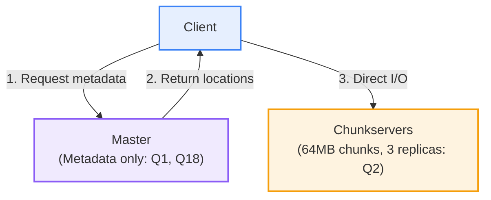
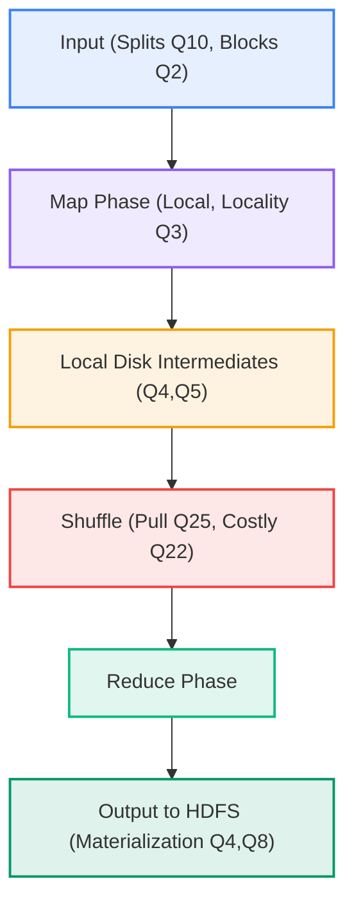
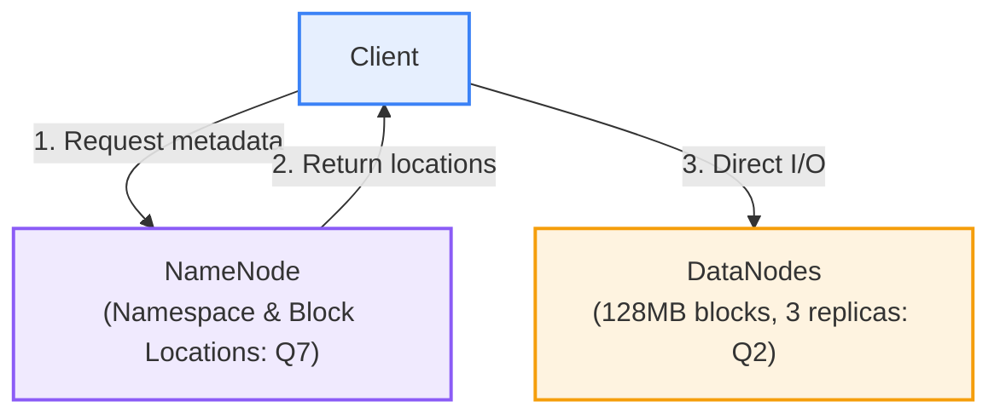
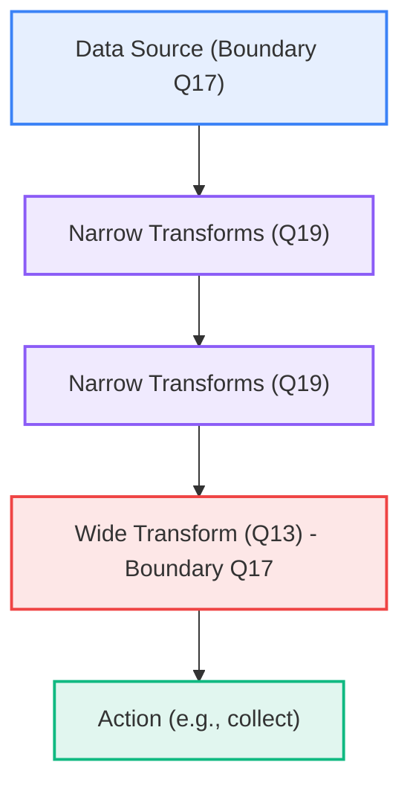
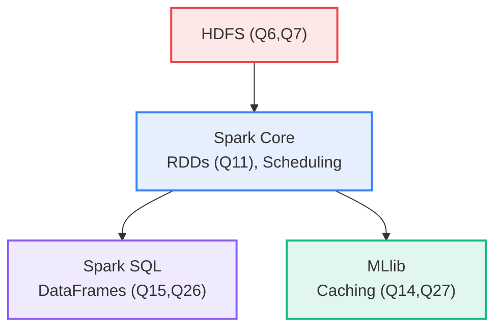
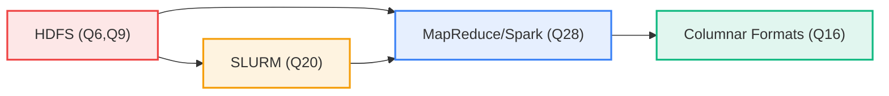

# Data Computation Course Summary: MapReduce and Apache Spark

This guide provides an in-depth exploration of MapReduce and Apache Spark, foundational distributed systems for data computation. It fully incorporates the quiz content from the "5 MapReduce & Apache Spark" module, including all 28 questions, answers, and explanations (e.g., GFS/HDFS chunks/replicas/metadata, input splits/locality, MapReduce phases/materialization/shuffles, RDD lineage/caching/narrow-wide transformations, DataFrames optimization/pruning, stage boundaries/DAG, SLURM directives, and more). The flow is logical: introduction → foundations (GFS → MapReduce → HDFS) → Spark core concepts → commands → optimization → applications → summary, with detailed explanations, examples, and transitions for clarity.

**Key Quiz Coverage**:

- Q1: GFS Master serves file data to clients (False; metadata only, off data path).
- Q2: GFS files split into fixed-size chunks (~64MB), 3 replicates across chunkservers (True).
- Q3: Data locality in MapReduce enabled by filesystem's mapping of blocks/chunks to replicas (True).
- Q4: Materialization points in MapReduce: input read from HDFS, mapper intermediates on local disk, final reducer output to HDFS (Partial; excludes RDD caching).
- Q5: MapReduce intermediates stored in HDFS before reducers fetch (False; local disk, reducers pull).
- Q6: HDFS is write-once, read-many (True).
- Q7: HDFS NameNode stores block/replica metadata and namespace (True; not file contents).
- Q8: Multi-stage MapReduce is disk-bound due to HDFS materialization (True).
- Q9: GFS/HDFS cost-effective via software replication, commodity hardware, sequential I/O (True).
- Q10: MapReduce input split is logical slice for map task, often aligned to block (True).
- Q11: Spark RDDs are immutable, partitioned, fault-tolerant via lineage (True).
- Q12: Spark guarantees no shuffles in DataFrames (False; shuffles possible).
- Q13: Wide transformations in Spark: groupBy, join, reduceByKey (True).
- Q14: Spark RDD caching advantage for iterative ML: in-memory reuse across steps (True).
- Q15: DataFrames declarative, enabling pruning/reordering to reduce shuffles (True).
- Q16: Columnar formats like Parquet enable column pruning/predicate pushdown (True).
- Q17: Spark stage boundaries at wide transformations/shuffles and new sources (True).
- Q18: GFS/HDFS metadata server on data path, streaming bytes (False; off-path).
- Q19: Narrow transformations don't require shuffling across partitions (True).
- Q20: SLURM #SBATCH --nodes specifies nodes to allocate (True).
- Q21: HDFS provides random in-place updates by default (False; append-only).
- Q22: GFS cost model: materialization (disk I/O) and data movement (shuffles) most costly (True).
- Q23: Spark transformations form DAG across stages, minimizing wide boundaries (True).
- Q24: Input splits logical for map tasks; aligning to blocks maximizes locality (True).
- Q25: MapReduce reducers pull mapper outputs during shuffle (True).
- Q26: DataFrames outperform RDDs by exposing relational intent for better plans (True).
- Q27: Spark RDD caching most helpful for iterative algorithms with data reuse (True).
- Q28: MapReduce/RDD/DataFrame are compute abstractions over storage; formats like Parquet influence costs; HDFS/object stores for long-term storage (All true).

**Usage**: Follow sections sequentially; execute code; use Mermaid for visuals.

---

## Table of Contents

1. [Introduction](#introduction)
2. [Foundations of Distributed Storage and Processing](#foundations)
   - [Google File System (GFS)](#gfs)
   - [MapReduce](#mapreduce)
   - [Hadoop Distributed File System (HDFS)](#hdfs)
3. [Apache Spark Core Concepts](#spark-core)
   - [RDDs (Resilient Distributed Datasets)](#rdds)
   - [DataFrames](#dataframes)
   - [DAG and Stage Boundaries](#dag-stages)
   - [Narrow and Wide Transformations](#transformations)
   - [Caching](#caching)
4. [Common Commands](#commands)
5. [Optimization and Best Practices](#optimization)
   - [Columnar Formats like Parquet (Q16)](#parquet)
6. [Applications, Benefits, and Real-World Use Cases](#applications)
7. [Key Takeaways](#key-takeaways)

---

## <a name="introduction"></a>1. Introduction

Apache Spark builds on foundational distributed systems like GFS, MapReduce, and HDFS to enable scalable analytics and computation. This section introduces these concepts, contrasting traditional approaches, and highlights their role in data computation.

### What is Distributed Data Processing?

Distributed systems handle large-scale data across clusters. GFS provides scalable storage, MapReduce enables parallel processing, HDFS implements GFS principles, and Spark unifies them for in-memory analytics (Q28). Spark's speed (up to 100x faster than disk-bound MapReduce; Q8) stems from these foundations.

### Core Value in Data Computation

These systems address big data challenges: scalability (Q9: commodity hardware), fault tolerance (Q2: replication), and efficiency (Q22: minimize materialization/shuffles). Spark integrates them for ETL, ML, and streaming.

#### Basic Example: Word Count in MapReduce (Q4, Q5)

```python
# Mapper: Process split locally
def map(key, value):
    for word in value.split():
        yield word, 1  # Emit to local disk (Q5)

# Reducer: Pull from mappers (Q25)
def reduce(key, values):
    return sum(values)  # Aggregate, output to HDFS (Q4)
```

Intermediates on local disk, reducers pull (Q5).

With foundations established, next explore GFS.

---

## <a name="foundations"></a>2. Foundations of Distributed Storage and Processing

This section covers the foundational systems: GFS, MapReduce, and HDFS, which form the backbone of distributed data processing.

### <a name="gfs"></a>Google File System (GFS)

GFS is a scalable distributed filesystem designed for large files with append-only operations, serving as inspiration for HDFS. It handles petabyte-scale data on commodity hardware (Q9).

#### Core Concepts (Q1, Q2, Q9, Q18, Q21)

- **Architecture**: Single Master manages metadata; multiple chunkservers store data in 64MB chunks with 3 replicas (Q2). Clients interact with Master for locations, then directly with chunkservers (off-path design).
- **Key Features**: Fault-tolerant replication, sequential I/O optimization, large files (multi-GB), append-only writes (no random updates; Q21). Files split into fixed-size chunks (~64MB) replicated across chunkservers (Q2: True).
- **Cost Model**: Focuses on sequential I/O; materialization (disk) and data movement (network) are costly (Q22). Cost-effective via software replication on commodity hardware (Q9: True).
- **Data Locality**: Chunk placement on nearby chunkservers for efficient access (Q3 precursor).

#### GFS Architecture Diagram

This diagram illustrates GFS's architecture, showing how clients query the Master for metadata and then access chunkservers directly for data, emphasizing the off-path design for scalability and tying to quiz questions on metadata handling and replication.



**Characteristics**:

- **File Size**: Optimized for large files (multi-GB); small files inefficient due to chunk overhead.
- **Block Size**: 64MB chunks (fixed-size for sequential access).
- **Replication**: 3 replicas default; software-managed for fault tolerance (Q9).
- **Access Pattern**: Append-only writes; high-throughput reads (sequential I/O favored, Q22).
- **Scalability**: Single Master for metadata (lightweight); multiple chunkservers for data.

GFS enables efficient large-scale storage; next, MapReduce for processing.

### <a name="mapreduce"></a>MapReduce

MapReduce is a programming model for processing large datasets in parallel across clusters, popularized by Google and implemented in Hadoop. It processes data in key-value pairs via map (parallel input) and reduce (aggregation) phases.

#### Core Concepts (Q3, Q4, Q5, Q8, Q10, Q22, Q24, Q25)

- **Input Splits**: Logical divisions of input data for map tasks (Q10: logical slice, aligned to blocks for locality Q3, Q24). Splits map to filesystem blocks/chunks (Q2).
- **Map Phase**: Processes splits locally, emitting intermediates to local disk (Q4, Q5: not HDFS; reducers pull Q25). Enables data locality by running maps near data (Q3: True).
- **Shuffle**: Reducers pull intermediates over network (Q25); costly data movement (Q22).
- **Reduce Phase**: Aggregates, writes final output to storage (Q4: HDFS materialization).
- **Multi-Stage**: Chains jobs; disk-bound due to HDFS writes between stages (Q8: True).

**Characteristics**:

- **File Size**: Handles large inputs via splits (logical, ~128MB blocks); outputs partitioned for next stage.
- **Data Flow**: Key-value pairs; map emits to local disk (temporary, small files per mapper), shuffle sorts/merges, reduce writes sequentially.
- **Parallelism**: Maps run in parallel (one per split); reduces aggregate (fan-in).
- **Fault Tolerance**: Restart failed tasks; idempotent reduces.
- **Performance**: Disk-bound (Q8); shuffles expensive (Q22: network I/O).

#### MapReduce Workflow Diagram

This flowchart depicts the MapReduce workflow, from input splits to final output, highlighting key phases like map (local processing for locality Q3), shuffle (data pull Q25), and reduce (aggregation with HDFS materialization Q4,Q8), showing how data flows through the pipeline with emphasis on disk-bound nature (Q8).



**Word Count Example** (Q4, Q5, Q25):

```java
// Mapper: Process split locally (Q3 locality)
public class WordCountMapper extends Mapper<LongWritable, Text, Text, IntWritable> {
    public void map(LongWritable key, Text value, Context context) {
        for (String word : value.toString().split("\\s+")) {
            context.write(new Text(word), new IntWritable(1));  // Local disk (Q5)
        }
    }
}

// Reducer: Pull from mappers (Q25)
public class WordCountReducer extends Reducer<Text, IntWritable, Text, IntWritable> {
    public void reduce(Text key, Iterable<IntWritable> values, Context context) {
        int sum = 0;
        for (IntWritable val : values) sum += val.get();
        context.write(key, new IntWritable(sum));  // HDFS output (Q4)
    }
}
```

Stages materialize to disk (Q8); locality via block mapping (Q3).

MapReduce scales processing; next, HDFS for storage.

### <a name="hdfs"></a>Hadoop Distributed File System (HDFS)

HDFS implements GFS principles for reliable, scalable storage on commodity hardware (Q9). It supports large files with block-based distribution.

#### Core Concepts (Q6, Q7, Q9, Q21)

- **Blocks and Replication**: Files split into 128MB blocks with 3 replicas (Q2, Q9: software replication). Write-once, read-many (Q6: append-only, no random updates Q21).
- **NameNode Role**: Manages metadata (namespace, block locations; Q7: stores metadata only). Off data path: Clients query for locations, then access DataNodes directly (Q1, Q18).
- **DataNodes**: Store actual blocks; handle reads/writes.
- **Fault Tolerance**: Automatic replication on failures (Q9).

#### HDFS Architecture Diagram

This diagram shows HDFS's architecture, illustrating the NameNode's role in metadata management and the direct client-to-DataNode data flow, highlighting the off-path design for efficient, scalable access and tying to quiz questions on metadata and data handling.



**Characteristics**:

- **File Size**: Optimized for large files (>GB); small files inefficient (one block overhead).
- **Block Size**: 128MB default (configurable; balances I/O and replication).
- **Replication**: 3 replicas (default; software-managed for fault tolerance Q9).
- **Access Pattern**: Append-only (Q6, Q21: no random writes); high-throughput sequential reads.
- **Scalability**: NameNode single (metadata); DataNodes distributed (data).

HDFS enables reliable storage; next, Spark for unified processing.

---

## <a name="spark-core"></a>3. Apache Spark Core Concepts

Spark builds on MapReduce/HDFS for in-memory, unified analytics (Q28). It supports batch, streaming, ML, and graphs via RDDs/DataFrames.

### <a name="rdds"></a>RDDs (Resilient Distributed Datasets) (Q11)

RDDs are immutable, partitioned, fault-tolerant via lineage (Q11).

- **Immutability**: Once created, RDDs cannot be modified, ensuring consistency.
- **Partitioned**: Data divided into partitions (default 128MB) for parallel processing.
- **Fault-Tolerant via Lineage**: Recomputes lost partitions using transformation history (Q11).

RDDs are lazy: transformations build DAG (Q23), executed on actions.

Example (Q11):

```scala
val rdd = sc.textFile("input")  // New source (stage boundary, Q17)
val words = rdd.flatMap(_.split(" "))  // Narrow (no shuffle, Q19)
val pairs = words.map((_, 1))          // Narrow
val counts = pairs.reduceByKey(_ + _)  // Wide (shuffle, Q13)
counts.cache()                         // For iteration (Q14, Q27)
```

### <a name="dataframes"></a>DataFrames (Q12, Q15, Q26)

DataFrames are structured RDDs with named columns, declarative for optimization (Q15, Q26: True).

- **Declarative**: Specify what (Q15), not how; Catalyst reorders/prunes.
- **Shuffles Possible**: (Q12: False) Like RDDs, but optimized.
- **Relational Intent**: Schema enables better plans (Q26).

Example (Q15, Q26):

```scala
val df = spark.read.text("input")  // DataFrame
df.filter($"value" > "10").groupBy().count()  // Optimizer prunes/reorders (Q15)
```

DataFrames outperform RDDs via relational intent (Q26).

### <a name="dag-stages"></a>DAG and Stage Boundaries (Q17, Q23)

Spark's DAG (Q23) is a graph of transformations; stages are split at boundaries (Q17).

- **DAG**: Logical plan; optimized to minimize wide boundaries (Q23).
- **Stage Boundaries**: At wide transformations/shuffles or new sources (Q17). Stages pipeline narrow ops; boundaries trigger shuffles (Q22).

Example (Q17, Q23):

```scala
val rdd = sc.textFile("input")  // New source: boundary
val words = rdd.flatMap(_.split(" "))  // Narrow: same stage
val counts = words.reduceByKey(_ + _)  // Wide: boundary (Q17)
```

DAG minimizes boundaries (Q23).

#### Spark Execution Flow Diagram

This diagram visualizes DAG execution, with stages separated by boundaries.



### <a name="transformations"></a>Narrow and Wide Transformations (Q13, Q19)

- **Narrow (Q19)**: Within partition, no shuffle (e.g., map, filter).
- **Wide (Q13)**: Across partitions, requires shuffle (e.g., groupBy, join, reduceByKey).

Narrow: Efficient, same stage. Wide: Costly, boundary (Q17).

Example (Q13, Q19):

```scala
val narrow = rdd.map(_ * 2)  // No shuffle (Q19)
val wide = rdd.reduceByKey(_ + _)  // Shuffle (Q13)
```

### <a name="caching"></a>Caching (Q14, Q27)

Caching persists RDDs/DataFrames in memory/disk for reuse (Q14, Q27: True).

- **Advantage**: Avoids recomputation in iterations (Q14); ideal for ML (Q27).
- **How**: `cache()` or `persist()`; uses lineage for fault tolerance.

Example (Q14, Q27):

```scala
val rdd = sc.textFile("input").cache()  // Cache for reuse
rdd.count()  // First use
rdd.filter(_ > 0).take(5)  // Second, cached (Q14, Q27)
```

#### Spark Components Diagram

This flowchart visualizes Spark's key components.



Spark unifies processing; next, commands.

---

## <a name="commands"></a>4. Common Commands

Essential tools for running and managing (Q20: SLURM for HPC).

### Hadoop/MapReduce Commands

- **hdfs dfs**: HDFS ops (Q2, Q7).
  - Explanation: Manages files (ls, put, get); NameNode coordinates (Q7).
  - Example: `hdfs dfs -put localfile /path` (write-once, Q6); `hdfs fsck -blocks /file` (replicas, Q2).

- **hadoop jar**: Submit MapReduce jobs.
  - Example: `hadoop jar wordcount.jar /input /output` (Q3-Q5).

### Spark Commands

- **spark-submit**: Run Spark apps.
  - Flags: `--master yarn` (cluster), `--executor-memory 4g`.
  - Example: `spark-submit --master local[*] wordcount.py` (DAG, Q23).

- **pyspark**: Interactive shell.
  - Example: `pyspark --master local[2]` (Q11-Q15).

### SLURM (Q20)

- **sbatch**: Submit batch jobs.
  - Example: Script with `#SBATCH --nodes=4` (nodes, Q20); `sbatch spark_job.sh`.

**Table: Key Commands** (Quiz Ties):

| Command | Description | Example | Characteristics |
|---------|-------------|---------|----------|
| hdfs dfs -ls | List HDFS files (metadata Q7) | hdfs dfs -ls / | Fast metadata ops; off-path (Q1,Q18); handles large dirs (millions files) |
| hadoop jar | Run MapReduce (splits/shuffle Q3,Q10,Q25) | hadoop jar app.jar | Processes large inputs (TB+); disk-bound (Q8); parallel maps/reduces |
| spark-submit | Submit Spark (DAG/shuffles Q13,Q23) | spark-submit app.py | In-memory (faster Q8); supports 128MB partitions; scalable to 1000s nodes |
| sbatch | SLURM job (#SBATCH --nodes Q20) | sbatch --nodes=2 script.sh | HPC scaling; allocates 1-1000s nodes; integrates with YARN for Spark |

**Data Tip**: Use `hdfs fsck` for replicas (Q2); spark-submit with caching (Q14).

Commands execute workflows; next, optimization.

---

## <a name="optimization"></a>5. Optimization and Best Practices (Q8, Q13, Q15-Q16, Q19, Q22, Q26)

Optimizations reduce materialization/shuffles (Q8, Q22); formats enable pruning (Q16).

### Spark Optimizations (Q15, Q23, Q26)

- **DAG & Lazy Evaluation**: Builds plan, minimizes stages/shuffles (Q23); wide at shuffles (Q13, Q17, Q19).
- **Caching**: MEMORY_AND_DISK for iteration (Q14, Q27).
- **DataFrames/Catalyst**: Declarative (Q15, Q26: relational intent for plans); pruning in columnar formats (Q16).

**Tuning Example** (Q13, Q19):

```python
df = spark.read.parquet("data.parquet")  # Pruning (Q16)
df.filter(df.col > 10).groupBy("key").agg(...)  # Reorder (Q15,Q26); wide (Q13)
df.cache()  # Multi-pass (Q27)
```

### Columnar Formats like Parquet (Q16)

Columnar formats like Parquet enable column pruning/predicate pushdown (Q16), allowing Spark to read only necessary data, reducing I/O. Formats influence costs (Q28).

Example (Q16):

```python
df = spark.read.parquet("data.parquet").filter(df.age > 18)  # Prunes columns (Q16)
```

---

## <a name="applications"></a>6. Applications, Benefits, and Real-World Use Cases (Q28)

### Real-World Use Cases

- **ETL Pipelines**: MapReduce/Spark on HDFS with columnar formats (Q28: abstractions/formats influence costs).
- **ML**: Spark caching for training (Q14, Q27).
- **HPC**: SLURM + Spark (Q20).
- **Analytics**: DataFrames for queries with pruning (Q15, Q16).

### Advantages & Limitations (Q8, Q9, Q12, Q22)

**Advantages**:

- Unified abstractions (Q28); in-memory faster than disk-bound MapReduce (Q8); opt. via DataFrames (Q26).
- Scalable on commodity hardware (Q9).

**Limitations**:

- Shuffles costly (Q22); DataFrames still shuffle (Q12); HDFS no random writes (Q21).

#### Ecosystem Diagram

This graph depicts the integrated ecosystem, showing how HDFS provides storage, MapReduce/Spark handles computation, columnar formats optimize, and SLURM enables HPC scaling (Q28).



---

## <a name="key-takeaways"></a>7. Key Takeaways (Full Quiz Coverage)

### Summary Table

| Topic | Key Concepts | Characteristics | File Size/Block Details |
|-------|--------------|-----------------|------------------------|
| **GFS** | Q1, Q2, Q9, Q18, Q21 | Single Master (lightweight metadata); multiple chunkservers (distributed data); append-only; fault-tolerant replication | 64MB chunks; large files (multi-GB); 3 replicas default |
| **MapReduce** | Q3, Q4, Q5, Q8, Q10, Q22, Q24, Q25 | Key-value processing; parallel maps (per split); fan-in reduces; idempotent; disk I/O heavy | Input splits ~128MB (logical); intermediates small/temp files; outputs partitioned (variable size) |
| **HDFS** | Q6, Q7, Q9, Q21 | Distributed blocks on DataNodes; NameNode coordinates (metadata only); append-only; high-throughput sequential | 128MB blocks; 3 replicas; large files (>GB); metadata small (KB per file) |
| **Spark** | Q11, Q12, Q13, Q14, Q15, Q16, Q17, Q19, Q23, Q26, Q27 | In-memory processing; lazy evaluation; unified (batch/stream/ML); adaptive query execution | 128MB default partitions; adaptive 100MB-1GB; in-memory (up to cluster RAM); columnar row groups 128MB-1GB |
| **Optimization** | Q8, Q13, Q15-Q16, Q19, Q22, Q26 | Minimize disk I/O (Q8); columnar formats (Q16); balance parallelism/memory | Partitions 100MB-1GB (default 128MB); shuffles configurable (200 partitions); columnar pages 1MB |

### Practical Advice

- GFS/HDFS: Use for durable storage (Q6); align blocks for locality (Q24).
- MapReduce: Minimize materialization (Q8); leverage locality (Q3).
- Spark: Cache iterative (Q27); DataFrames for analytics (Q26); columnar pruning (Q16).
- Tune shuffles (Q22); SLURM scaling (Q20).
- Partition by filters (date/region); use columnar formats for efficiency (Q16).
- Balance partitions (100MB-1GB); monitor skew.

### Advanced Topics

- Delta Lake for ACID on HDFS.
- Spark on K8s/SLURM.
- GPU via RAPIDS.
- Formats: Parquet/ORC/Avro (Q28).

### Glossary (Quiz Terms)

- **Input Split**: Logical map unit (Q10).
- **Shuffle**: Data movement in wide (Q13, Q25).
- **Lineage**: RDD fault-tolerance (Q11).
- **Predicate Pushdown**: Filter before scan (Q16).
- **Partitioning**: Dividing data for parallelism (Q24).
- **Stage Boundary**: Point in DAG where shuffling or new data source splits execution into stages (Q17).
- **Narrow Transformation**: Operations within partitions, no shuffle (Q19).
- **Wide Transformation**: Operations requiring shuffle across partitions (Q13).

Practice with word count (Q4,Q5) or RDD caching (Q14). MapReduce/Spark enable big data—explore Spark docs (spark.apache.org).
