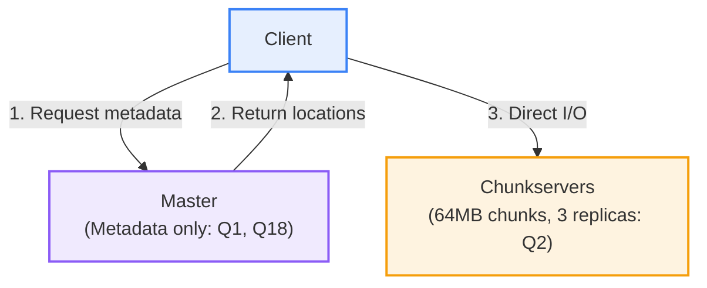
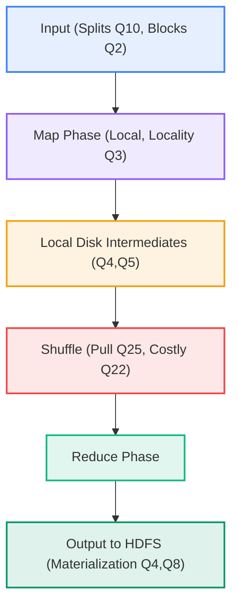
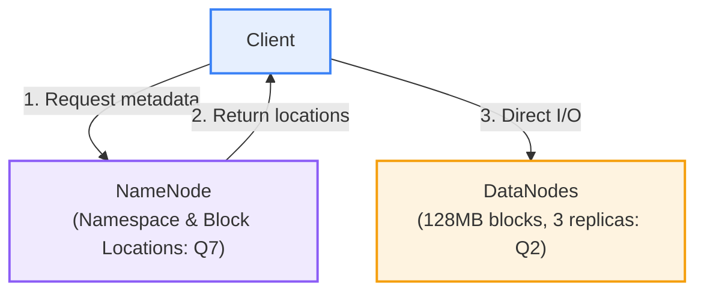
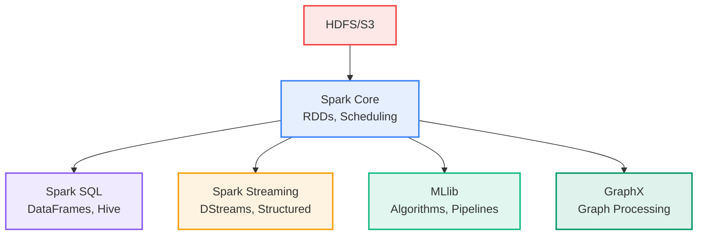
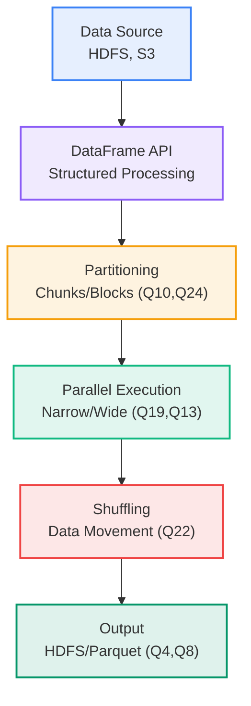
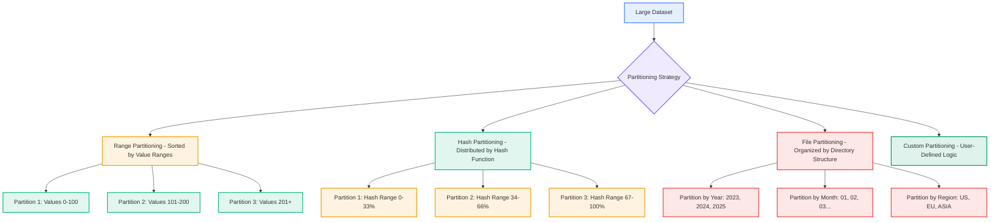
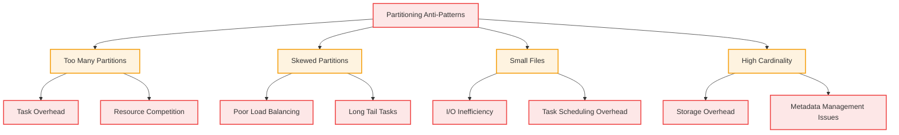
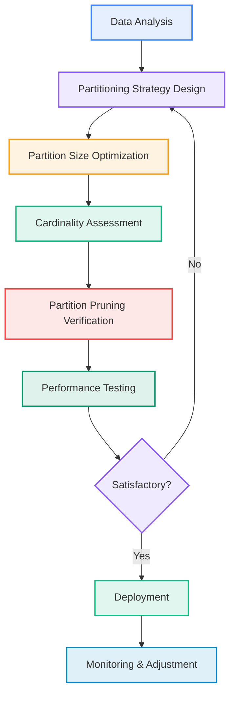
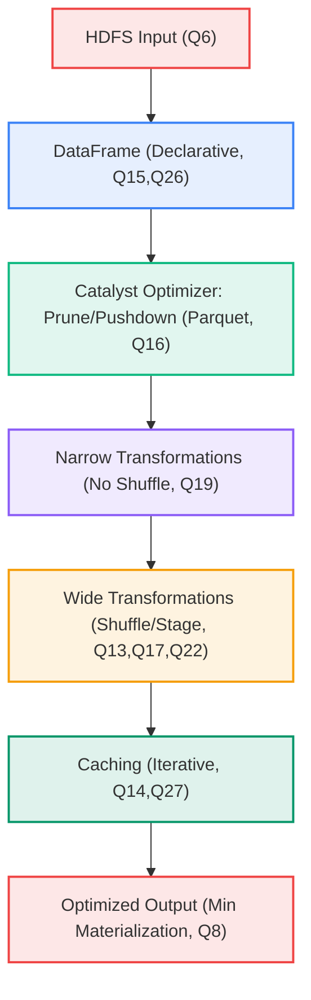
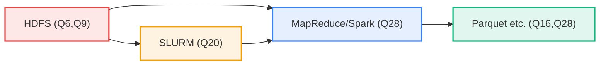

# Data Computation Course Summary - Apache Spark

This guide provides an in-depth exploration of Apache Spark and foundational distributed systems like GFS, MapReduce, and HDFS, tailored for data computation. It fully incorporates the quiz content from the "5 MapReduce & Apache Spark" module, including all 28 questions, answers, and explanations (e.g., GFS/HDFS chunks/replicas/metadata, input splits/locality, MapReduce phases/materialization/shuffles, RDD lineage/caching/narrow-wide transformations, DataFrames optimization/pruning, stage boundaries/DAG, SLURM directives, and more). The flow is logical: foundations (GFS → MapReduce → HDFS) → Spark → commands → optimization → applications → summary, with detailed explanations, examples, and transitions for clarity.

**Key Quiz Coverage**:

- Q1: GFS Master serves file data to clients (False; metadata only, off data path).
- Q2: GFS files split into fixed-size chunks (~64MB), 3 replicates across chunkservers (True).
- Q3: Data locality in MapReduce enabled by filesystem's mapping of blocks/chunks to replicas (True).
- Q4: Materialization points in MapReduce: input read from HDFS, mapper intermediates on local disk, final reducer output to HDFS (Partial; excludes RDD caching).
- Q5: MapReduce intermediates stored in HDFS before reducers fetch (False; local disk, reducers pull).
- Q6: HDFS is write-once, read-many (True).
- Q7: HDFS NameNode stores block/replica metadata and namespace (True; not file contents).
- Q8: Multi-stage MapReduce is disk-bound due to HDFS materialization (True).
- Q9: GFS/HDFS cost-effective via software replication, commodity hardware, sequential I/O (True).
- Q10: MapReduce input split is logical slice for map task, often aligned to block (True).
- Q11: Spark RDDs are immutable, partitioned, fault-tolerant via lineage (True).
- Q12: Spark guarantees no shuffles in DataFrames (False; shuffles possible).
- Q13: Wide transformations in Spark: groupBy, join, reduceByKey (True).
- Q14: Spark RDD caching advantage for iterative ML: in-memory reuse across steps (True).
- Q15: DataFrames declarative, enabling pruning/reordering to reduce shuffles (True).
- Q16: Columnar formats like Parquet enable column pruning/predicate pushdown (True).
- Q17: Spark stage boundaries at wide transformations/shuffles and new sources (True).
- Q18: GFS/HDFS metadata server on data path, streaming bytes (False; off-path).
- Q19: Narrow transformations don't require shuffling across partitions (True).
- Q20: SLURM #SBATCH --nodes specifies nodes to allocate (True).
- Q21: HDFS provides random in-place updates by default (False; append-only).
- Q22: GFS cost model: materialization (disk I/O) and data movement (shuffles) most costly (True).
- Q23: Spark transformations form DAG across stages, minimizing wide boundaries (True).
- Q24: Input splits logical for map tasks; aligning to blocks maximizes locality (True).
- Q25: MapReduce reducers pull mapper outputs during shuffle (True).
- Q26: DataFrames outperform RDDs by exposing relational intent for better plans (True).
- Q27: Spark RDD caching most helpful for iterative algorithms with data reuse (True).
- Q28: MapReduce/RDD/DataFrame are compute abstractions over storage; formats like Parquet influence costs; HDFS/object stores for long-term storage (All true).

**Usage**: Follow sections sequentially; execute code; use Mermaid for visuals.

---

## Table of Contents

1. [Introduction](#introduction)
2. [Google File System (GFS)](#gfs)
3. [MapReduce](#mapreduce)
4. [Hadoop Distributed File System (HDFS)](#hdfs)
5. [Apache Spark](#spark)
6. [Common Commands](#common-commands)
7. [Optimization, Parameters, and Best Practices](#optimization)
8. [Applications, Benefits, and Real-World Use Cases](#applications)
9. [Key Takeaways](#key-takeaways)

---

## <a name="introduction"></a>1. Introduction

Apache Spark builds on foundational distributed systems like GFS, MapReduce, and HDFS to enable scalable analytics and computation. This section introduces these concepts, contrasting traditional approaches, and highlights their role in data computation.

### What is Distributed Data Processing?

Distributed systems handle large-scale data across clusters. GFS provides scalable storage, MapReduce enables parallel processing, HDFS implements GFS principles, and Spark unifies them for in-memory analytics (Q28). Spark's speed (up to 100x faster than disk-bound MapReduce; Q8) stems from these foundations.

### Core Value in Data Computation

These systems address big data challenges: scalability (Q9: commodity hardware), fault tolerance (Q2: replication), and efficiency (Q22: minimize materialization/shuffles). Spark integrates them for ETL, ML, and streaming.

#### Basic Example: Word Count in MapReduce (Q4, Q5)

```python
# Mapper: Process split locally
def map(key, value):
    for word in value.split():
        yield word, 1  # Emit to local disk (Q5)

# Reducer: Pull from mappers (Q25)
def reduce(key, values):
    return sum(values)  # Aggregate, output to HDFS (Q4)
```

Intermediates on local disk, reducers pull (Q5).

With foundations established, next explore GFS.

---

## <a name="gfs"></a>2. Google File System (GFS)

GFS is a scalable distributed filesystem designed for large files with append-only operations, serving as inspiration for HDFS. It handles petabyte-scale data on commodity hardware (Q9).

### Core Concepts

- **Architecture**: Single Master manages metadata; multiple chunkservers store data in 64MB chunks with 3 replicas (Q2). Clients interact with Master for locations, then directly with chunkservers (off-path design).
- **Key Features**: Fault-tolerant replication, sequential I/O optimization, large files (multi-GB), append-only writes (no random updates; ties to Q21). Files split into fixed-size chunks (~64MB) replicated across chunkservers (Q2: True).
- **Cost Model**: Focuses on sequential I/O; materialization (disk) and data movement (network) are costly (Q22). Cost-effective via software replication on commodity hardware (Q9: True).
- **Data Locality**: Chunk placement on nearby chunkservers for efficient access (Q3 precursor).

#### GFS Architecture Diagram

This diagram illustrates GFS's architecture, showing how clients query the Master for metadata and then access chunkservers directly for data, emphasizing the off-path design for scalability and tying to quiz questions on metadata handling and replication.



**Characteristics**:

- **File Size**: Optimized for large files (multi-GB); small files inefficient due to chunk overhead.
- **Block Size**: 64MB chunks (fixed-size for sequential access).
- **Replication**: 3 replicas default; software-managed for fault tolerance (Q9).
- **Access Pattern**: Append-only writes; high-throughput reads (sequential I/O favored, Q22).
- **Scalability**: Single Master for metadata (lightweight); multiple chunkservers for data.

GFS enables efficient large-scale storage; next, MapReduce for processing.

---

## <a name="mapreduce"></a>3. MapReduce

MapReduce is a programming model for processing large datasets in parallel across clusters, popularized by Google and implemented in Hadoop. It processes data in key-value pairs via map (parallel input) and reduce (aggregation) phases.

### Core Concepts (Q3-Q5, Q8, Q10, Q22, Q25)

- **Input Splits**: Logical divisions of input data for map tasks (Q10: logical slice, aligned to blocks for locality Q3, Q24). Splits map to filesystem blocks/chunks (Q2).
- **Map Phase**: Processes splits locally, emitting intermediates to local disk (Q4, Q5: not HDFS; reducers pull Q25). Enables data locality by running maps near data (Q3: True).
- **Shuffle**: Reducers pull intermediates over network (Q25); costly data movement (Q22).
- **Reduce Phase**: Aggregates, writes final output to storage (Q4: HDFS materialization).
- **Multi-Stage**: Chains jobs; disk-bound due to HDFS writes between stages (Q8: True).

**Characteristics**:

- **File Size**: Handles large inputs via splits (logical, ~128MB blocks); outputs partitioned for next stage.
- **Data Flow**: Key-value pairs; map emits to local disk (temporary, small files per mapper), shuffle sorts/merges, reduce writes sequentially.
- **Parallelism**: Maps run in parallel (one per split); reduces aggregate (fan-in).
- **Fault Tolerance**: Restart failed tasks; idempotent reduces.
- **Performance**: Disk-bound (Q8); shuffles expensive (Q22: network I/O).

#### MapReduce Workflow Diagram

This flowchart depicts the MapReduce workflow, from input splits to final output, highlighting key phases like map (local processing for locality Q3), shuffle (data pull Q25), and reduce (aggregation with HDFS materialization Q4,Q8), showing how data flows through the pipeline with emphasis on disk-bound nature (Q8).



**Word Count Example** (Q4, Q5, Q25):

```java
// Mapper: Process split locally (Q3 locality)
public class WordCountMapper extends Mapper<LongWritable, Text, Text, IntWritable> {
    public void map(LongWritable key, Text value, Context context) {
        for (String word : value.toString().split("\\s+")) {
            context.write(new Text(word), new IntWritable(1));  // Local disk (Q5)
        }
    }
}

// Reducer: Pull from mappers (Q25)
public class WordCountReducer extends Reducer<Text, IntWritable, Text, IntWritable> {
    public void reduce(Text key, Iterable<IntWritable> values, Context context) {
        int sum = 0;
        for (IntWritable val : values) sum += val.get();
        context.write(key, new IntWritable(sum));  // HDFS output (Q4)
    }
}
```

Stages materialize to disk (Q8); locality via block mapping (Q3).

MapReduce scales processing; next, HDFS for storage.

---

## <a name="hdfs"></a>4. Hadoop Distributed File System (HDFS)

HDFS implements GFS principles for reliable, scalable storage on commodity hardware (Q9). It supports large files with block-based distribution.

### Core Concepts (Q6, Q7, Q9, Q21)

- **Blocks and Replication**: Files split into 128MB blocks with 3 replicas (Q2, Q9: software replication). Write-once, read-many (Q6: append-only, no random updates Q21).
- **NameNode Role**: Manages metadata (namespace, block locations; Q7: stores metadata only). Off data path: Clients query for locations, then access DataNodes directly (Q1, Q18).
- **DataNodes**: Store actual blocks; handle reads/writes.
- **Fault Tolerance**: Automatic replication on failures (Q9).

#### HDFS Architecture Diagram

This diagram shows HDFS's architecture, illustrating the NameNode's role in metadata management and the direct client-to-DataNode data flow, highlighting the off-path design for efficient, scalable access and tying to quiz questions on metadata and data handling.



**Characteristics**:

- **File Size**: Optimized for large files (>GB); small files inefficient (one block overhead).
- **Block Size**: 128MB default (configurable; balances I/O and replication).
- **Replication**: 3 replicas (default; software-managed for fault tolerance Q9).
- **Access Pattern**: Append-only (Q6, Q21: no random writes); high-throughput sequential reads.
- **Scalability**: NameNode single (metadata); DataNodes distributed (data).

HDFS enables reliable storage; next, Spark for unified processing.

---

## <a name="spark"></a>5. Apache Spark

Spark builds on MapReduce/HDFS for in-memory, unified analytics (Q28). It supports batch, streaming, ML, and graphs via RDDs/DataFrames.

### Core Concepts and Evolution (Q11, Q23)

- **RDDs**: Immutable, partitioned, fault-tolerant via lineage (Q11). Lazy evaluation builds DAG (Q23: minimizes wide boundaries).
- **DataFrames**: Structured layer over RDDs; declarative for optimization (Q15, Q26).
- **DAG Execution**: Optimizes stages (Q17: boundaries at shuffles/new sources).

Evolution: RDDs to DataFrames (Spark 2.0+) for better performance (Q12: shuffles possible).

### Key Components

- **Spark Core**: RDDs, scheduling, in-memory storage (Q11).
- **Spark SQL**: DataFrames/SQL with Catalyst (Q15: pruning/reordering).
- **Streaming**: Real-time processing.
- **MLlib**: ML pipelines (Q14, Q27: caching for iterative).
- **GraphX**: Graph algorithms.

#### Spark Components Diagram

This flowchart visualizes Spark's key components, showing how Spark Core serves as the foundation for higher-level libraries like SQL and MLlib, with HDFS/S3 as storage backends, illustrating the unified ecosystem for data processing and tying to quiz concepts on abstractions (Q28).



### Data Abstractions: RDDs and DataFrames (Q11-Q16, Q19, Q26)

- **RDDs**: Immutable/partitioned; narrow (no shuffle, Q19) vs. wide transformations (Q13: groupBy/join/reduceByKey). Caching for reuse (Q14, Q27).
- **DataFrames**: Declarative (Q15, Q26: relational intent for plans); pruning in columnar formats (Q16).

Example (Q13, Q19):

```scala
val rdd = sc.textFile("input")  # New source (stage boundary, Q17)
val words = rdd.flatMap(_.split(" "))  # Narrow (no shuffle, Q19)
val pairs = words.map((_, 1))          # Narrow
val counts = pairs.reduceByKey(_ + _)  # Wide (shuffle, Q13)
counts.cache()                         # For iteration (Q14, Q27)
```

DataFrames outperform via optimization (Q26).

| Abstraction | Pros | Cons | Characteristics | File Size/Block Details |
|-------------|------|------|-----------------|------------------------|
| RDDs | Flexibility, lineage (Q11), caching (Q14) | Manual, shuffles (Q13, Q19) | Immutable, partitioned (default 128MB blocks), fault-tolerant via lineage | 128MB partitions; in-memory caching (MEMORY_AND_DISK levels) |
| DataFrames | Opt. (Q15, Q26), pruning (Q16) | Shuffles possible (Q12) | Structured, schema-based; columnar support (e.g., Parquet 128MB-1GB row groups) | 128MB default; adaptive coalescing (100MB-1GB target) |

### Workflow and I/O (Q4, Q8, Q17, Q22-Q24)

Pipeline: Load (splits/blocks Q10, Q24) → Transform (narrow/wide Q19, Q13) → Cache (Q14) → Action (DAG Q23). Shuffles/stages at wide/new sources (Q17); materialization costly (Q8, Q22).

#### Spark I/O Pipeline Diagram

This flowchart illustrates Spark's I/O and workflow, from data sources to output, showing partitioning, transformations, shuffling, and caching, with ties to key quiz concepts like stage boundaries (Q17) and materialization costs (Q8).



Partitioning: Input (logical splits Q10, aligned for locality Q3, Q24), shuffle (Q13), output (by columns for pruning Q16).

#### Types of Partitioning Visualization

This diagram visualizes different partitioning strategies in Spark, showing how data is divided into partitions using range, hash, file, or custom methods, with examples of partition examples to illustrate how large datasets are split for parallel processing.



#### Partitioning Anti-Patterns Visualization

This diagram highlights common partitioning pitfalls in Spark, such as too many partitions leading to overhead or skewed data causing imbalance, helping identify issues that degrade performance and how to avoid them for optimal data distribution.



#### Partitioning Optimization Pipeline Diagram

This flowchart outlines the step-by-step process for optimizing partitioning in Spark, from initial analysis to deployment, emphasizing verification of pruning and performance testing to ensure efficient data handling.



#### Optimization Diagram

This diagram represents the overall optimization process in Spark, from input to output, incorporating Catalyst for pruning and caching for iterative workloads, demonstrating how these features reduce costs and improve efficiency in data processing pipelines.



#### Ecosystem Diagram

This graph depicts the integrated ecosystem, showing how HDFS provides storage, MapReduce/Spark handles computation, Parquet optimizes formats, and SLURM enables HPC scaling, illustrating the full stack for big data processing with ties to quiz concepts on storage and compute abstractions (Q28).



---

## <a name="common-commands"></a>6. Common Commands

Essential tools for running and managing (Q20: SLURM for HPC).

### Hadoop/MapReduce Commands

- **hdfs dfs**: HDFS ops (Q2, Q7).
  - Explanation: Manages files (ls, put, get); NameNode coordinates (Q7).
  - Example: `hdfs dfs -put localfile /path` (write-once, Q6); `hdfs fsck -blocks /file` (replicas, Q2).

- **hadoop jar**: Submit MapReduce jobs.
  - Example: `hadoop jar wordcount.jar /input /output` (Q3-Q5).

### Spark Commands

- **spark-submit**: Run Spark apps.
  - Flags: `--master yarn` (cluster), `--executor-memory 4g`.
  - Example: `spark-submit --master local[*] wordcount.py` (DAG, Q23).

- **pyspark**: Interactive shell.
  - Example: `pyspark --master local[2]` (Q11-Q15).

### SLURM (Q20)

- **sbatch**: Submit batch jobs.
  - Example: Script with `#SBATCH --nodes=4` (nodes, Q20); `sbatch spark_job.sh`.

**Table: Key Commands** (Quiz Ties):

| Command | Description | Example | Characteristics |
|---------|-------------|---------|----------|
| hdfs dfs -ls | List HDFS files (metadata Q7) | hdfs dfs -ls / | Fast metadata ops; off-path (Q1,Q18); handles large dirs (millions files) |
| hadoop jar | Run MapReduce (splits/shuffle Q3,Q10,Q25) | hadoop jar app.jar | Processes large inputs (TB+); disk-bound (Q8); parallel maps/reduces |
| spark-submit | Submit Spark (DAG/shuffles Q13,Q23) | spark-submit app.py | In-memory (faster Q8); supports 128MB partitions; scalable to 1000s nodes |
| sbatch | SLURM job (#SBATCH --nodes Q20) | sbatch --nodes=2 script.sh | HPC scaling; allocates 1-1000s nodes; integrates with YARN for Spark |

**Data Tip**: Use `hdfs fsck` for replicas (Q2); spark-submit with caching (Q14).

Commands execute workflows; next, optimization.

---

## <a name="optimization"></a>7. Optimization, Parameters, and Best Practices (Quiz Q8, Q13, Q15-Q16, Q19, Q22, Q26)

Optimizations reduce materialization/shuffles (Q8, Q22); formats enable pruning (Q16).

### Spark Optimizations (Quiz Q15, Q23, Q26)

- **DAG & Lazy Evaluation**: Builds plan, minimizes stages/shuffles (Q23); wide at shuffles (Q13, Q17, Q19).
- **Caching**: MEMORY_AND_DISK for iteration (Q14, Q27).
- **DataFrames/Catalyst**: Declarative (Q15, Q26); predicate pushdown/column pruning.

**Tuning Example** (Quiz Q13, Q19):

```python
df = spark.read.parquet("data.parquet")  # Pruning (Q16)
df.filter(df.col > 10).groupBy("key").agg(...)  # Reorder (Q15,Q26); wide (Q13)
df.cache()  # Multi-pass (Q27)
```

Parquet (Q16, Q28): Columnar format for Spark; 50-90% compression, predicate pushdown for fast filtering, outperforms CSV/JSON in analytics.


Parquet is a columnar storage format optimized for Spark and big data frameworks. It stores data column-by-column for efficient reads, with built-in compression (50-90% smaller), encoding (dictionary/run-length), schema evolution (add columns without rewrite), predicate pushdown (filter at file level, Q16), and type support (nested/complex).

#### Key Features of Parquet

- **Columnar Storage**: Reads specific columns without full rows, ideal for analytics (Q16: enables pruning). Row groups: 128MB-1GB; pages: 1MB.
- **Compression**: Reduces I/O/storage (Q28: influences costs); codecs: Snappy (fast, low CPU), GZIP (high ratio, more CPU).
- **Encoding**: Dictionary/run-length for repeated values; efficient for analytics datasets with duplicates.
- **Schema Evolution**: Add columns without full rewrite; supports nested/complex types (e.g., structs, arrays, maps).
- **Predicate Pushdown**: Filters applied at file level using metadata (Q16); skips irrelevant data for faster queries.
- **Type Support**: Rich types (primitive, nested); metadata footer includes schema and min/max stats for pruning.

#### Parquet vs. Other Formats (Q28)

This table compares Parquet with CSV and JSON, highlighting why Parquet is preferred for big data analytics in Spark, focusing on storage, performance, and optimization features.

| Feature | CSV | JSON | Parquet |
|---------|-----|------|---------|
| **Storage Size** | Large (text, no compression; variable line sizes) | Large (text, optional compression; variable doc sizes) | Compressed (50-90% smaller; Snappy/GZIP codecs for columns) |
| **Read Performance** | Slow (row-wise scan of entire file; no selective access) | Slow (parse entire file; JSON parsing overhead) | Fast (columnar; selective column reads without full scan) |
| **Schema** | None (inferred on read; no enforcement) | Flexible but no strict enforcement (JSON schema optional) | Strong, evolvable (metadata footer with types/min-max stats) |
| **Data Types** | Basic (strings/nums; no native nested support) | Basic/nested (JSON objects/arrays; flexible but verbose) | Rich (nested/complex: structs, arrays, maps; efficient encoding) |
| **Compression** | None (plain text) | None or inline (e.g., gzip on whole file) | Built-in (column-optimized; efficient for sparse/repeated data) |
| **Query Optimization** | Minimal (no pruning; full file scan) | Minimal (full parse; no native pushdown) | Advanced (predicate pushdown Q16; stats-based filtering) |
| **File Size** | Variable (text lines; grows with data volume) | Variable (JSON docs; overhead for nesting) | 128MB-1GB row groups; 1MB pages (optimized for large files) |

CSV/JSON: Row-wise formats requiring full scans; inefficient for big data. Parquet: Columnar, enabling pruning (Q16) and cost savings (Q28).

#### Parquet File Structure

Parquet files are self-describing with a hierarchical structure optimized for columnar storage and efficient querying in distributed systems like Spark.

- **File Header**: Magic number ("PAR1") for identification.
- **Row Groups**: Logical divisions of rows (default 128MB-1GB); each contains column chunks for a subset of data, allowing parallel processing.
- **Column Chunks**: Per-column data within row groups; store values, definition levels for nesting, and values sorted for compression.
- **Pages**: Smallest unit (1MB); include data pages (values) and dictionary pages (for encoding); support min/max stats for pruning.
- **Metadata/Footer**: Schema, row group metadata (stats for pushdown Q16), and file-level info; enables schema evolution without rewrites.

**Characteristics**:

- **File Size**: Optimized for large files (128MB-1GB row groups); small files less efficient due to overhead.
- **Block Size**: Pages 1MB (encoded/compressed); row groups 128MB-1GB for parallelism and I/O efficiency.
- **Replication**: Integrates with HDFS (3 replicas Q2); columnar design reduces storage needs.
- **Access Pattern**: Columnar reads (fast for analytics); append-friendly for streaming writes.
- **Scalability**: Small metadata (footer ~KB); supports petabyte-scale datasets with efficient pruning (Q16).

Example: For analytics, Parquet's structure allows Spark to read only required columns from specific row groups, reducing I/O dramatically (Q16).

#### When to Use Parquet

- **Large Datasets**: Efficient storage and querying with 50-90% compression, ideal for terabyte-scale data lakes.
- **Analytical Workloads**: Complex aggregations/joins with filters; columnar format enables predicate pushdown (Q16) for 10-100x faster queries.
- **Spark Processing**: Native integration with DataFrames; leverages Catalyst for optimization (Q15, Q26).
- **Schema Evolution**: Evolving data schemas without full rewrites, supporting iterative ML pipelines (Q14, Q27).
- **Cost-Sensitive Environments**: Lower I/O and compute costs (Q28); use Snappy for speed (low CPU overhead) or GZIP for maximum compression (higher CPU but smaller files).

Performance: 10-100x faster queries vs. row-based formats due to selective reads and compression; choose codecs based on workload (Snappy for latency-sensitive, GZIP for storage-bound).

**Conversion Example** (Q16):

```python
from pyspark.sql import SparkSession

spark = SparkSession.builder.appName("ETL").getOrCreate()
df = spark.read.csv("input.csv", header=True)
df_filtered = df.filter(df.age > 18).select("name", "age")  # Pushdown (Q15)
df_filtered.write.mode("overwrite").partitionBy("year").parquet("output.parquet")  # Columnar output with pruning enabled (Q16)
spark.stop()
```

#### Optimization Diagram

This diagram represents the overall optimization process in Spark, from input to output, incorporating Catalyst for pruning and caching for iterative workloads, demonstrating how these features reduce costs and improve efficiency in data processing pipelines.


#### Ecosystem Diagram

This graph depicts the integrated ecosystem, showing how HDFS provides storage, MapReduce/Spark handles computation, Parquet optimizes formats, and SLURM enables HPC scaling, illustrating the full stack for big data processing with ties to quiz concepts on storage and compute abstractions (Q28).


---

## <a name="common-commands"></a>6. Common Commands

Essential tools for running and managing (Q20: SLURM for HPC).

### Hadoop/MapReduce Commands

- **hdfs dfs**: HDFS ops (Q2, Q7).
  - Explanation: Manages files (ls, put, get); NameNode coordinates (Q7).
  - Example: `hdfs dfs -put localfile /path` (write-once, Q6); `hdfs fsck -blocks /file` (replicas, Q2).

- **hadoop jar**: Submit MapReduce jobs.
  - Example: `hadoop jar wordcount.jar /input /output` (Q3-Q5).

### Spark Commands

- **spark-submit**: Run Spark apps.
  - Flags: `--master yarn` (cluster), `--executor-memory 4g`.
  - Example: `spark-submit --master local[*] wordcount.py` (DAG, Q23).

- **pyspark**: Interactive shell.
  - Example: `pyspark --master local[2]` (Q11-Q15).

### SLURM (Q20)

- **sbatch**: Submit batch jobs.
  - Example: Script with `#SBATCH --nodes=4` (nodes, Q20); `sbatch spark_job.sh`.

**Table: Key Commands** (Quiz Ties):

| Command | Description | Example | Characteristics |
|---------|-------------|---------|----------|
| hdfs dfs -ls | List HDFS files (metadata Q7) | hdfs dfs -ls / | Fast metadata ops; off-path (Q1,Q18); handles large dirs (millions files) |
| hadoop jar | Run MapReduce (splits/shuffle Q3,Q10,Q25) | hadoop jar app.jar | Processes large inputs (TB+); disk-bound (Q8); parallel maps/reduces |
| spark-submit | Submit Spark (DAG/shuffles Q13,Q23) | spark-submit app.py | In-memory (faster Q8); supports 128MB partitions; scalable to 1000s nodes |
| sbatch | SLURM job (#SBATCH --nodes Q20) | sbatch --nodes=2 script.sh | HPC scaling; allocates 1-1000s nodes; integrates with YARN for Spark |

**Data Tip**: Use `hdfs fsck` for replicas (Q2); spark-submit with caching (Q14).

Commands execute workflows; next, optimization.

---

## <a name="optimization"></a>7. Optimization, Parameters, and Best Practices (Quiz Q8, Q13, Q15-Q16, Q19, Q22, Q26)

Optimizations reduce materialization/shuffles (Q8, Q22); formats enable pruning (Q16).

### Spark Optimizations (Quiz Q15, Q23, Q26)

- **DAG & Lazy Evaluation**: Builds plan, minimizes stages/shuffles (Q23); wide at shuffles (Q13, Q17, Q19).
- **Caching**: MEMORY_AND_DISK for iteration (Q14, Q27).
- **DataFrames/Catalyst**: Declarative (Q15, Q26); predicate pushdown/column pruning.

**Tuning Example** (Quiz Q13, Q19):

```python
df = spark.read.parquet("data.parquet")  # Pruning (Q16)
df.filter(df.col > 10).groupBy("key").agg(...)  # Reorder (Q15,Q26); wide (Q13)
df.cache()  # Multi-pass (Q27)
```

Parquet (Q16, Q28): Columnar format for Spark; 50-90% compression, predicate pushdown for fast filtering, outperforms CSV/JSON in analytics.


Parquet is a columnar storage format optimized for Spark and big data frameworks. It stores data column-by-column for efficient reads, with built-in compression (50-90% smaller), encoding (dictionary/run-length), schema evolution (add columns without rewrite), predicate pushdown (filter at file level, Q16), and type support (nested/complex).

#### Key Features of Parquet

- **Columnar Storage**: Reads specific columns without full rows, ideal for analytics (Q16: enables pruning). Row groups: 128MB-1GB; pages: 1MB.
- **Compression**: Reduces I/O/storage (Q28: influences costs); codecs: Snappy (fast, low CPU), GZIP (high ratio, more CPU).
- **Encoding**: Dictionary/run-length for repeated values; efficient for analytics datasets with duplicates.
- **Schema Evolution**: Add columns without full rewrite; supports nested/complex types (e.g., structs, arrays, maps).
- **Predicate Pushdown**: Filters applied at file level using metadata (Q16); skips irrelevant data for faster queries.
- **Type Support**: Rich types (primitive, nested); metadata footer includes schema and min/max stats for pruning.

#### Parquet vs. Other Formats (Q28)

This table compares Parquet with CSV and JSON, highlighting why Parquet is preferred for big data analytics in Spark, focusing on storage, performance, and optimization features.

| Feature | CSV | JSON | Parquet |
|---------|-----|------|---------|
| **Storage Size** | Large (text, no compression; variable line sizes) | Large (text, optional compression; variable doc sizes) | Compressed (50-90% smaller; Snappy/GZIP codecs for columns) |
| **Read Performance** | Slow (row-wise scan of entire file; no selective access) | Slow (parse entire file; JSON parsing overhead) | Fast (columnar; selective column reads without full scan) |
| **Schema** | None (inferred on read; no enforcement) | Flexible but no strict enforcement (JSON schema optional) | Strong, evolvable (metadata footer with types/min-max stats) |
| **Data Types** | Basic (strings/nums; no native nested support) | Basic/nested (JSON objects/arrays; flexible but verbose) | Rich (nested/complex: structs, arrays, maps; efficient encoding) |
| **Compression** | None (plain text) | None or inline (e.g., gzip on whole file) | Built-in (column-optimized; efficient for sparse/repeated data) |
| **Query Optimization** | Minimal (no pruning; full file scan) | Minimal (full parse; no native pushdown) | Advanced (predicate pushdown Q16; stats-based filtering) |
| **File Size** | Variable (text lines; grows with data volume) | Variable (JSON docs; overhead for nesting) | 128MB-1GB row groups; 1MB pages (optimized for large files) |

CSV/JSON: Row-wise formats requiring full scans; inefficient for big data. Parquet: Columnar, enabling pruning (Q16) and cost savings (Q28).

#### Parquet File Structure

Parquet files are self-describing with a hierarchical structure optimized for columnar storage and efficient querying in distributed systems like Spark.

- **File Header**: Magic number ("PAR1") for identification.
- **Row Groups**: Logical divisions of rows (default 128MB-1GB); each contains column chunks for a subset of data, allowing parallel processing.
- **Column Chunks**: Per-column data within row groups; store values, definition levels for nesting, and values sorted for compression.
- **Pages**: Smallest unit (1MB); include data pages (values) and dictionary pages (for encoding); support min/max stats for pruning.
- **Metadata/Footer**: Schema, row group metadata (stats for pushdown Q16), and file-level info; enables schema evolution without rewrites.

**Characteristics**:

- **File Size**: Optimized for large files (128MB-1GB row groups); small files less efficient due to overhead.
- **Block Size**: Pages 1MB (encoded/compressed); row groups 128MB-1GB for parallelism and I/O efficiency.
- **Replication**: Integrates with HDFS (3 replicas Q2); columnar design reduces storage needs.
- **Access Pattern**: Columnar reads (fast for analytics); append-friendly for streaming writes.
- **Scalability**: Small metadata (footer ~KB); supports petabyte-scale datasets with efficient pruning (Q16).

Example: For analytics, Parquet's structure allows Spark to read only required columns from specific row groups, reducing I/O dramatically (Q16).

#### When to Use Parquet

- **Large Datasets**: Efficient storage and querying with 50-90% compression, ideal for terabyte-scale data lakes.
- **Analytical Workloads**: Complex aggregations/joins with filters; columnar format enables predicate pushdown (Q16) for 10-100x faster queries.
- **Spark Processing**: Native integration with DataFrames; leverages Catalyst for optimization (Q15, Q26).
- **Schema Evolution**: Evolving data schemas without full rewrites, supporting iterative ML pipelines (Q14, Q27).
- **Cost-Sensitive Environments**: Lower I/O and compute costs (Q28); use Snappy for speed (low CPU overhead) or GZIP for maximum compression (higher CPU but smaller files).

Performance: 10-100x faster queries vs. row-based formats due to selective reads and compression; choose codecs based on workload (Snappy for latency-sensitive, GZIP for storage-bound).

**Conversion Example** (Q16):

```python
from pyspark.sql import SparkSession

spark = SparkSession.builder.appName("ETL").getOrCreate()
df = spark.read.csv("input.csv", header=True)
df_filtered = df.filter(df.age > 18).select("name", "age")  # Pushdown (Q15)
df_filtered.write.mode("overwrite").partitionBy("year").parquet("output.parquet")  # Columnar output with pruning enabled (Q16)
spark.stop()
```

#### Optimization Diagram

This diagram represents the overall optimization process in Spark, from input to output, incorporating Catalyst for pruning and caching for iterative workloads, demonstrating how these features reduce costs and improve efficiency in data processing pipelines.


#### Ecosystem Diagram

This graph depicts the integrated ecosystem, showing how HDFS provides storage, MapReduce/Spark handles computation, Parquet optimizes formats, and SLURM enables HPC scaling, illustrating the full stack for big data processing with ties to quiz concepts on storage and compute abstractions (Q28).


---

## <a name="common-commands"></a>6. Common Commands

Essential tools for running and managing (Q20: SLURM for HPC).

### Hadoop/MapReduce Commands

- **hdfs dfs**: HDFS ops (Q2, Q7).
  - Explanation: Manages files (ls, put, get); NameNode coordinates (Q7).
  - Example: `hdfs dfs -put localfile /path` (write-once, Q6); `hdfs fsck -blocks /file` (replicas, Q2).

- **hadoop jar**: Submit MapReduce jobs.
  - Example: `hadoop jar wordcount.jar /input /output` (Q3-Q5).

### Spark Commands

- **spark-submit**: Run Spark apps.
  - Flags: `--master yarn` (cluster), `--executor-memory 4g`.
  - Example: `spark-submit --master local[*] wordcount.py` (DAG, Q23).

- **pyspark**: Interactive shell.
  - Example: `pyspark --master local[2]` (Q11-Q15).

### SLURM (Q20)

- **sbatch**: Submit batch jobs.
  - Example: Script with `#SBATCH --nodes=4` (nodes, Q20); `sbatch spark_job.sh`.

**Table: Key Commands** (Quiz Ties):

| Command | Description | Example | Characteristics |
|---------|-------------|---------|----------|
| hdfs dfs -ls | List HDFS files (metadata Q7) | hdfs dfs -ls / | Fast metadata ops; off-path (Q1,Q18); handles large dirs (millions files) |
| hadoop jar | Run MapReduce (splits/shuffle Q3,Q10,Q25) | hadoop jar app.jar | Processes large inputs (TB+); disk-bound (Q8); parallel maps/reduces |
| spark-submit | Submit Spark (DAG/shuffles Q13,Q23) | spark-submit app.py | In-memory (faster Q8); supports 128MB partitions; scalable to 1000s nodes |
| sbatch | SLURM job (#SBATCH --nodes Q20) | sbatch --nodes=2 script.sh | HPC scaling; allocates 1-1000s nodes; integrates with YARN for Spark |

**Data Tip**: Use `hdfs fsck` for replicas (Q2); spark-submit with caching (Q14).

Commands execute workflows; next, optimization.

---

## <a name="optimization"></a>7. Optimization, Parameters, and Best Practices (Quiz Q8, Q13, Q15-Q16, Q19, Q22, Q26)

Optimizations reduce materialization/shuffles (Q8, Q22); formats enable pruning (Q16).

### Spark Optimizations (Quiz Q15, Q23, Q26)

- **DAG & Lazy Evaluation**: Builds plan, minimizes stages/shuffles (Q23); wide at shuffles (Q13, Q17, Q19).
- **Caching**: MEMORY_AND_DISK for iteration (Q14, Q27).
- **DataFrames/Catalyst**: Declarative (Q15, Q26); predicate pushdown/column pruning.

**Tuning Example** (Quiz Q13, Q19):

```python
df = spark.read.parquet("data.parquet")  # Pruning (Q16)
df.filter(df.col > 10).groupBy("key").agg(...)  # Reorder (Q15,Q26); wide (Q13)
df.cache()  # Multi-pass (Q27)
```

Parquet (Q16, Q28): Columnar format for Spark; 50-90% compression, predicate pushdown for fast filtering, outperforms CSV/JSON in analytics.


Parquet is a columnar storage format optimized for Spark and big data frameworks. It stores data column-by-column for efficient reads, with built-in compression (50-90% smaller), encoding (dictionary/run-length), schema evolution (add columns without rewrite), predicate pushdown (filter at file level, Q16), and type support (nested/complex).

#### Key Features of Parquet

- **Columnar Storage**: Reads specific columns without full rows, ideal for analytics (Q16: enables pruning). Row groups: 128MB-1GB; pages: 1MB.
- **Compression**: Reduces I/O/storage (Q28: influences costs); codecs: Snappy (fast, low CPU), GZIP (high ratio, more CPU).
- **Encoding**: Dictionary/run-length for repeated values; efficient for analytics datasets with duplicates.
- **Schema Evolution**: Add columns without full rewrite; supports nested/complex types (e.g., structs, arrays, maps).
- **Predicate Pushdown**: Filters applied at file level using metadata (Q16); skips irrelevant data for faster queries.
- **Type Support**: Rich types (primitive, nested); metadata footer includes schema and min/max stats for pruning.

#### Parquet vs. Other Formats (Q28)

This table compares Parquet with CSV and JSON, highlighting why Parquet is preferred for big data analytics in Spark, focusing on storage, performance, and optimization features.

| Feature | CSV | JSON | Parquet |
|---------|-----|------|---------|
| **Storage Size** | Large (text, no compression; variable line sizes) | Large (text, optional compression; variable doc sizes) | Compressed (50-90% smaller; Snappy/GZIP codecs for columns) |
| **Read Performance** | Slow (row-wise scan of entire file; no selective access) | Slow (parse entire file; JSON parsing overhead) | Fast (columnar; selective column reads without full scan) |
| **Schema** | None (inferred on read; no enforcement) | Flexible but no strict enforcement (JSON schema optional) | Strong, evolvable (metadata footer with types/min-max stats) |
| **Data Types** | Basic (strings/nums; no native nested support) | Basic/nested (JSON objects/arrays; flexible but verbose) | Rich (nested/complex: structs, arrays, maps; efficient encoding) |
| **Compression** | None (plain text) | None or inline (e.g., gzip on whole file) | Built-in (column-optimized; efficient for sparse/repeated data) |
| **Query Optimization** | Minimal (no pruning; full file scan) | Minimal (full parse; no native pushdown) | Advanced (predicate pushdown Q16; stats-based filtering) |
| **File Size** | Variable (text lines; grows with data volume) | Variable (JSON docs; overhead for nesting) | 128MB-1GB row groups; 1MB pages (optimized for large files) |

CSV/JSON: Row-wise formats requiring full scans; inefficient for big data. Parquet: Columnar, enabling pruning (Q16) and cost savings (Q28).

#### Parquet File Structure

Parquet files are self-describing with a hierarchical structure optimized for columnar storage and efficient querying in distributed systems like Spark.

- **File Header**: Magic number ("PAR1") for identification.
- **Row Groups**: Logical divisions of rows (default 128MB-1GB); each contains column chunks for a subset of data, allowing parallel processing.
- **Column Chunks**: Per-column data within row groups; store values, definition levels for nesting, and values sorted for compression.
- **Pages**: Smallest unit (1MB); include data pages (values) and dictionary pages (for encoding); support min/max stats for pruning.
- **Metadata/Footer**: Schema, row group metadata (stats for pushdown Q16), and file-level info; enables schema evolution without rewrites.

**Characteristics**:

- **File Size**: Optimized for large files (128MB-1GB row groups); small files less efficient due to overhead.
- **Block Size**: Pages 1MB (encoded/compressed); row groups 128MB-1GB for parallelism and I/O efficiency.
- **Replication**: Integrates with HDFS (3 replicas Q2); columnar design reduces storage needs.
- **Access Pattern**: Columnar reads (fast for analytics); append-friendly for streaming writes.
- **Scalability**: Small metadata (footer ~KB); supports petabyte-scale datasets with efficient pruning (Q16).

Example: For analytics, Parquet's structure allows Spark to read only required columns from specific row groups, reducing I/O dramatically (Q16).

#### When to Use Parquet

- **Large Datasets**: Efficient storage and querying with 50-90% compression, ideal for terabyte-scale data lakes.
- **Analytical Workloads**: Complex aggregations/joins with filters; columnar format enables predicate pushdown (Q16) for 10-100x faster queries.
- **Spark Processing**: Native integration with DataFrames; leverages Catalyst for optimization (Q15, Q26).
- **Schema Evolution**: Evolving data schemas without full rewrites, supporting iterative ML pipelines (Q14, Q27).
- **Cost-Sensitive Environments**: Lower I/O and compute costs (Q28); use Snappy for speed (low CPU overhead) or GZIP for maximum compression (higher CPU but smaller files).

Performance: 10-100x faster queries vs. row-based formats due to selective reads and compression; choose codecs based on workload (Snappy for latency-sensitive, GZIP for storage-bound).

**Conversion Example** (Q16):

```python
from pyspark.sql import SparkSession

spark = SparkSession.builder.appName("ETL").getOrCreate()
df = spark.read.csv("input.csv", header=True)
df_filtered = df.filter(df.age > 18).select("name", "age")  # Pushdown (Q15)
df_filtered.write.mode("overwrite").partitionBy("year").parquet("output.parquet")  # Columnar output with pruning enabled (Q16)
spark.stop()
```

#### Optimization Diagram

This diagram represents the overall optimization process in Spark, from input to output, incorporating Catalyst for pruning and caching for iterative workloads, demonstrating how these features reduce costs and improve efficiency in data processing pipelines.


#### Ecosystem Diagram

This graph depicts the integrated ecosystem, showing how HDFS provides storage, MapReduce/Spark handles computation, Parquet optimizes formats, and SLURM enables HPC scaling, illustrating the full stack for big data processing with ties to quiz concepts on storage and compute abstractions (Q28).


---

## <a name="common-commands"></a>6. Common Commands

Essential tools for running and managing (Q20: SLURM for HPC).

### Hadoop/MapReduce Commands

- **hdfs dfs**: HDFS ops (Q2, Q7).
  - Explanation: Manages files (ls, put, get); NameNode coordinates (Q7).
  - Example: `hdfs dfs -put localfile /path` (write-once, Q6); `hdfs fsck -blocks /file` (replicas, Q2).

- **hadoop jar**: Submit MapReduce jobs.
  - Example: `hadoop jar wordcount.jar /input /output` (Q3-Q5).

### Spark Commands

- **spark-submit**: Run Spark apps.
  - Flags: `--master yarn` (cluster), `--executor-memory 4g`.
  - Example: `spark-submit --master local[*] wordcount.py` (DAG, Q23).

- **pyspark**: Interactive shell.
  - Example: `pyspark --master local[2]` (Q11-Q15).

### SLURM (Q20)

- **sbatch**: Submit batch jobs.
  - Example: Script with `#SBATCH --nodes=4` (nodes, Q20); `sbatch spark_job.sh`.

**Table: Key Commands** (Quiz Ties):

| Command | Description | Example | Characteristics |
|---------|-------------|---------|----------|
| hdfs dfs -ls | List HDFS files (metadata Q7) | hdfs dfs -ls / | Fast metadata ops; off-path (Q1,Q18); handles large dirs (millions files) |
| hadoop jar | Run MapReduce (splits/shuffle Q3,Q10,Q25) | hadoop jar app.jar | Processes large inputs (TB+); disk-bound (Q8); parallel maps/reduces |
| spark-submit | Submit Spark (DAG/shuffles Q13,Q23) | spark-submit app.py | In-memory (faster Q8); supports 128MB partitions; scalable to 1000s nodes |
| sbatch | SLURM job (#SBATCH --nodes Q20) | sbatch --nodes=2 script.sh | HPC scaling; allocates 1-1000s nodes; integrates with YARN for Spark |

**Data Tip**: Use `hdfs fsck` for replicas (Q2); spark-submit with caching (Q14).

Commands execute workflows; next, optimization.

---

## <a name="optimization"></a>7. Optimization, Parameters, and Best Practices (Quiz Q8, Q13, Q15-Q16, Q19, Q22, Q26)

Optimizations reduce materialization/shuffles (Q8, Q22); formats enable pruning (Q16).

### Spark Optimizations (Quiz Q15, Q23, Q26)

- **DAG & Lazy Evaluation**: Builds plan, minimizes stages/shuffles (Q23); wide at shuffles (Q13, Q17, Q19).
- **Caching**: MEMORY_AND_DISK for iteration (Q14, Q27).
- **DataFrames/Catalyst**: Declarative (Q15, Q26); predicate pushdown/column pruning.

**Tuning Example** (Quiz Q13, Q19):

```python
df = spark.read.parquet("data.parquet")  # Pruning (Q16)
df.filter(df.col > 10).groupBy("key").agg(...)  # Reorder (Q15,Q26); wide (Q13)
df.cache()  # Multi-pass (Q27)
```

Parquet (Q16, Q28): Columnar format for Spark; 50-90% compression, predicate pushdown for fast filtering, outperforms CSV/JSON in analytics.


Parquet is a columnar storage format optimized for Spark and big data frameworks. It stores data column-by-column for efficient reads, with built-in compression (50-90% smaller), encoding (dictionary/run-length), schema evolution (add columns without rewrite), predicate pushdown (filter at file level, Q16), and type support (nested/complex).

#### Key Features of Parquet

- **Columnar Storage**: Reads specific columns without full rows, ideal for analytics (Q16: enables pruning). Row groups: 128MB-1GB; pages: 1MB.
- **Compression**: Reduces I/O/storage (Q28: influences costs); codecs: Snappy (fast, low CPU), GZIP (high ratio, more CPU).
- **Encoding**: Dictionary/run-length for repeated values; efficient for analytics datasets with duplicates.
- **Schema Evolution**: Add columns without full rewrite; supports nested/complex types (e.g., structs, arrays, maps).
- **Predicate Pushdown**: Filters applied at file level using metadata (Q16); skips irrelevant data for faster queries.
- **Type Support**: Rich types (primitive, nested); metadata footer includes schema and min/max stats for pruning.

#### Parquet vs. Other Formats (Q28)

This table compares Parquet with CSV and JSON, highlighting why Parquet is preferred for big data analytics in Spark, focusing on storage, performance, and optimization features.

| Feature | CSV | JSON | Parquet |
|---------|-----|------|---------|
| **Storage Size** | Large (text, no compression; variable line sizes) | Large (text, optional compression; variable doc sizes) | Compressed (50-90% smaller; Snappy/GZIP codecs for columns) |
| **Read Performance** | Slow (row-wise scan of entire file; no selective access) | Slow (parse entire file; JSON parsing overhead) | Fast (columnar; selective column reads without full scan) |
| **Schema** | None (inferred on read; no enforcement) | Flexible but no strict enforcement (JSON schema optional) | Strong, evolvable (metadata footer with types/min-max stats) |
| **Data Types** | Basic (strings/nums; no native nested support) | Basic/nested (JSON objects/arrays; flexible but verbose) | Rich (nested/complex: structs, arrays, maps; efficient encoding) |
| **Compression** | None (plain text) | None or inline (e.g., gzip on whole file) | Built-in (column-optimized; efficient for sparse/repeated data) |
| **Query Optimization** | Minimal (no pruning; full file scan) | Minimal (full parse; no native pushdown) | Advanced (predicate pushdown Q16; stats-based filtering) |
| **File Size** | Variable (text lines; grows with data volume) | Variable (JSON docs; overhead for nesting) | 128MB-1GB row groups; 1MB pages (optimized for large files) |

CSV/JSON: Row-wise formats requiring full scans; inefficient for big data. Parquet: Columnar, enabling pruning (Q16) and cost savings (Q28).

#### Parquet File Structure

Parquet files are self-describing with a hierarchical structure optimized for columnar storage and efficient querying in distributed systems like Spark.

- **File Header**: Magic number ("PAR1") for identification.
- **Row Groups**: Logical divisions of rows (default 128MB-1GB); each contains column chunks for a subset of data, allowing parallel processing.
- **Column Chunks**: Per-column data within row groups; store values, definition levels for nesting, and values sorted for compression.
- **Pages**: Smallest unit (1MB); include data pages (values) and dictionary pages (for encoding); support min/max stats for pruning.
- **Metadata/Footer**: Schema, row group metadata (stats for pushdown Q16), and file-level info; enables schema evolution without rewrites.

**Characteristics**:

- **File Size**: Optimized for large files (128MB-1GB row groups); small files less efficient due to overhead.
- **Block Size**: Pages 1MB (encoded/compressed); row groups 128MB-1GB for parallelism and I/O efficiency.
- **Replication**: Integrates with HDFS (3 replicas Q2); columnar design reduces storage needs.
- **Access Pattern**: Columnar reads (fast for analytics); append-friendly for streaming writes.
- **Scalability**: Small metadata (footer ~KB); supports petabyte-scale datasets with efficient pruning (Q16).

Example: For analytics, Parquet's structure allows Spark to read only required columns from specific row groups, reducing I/O dramatically (Q16).

#### When to Use Parquet

- **Large Datasets**: Efficient storage and querying with 50-90% compression, ideal for terabyte-scale data lakes.
- **Analytical Workloads**: Complex aggregations/joins with filters; columnar format enables predicate pushdown (Q16) for 10-100x faster queries.
- **Spark Processing**: Native integration with DataFrames; leverages Catalyst for optimization (Q15, Q26).
- **Schema Evolution**: Evolving data schemas without full rewrites, supporting iterative ML pipelines (Q14, Q27).
- **Cost-Sensitive Environments**: Lower I/O and compute costs (Q28); use Snappy for speed (low CPU overhead) or GZIP for maximum compression (higher CPU but smaller files).

Performance: 10-100x faster queries vs. row-based formats due to selective reads and compression; choose codecs based on workload (Snappy for latency-sensitive, GZIP for storage-bound).

**Conversion Example** (Q16):

```python
from pyspark.sql import SparkSession

spark = SparkSession.builder.appName("ETL").getOrCreate()
df = spark.read.csv("input.csv", header=True)
df_filtered = df.filter(df.age > 18).select("name", "age")  # Pushdown (Q15)
df_filtered.write.mode("overwrite").partitionBy("year").parquet("output.parquet")  # Columnar output with pruning enabled (Q16)
spark.stop()
```

#### Optimization Diagram

This diagram represents the overall optimization process in Spark, from input to output, incorporating Catalyst for pruning and caching for iterative workloads, demonstrating how these features reduce costs and improve efficiency in data processing pipelines.


#### Ecosystem Diagram

This graph depicts the integrated ecosystem, showing how HDFS provides storage, MapReduce/Spark handles computation, Parquet optimizes formats, and SLURM enables HPC scaling, illustrating the full stack for big data processing with ties to quiz concepts on storage and compute abstractions (Q28).


---

## <a name="applications"></a>8. Applications, Benefits, and Real-World Use Cases (Q28)

### Real-World Use Cases

- **ETL Pipelines**: MapReduce/Spark on HDFS with Parquet (Q28: abstractions/formats influence costs).
- **ML**: Spark caching for training (Q14, Q27).
- **HPC**: SLURM + Spark (Q20).
- **Analytics**: DataFrames for queries with pruning (Q15, Q16).

### Advantages & Limitations (Quiz Q8, Q9, Q12, Q22)

**Advantages**:

- Unified abstractions (Q28); in-memory faster than disk-bound MapReduce (Q8); opt. via DataFrames (Q26).
- Scalable on commodity hardware (Q9).

**Limitations**:

- Shuffles costly (Q22); DataFrames still shuffle (Q12); HDFS no random writes (Q21).

#### Ecosystem Visualization

This graph depicts the integrated ecosystem, showing how HDFS provides storage, MapReduce/Spark handles computation, Parquet optimizes formats, and SLURM enables HPC scaling, illustrating the full stack for big data processing with ties to quiz concepts on storage and compute abstractions (Q28).


---

## <a name="key-takeaways"></a>9. Key Takeaways (Full Quiz Coverage)

### Summary Table

| Topic | Key Concepts | Characteristics | File Size/Block Details |
|-------|--------------|-----------------|------------------------|
| **GFS** | Master metadata off-path (Q1,Q18); chunks/replicas (Q2); sequential I/O (Q9,Q22) | Single Master (lightweight metadata); multiple chunkservers (distributed data); append-only; fault-tolerant replication | 64MB chunks; large files (multi-GB); 3 replicas default |
| **MapReduce** | Splits/locality (Q3,Q10,Q24); local intermediates/pull shuffle (Q4,Q5,Q25); disk-bound (Q8,Q22) | Key-value processing; parallel maps (per split); fan-in reduces; idempotent; disk I/O heavy | Input splits ~128MB (logical); intermediates small/temp files; outputs partitioned (variable size) |
| **HDFS** | Write-once (Q6,Q21); NameNode metadata (Q7); commodity replication (Q9); off-path (Q1,Q18) | Distributed blocks on DataNodes; NameNode coordinates (metadata only); append-only; high-throughput sequential | 128MB blocks; 3 replicas; large files (>GB); metadata small (KB per file) |
| **Spark** | RDDs/lineage (Q11,Q23); narrow/wide (Q13,Q19); caching (Q14,Q27); DataFrames opt. (Q12,Q15,Q16,Q26); stages (Q17); DAG (Q23) | In-memory processing; lazy evaluation; unified (batch/stream/ML); adaptive query execution | 128MB default partitions; adaptive 100MB-1GB; in-memory (up to cluster RAM); Parquet row groups 128MB-1GB |
| **Optimization** | Shuffles/stages (Q13,Q17,Q22); pruning (Q16); partitioning (Q24) | Minimize disk I/O (Q8); columnar formats (Q16); balance parallelism/memory | Partitions 100MB-1GB (default 128MB); shuffles configurable (200 partitions); Parquet pages 1MB |

### Practical Advice

- GFS/HDFS: Use for durable storage (Q6); align blocks for locality (Q24).
- MapReduce: Minimize materialization (Q8); leverage locality (Q3).
- Spark: Cache iterative (Q27); DataFrames for analytics (Q26); Parquet pruning (Q16).
- Tune shuffles (Q22); SLURM scaling (Q20).
- Partition by filters (date/region); use Parquet for columnar efficiency (Q16).
- Balance partitions (100MB-1GB); monitor skew.

### Advanced Topics

- Delta Lake for ACID on HDFS.
- Spark on K8s/SLURM.
- GPU via RAPIDS.
- Formats: Parquet/ORC/Avro (Q28).

### Glossary (Quiz Terms)

- **Input Split**: Logical map unit (Q10).
- **Shuffle**: Data movement in wide (Q13,Q25).
- **Lineage**: RDD fault-tolerance (Q11).
- **Predicate Pushdown**: Filter before scan (Q16).
- **Partitioning**: Dividing data for parallelism (Q24).

Practice with word count (Q4,Q5) or RDD caching (Q14). MapReduce/Spark enable big data—explore Spark docs (spark.apache.org).
