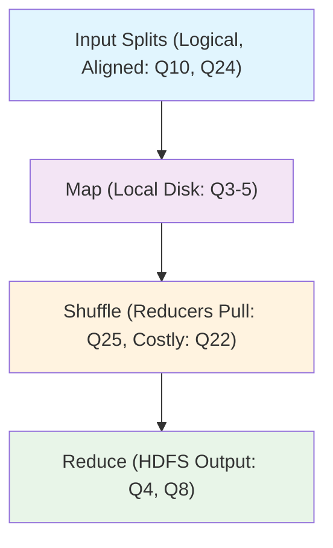
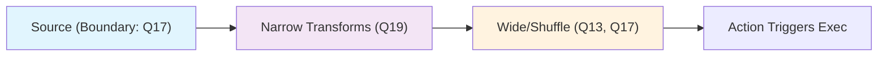
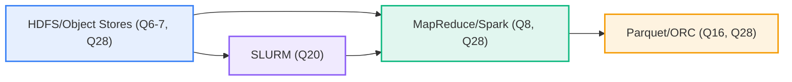

# Data Computation Course Summary: MapReduce and Apache Spark

This comprehensive guide explores MapReduce and Apache Spark, key distributed computing frameworks for big data processing. It fully integrates all 28 quiz questions from the "5 MapReduce & Apache Spark" module, covering GFS/HDFS architecture, MapReduce workflows, Spark's RDDs/DataFrames, transformations, caching, optimizations, and more. The structure follows a logical progression: introduction to distributed systems → foundational storage (GFS/HDFS) → processing models (MapReduce) → Spark's advanced abstractions → practical commands and optimizations → real-world applications → key takeaways with quiz mappings.

**Quiz Coverage Overview** (All 28 Questions Integrated):
- **GFS/HDFS (Q1-2, Q6-7, Q9, Q18, Q21)**: Metadata-only master (Q1: False), 64MB chunks with 3 replicas (Q2: True), write-once read-many (Q6: True), NameNode metadata (Q7: True), off-path design (Q18: False), no random updates (Q21: False), cost-effective via replication/sequential I/O (Q9: True).
- **MapReduce (Q3-5, Q8, Q10, Q22, Q24-25)**: Data locality via block mapping (Q3: True), materialization at input/map/reduce (Q4: Partial), local disk intermediates (Q5: False), disk-bound multi-stage (Q8: True), input splits logical/aligned (Q10, Q24: True), reducers pull (Q25: True), costly materialization/shuffles (Q22: True).
- **Spark Core (Q11, Q13-17, Q19, Q23, Q26-27)**: RDDs immutable/partitioned/lineage (Q11: True), wide transformations (Q13: True), caching for iterations (Q14, Q27: True), DataFrames declarative/pruning (Q15, Q26: True), stage boundaries at shuffles/sources (Q17: True), narrow no-shuffle (Q19: True), DAG minimizes boundaries (Q23: True).
- **Optimizations (Q12, Q16)**: DataFrames may shuffle (Q12: False), columnar pruning/pushdown (Q16: True).
- **Other (Q20, Q28)**: SLURM --nodes (Q20: True), abstractions/formats/storage layers (Q28: All true).

Use this sequentially for learning; execute examples in Spark/PySpark; visualize with Mermaid diagrams.

## Table of Contents

1. [Introduction to Distributed Data Processing](#introduction)
2. [Foundational Storage Systems](#foundations)
   - [Google File System (GFS)](#gfs)
   - [Hadoop Distributed File System (HDFS)](#hdfs)
3. [MapReduce Processing Model](#mapreduce)
4. [Apache Spark: Core Concepts](#spark-core)
   - [Resilient Distributed Datasets (RDDs)](#rdds)
   - [DataFrames and Optimizations](#dataframes)
   - [Directed Acyclic Graph (DAG) and Stages](#dag-stages)
   - [Transformations: Narrow vs. Wide](#transformations)
   - [Caching and Persistence](#caching)
5. [Practical Commands and Tools](#commands)
6. [Optimization Strategies](#optimization)
7. [Applications and Ecosystem](#applications)
8. [Key Takeaways and Quiz Mappings](#key-takeaways)

---

## 1. Introduction to Distributed Data Processing {#introduction}

Distributed systems like MapReduce and Spark tackle big data challenges by scaling storage and computation across clusters of commodity hardware (Q9). GFS/HDFS provide fault-tolerant storage (Q2, Q6), MapReduce enables parallel processing (Q3-5), and Spark accelerates it with in-memory computing (up to 100x faster than disk-bound MapReduce; Q8, Q28).

### Why These Systems Matter
They address scalability, fault tolerance, and efficiency: replication for reliability (Q2), data locality to minimize network I/O (Q3), and minimizing costly operations like shuffles/materialization (Q22). Spark unifies batch, streaming, ML, and SQL workloads (Q28).

#### Simple Word Count Example (Ties to Q4-5, Q25)
In MapReduce, process text files by mapping words to counts (local disk output; Q5) and reducing aggregates (pull via shuffle; Q25).

```python
# Mapper (local processing for locality, Q3)
def map(key, value):
    for word in value.split():
        yield word, 1  # Intermediate to local disk (Q4, Q5: not HDFS)

# Reducer (pulls from mappers, Q25)
def reduce(key, values):
    return sum(values)  # Output to HDFS (Q4)
```

This flows into storage foundations for context.

---

## 2. Foundational Storage Systems {#foundations}

Reliable storage underpins distributed processing. GFS inspired HDFS for scalable, fault-tolerant file systems optimized for large files and sequential access (Q9).

### Google File System (GFS) {#gfs}

GFS handles petabyte-scale data on commodity hardware with append-only semantics (Q21: no random updates).

#### Key Features (Q1, Q2, Q9, Q18)
- **Architecture**: Single Master manages lightweight metadata (Q1: False, serves locations only; Q18: off-path); chunkservers store 64MB fixed chunks with 3 replicas (Q2: True).
- **Fault Tolerance**: Software replication (Q9); sequential I/O favored to reduce costs (Q22 precursor).
- **Access**: Clients query Master, then read directly from chunkservers (Q18: False).

#### GFS Architecture
```mermaid
graph TB
    Client["Client"] -->|Metadata Query (Q1, Q18)| Master["Master (Metadata Only)"]
    Master -->|Chunk Locations| Client
    Client -->|Direct Data Access| Chunkservers["Chunkservers (64MB Chunks, 3 Replicas: Q2)"]
    style Master fill:#f9d,stroke:#333
    style Chunkservers fill:#bbf,stroke:#333
```

**Characteristics Table**:
| Aspect          | Details                          | Quiz Tie |
|-----------------|----------------------------------|----------|
| Chunk Size     | ~64MB fixed                     | Q2      |
| Replication    | 3 replicas across chunkservers  | Q2, Q9  |
| Write Pattern  | Append-only, no random (Q21)    | Q21     |
| Scalability    | Master off-path (Q18)           | Q1, Q18 |

GFS enables locality (Q3); transitions to HDFS implementation.

### Hadoop Distributed File System (HDFS) {#hdfs}

HDFS adapts GFS for Hadoop: write-once, read-many (Q6: True) with 128MB blocks.

#### Key Features (Q6, Q7, Q9, Q21)
- **Architecture**: NameNode stores namespace/block metadata (Q7: True, not contents); DataNodes hold blocks with 3 replicas (Q9).
- **Access**: Off-path like GFS (Q1, Q18); append-only (Q21: False for random).
- **Optimization**: Sequential reads; block alignment for locality (Q3, Q24).

#### HDFS vs. GFS Comparison Table
| Feature       | GFS                  | HDFS                 | Quiz Tie |
|---------------|----------------------|----------------------|----------|
| Block Size   | 64MB chunks         | 128MB blocks        | Q2      |
| Master/Node  | Master (metadata)   | NameNode (Q7)       | Q7      |
| Replication  | 3 (software)        | 3 (default)         | Q9      |
| Write        | Append-only         | Write-once (Q6)     | Q6, Q21 |

#### HDFS Architecture
```mermaid
graph TB
    Client["Client"] -->|Metadata (Q7)| NameNode["NameNode (Namespace/Blocks)"]
    NameNode -->|Locations| Client
    Client -->|Direct I/O| DataNodes["DataNodes (128MB Blocks, Replicas: Q9)"]
    style NameNode fill:#f9d,stroke:#333
```

HDFS stores data durably; next, processing via MapReduce.

---

## 3. MapReduce Processing Model {#mapreduce}

MapReduce processes large datasets in parallel: map tasks on input splits (Q10), shuffle, reduce.

#### Workflow (Q3-5, Q8, Q10, Q22, Q24-25)
- **Input Splits**: Logical divisions (~128MB, aligned to blocks for locality; Q10, Q24: True; Q3).
- **Map Phase**: Local processing, intermediates to disk (Q4, Q5: False for HDFS; not cached like RDDs).
- **Shuffle**: Reducers pull over network (Q25: True; costly Q22).
- **Reduce**: Aggregates to HDFS (Q4); multi-stage disk-bound (Q8: True).

#### MapReduce Workflow


**Performance Insights (Q22)**: Minimize materialization (disk I/O) and shuffles (network); locality via block mapping (Q3).

Example: Word count as above; scales to TB+ via parallelism.

MapReduce is foundational; Spark improves it with in-memory abstractions.

---

## 4. Apache Spark: Core Concepts {#spark-core}

Spark extends MapReduce for faster, unified analytics (Q28): batch/streaming/ML on HDFS (Q8 faster via memory).

### Resilient Distributed Datasets (RDDs) {#rdds} (Q11, Q14, Q27)
RDDs: Immutable, partitioned collections; fault-tolerant via lineage (Q11: True). Lazy evaluation builds DAG (Q23).

- **Key Traits**: Partitions (~128MB); recompute lost data (lineage).
- **Use**: Ideal for iterative ML (cache reuse; Q14, Q27: True).

Example:
```scala
val rdd = sc.textFile("input.txt")  // Source (Q17 boundary)
val words = rdd.flatMap(_.split(" "))  // Narrow (Q19)
val counts = words.map((_, 1)).reduceByKey(_ + _)  // Wide (Q13)
counts.cache()  // For iterations (Q14, Q27)
```

### DataFrames and Optimizations {#dataframes} (Q12, Q15, Q26)
Structured like tables; declarative API enables Catalyst optimizer (Q15: True; prunes/reorders). Expose relational intent for better plans (Q26: True); shuffles possible (Q12: False).

- **Advantages**: Predicate pushdown/column pruning with columnar formats (Q16).
- **vs. RDDs**: Faster analytics via schema (Q26).

Example:
```scala
val df = spark.read.parquet("data.parquet")  // Columnar (Q16)
df.filter(col("age") > 18).groupBy("city").count()  // Optimized (Q15, Q26)
```

### Directed Acyclic Graph (DAG) and Stages {#dag-stages} (Q17, Q23)
Transformations form DAG (Q23: True); stages split at boundaries (Q17: shuffles/sources). Pipelines narrow ops; minimizes wide boundaries.

#### Spark Execution DAG


### Transformations: Narrow vs. Wide {#transformations} (Q13, Q19)
- **Narrow (Q19: True)**: Partition-local (map, filter); no shuffle, same stage.
- **Wide (Q13: True)**: Cross-partition (groupBy, join, reduceByKey); shuffle boundary (Q17).

#### Transformations Table
| Type    | Examples              | Shuffle? | Stage Impact | Quiz Tie |
|---------|-----------------------|----------|--------------|----------|
| Narrow | map, filter          | No      | Same stage  | Q19     |
| Wide   | reduceByKey, join    | Yes     | New stage   | Q13, Q17|

Example: Narrow `map(_ * 2)`; wide `reduceByKey(_ + _)` (Q13).

### Caching and Persistence {#caching} (Q14, Q27)
`cache()` or `persist()` stores in memory/disk; avoids recompute in iterations (Q14, Q27: True for ML).

- **Levels**: MEMORY_ONLY (fastest); use for reused data.

Spark's abstractions outperform MapReduce (Q8, Q26); proceed to commands.

---

## 5. Practical Commands and Tools {#commands} (Q20, Q28)

Run jobs on clusters; integrate with HDFS/SLURM (Q20).

### HDFS Commands
- `hdfs dfs -ls /path`: List (metadata via NameNode; Q7).
- `hdfs dfs -put local /hdfs`: Upload (write-once; Q6).

### MapReduce
- `hadoop jar app.jar /input /output`: Submit (splits/shuffles; Q3-5, Q10).

### Spark
- `spark-submit --master yarn app.py`: Run (DAG; Q23); `--executor-memory 4g`.
- `pyspark`: Shell (RDDs/DataFrames; Q11-15).

### SLURM for HPC (Q20: True)
- `#SBATCH --nodes=4`: Allocate nodes.
- `sbatch script.sh`: Submit Spark job.

#### Commands Summary Table
| Tool      | Command Example                  | Purpose                  | Quiz Tie |
|-----------|----------------------------------|--------------------------|----------|
| HDFS     | `hdfs dfs -ls /`                | Metadata ops (Q7)       | Q7      |
| MapReduce| `hadoop jar ...`                | Splits/shuffles (Q10,25)| Q3-5    |
| Spark    | `spark-submit app.py`           | DAG/caching (Q23,27)    | Q11-15  |
| SLURM    | `#SBATCH --nodes=4`             | Node allocation         | Q20     |

Use `hdfs fsck -blocks` for replicas (Q2); cache in Spark (Q14).

---

## 6. Optimization Strategies {#optimization} (Q8, Q12, Q15-16, Q19, Q22, Q26)

Reduce costs: shuffles (Q22), disk I/O (Q8); leverage DataFrames (Q15, Q26).

- **DAG Tuning**: Minimize stages (Q23); narrow chaining (Q19).
- **Caching**: For iterations (Q27); MEMORY_AND_DISK.
- **DataFrames/Catalyst**: Declarative plans (Q15); shuffles optimized (Q12).
- **Formats**: Columnar like Parquet for pruning/pushdown (Q16: True; Q28).

#### Optimization Techniques Table
| Technique       | Benefit                          | Example                  | Quiz Tie |
|-----------------|----------------------------------|--------------------------|----------|
| Caching        | Reuse in iterations (Q27)       | `df.cache()`            | Q14,27  |
| Columnar Formats| Pruning/pushdown (Q16)          | Parquet reads            | Q16     |
| Narrow Chaining| No shuffle (Q19)                | map → filter            | Q19     |
| Declarative DF | Better plans (Q26)              | filter → groupBy        | Q15,26  |

Tuned Example (Q16, Q22):
```python
df = spark.read.parquet("data.parquet").cache()  # Q16, Q27
result = df.filter(col("val") > 10).groupBy("key").count()  # Pruned/optimized (Q15)
```

Formats influence costs (Q28); balance partitions (100MB-1GB).

---

## 7. Applications and Ecosystem {#applications} (Q28)

### Use Cases
- **ETL**: Spark on HDFS with Parquet (Q16, Q28).
- **ML**: Iterative caching (Q14, Q27).
- **HPC**: SLURM + Spark (Q20).
- **Analytics**: DataFrames for queries (Q15, Q26).

### Benefits & Limitations
- **Pros**: Unified API (Q28); in-memory speed (Q8); scalable (Q9).
- **Cons**: Shuffles costly (Q12, Q22); HDFS append-only (Q21).

#### Ecosystem Overview


Integrates for end-to-end pipelines (Q28).

---

## 8. Key Takeaways and Quiz Mappings {#key-takeaways}

### Core Concepts Summary Table
| Topic      | Highlights                                      | Characteristics                  | Quiz Ties                  |
|------------|-------------------------------------------------|----------------------------------|----------------------------|
| **GFS/HDFS** | Metadata master, replicated blocks, sequential I/O | 64/128MB, 3 replicas, append-only | Q1-2,6-7,9,18,21          |
| **MapReduce** | Splits → map (local) → shuffle (pull) → reduce | Disk-bound, locality-aligned    | Q3-5,8,10,22,24-25        |
| **Spark RDDs** | Immutable, lineage, cacheable                  | Partitions, lazy DAG            | Q11,14,19,23,27           |
| **DataFrames** | Declarative, optimized plans                   | Pruning, relational             | Q12,15-16,26              |
| **Transformations/Stages** | Narrow (no shuffle), wide (boundary)          | Minimize shuffles               | Q13,17,19                 |

### Practical Tips
- Align splits/blocks for locality (Q24); cache iterations (Q27).
- Use DataFrames/Parquet for analytics (Q15-16, Q26).
- Monitor shuffles (Q22); SLURM for scaling (Q20).
- Avoid HDFS random writes (Q21); formats matter (Q28).

### Glossary
- **Input Split (Q10,24)**: Logical map unit, aligned to blocks.
- **Shuffle (Q13,25)**: Cross-partition data movement (costly Q22).
- **Lineage (Q11)**: RDD recompute history.
- **Predicate Pushdown (Q16)**: Filter at source.
- **Stage Boundary (Q17)**: Shuffle or new source.
- **Narrow/Wide (Q13,19)**: Local vs. cross-partition ops.

Practice: Implement word count in Spark; review Spark docs (spark.apache.org). This covers the full quiz for mastery.