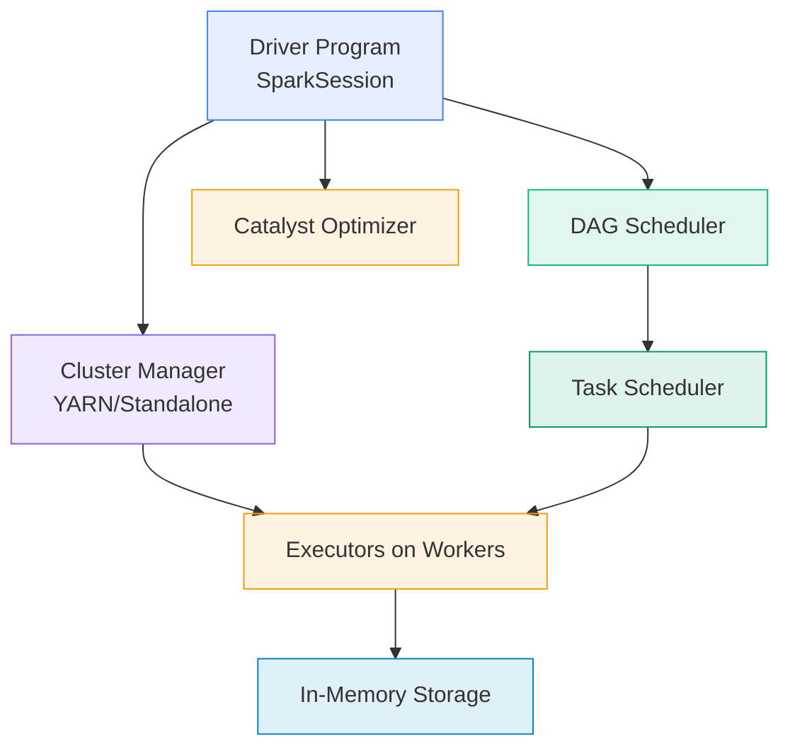
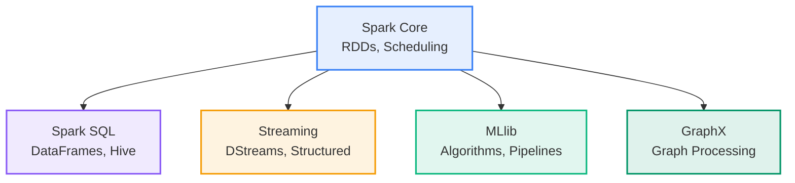
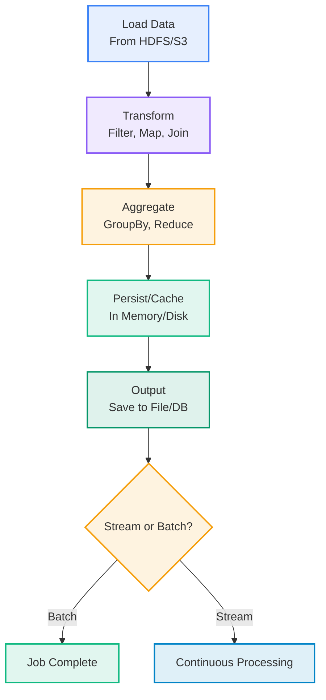
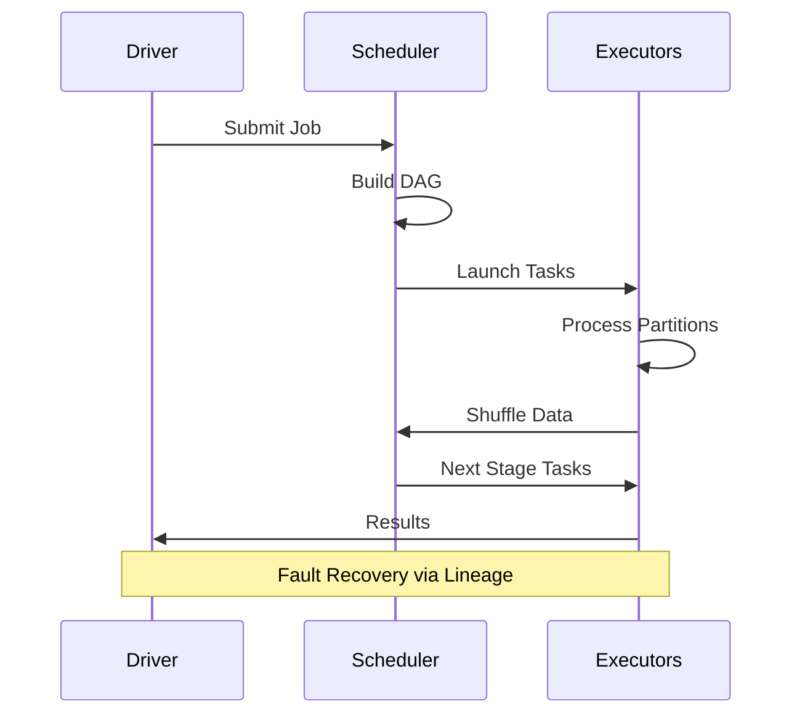
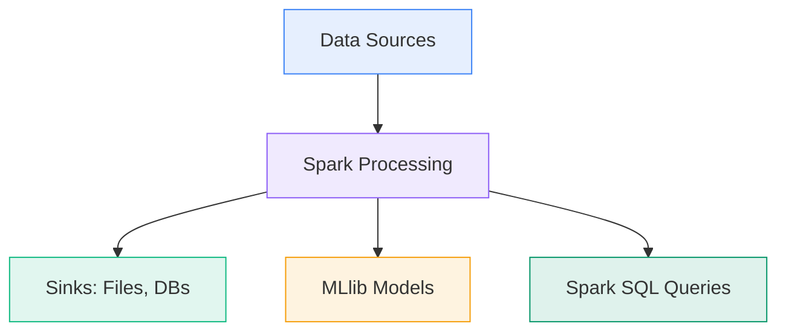

# Data Computation Course Summary - Apache Spark

## Table of Contents

1. [Introduction to Spark](#introduction-to-spark)
   - [What is Apache Spark?](#what-is-apache-spark)
   - [Core Concepts and Evolution](#core-concepts-and-evolution)
   - [Spark in Data Computation](#spark-in-data-computation)
2. [Key Components of Spark](#key-components-of-spark)
   - [Spark Core](#spark-core)
   - [Spark SQL](#spark-sql)
   - [Spark Streaming](#spark-streaming)
   - [MLlib](#mllib)
   - [GraphX](#graphx)
3. [Data Processing Pipeline](#data-processing-pipeline)
   - [Step-by-Step Execution](#step-by-step-execution)
   - [Optimization Techniques](#optimization-techniques)
   - [Fault Tolerance](#fault-tolerance)
4. [RDDs and DataFrames](#rdds-and-dataframes)
   - [RDD Fundamentals](#rdd-fundamentals)
   - [DataFrames and Datasets](#dataframes-and-datasets)
   - [Choosing the Right Abstraction](#choosing-the-right-abstraction)
5. [Spark Examples](#spark-examples)
   - [Basic RDD Operations](#basic-rdd-operations)
   - [DataFrame ETL](#dataframe-etl)
   - [Structured Streaming](#structured-streaming)
   - [ML Pipeline](#ml-pipeline)
6. [Common Commands](#common-commands)
   - [Spark Submit](#spark-submit)
   - [Shell and UI](#shell-and-ui)
   - [Docker for Spark](#docker-for-spark)
7. [Parameters, Tuning, and Best Practices](#parameters-tuning-and-best-practices)
   - [Configuration Parameters](#configuration-parameters)
   - [Tuning Strategies](#tuning-strategies)
   - [Best Practices](#best-practices)
8. [Applications and Benefits](#applications-and-benefits)
   - [Real-World Use Cases](#real-world-use-cases)
   - [Advantages and Limitations](#advantages-and-limitations)
9. [Key Takeaways](#key-takeaways)
   - [Core Principles](#core-principles)
   - [Practical Advice](#practical-advice)
   - [Advanced Topics](#advanced-topics)

---

## <a name="introduction-to-spark"></a>Introduction to Spark

### <a name="what-is-apache-spark"></a>What is Apache Spark?

Apache Spark is a unified analytics engine for large-scale data processing, offering high-level APIs in multiple languages (Scala, Java, Python, R). Developed at UC Berkeley, Spark handles batch processing, real-time streaming, machine learning, and graph analytics in a single framework. Its in-memory computation model makes it up to 100x faster than traditional disk-based systems like Hadoop MapReduce.

Spark's distributed nature allows it to scale from a single machine to thousands of nodes, making it indispensable for big data computation.

### <a name="core-concepts-and-evolution"></a>Core Concepts and Evolution

Key concepts:
- **Resilient Distributed Datasets (RDDs)**: Immutable, fault-tolerant collections.
- **DAG Execution**: Optimizes computations into stages.
- **Lazy Evaluation**: Builds plans before executing.

Evolution: From core RDDs to higher-level DataFrames and Structured Streaming in Spark 2.0+, improving usability and performance.

### <a name="spark-in-data-computation"></a>Spark in Data Computation

Spark powers data lakes, ETL pipelines, and analytics platforms. It integrates seamlessly with storage like HDFS or S3, enabling transformations on terabytes of data without moving it.

#### Spark Architecture Schema



#### Basic Example

Word count using PySpark:

```python
from pyspark import SparkContext

sc = SparkContext("local", "WordCount")
text_file = sc.textFile("input.txt")
counts = text_file.flatMap(lambda line: line.split(" ")) \
                  .map(lambda word: (word, 1)) \
                  .reduceByKey(lambda a, b: a + b)
counts.saveAsTextFile("output")
sc.stop()
```

---

## <a name="key-components-of-spark"></a>Key Components of Spark

Spark's modular libraries build on the core engine, providing specialized tools for diverse data tasks.

### <a name="spark-core"></a>Spark Core

The foundation, offering RDDs, task scheduling, and cluster management. It includes SparkContext (or SparkSession in newer versions) as the entry point.

### <a name="spark-sql"></a>Spark SQL

Enables structured data processing with DataFrames, SQL queries, and integration with Hive. Catalyst optimizer ensures efficient execution.

### <a name="spark-streaming"></a>Spark Streaming

Handles real-time data:
- **DStreams**: Micro-batch processing.
- **Structured Streaming**: Continuous, fault-tolerant streams using DataFrames.

### <a name="mllib"></a>MLlib

Spark's machine learning library with algorithms for classification, regression, clustering, and pipelines for end-to-end ML workflows.

### <a name="graphx"></a>GraphX

For graph-parallel computation, supporting algorithms like PageRank on large graphs.

#### Components Visualization



---

## <a name="data-processing-pipeline"></a>Data Processing Pipeline

Spark pipelines transform raw data into insights through a series of distributed operations, optimized for performance.

### <a name="step-by-step-execution"></a>Step-by-Step Execution

1. **Load Data**: From files, databases, or streams.
2. **Transform**: Apply filters, maps, joins (lazy).
3. **Aggregate**: Group, reduce for summaries.
4. **Persist**: Cache for reuse.
5. **Output**: Write results; trigger execution.

### <a name="optimization-techniques"></a>Optimization Techniques

- **Catalyst Optimizer**: Rewrites queries for efficiency.
- **Tungsten Execution**: Columnar storage and code generation.
- **Adaptive Query Execution (AQE)**: Dynamic adjustments in Spark 3.0+.

### <a name="fault-tolerance"></a>Fault Tolerance

Lineage tracking allows recomputation of lost partitions without data loss.

#### Pipeline Flowchart



#### Execution Sequence



---

## <a name="rdds-and-dataframes"></a>RDDs and DataFrames

Spark offers abstractions from low-level RDDs to high-level DataFrames for different use cases.

### <a name="rdd-fundamentals"></a>RDD Fundamentals

RDDs are the original API: distributed, immutable collections supporting transformations (e.g., `map`) and actions (e.g., `collect`). They provide fine control but require manual optimization.

### <a name="dataframes-and-datasets"></a>DataFrames and Datasets

DataFrames add schema and SQL support, leveraging Catalyst for optimization. Datasets (JVM languages) add type safety.

| Abstraction | Pros | Cons |
|-------------|------|------|
| RDDs | Flexibility | No auto-optimization |
| DataFrames | Performance, SQL | Less low-level control |

### <a name="choosing-the-right-abstraction"></a>Choosing the Right Abstraction

Use RDDs for custom logic; DataFrames for structured queries. In Python, DataFrames are preferred for most tasks.

---

## <a name="spark-examples"></a>Spark Examples

Hands-on code demonstrates Spark's versatility.

### <a name="basic-rdd-operations"></a>Basic RDD Operations

```python
from pyspark import SparkContext
sc = SparkContext("local", "Example")
rdd = sc.parallelize([1, 2, 3, 4])
squared = rdd.map(lambda x: x * x)
print(squared.collect())  # [1, 4, 9, 16]
```

### <a name="dataframe-etl"></a>DataFrame ETL

```python
from pyspark.sql import SparkSession
spark = SparkSession.builder.appName("ETL").getOrCreate()
df = spark.read.csv("data.csv", header=True)
df_filtered = df.filter(df.age > 18)
df_filtered.write.parquet("output.parquet")
```

### <a name="structured-streaming"></a>Structured Streaming

```python
spark = SparkSession.builder.appName("Stream").getOrCreate()
lines = spark.readStream.format("kafka").option("kafka.bootstrap.servers", "host:port").load()
query = lines.selectExpr("CAST(value AS STRING)").writeStream.format("console").start()
query.awaitTermination()
```

### <a name="ml-pipeline"></a>ML Pipeline

```python
from pyspark.ml import Pipeline
from pyspark.ml.feature import StringIndexer
from pyspark.ml.classification import LogisticRegression

indexer = StringIndexer(inputCol="category", outputCol="label")
lr = LogisticRegression(featuresCol="features", labelCol="label")
pipeline = Pipeline(stages=[indexer, lr])
model = pipeline.fit(training)
```

---

## <a name="common-commands"></a>Common Commands

Commands facilitate Spark cluster management and job submission.

### <a name="spark-submit"></a>Spark Submit

| Command | Description | Example |
|---------|-------------|---------|
| Submit script | Run app | `spark-submit --master yarn script.py` |
| With config | Tune params | `spark-submit --executor-memory 4g app.jar` |
| Cluster mode | Distribute | `--deploy-mode cluster` |

### <a name="shell-and-ui"></a>Shell and UI

- `pyspark`: Interactive shell.
- Access UI at `http://master:8080` for job monitoring.

### <a name="docker-for-spark"></a>Docker for Spark

```yaml
version: '3.8'
services:
  master:
    image: bitnami/spark:3.5.0
    environment: {SPARK_MODE: master}
    ports: ["8080:8080"]
  worker:
    image: bitnami/spark:3.5.0
    environment: {SPARK_MODE: worker, SPARK_MASTER_URL: spark://master:7077}
```

---

## <a name="parameters-tuning-and-best-practices"></a>Parameters, Tuning, and Best Practices

### <a name="configuration-parameters"></a>Configuration Parameters

Set via `spark-submit` or `spark-defaults.conf`:

| Parameter | Description | Default |
|-----------|-------------|---------|
| `spark.executor.memory` | Executor RAM | 1g |
| `spark.sql.shuffle.partitions` | Shuffle partitions | 200 |
| `spark.default.parallelism` | RDD parallelism | Based on cores |

### <a name="tuning-strategies"></a>Tuning Strategies

1. **Partition Sizing**: Aim for 128MB per partition.
2. **Caching**: Use `cache()` for iterative algorithms.
3. **Broadcasting**: For small joins to avoid shuffles.
4. **GC Tuning**: Adjust JVM flags for long jobs.

### <a name="best-practices"></a>Best Practices

- Monitor via Spark UI for bottlenecks.
- Use DataFrames over RDDs.
- Enable AQE for adaptive plans.
- Test on small data before scaling.

---

## <a name="applications-and-benefits"></a>Applications and Benefits

### <a name="real-world-use-cases"></a>Real-World Use Cases

- **ETL**: Process logs into warehouses.
- **Streaming Analytics**: Real-time fraud detection.
- **ML**: Distributed training on Databricks.

### <a name="advantages-and-limitations"></a>Advantages and Limitations

**Advantages**:
- Unified platform reduces tool sprawl.
- High performance via in-memory processing.

**Limitations**:
- High memory demands.
- Complex for beginners.

#### Pipeline Visualization



---

## <a name="key-takeaways"></a>Key Takeaways

### <a name="core-principles"></a>Core Principles

| Principle | Description |
|-----------|-------------|
| **Distributed Computing** | Parallelism across nodes. |
| **Lazy Evaluation** | Optimize on demand. |
| **Fault Tolerance** | Lineage for recovery. |

### <a name="practical-advice"></a>Practical Advice

- Start with local mode for prototyping.
- Tune based on cluster resources.
- Integrate with Airflow for orchestration.

### <a name="advanced-topics"></a>Advanced Topics

- Delta Lake for ACID tables.
- Spark on K8s.
- RAPIDS for GPU acceleration.

Spark revolutionizes big data processing with speed and simplicity. 🔥